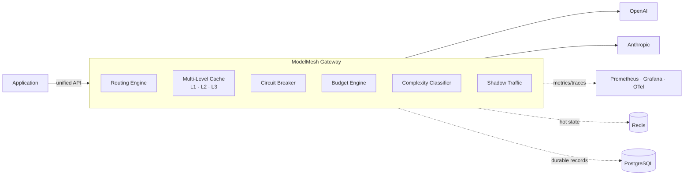
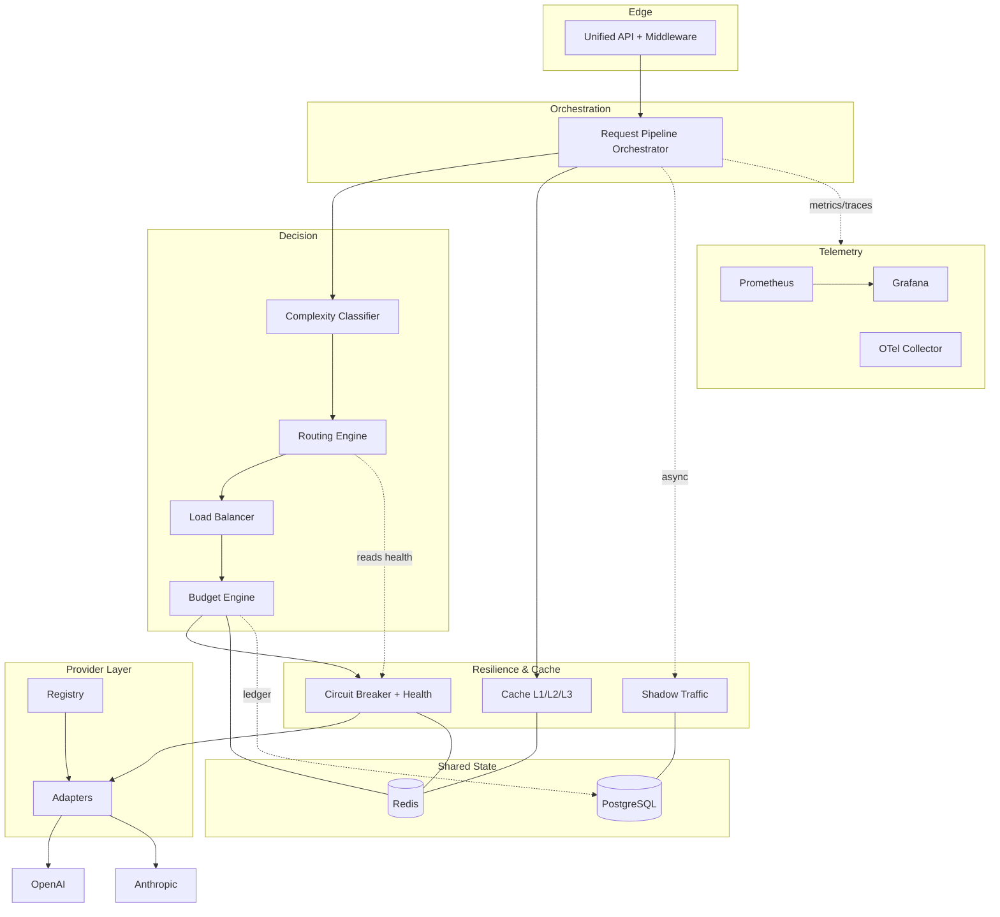
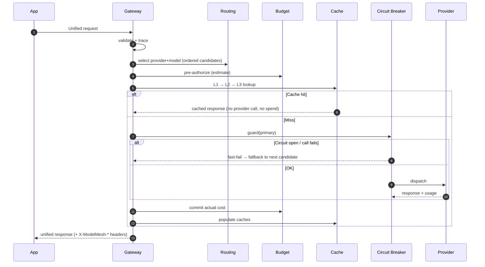
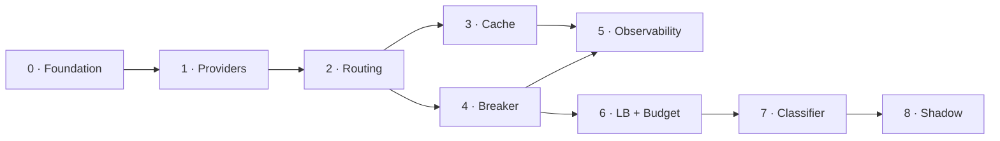

<div align="center">

# 🕸️ ModelMesh

### A production-grade intelligent LLM Gateway

*One unified API across multiple LLM providers — with intelligent routing, semantic caching, circuit breaking, full observability, and cost optimization.*

<br/>

[](docs/)
[](#-technology-stack)
[](#)
[](#-technology-stack)
[](#-observability)
[](docs/)

<sub>Badges are placeholders for a portfolio project.</sub>

</div>

---

> **What this is:** an *architecture-first portfolio project* demonstrating backend engineering, distributed systems, and AI infrastructure.
> **What this is not:** a commercial SaaS. It is intentionally single-tenant, self-hosted, and scoped for depth over breadth.

Applications should **never** call OpenAI or Anthropic directly. They call **ModelMesh**, and ModelMesh decides *which provider, which model, whether the answer is already cached, whether the provider is healthy, whether the request fits the budget, what it costs,* and *how it's measured* — behind one stable API.

---

## 📑 Table of Contents

- [Architecture Preview](#-architecture-preview)
- [Project Overview](#-project-overview)
- [Key Features](#-key-features)
- [Architecture](#-architecture)
- [Request Lifecycle](#-request-lifecycle)
- [Technology Stack](#-technology-stack)
- [Folder Structure](#-folder-structure)
- [Development Roadmap](#-development-roadmap)
- [Demo Scenarios](#-demo-scenarios)
- [Performance Goals](#-performance-goals)
- [Future Work](#-future-work)
- [Learning Outcomes](#-learning-outcomes)
- [Documentation](#-documentation)
- [References](#-references)

---

## 🗺️ Architecture Preview



---

## 🔭 Project Overview

**What ModelMesh is.** A unified LLM gateway that sits between your applications and multiple LLM providers, presenting one provider-agnostic REST API while internally handling routing, caching, resilience, cost control, and telemetry.

**Why it exists.** Teams building on LLMs re-solve the same operational problems inside every service: provider coupling, no failover, redundant/expensive calls, invisible cost, cascading failures, and poor observability. Each of these is an *infrastructure* concern, not an application concern — so it should be solved once, correctly, behind a single API.

**What problem it solves.**

| Without ModelMesh | With ModelMesh |
|---|---|
| Apps import a provider SDK and hardcode models | Apps call one unified API; the gateway chooses |
| A provider outage takes the app down | Circuit breaker + automatic failover contain it |
| Identical/similar prompts hit the provider every time | Multi-level cache (exact + semantic) serves repeats |
| Cost is discovered on the invoice | Per-request cost accounting + budget enforcement |
| No visibility into behavior | Metrics, traces, and dashboards for every request |
| Provider strategy is scattered across services | Routing, cost, and reliability policy is centralized |

> The gateway resembles the kind of internal infrastructure a team at a company like **OpenAI, Anthropic, or Stripe** might build for its own use.

---

## ✨ Key Features

| Feature | What it does |
|---------|--------------|
| 🔌 **Provider Layer** | Adapter-per-provider behind one contract. Switch OpenAI ⇄ Anthropic **without changing application code**. Adding a provider is one adapter + config entry. |
| 🧭 **Routing Engine** | Configurable **weighted** selection producing an ordered, health-filtered candidate list. Every decision is explainable via a debug endpoint. |
| ⚡ **Multi-Level Cache** | **L1** in-memory (per instance) → **L2** Redis (fleet-shared) → **L3** semantic (embedding nearest-neighbor). A cache hit calls no provider and commits no spend. |
| 🛡️ **Circuit Breaker** | Per-provider `closed → open → half-open` state machine with health monitoring. Fast-fails dead providers, fails over automatically, recovers on its own. |
| 📊 **Observability** | Prometheus metrics, Grafana dashboards, and OpenTelemetry traces spanning the full request path — instrumented inline, fail-safe by default. |
| 💰 **Budget Engine** | Per-request cost accounting via a pricing model, pre-authorization before dispatch, and enforcement that **downgrades or rejects** on budget exhaustion. |
| 🧠 **Prompt Classifier** | Cheap, fail-safe complexity classification that biases routing — simple prompts to cheaper models, complex prompts to stronger ones. |
| 🌓 **Shadow Traffic** | Mirrors a sampled fraction of live traffic to an alternate model **out of band** to compare outputs, cost, and latency — with **zero caller impact**. |

---

## 🏛️ Architecture

ModelMesh is a **stateless** gateway (horizontally scalable) with shared state in **Redis** and durable records in **PostgreSQL**. The request path is a single in-process pipeline of ordered, fail-safe stages; observability cross-cuts them all.



**Design principles:** interfaces over implementations · single request pipeline · stateless hot path / shared cold state · fail safe, not fail closed · health as a first-class signal · config over code.

📖 *Full detail: [High-Level Architecture](docs/02-architecture/High-Level-Architecture.md)*

---

## 🔄 Request Lifecycle

Only **three** things ever fail a request to the caller: a validation error, a budget rejection, or **all** provider candidates being exhausted. Everything else degrades gracefully.



📖 *Full detail: [Request Lifecycle](docs/02-architecture/Request-Lifecycle.md)*

---

## 🧰 Technology Stack

| Layer | Choice | Why *(see [ADRs](docs/05-implementation/Architecture-Decisions.md))* |
|-------|--------|-----|
| **Backend** | Go | Goroutine concurrency fits a fan-out gateway; tiny static binaries; lingua franca of cloud infra. |
| **API** | REST / JSON over HTTP (+ SSE) | Drop-in familiarity, zero client tooling, inspectable. gRPC intentionally excluded. |
| **Providers** | OpenAI, Anthropic | Two providers make routing, failover, and cost comparison genuinely demonstrable. |
| **Caching** | In-memory (L1) · Redis (L2) · Semantic (L3) | Latency, fleet-sharing, and near-duplicate collapse — three distinct wins. |
| **Database** | PostgreSQL | Durable, queryable records: cost ledger, shadow evaluations, decision history. |
| **Shared state** | Redis | Fast, atomic, TTL'd hot state: L2/L3 cache, health/circuit state, budget counters. |
| **Metrics** | Prometheus | Pull-based, dimensional, PromQL — the cloud-native standard. |
| **Dashboards** | Grafana | Dashboards-as-code over the Prometheus datasource. |
| **Tracing** | OpenTelemetry | Vendor-neutral, end-to-end spans across the pipeline. |
| **Containerization** | Docker + Compose | Reproducible one-command local stack. Kubernetes intentionally excluded. |

---

## 📁 Folder Structure

```
modelmesh/
├── cmd/gateway/                 # Process entrypoint & dependency wiring
├── internal/
│   ├── api/                     # Edge: HTTP handlers, DTOs
│   │   └── middleware/          #   validation, request-id, tracing hooks
│   ├── orchestrator/            # Request pipeline: stage sequencing & fallback
│   ├── provider/                # PROVIDER LAYER
│   │   ├── contract/            #   unified request/response/error models
│   │   ├── registry/            #   resolves {provider,model} → adapter
│   │   └── adapters/            #   openai/, anthropic/, mock/
│   ├── routing/                 # ROUTING ENGINE (weighted strategy + candidates)
│   ├── loadbalancer/            # LOAD BALANCER (target distribution)
│   ├── cache/                   # MULTI-LEVEL CACHE
│   │   ├── l1memory/            #   per-instance exact-match
│   │   ├── l2redis/             #   fleet-shared exact-match
│   │   └── l3semantic/          #   embedding nearest-neighbor
│   ├── resilience/              # CIRCUIT BREAKER + health monitoring
│   ├── budget/                  # BUDGET ENGINE (authorize/commit/enforce)
│   ├── cost/                    # COST MODEL (pricing → estimate/actual)
│   ├── classifier/              # PROMPT COMPLEXITY CLASSIFIER
│   ├── shadow/                  # SHADOW TRAFFIC + evaluation
│   ├── observability/           # metrics, tracing, structured logging
│   └── config/                  # loader, validation, typed views
├── eval/                        # Offline harnesses: classifier accuracy, shadow reports
├── deploy/                      # docker-compose, prometheus/, grafana/ dashboards
├── config/                      # Example configuration & schema
└── docs/                        # PRD, architecture, module designs, API, ADRs, roadmap
```

Each `internal/*` package maps to exactly one module in the [Component Handbook](docs/03-components/README.md) and depends on siblings **through interfaces only** — the orchestrator is the sole package that knows the full stage sequence.

---

## 🚦 Development Roadmap

Built as **vertical slices** — every phase runs, is instrumented, and ends in a live demo.

| Phase | Module | Headline Deliverable |
|:---:|--------|----------------------|
| **0** | Foundation | Running skeleton, unified contract, one-command stack |
| **1** | Provider Layer | Switch providers **without changing application code** |
| **2** | Weighted Routing | **Routing score breakdown** for every request |
| **3** | Multi-Level Cache | **Cache hit ratio + estimated cost savings** |
| **4** | Circuit Breaker | **Automatic provider failover** demonstration |
| **5** | Observability | **Grafana dashboard**: latency, cache, health, cost |
| **6** | Load Balancer + Budget | **Automatic downgrade** after budget exhaustion |
| **7** | Complexity Classifier | **Routing accuracy** measured on a labeled dataset |
| **8** | Shadow Traffic | **Primary-vs-shadow** comparison report |



📖 *Full detail: [Development Roadmap](docs/05-implementation/Development-Roadmap.md)*

---

## 🎬 Demo Scenarios

<table>
<tr><th>Scenario</th><th>What it shows</th></tr>
<tr>
<td>🧭 <b>Router Transparency</b></td>
<td>Call <code>/v1/debug/route</code> and see the ordered candidate list with per-candidate scores and selection reasons — no provider call made. Flip weights in config and watch ordering change.</td>
</tr>
<tr>
<td>⚡ <b>Semantic Cache</b></td>
<td>Send a prompt (miss), resend it (L1/L2 hit, cost $0), then send a <i>paraphrase</i> (L3 semantic hit). <code>/v1/cache/stats</code> reports hit ratios and estimated cost saved.</td>
</tr>
<tr>
<td>🛡️ <b>Circuit Breaker</b></td>
<td>Inject failures into the primary provider (mock). Watch the circuit open, traffic fail over transparently (<code>X-ModelMesh-Fallback: true</code>), then recover via half-open probe — caller sees uninterrupted success.</td>
</tr>
<tr>
<td>📊 <b>Grafana Dashboard</b></td>
<td>Drive mixed traffic and watch latency percentiles, per-level cache hit ratios, provider health flipping, and cost accumulating — live. Open one request's trace and walk its spans.</td>
</tr>
<tr>
<td>💰 <b>Budget Downgrade</b></td>
<td>Set a low budget. As spend climbs, requests <b>downgrade</b> to a cheaper model; once hard-exhausted they return <code>402 budget_exceeded</code>. The Postgres ledger records each committed cost.</td>
</tr>
<tr>
<td>🌓 <b>Shadow Traffic</b></td>
<td>Enable shadowing to an alternate model. Callers see only primary responses (returned immediately). Afterward, generate a comparison report: divergence, cost delta, latency delta. Kill the shadow provider mid-run — callers are unaffected.</td>
</tr>
</table>

---

## 🎯 Performance Goals

> Target objectives for the completed system, validated under representative load. These are engineering goals for a portfolio build, not production SLAs.

| Dimension | Goal |
|-----------|------|
| ⏱️ **Latency** | Cache hits (L1/L2) add negligible overhead vs. a provider call; gateway overhead on a miss is small relative to provider response time. |
| 🟢 **Availability** | A single degraded provider never fails the gateway — contained by circuit breaking and automatic failover. |
| 💵 **Cost Reduction** | Meaningful reduction in provider spend via multi-level caching and budget-aware routing, quantified as *provider calls avoided* and *estimated cost saved*. |
| 🎯 **Cache Hit Rate** | A healthy combined hit ratio across L1/L2/L3 under representative traffic, reported per level. |

---

## 🔮 Future Work

The following are **intentionally excluded** — conscious scope decisions to keep the project deep and focused, **not** missing features. Each is recorded with rationale in [ADR-015](docs/05-implementation/Architecture-Decisions.md#adr-015--why-we-intentionally-exclude-kubernetes-oauth-rbac-multi-tenancy-sdk-generation-and-an-admin-panel).

| Excluded | Why it's out of scope | Natural future extension |
|----------|----------------------|--------------------------|
| **Kubernetes / Helm** | Orchestration is a deployment concern; Docker Compose fully covers the local story. | K8s manifests + autoscaling |
| **OAuth / Authentication** | Single-tenant, self-hosted, trusted-network by design. | API keys, OAuth, per-caller identity |
| **RBAC** | No multi-user/role model exists to protect. | Roles & scoped permissions |
| **Multi-tenancy** | A large product concern orthogonal to the infra primitives being demonstrated. | Per-tenant routing, caches, budgets |
| **SDK Generation** | The REST/OpenAPI surface is directly consumable. | Generated client SDKs |
| **Admin Panel** | Grafana + read-only endpoints cover visibility; a control UI implies mutation/authz. | Management UI |

> Reversing any of these would be a **new ADR** with the added scope (identity, tenancy, orchestration) made explicit — the architecture already leaves the seams for them.

---

## 🎓 Learning Outcomes

This project is designed to demonstrate, in one coherent system:

- **Distributed Systems** — stateless request path, shared state in Redis, fleet-wide health convergence, horizontal scalability.
- **AI Infrastructure** — a real LLM gateway with provider abstraction, semantic caching, complexity-aware routing, and shadow evaluation.
- **Reliability Engineering** — circuit breaking, health monitoring, failover, fault isolation, and graceful degradation, verified under fault injection.
- **Caching Strategy** — a layered cache with exact and semantic levels, explicit eligibility, keys, and invalidation semantics.
- **Observability** — metrics, dashboards, and distributed tracing as first-class, inline concerns.
- **Cost & Resource Control** — per-request cost accounting, pre-authorization, budget enforcement, and cost-aware routing.
- **API Design** — a clean, versioned, provider-agnostic REST contract with a consistent error model and OpenAPI spec.
- **Software Design** — Adapter, Strategy, Chain of Responsibility, Factory, Circuit Breaker, Facade, and Repository applied where they earn their place.
- **Engineering Judgment** — disciplined scoping, documented trade-offs (16 ADRs), and a phased, demoable delivery plan.

---

## 📚 Documentation

A complete, architecture-first documentation set precedes implementation:

| Document | Purpose |
|----------|---------|
| [📄 PRD](docs/PRD.md) | Product requirements, goals, non-goals, scope |
| [🏛️ High-Level Architecture](docs/02-architecture/High-Level-Architecture.md) | Layers, components, deployment, patterns |
| [🔄 Request Lifecycle](docs/02-architecture/Request-Lifecycle.md) | Stage-by-stage execution path & scenarios |
| [🧩 Component Handbook](docs/03-components/README.md) | Low-level design for all 9 modules |
| [🔌 REST API](docs/04-api/REST-API.md) | Full API spec + OpenAPI skeleton |
| [🧠 Architecture Decisions](docs/05-implementation/Architecture-Decisions.md) | 16 ADRs — *why* every major choice was made |
| [🚦 Development Roadmap](docs/05-implementation/Development-Roadmap.md) | Phase-by-phase execution blueprint |

---

## 🔖 References

**Design Patterns**

| Pattern | Where it's used |
|---------|-----------------|
| Adapter | Provider adapters (unified ⇄ native) |
| Strategy | Routing, load balancing, classification, eviction |
| Chain of Responsibility | The request pipeline |
| Factory | Provider/strategy construction from config |
| Circuit Breaker | Per-provider resilience |
| Facade | Multi-level cache, cost model, telemetry recorders |
| Repository | Cache and shared-state stores |
| Observer / Producer-Consumer | Health monitoring, shadow dispatch |

**Prior Art** — LLM gateways such as **LiteLLM**, **Portkey**, and **Helicone** validate the thesis that LLM traffic benefits from a dedicated infrastructure layer. ModelMesh is a from-first-principles portfolio implementation, not a competitor.

**Technologies** — [Go](https://go.dev) · [Redis](https://redis.io) · [PostgreSQL](https://www.postgresql.org) · [Prometheus](https://prometheus.io) · [Grafana](https://grafana.com) · [OpenTelemetry](https://opentelemetry.io) · [Docker](https://www.docker.com) · [OpenAI](https://openai.com) · [Anthropic](https://www.anthropic.com)

---

<div align="center">

**ModelMesh** — *an architecture-first look at what a real LLM gateway takes to build.*

<sub>Single-tenant · self-hosted · portfolio project · not a commercial SaaS</sub>

</div>
