# ModelMesh — High-Level Architecture

**Status:** Draft (pre-implementation)
**Document type:** Architecture Design Document
**Last updated:** 2026-07-16
**Owner:** Engineering
**Related:** [Product Requirements Document](../PRD.md)

---

## 0. Preface

This document designs the complete system architecture for ModelMesh **before implementation begins**. It covers exactly the nine components defined for the project — Provider Layer, Routing Engine, Multi-Level Cache, Circuit Breaker, Observability, Load Balancer, Budget Engine, Prompt Complexity Classifier, and Shadow Traffic — and nothing outside that scope. No enterprise modules (multi-tenancy, RBAC, admin UI, billing, etc.) are introduced.

The document is language-neutral. Folder structure and module names are illustrative of a conventional backend service (equally expressible in Go, Python, or TypeScript); the architecture, boundaries, and contracts are what matter, not the host language.

No implementation code appears here — this is an architecture document.

---

## 1. Architecture Goals

| # | Goal | Meaning |
|---|------|---------|
| G-1 | **Unified surface** | One stable completion API, independent of provider or model. |
| G-2 | **Provider independence** | Providers are pluggable behind one internal contract; adding or removing a provider touches no other component. |
| G-3 | **Decision centralization** | Routing, caching, health, budget, and cost decisions live in the gateway, not in callers. |
| G-4 | **Fault containment** | A degraded provider cannot degrade the gateway; failures are isolated at component boundaries. |
| G-5 | **Observable by construction** | Every request is measurable and traceable across the full path, including cache hits and failures. |
| G-6 | **Horizontal scalability** | The request path is stateless; shared state lives in Redis so instances scale out behind a load balancer. |
| G-7 | **Graceful degradation** | Optional subsystems (semantic cache, shadow, tracing, classifier) fail safe and never fail the primary request. |
| G-8 | **Composability** | Components are ordered stages behind interfaces, so behavior can evolve one stage at a time. |
| G-9 | **Configuration over code** | Weights, providers, cache TTLs, budgets, and shadow settings are configurable without code changes. |

---

## 2. Architecture Principles

1. **Interfaces over implementations.** Providers, cache levels, routing strategies, and classifiers sit behind narrow interfaces. Callers depend on the contract, never the concrete type.
2. **Single request pipeline.** A request travels through an ordered chain of stages (middleware → cache → routing → resilience → provider). Each stage has one responsibility and can short-circuit.
3. **Stateless hot path, shared cold state.** The gateway process holds no per-request durable state. Cross-instance state (L2 cache, semantic index, health, budget counters) lives in Redis.
4. **Fail safe, not fail closed.** When an optional subsystem errors, the pipeline continues as if it were absent. Only the provider call itself is allowed to fail a request, and even then failover applies.
5. **Read-through caching.** The cache is consulted before routing; population happens on the way back. The caller is unaware of which level served the response.
6. **Health is a first-class signal.** Provider health drives routing, load balancing, and circuit state, and is continuously updated from real request outcomes.
7. **Cost and budget are computed at the gateway.** Every served request has a known cost; budget is enforced before a provider is called.
8. **Instrumentation is inline, not bolted on.** Each stage emits metrics and spans as part of its contract.
9. **Explicit, minimal scope.** Only the nine components exist. Nothing is added "for completeness."

---

## 3. Layered Architecture

ModelMesh is organized into six horizontal layers. Higher layers depend downward only.

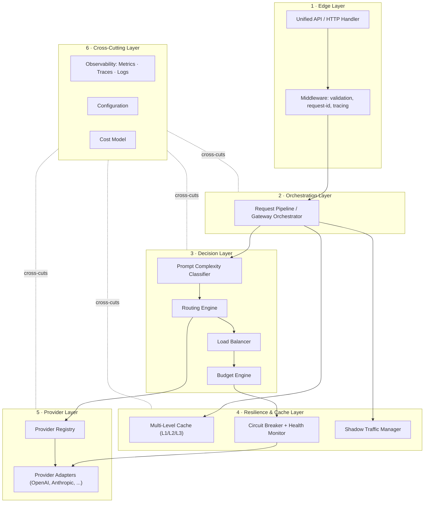

| Layer | Purpose | Components |
|-------|---------|------------|
| 1 · Edge | Accept, validate, and normalize requests; attach request identity and tracing context. | API handler, middleware |
| 2 · Orchestration | Drive the request through the pipeline; own short-circuit and fallback control flow. | Request pipeline / orchestrator |
| 3 · Decision | Decide *what* to do: classify, choose provider/model, balance, check budget. | Classifier, Routing Engine, Load Balancer, Budget Engine |
| 4 · Resilience & Cache | Avoid work (cache), protect against failure (circuit breaker/health), mirror for evaluation (shadow). | Multi-Level Cache, Circuit Breaker + Health Monitor, Shadow Manager |
| 5 · Provider | Execute the call against a concrete provider behind a common contract. | Provider Registry, Provider Adapters |
| 6 · Cross-Cutting | Concerns every layer uses: telemetry, configuration, cost. | Observability, Configuration, Cost Model |

---

## 4. High-Level Component Diagram

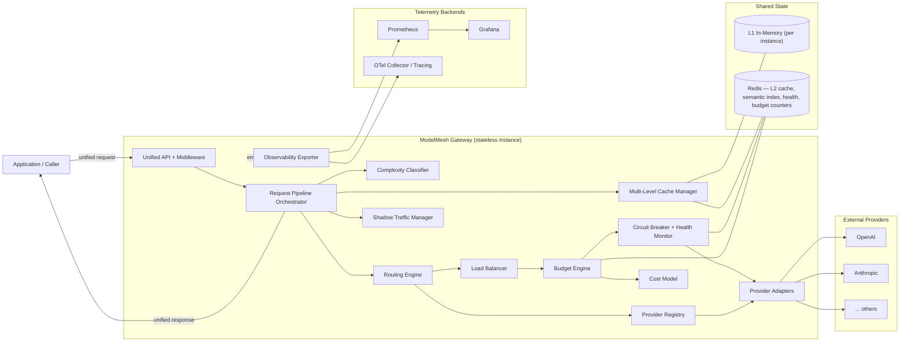

---

## 5. Component Responsibilities

### 5.1 Unified API + Middleware (Edge)
- Expose the single completion endpoint and validate incoming requests against the unified schema.
- Assign a request id, establish tracing context, and attach it to the request for downstream propagation.
- Translate the unified response/error model back to the wire.
- **Not responsible for** any provider logic, routing, or caching.

### 5.2 Request Pipeline Orchestrator (Orchestration)
- Own the ordered execution of stages and the control flow between them (short-circuit on cache hit, fallback on provider failure, budget rejection).
- Coordinate — but not implement — decision, cache, resilience, and provider stages.
- Guarantee that optional-stage failures degrade gracefully.

### 5.3 Prompt Complexity Classifier (Decision)
- Produce a complexity signal (e.g. a bucketed level) for a prompt.
- Provide that signal to the Routing Engine as one input.
- Fail safe: if unavailable, routing proceeds with a default/neutral complexity.

### 5.4 Multi-Level Cache Manager (Resilience & Cache)
- Present a single read-through/write-through cache interface over three levels:
  - **L1 — in-memory**, per instance, exact-match, lowest latency.
  - **L2 — Redis**, shared across instances, exact-match.
  - **L3 — semantic**, embedding-based nearest-neighbor over a Redis-backed index, gated by a similarity threshold.
- Own cache-key construction, eligibility rules, TTL, and invalidation semantics per level.
- Emit hit/miss telemetry per level. Degrade to "miss" on any cache backend error.

### 5.5 Routing Engine (Decision)
- Select a candidate **provider + model** using configured weights, provider health, and (optionally) the complexity signal.
- Exclude unhealthy / open-circuit providers from candidacy.
- Produce an ordered candidate list to support fallback.
- Strategy-based: the selection algorithm is swappable (weighted, complexity-aware, etc.).

### 5.6 Load Balancer (Decision)
- Distribute requests across the eligible targets for the chosen provider/model consistent with routing intent and live health.
- Apply a balancing strategy (e.g. weighted round-robin / least-loaded) over healthy instances.

### 5.7 Budget Engine (Decision)
- Estimate request cost via the Cost Model before dispatch and record actual cost after.
- Enforce configured budget limits; reject or trigger reroute when a request would exceed budget.
- Maintain spend counters in Redis and expose them as metrics.

### 5.8 Circuit Breaker + Health Monitor (Resilience)
- Track per-provider outcomes (success, failure, latency) and maintain a health state.
- Implement per-provider circuit states — **closed → open → half-open → closed** — and expose the current state to routing/LB.
- Short-circuit calls to open providers; probe recovery via half-open.

### 5.9 Shadow Traffic Manager (Resilience)
- Mirror a configurable fraction of live requests to a shadow provider/model **out of band**.
- Never affect the response returned to the caller; discard or record shadow outcomes for evaluation.
- Fully fail-safe: shadow errors are invisible to the primary path.

### 5.10 Provider Registry + Adapters (Provider Layer)
- **Registry:** hold the set of configured providers/models and resolve a target to a concrete adapter.
- **Adapters:** implement the common provider contract; translate unified request → provider request and provider response/error → unified model. One adapter per provider.

### 5.11 Cost Model (Cross-Cutting)
- Given provider/model and usage, compute cost from configured pricing.
- Serve both pre-call estimation (Budget Engine) and post-call accounting/metrics.

### 5.12 Observability Exporter (Cross-Cutting)
- Collect metrics (Prometheus), spans (OpenTelemetry), and structured logs from every stage.
- Expose the metrics endpoint and export traces; dashboards live in Grafana.

### 5.13 Configuration (Cross-Cutting)
- Load and validate configuration (providers, weights, cache params, budgets, shadow settings, pricing) and present typed, read-only views to each component.

---

## 6. Internal Request Flow

The primary "happy path plus fallback" request flow through the pipeline:

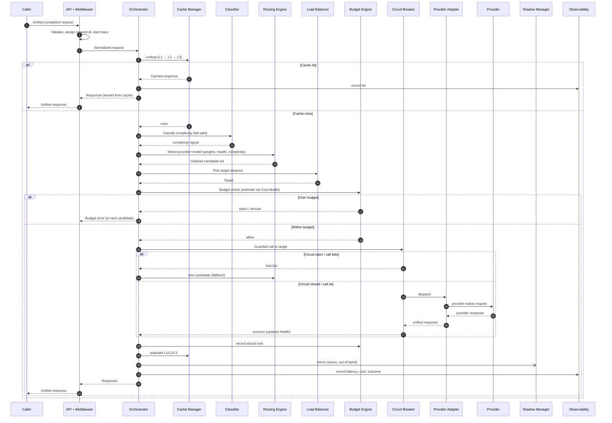

Key control-flow properties:
- **Cache short-circuits everything** downstream when it hits.
- **Classifier, shadow, cache population** are fail-safe: an error there never fails the request.
- **Fallback** is orchestrator-driven: on circuit-open/failure it advances to the next routing candidate.
- **Budget is checked pre-dispatch** and reconciled post-dispatch.

---

## 7. Data Flow

Two views: the *shape* of data as it transforms, and *where* state lives.

### 7.1 Request/response transformation

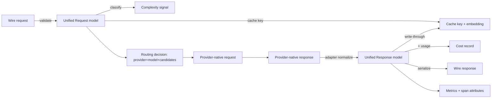

### 7.2 State ownership

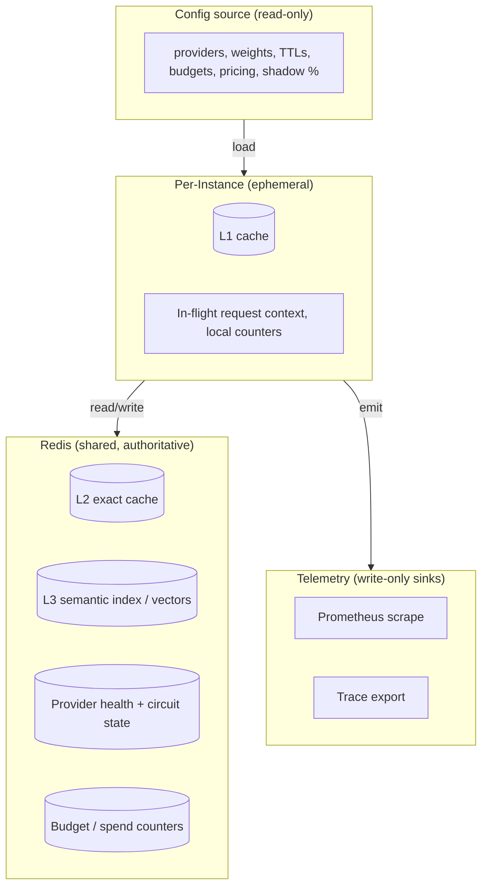

**Rule:** anything that must be consistent across instances lives in Redis; anything purely for speed or single-request lifetime lives in the instance.

---

## 8. Component Communication

- **In-process, synchronous** for the hot path: the orchestrator calls each stage through an interface (function/method call). This keeps latency low and control flow explicit.
- **Out-of-band, asynchronous** for shadow traffic and telemetry export: mirrored calls and span/metric emission must not block or fail the primary response.
- **Instance ↔ Redis** over the Redis protocol for shared state (cache L2/L3, health, budget).
- **Adapter ↔ Provider** over provider HTTP APIs, isolated inside each adapter.
- **Instance → Telemetry** via metrics scrape (Prometheus pull) and trace export (OTel push).

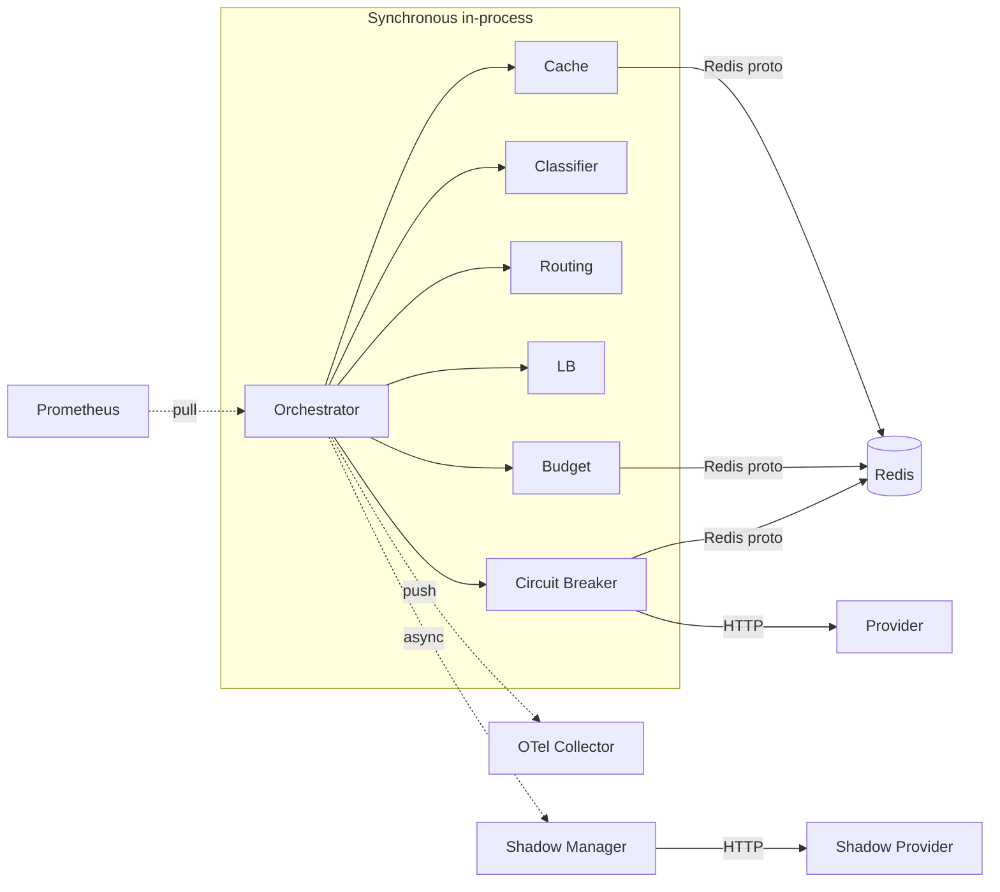

| Path | Mode | Rationale |
|------|------|-----------|
| Orchestrator ↔ stages | Sync, in-process | Low latency, explicit control flow, easy fallback |
| Orchestrator → Shadow | Async, fire-and-forget | Must not affect served response |
| Stage ↔ Redis | Sync over Redis protocol | Shared authoritative state |
| Adapter ↔ Provider | Sync HTTP | External dependency, guarded by circuit breaker |
| Instance → telemetry | Pull (metrics) / push (traces) | Standard Prometheus/OTel patterns |

---

## 9. Configuration Flow

Configuration is loaded once at startup, validated, and exposed as typed read-only views. No component reads raw config; each receives only the slice it needs.

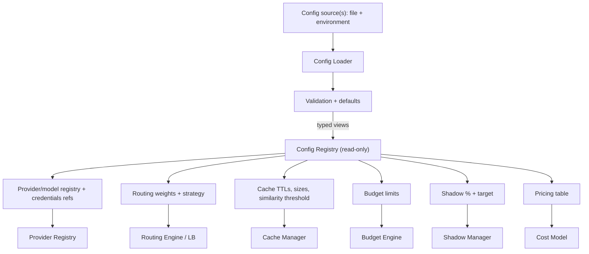

Principles:
- **Validate-then-serve:** invalid configuration fails fast at startup, not mid-request.
- **Least exposure:** each component depends on its own typed view, not the global config.
- **Config over code:** weights, thresholds, budgets, and shadow settings change behavior without redeploying logic.

---

## 10. Error Handling Flow

Errors are classified and each class has a defined disposition. The guiding rule: **only a genuine, non-recoverable provider failure across all candidates reaches the caller as an error.**

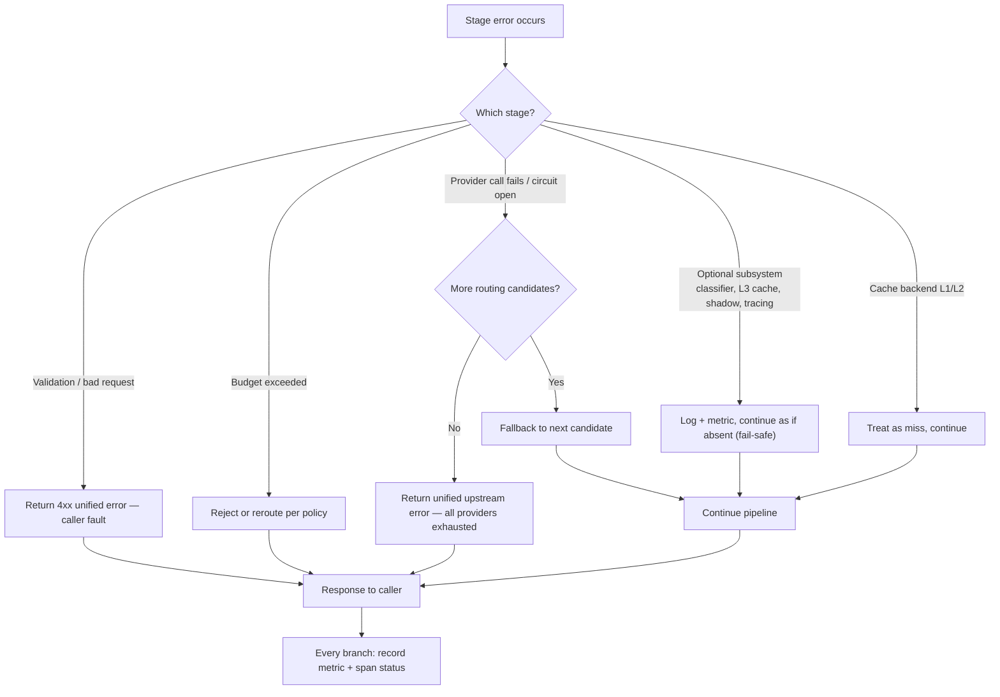

| Error class | Disposition | Caller impact |
|-------------|-------------|---------------|
| Validation / schema | Reject with unified 4xx | Yes (their fault) |
| Optional subsystem (classifier, L3, shadow, tracing) | Log, metric, continue | None |
| Cache backend (L1/L2) | Degrade to miss | None (latency only) |
| Budget exceeded | Reject / reroute per policy | Yes (policy) |
| Single provider failure / open circuit | Fallback to next candidate | None if a candidate succeeds |
| All candidates exhausted | Unified upstream error | Yes |

Every branch emits telemetry so failures are always observable, and the circuit breaker updates provider health on each provider outcome.

---

## 11. Deployment Architecture

ModelMesh runs as one or more **stateless gateway instances** behind a load balancer, sharing a single Redis for cross-instance state, and exporting telemetry to Prometheus/Grafana/OTel. It is self-hosted; no Kubernetes/Helm packaging is in scope (that is future work).

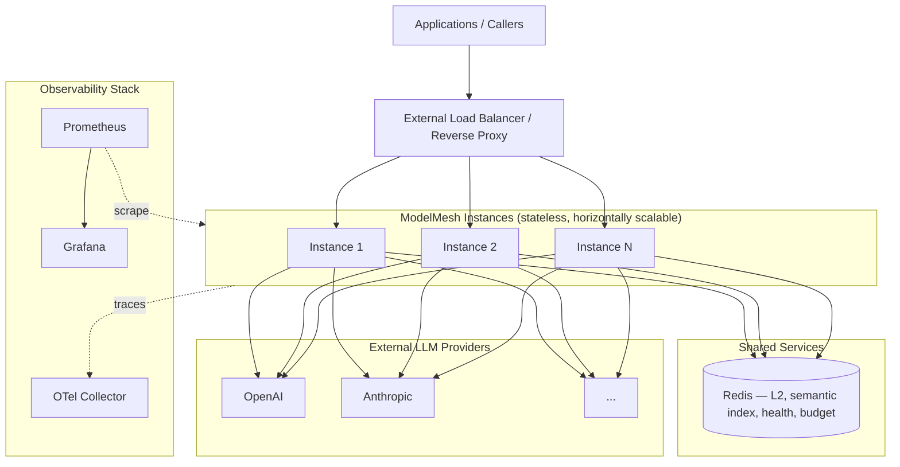

Deployment properties:
- **Stateless instances:** any instance can serve any request; scaling is adding instances.
- **L1 cache is per instance** (best-effort, not shared); **L2/L3, health, and budget are shared** in Redis so behavior is consistent across the fleet.
- **Health and circuit state in Redis** let all instances converge on the same provider health view.
- **Telemetry** is pulled (metrics) and pushed (traces) to the standard backends.

---

## 12. Folder Structure

Illustrative module layout (language-neutral). Boundaries mirror the components above; each package exposes an interface and hides its implementation.

```
modelmesh/
├── cmd/
│   └── gateway/                # process entrypoint, wiring/bootstrap
├── docs/
│   ├── PRD.md
│   └── 02-architecture/
│       └── High-Level-Architecture.md
├── config/                     # example config files, schema
└── internal/
    ├── api/                    # edge: handlers, request/response DTOs
    │   └── middleware/         # validation, request-id, tracing hooks
    ├── orchestrator/           # request pipeline, stage sequencing, fallback
    ├── provider/               # Provider Layer
    │   ├── contract/           # common provider interface + unified models
    │   ├── registry/           # provider/model registry & resolution
    │   └── adapters/           # openai/, anthropic/, ... (one per provider)
    ├── routing/                # Routing Engine + strategies
    ├── loadbalancer/           # Load Balancer strategies
    ├── cache/                  # Multi-Level Cache
    │   ├── l1memory/
    │   ├── l2redis/
    │   └── l3semantic/
    ├── resilience/             # Circuit Breaker + Health Monitor
    ├── budget/                 # Budget Engine
    ├── cost/                   # Cost Model + pricing
    ├── classifier/             # Prompt Complexity Classifier
    ├── shadow/                 # Shadow Traffic Manager
    ├── observability/          # metrics, tracing, logging exporters
    └── config/                 # loader, validation, typed views
```

Conventions:
- `internal/*` packages depend **downward and sideways through interfaces only**; the orchestrator is the only package that knows the full stage sequence.
- `provider/contract` is the single source of truth for the unified request/response/error model.
- Adapters, cache levels, routing strategies, and LB strategies are **interchangeable implementations** behind their package's interface.

---

## 13. Dependency Graph

Compile-time dependency direction (arrows point to the dependency). The orchestrator composes; cross-cutting packages are depended upon but depend on nothing in the domain.

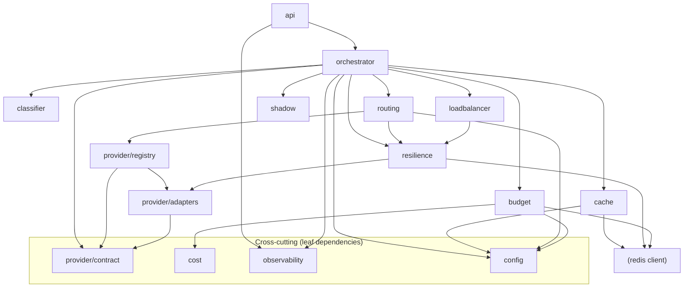

Rules enforced by this graph:
- **No cycles.** Domain packages never depend back on the orchestrator or api.
- **Contract at the bottom.** `provider/contract` and `cost`/`config`/`observability` are leaf-ish and widely depended upon.
- **Redis is an implementation detail** of cache/resilience/budget, not a shared domain dependency.

---

## 14. Architectural Patterns Used

| Pattern | Where | Why |
|---------|-------|-----|
| **Adapter** | `provider/adapters/*` | Translate the unified request/response/error model to and from each provider's native API, so providers are interchangeable behind one contract. |
| **Strategy** | Routing Engine (weighted / complexity-aware), Load Balancer (round-robin / least-loaded), Classifier | Swap the decision algorithm without changing the caller. Selection policy is a pluggable strategy. |
| **Chain of Responsibility** | Orchestrator pipeline (middleware → cache → classify → route → LB → budget → circuit → provider) | Ordered stages, each able to handle or short-circuit the request; new stages insert without rewiring others. |
| **Factory** | Provider Registry resolving a target → adapter; construction of cache levels and strategies from config | Centralize creation of concrete implementations selected by configuration. |
| **Circuit Breaker** | `resilience` component, per provider | Contain provider failures; open on repeated failure, probe via half-open, restore on recovery. |
| **Repository** | Cache Manager over L1/L2/L3; health & budget stores over Redis | Present a collection-like interface over storage, hiding whether data comes from memory, Redis, or a semantic index. |
| **Decorator (supporting)** | Observability wrapping stages; circuit breaker wrapping the provider call | Add telemetry/protection around a call without changing its interface. |
| **Facade (supporting)** | Multi-Level Cache Manager over three cache levels | One cache interface hides L1→L2→L3 traversal from the orchestrator. |

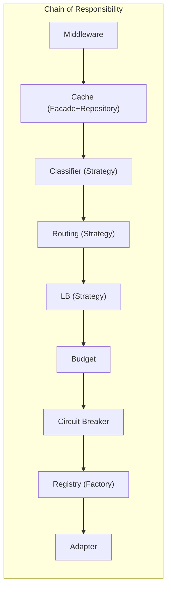

---

## 15. Scalability Considerations

- **Stateless horizontal scale.** The hot path holds no durable state, so throughput scales by adding instances behind the external load balancer. No sticky sessions required.
- **Shared cold state in Redis.** L2/L3 cache, health/circuit state, and budget counters are centralized so all instances see a consistent view; this is the coordination point and thus the primary scaling dependency.
- **Cache as a load shedder.** L1 absorbs hot exact-matches per instance at near-zero latency; L2 shares hits across the fleet; L3 collapses near-duplicate prompts. Effective caching directly reduces provider load, latency, and cost.
- **Health convergence.** Because circuit/health state is shared, a provider failure observed by one instance quickly steers the whole fleet away from it, avoiding N-instance rediscovery of the same outage.
- **Budget consistency.** Spend counters in Redis are updated atomically so budget enforcement holds across instances rather than per-instance drift.
- **Async isolation.** Shadow traffic and telemetry export run out of band, so evaluation and observability load do not steal from the request path.
- **Bounded fan-out.** Fallback walks an ordered candidate list rather than fanning out to all providers, keeping worst-case work per request bounded.

Known scaling limits (acknowledged, not solved here):
- Redis is a shared dependency and a potential bottleneck/SPOF; mitigations (replication, clustering) are deployment concerns, not architectural changes.
- L1 caches are not coherent across instances (best-effort by design); L2 is the source of truth for shared hits.

---

## 16. Tradeoffs

| Decision | Alternative | Why chosen | Cost accepted |
|----------|-------------|------------|---------------|
| **In-process synchronous pipeline** | Message-bus / microservice per stage | Lowest latency, explicit control flow, far simpler to reason about and demonstrate | Stages scale together, not independently |
| **Redis for all shared state** | Separate stores per concern (vector DB, KV, counter service) | One well-understood dependency covers L2, semantic index, health, and budget | Redis becomes a shared bottleneck/SPOF |
| **Per-instance L1 (non-coherent)** | Distributed coherent L1 | Near-zero-latency local hits without coordination overhead | Possible duplicate misses across instances |
| **Read-through cache before routing** | Route first, cache per provider | Maximizes hit rate and cost savings independent of provider choice | Cache keys must be provider-independent and eligibility carefully defined |
| **Semantic cache as best-effort (L3)** | Semantic cache as authoritative | Avoids returning subtly-wrong "close" answers; conservative threshold + fail-safe | Lower hit rate than an aggressive semantic cache |
| **Orchestrator-driven fallback (sequential candidates)** | Parallel hedged requests to multiple providers | Bounded cost and no duplicate spend | Higher tail latency on failover vs. hedging |
| **Shadow traffic fire-and-forget** | Synchronous shadow comparison | Zero impact on served latency/reliability | Shadow results are eventually-collected, not inline |
| **Budget checked pre-dispatch via estimate** | Post-hoc accounting only | Prevents overspend before the call | Estimate may differ from actual; reconciled after |
| **Classifier as optional input** | Classifier as mandatory gate | Routing still works if classification is unavailable | Complexity-aware routing degrades to default when classifier is down |
| **Single-tenant, self-hosted** | Multi-tenant service | Keeps scope on infrastructure primitives (portfolio goal) | No isolation/tenancy — explicitly out of scope |

---

## 17. Traceability to Phases

| Phase | Component(s) | Section(s) |
|-------|-------------|-----------|
| 1 · Provider Layer | Provider Registry + Adapters, `provider/contract` | 5.10, 12, 14 |
| 2 · Routing Engine | Routing Engine | 5.5, 6, 14 |
| 3 · Multi-Level Cache | Cache Manager (L1/L2/L3) | 5.4, 6, 7 |
| 4 · Circuit Breaker | Circuit Breaker + Health Monitor | 5.8, 10, 14 |
| 5 · Observability | Observability Exporter | 5.12, 8, 11 |
| 6 · Load Balancer | Load Balancer | 5.6, 15 |
| 7 · Budget Engine | Budget Engine + Cost Model | 5.7, 5.11, 9 |
| 8 · Prompt Complexity Classifier | Classifier | 5.3, 6 |
| 9 · Shadow Traffic | Shadow Traffic Manager | 5.9, 8, 16 |

Every architectural element maps to exactly one of the nine in-scope phases; nothing outside that set is introduced.
