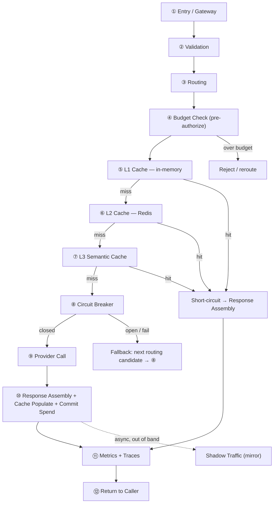
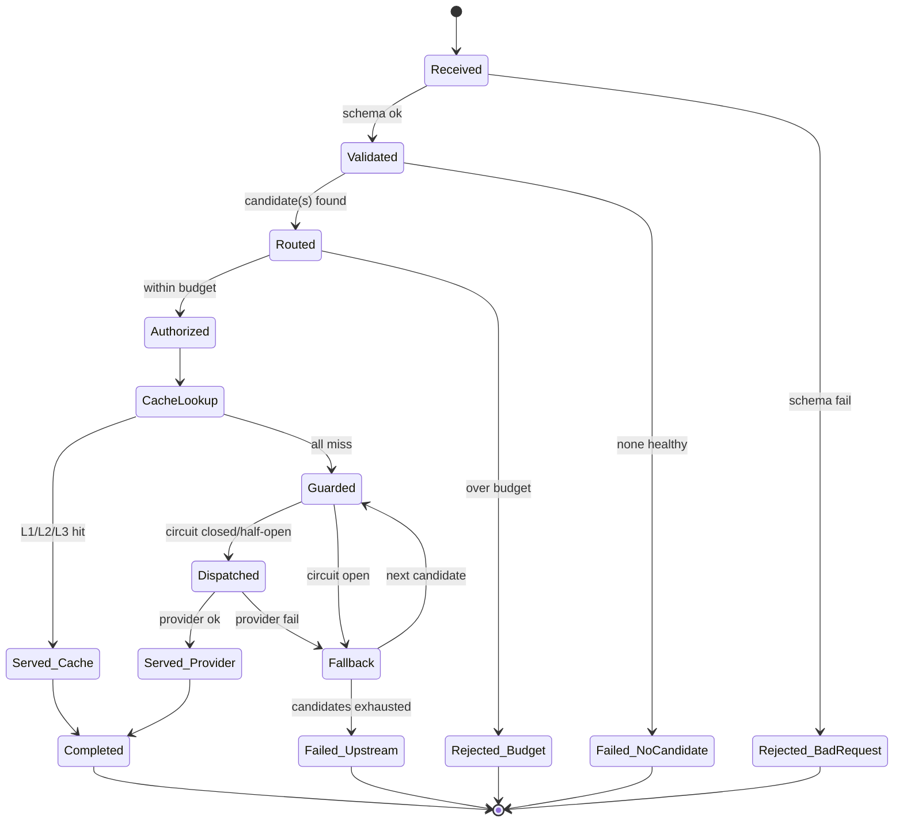
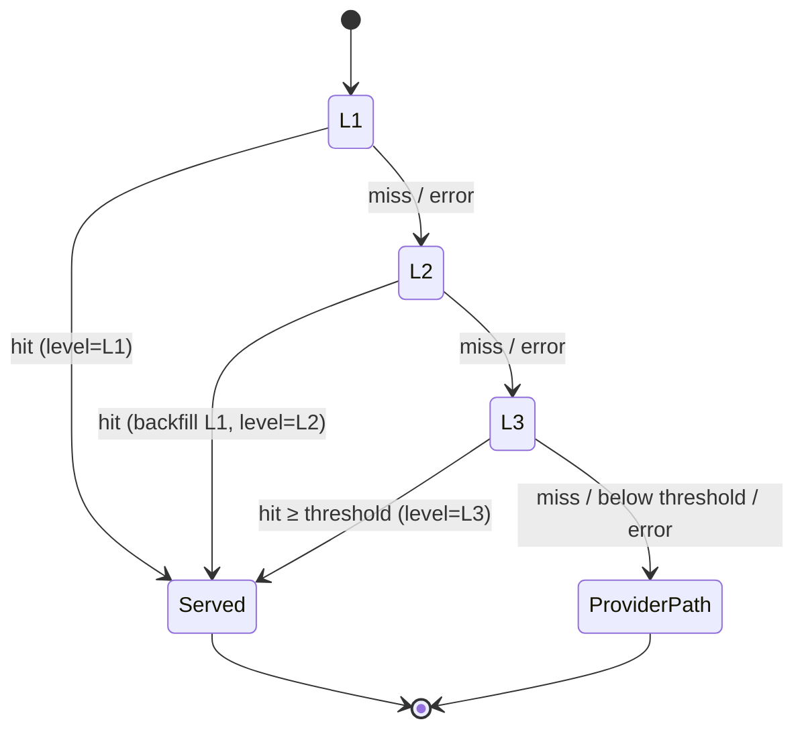
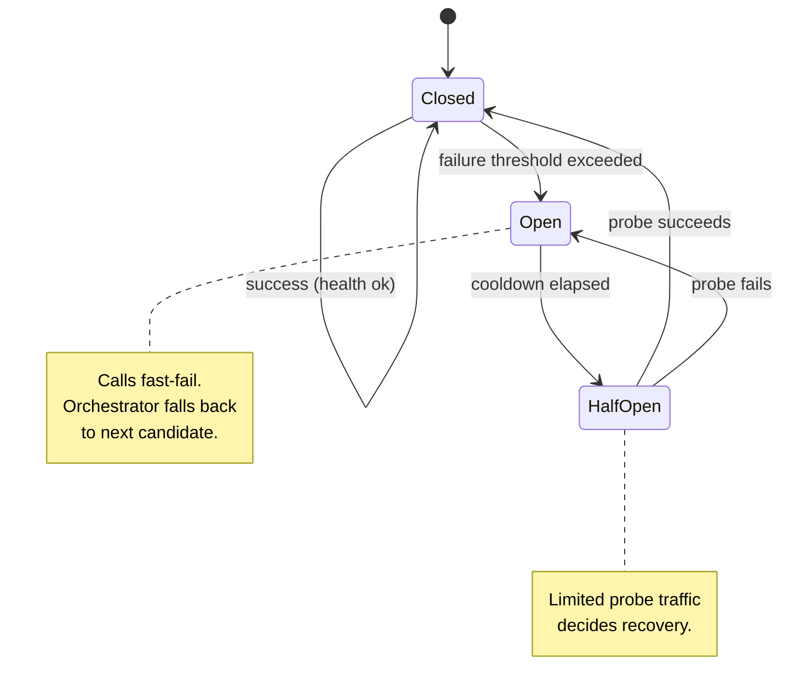
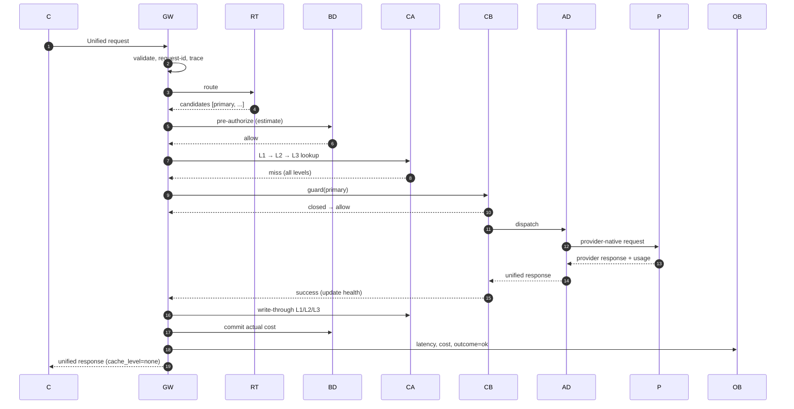
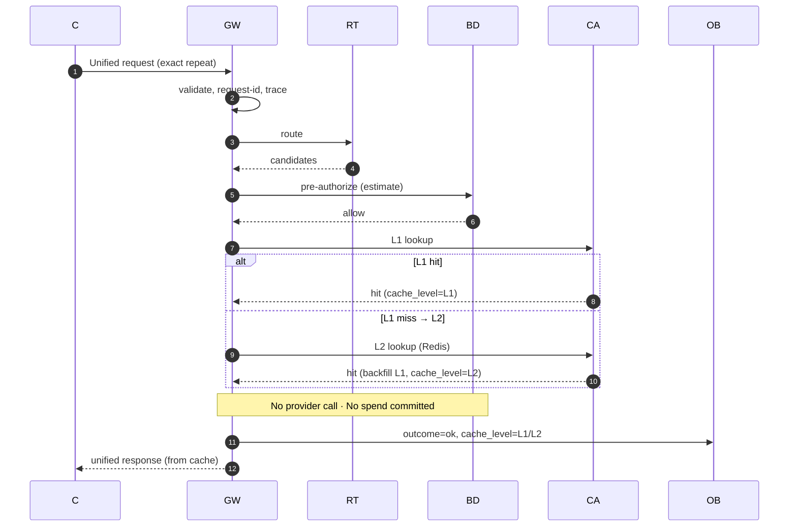
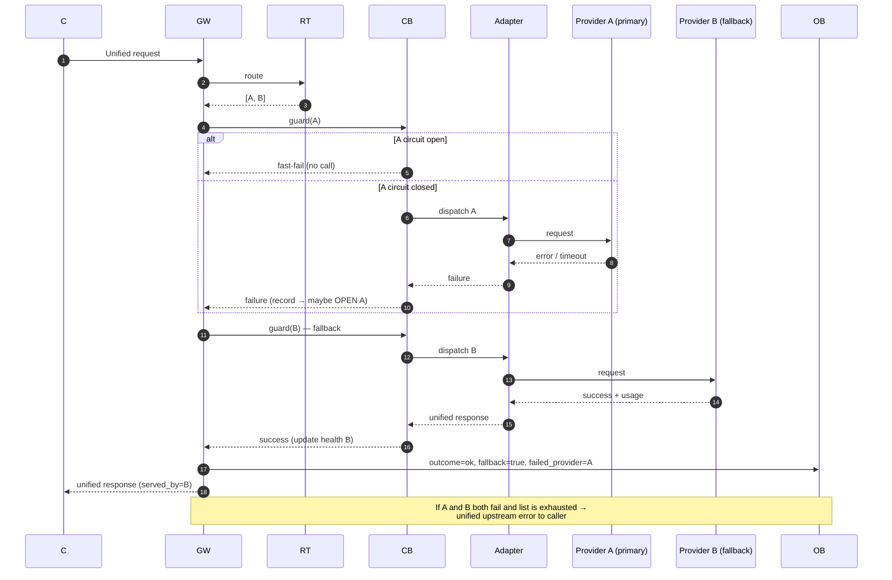
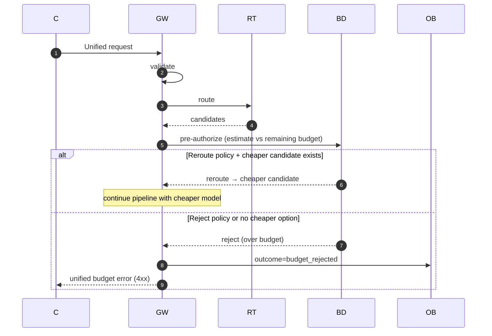
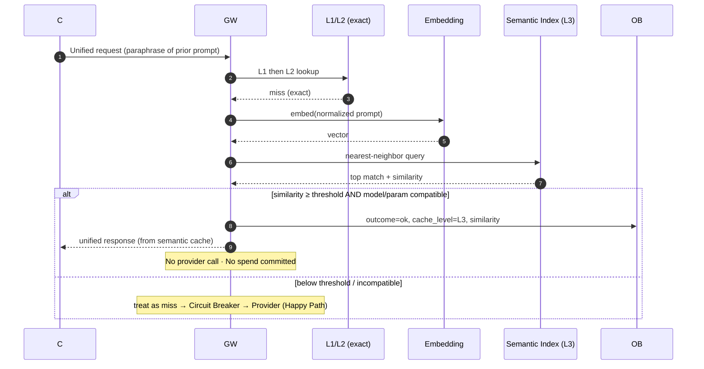
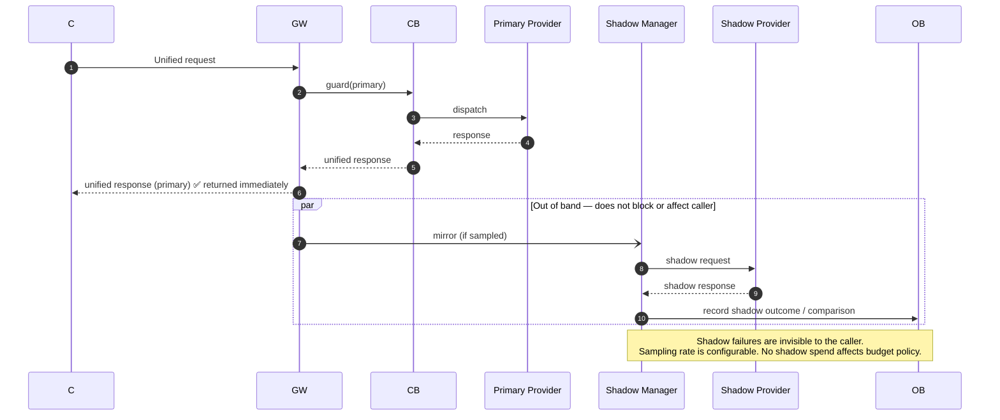

# ModelMesh — Request Lifecycle

**Status:** Draft (pre-implementation)
**Document type:** Architecture Document — Execution Path
**Last updated:** 2026-07-16
**Owner:** Engineering
**Related:** [PRD](../PRD.md) · [High-Level Architecture](./High-Level-Architecture.md)

---

## 0. How to Read This Document

This document traces the complete execution path of **a single request** through ModelMesh, stage by stage. The goal is that a new engineer can understand exactly what happens to a request — and why — **before opening any source code**.

It is organized in three parts:

1. **The pipeline** — an end-to-end map and a stage-by-stage reference. Each stage documents its **Purpose, Input, Output, Internal Logic, Failure Scenarios, Recovery Strategy, and Metrics Emitted**.
2. **The scenario paths** — six concrete end-to-end walkthroughs (Happy Path, Cache Hit, Provider Failure, Budget Exceeded, Semantic Cache Hit, Shadow Traffic), each with a sequence diagram.
3. **State reference** — state diagrams for the request lifecycle, the cache lookup, and the circuit breaker.

No implementation code appears here. This is an architecture document.

---

## 1. Stage Ordering Note (important)

This document uses the following canonical order:

```
Entry → Validation → Routing → Budget Check → L1 → L2 → L3 → Circuit Breaker → Provider → Response → Metrics → Return
```

Note that **Routing and Budget run before the cache lookup** here. The [High-Level Architecture](./High-Level-Architecture.md) discusses a cache-first read-through variant. Both are valid; this document adopts **routing-before-cache** and the rest of the system is described consistently with it. Two consequences follow directly from this choice, and they hold throughout:

- **The cache key includes the routed model.** Because routing has already chosen a provider/model when the cache is consulted, the cache key can incorporate the model. Lookups are therefore per-model exact matches (L1/L2) rather than provider-independent.
- **Budget is a pre-authorization, not a commitment.** The Budget Check *authorizes* the request against remaining budget using an estimate, but **spend is only committed after a real provider call succeeds**. A request served from cache (L1, L2, or L3) commits **no** spend, even though it passed the budget gate.

| Ordering | Pro | Con |
|----------|-----|-----|
| **Routing → Budget → Cache** (this doc) | Cache key can be model-specific; budget gate is evaluated once, early | Routing/budget work is spent even on a cache hit |
| Cache → Routing → Budget (arch variant) | No routing cost on a cache hit; higher hit rate (provider-independent keys) | Cache keys must be provider-independent; eligibility is trickier |

---

## 2. End-to-End Pipeline Map



The stages are executed by the **Request Pipeline Orchestrator**. Stages that are *optional* (L3 semantic, shadow) or *best-effort* (L1/L2 backends) degrade to "skip / miss" on error and never fail the request; only validation, budget rejection, or exhaustion of all provider candidates produce a caller-facing error.

---

## 3. Stage-by-Stage Reference

### ① Entry / Gateway (Edge)

- **Purpose:** Accept the inbound request at the unified API boundary, establish request identity and tracing context, and hand a normalized request object to the pipeline.
- **Input:** Raw HTTP request on the unified completion endpoint (headers + body).
- **Output:** A request context carrying a unique `request_id`, an open trace/span, and the raw payload, passed to Validation.
- **Internal logic:**
  - Assign a `request_id` (generate if absent).
  - Start the root trace span; attach `request_id` and route as span attributes.
  - Record receive timestamp for end-to-end latency.
  - Apply edge middleware (size limits, content-type checks) that is transport-level only.
- **Failure scenarios:** Malformed transport (bad content-type, oversized body); tracing subsystem unavailable.
- **Recovery strategy:** Transport errors → immediate `4xx` unified error. Tracing failure is **fail-safe**: continue without a span, record a metric.
- **Metrics emitted:** `requests_received_total`, `request_bytes` (histogram); span `gateway.entry`.

---

### ② Validation

- **Purpose:** Guarantee the request conforms to the unified schema before any decision or cost is incurred.
- **Input:** Request context + raw payload from Entry.
- **Output:** A typed, validated **Unified Request** model (prompt/messages, parameters, constraints) — or a rejection.
- **Internal logic:**
  - Parse payload into the Unified Request model.
  - Validate required fields, parameter ranges, and any caller-supplied constraints (e.g. allowed models).
  - Normalize inputs (defaults applied) so downstream stages see a canonical shape.
- **Failure scenarios:** Missing/invalid fields; unsupported parameters; unparseable body.
- **Recovery strategy:** **Fail closed with a 4xx** — this is caller fault and must not be retried or defaulted silently. No downstream stage runs.
- **Metrics emitted:** `validation_failures_total{reason}`, `requests_valid_total`; span `gateway.validate`.

---

### ③ Routing

- **Purpose:** Decide **which provider and model** should serve the request, producing an ordered list of candidates to enable fallback.
- **Input:** Unified Request; provider **health/circuit state**; routing config (weights, strategy); optional **complexity signal** from the classifier.
- **Output:** An ordered **candidate list** `[{provider, model}, …]`, best first.
- **Internal logic:**
  - Invoke the Complexity Classifier (fail-safe; default complexity if unavailable).
  - Filter out providers whose circuit is **open** or that are marked unhealthy.
  - Apply the active routing **strategy** (weighted; optionally complexity-aware) to rank remaining candidates.
  - Emit the ordered candidate list; the first is primary, the rest are fallbacks.
- **Failure scenarios:** No healthy candidate available; classifier unavailable; misconfigured weights.
- **Recovery strategy:** Classifier down → proceed with default complexity. **No candidates** → short-circuit to an upstream-unavailable error (no provider to try). Misconfiguration is caught at config-load, not here.
- **Metrics emitted:** `routing_decisions_total{provider,model}`, `routing_candidates` (histogram), `routing_no_candidate_total`, `classifier_latency_seconds`; span `gateway.route`.

---

### ④ Budget Check (Pre-Authorization)

- **Purpose:** Ensure the request is permitted under the configured budget **before** any provider cost is incurred.
- **Input:** Unified Request + chosen primary candidate `{provider, model}`; current spend counters (Redis); pricing (Cost Model).
- **Output:** An **authorization decision**: allow / reject / reroute. On allow, an estimated cost is attached for later reconciliation.
- **Internal logic:**
  - Estimate request cost via the Cost Model for the chosen model.
  - Compare `current_spend + estimate` against the applicable budget limit (read from Redis).
  - **Pre-authorize** only — do **not** decrement/commit here. Commitment happens post-provider-call (Stage ⑩). A cache hit therefore commits nothing.
- **Failure scenarios:** Over budget; Redis counter read fails.
- **Recovery strategy:** Over budget → **reject** (unified budget error) or **reroute** to a cheaper candidate if policy allows. Counter read failure is a **policy decision documented as fail-open or fail-closed** in config (default: fail-closed to avoid overspend), and is recorded as a metric.
- **Metrics emitted:** `budget_checks_total{decision}`, `budget_rejections_total`, `estimated_cost_usd` (histogram), `budget_remaining_usd` (gauge); span `gateway.budget`.

---

### ⑤ L1 Cache (In-Memory, per instance)

- **Purpose:** Serve exact-match repeats at the lowest possible latency from process memory.
- **Input:** Cache key derived from `{normalized prompt/messages, parameters, routed model}`.
- **Output:** Cached Unified Response (**hit**) → short-circuit to Response Assembly; or **miss** → proceed to L2.
- **Internal logic:**
  - Compute the exact-match cache key.
  - Look up in the in-process store honoring TTL and size bounds (eviction on pressure).
  - On hit, mark the response `cache_level = L1` and skip all downstream stages including the provider.
- **Failure scenarios:** Key absent (normal miss); store corruption/eviction race.
- **Recovery strategy:** Any error is treated as a **miss** — continue to L2. Never fatal.
- **Metrics emitted:** `cache_lookups_total{level="l1"}`, `cache_hits_total{level="l1"}`, `cache_hit_ratio{level="l1"}`; span `cache.l1`.

---

### ⑥ L2 Cache (Redis, shared)

- **Purpose:** Serve exact-match repeats **across the fleet** from shared Redis, so a response cached by one instance is reusable by all.
- **Input:** The same exact-match cache key used for L1.
- **Output:** Cached Unified Response (**hit**) → short-circuit (and backfill L1); or **miss** → proceed to L3.
- **Internal logic:**
  - Look up the key in Redis honoring TTL.
  - On hit, **backfill L1** so subsequent same-instance requests hit locally, mark `cache_level = L2`, and short-circuit.
- **Failure scenarios:** Cache miss; Redis unavailable/timeout.
- **Recovery strategy:** Redis error → treat as **miss** (fail-safe), record a backend-error metric, continue to L3. A degraded Redis reduces hit rate but never fails requests.
- **Metrics emitted:** `cache_lookups_total{level="l2"}`, `cache_hits_total{level="l2"}`, `cache_backend_errors_total{level="l2"}`, `l2_latency_seconds`; span `cache.l2`.

---

### ⑦ L3 Semantic Cache

- **Purpose:** Serve **semantically equivalent** (not byte-identical) prior prompts, collapsing near-duplicate requests. Best-effort by design.
- **Input:** An embedding of the normalized prompt; the semantic index (Redis-backed); a configured **similarity threshold**.
- **Output:** Cached Unified Response for a sufficiently similar prompt (**hit**) → short-circuit; or **miss** → proceed to Circuit Breaker.
- **Internal logic:**
  - Compute the prompt embedding.
  - Query nearest neighbors in the semantic index.
  - Accept the top match **only if** similarity ≥ threshold **and** it is model/parameter-compatible; on accept, mark `cache_level = L3` and short-circuit.
  - Conservative by intent: below threshold is a miss.
- **Failure scenarios:** Embedding computation fails; index unavailable; no neighbor above threshold.
- **Recovery strategy:** Any error or below-threshold result → **miss**, continue to provider. L3 is optional and must never fail a request or return a low-confidence match.
- **Metrics emitted:** `cache_lookups_total{level="l3"}`, `cache_hits_total{level="l3"}`, `semantic_similarity` (histogram), `embedding_latency_seconds`, `cache_backend_errors_total{level="l3"}`; span `cache.l3`.

---

### ⑧ Circuit Breaker + Health

- **Purpose:** Protect the system from a degraded provider by guarding each provider call and short-circuiting calls to providers that are failing.
- **Input:** Chosen candidate `{provider, model}`; the provider's current circuit state (closed/open/half-open) from shared health state.
- **Output:** Permission to dispatch (state = closed or half-open probe) → proceed to Provider; or a **fast-fail** (state = open) → orchestrator falls back to the next candidate.
- **Internal logic:**
  - Read the provider's circuit state.
  - **Closed:** allow the call.
  - **Open:** reject immediately without calling the provider (fast-fail) → fallback.
  - **Half-open:** allow a limited probe; the outcome decides whether the circuit closes or re-opens.
  - After the call returns (Stage ⑨), **record the outcome** (success/failure/latency) to update health and drive state transitions.
- **Failure scenarios:** Circuit open; repeated failures push closed → open; probe fails in half-open.
- **Recovery strategy:** Open circuit → **fallback to next routing candidate**; if all candidates are open/exhausted, return an upstream-unavailable error. Recovery is automatic via the **half-open probe** restoring the provider when it succeeds. (See [state diagram](#93-circuit-breaker-state).)
- **Metrics emitted:** `circuit_state{provider}` (gauge: 0 closed / 1 open / 2 half-open), `circuit_transitions_total{provider,to}`, `circuit_short_circuits_total{provider}`, `provider_health{provider}`; span `resilience.breaker`.

---

### ⑨ Provider Call (Adapter)

- **Purpose:** Execute the actual completion against the concrete external provider through its adapter, translating to and from the unified model.
- **Input:** Unified Request + target `{provider, model}` (permitted by the breaker).
- **Output:** A provider-native response translated into a **Unified Response** (with token usage), or a normalized error.
- **Internal logic:**
  - Adapter translates Unified Request → provider-native request.
  - Issue the call to the provider API under configured timeout.
  - Translate provider-native response → Unified Response; extract usage (tokens) for cost.
  - Translate provider errors → the normalized internal error model.
  - Report the outcome to the Circuit Breaker (Stage ⑧) to update health.
- **Failure scenarios:** Timeout; provider `5xx`/rate-limit; malformed provider response; network error.
- **Recovery strategy:** On failure, the breaker records it and the orchestrator **falls back to the next candidate** (re-entering Stage ⑧ for that candidate). Only after **all candidates are exhausted** does a unified upstream error reach the caller. Retries within a provider, if any, are bounded and configured.
- **Metrics emitted:** `provider_requests_total{provider,model,outcome}`, `provider_latency_seconds{provider,model}`, `provider_tokens_total{provider,model,type}`, `provider_errors_total{provider,reason}`; span `provider.call`.

---

### ⑩ Response Assembly + Cache Populate + Commit Spend

- **Purpose:** Finalize the response, populate the caches for future reuse, and commit actual spend.
- **Input:** Unified Response (from provider **or** from a cache short-circuit) + request context.
- **Internal logic:**
  - Assemble the caller-facing Unified Response; annotate `cache_level` and `served_by` (provider/model).
  - **If served by the provider** (not a cache hit): write-through to **L1**, **L2**, and index into **L3**, subject to eligibility/TTL; compute **actual cost** from usage via the Cost Model and **commit** it to the Redis spend counter (reconciling against the Stage ④ estimate).
  - **If served from cache:** no cache write for the served value, **no spend committed**.
  - Trigger **shadow mirroring** out of band if enabled (fire-and-forget; see [Shadow path](#86-shadow-traffic-path)).
- **Failure scenarios:** Cache write fails; spend-counter update fails; shadow dispatch fails.
- **Recovery strategy:** All are **fail-safe** and out of the response's critical path — the caller's response is already determined. Failures are logged and metered; a failed spend commit is flagged for reconciliation but does not fail the response.
- **Metrics emitted:** `cache_populations_total{level}`, `spend_committed_usd` (counter), `spend_commit_failures_total`, `response_assembled_total{cache_level}`; span `gateway.assemble`.

---

### ⑪ Metrics + Traces

- **Purpose:** Record the complete outcome of the request for observability, and close the trace.
- **Input:** Full request context: timings, decisions, cache level, provider, cost, outcome.
- **Internal logic:**
  - Emit end-to-end latency (`request_duration_seconds`) and the outcome dimension.
  - Finalize span statuses across the stage spans and export the trace.
  - Ensure a metric was emitted for **every** branch taken (including fail-safe skips) so no path is invisible.
- **Failure scenarios:** Metrics/trace backend unavailable.
- **Recovery strategy:** **Fail-safe** — telemetry export never blocks or fails the response; drops are counted locally where possible.
- **Metrics emitted:** `request_duration_seconds{outcome}`, `requests_completed_total{outcome,cache_level}`; closes all spans.

---

### ⑫ Return to Caller

- **Purpose:** Serialize and send the Unified Response over the wire.
- **Input:** Assembled Unified Response.
- **Output:** HTTP response to the caller (status + body), independent of which provider or cache level served it.
- **Internal logic:** Serialize to the unified wire schema; set status; include `request_id` for correlation.
- **Failure scenarios:** Client disconnected; serialization error.
- **Recovery strategy:** Client disconnect is recorded as an aborted request; serialization errors map to a `5xx` with the `request_id` logged.
- **Metrics emitted:** `responses_sent_total{status}`, `response_bytes` (histogram).

---

## 4. Metrics Catalog (summary)

| Stage | Key metrics |
|-------|-------------|
| Entry | `requests_received_total`, `request_bytes` |
| Validation | `validation_failures_total{reason}`, `requests_valid_total` |
| Routing | `routing_decisions_total`, `routing_candidates`, `routing_no_candidate_total`, `classifier_latency_seconds` |
| Budget | `budget_checks_total{decision}`, `budget_rejections_total`, `budget_remaining_usd` |
| L1 | `cache_hits_total{level="l1"}`, `cache_hit_ratio{level="l1"}` |
| L2 | `cache_hits_total{level="l2"}`, `cache_backend_errors_total{level="l2"}` |
| L3 | `cache_hits_total{level="l3"}`, `semantic_similarity`, `embedding_latency_seconds` |
| Circuit Breaker | `circuit_state{provider}`, `circuit_transitions_total`, `circuit_short_circuits_total` |
| Provider | `provider_requests_total{outcome}`, `provider_latency_seconds`, `provider_tokens_total`, `provider_errors_total` |
| Assembly | `spend_committed_usd`, `cache_populations_total` |
| Completion | `request_duration_seconds{outcome}`, `requests_completed_total{outcome,cache_level}` |

---

## 5. Request Lifecycle — State View

The request as a state machine, showing terminal outcomes:



---

## 6. Cache Lookup — State View



Every downward transition (`L1→L2→L3→provider`) also occurs on **backend error**, not just a clean miss — this is what makes caching fail-safe.

---

## 7. Circuit Breaker — State View



---

## 8. Scenario Paths

Each scenario is an end-to-end walkthrough with a sequence diagram. Participants are abbreviated:
`C`=Caller, `GW`=Gateway/Validation, `RT`=Routing, `BD`=Budget, `CA`=Cache (L1/L2/L3), `CB`=Circuit Breaker, `AD`=Adapter, `P`=Provider, `SH`=Shadow, `OB`=Observability.

### 8.1 Happy Path (cache miss → provider success)

The request is valid, routed, within budget, misses all cache levels, the circuit is closed, and the provider responds successfully.



### 8.2 Cache Hit Path (L1 or L2 exact match)

An exact repeat: the request passes validation, routing, and budget pre-authorization, then hits an exact-match cache level and short-circuits **before any provider call** — committing **no spend**.



### 8.3 Provider Failure Path (fallback via circuit breaker)

The primary provider fails (or its circuit is open). The orchestrator falls back through the ordered candidate list; a healthy candidate succeeds. The failing provider's health is updated, potentially opening its circuit.



### 8.4 Budget Exceeded Path

The Budget Check pre-authorization determines the request would exceed the configured limit. Per policy it is rejected (or rerouted to a cheaper candidate). **No provider call, no cache work.**



### 8.5 Semantic Cache Hit Path (L3)

Exact-match L1/L2 miss, but the L3 semantic cache finds a prior prompt whose embedding similarity meets the threshold. The stored response is served; below-threshold would have fallen through to the provider.



### 8.6 Shadow Traffic Path

A fraction of live requests is mirrored to a shadow provider/model **out of band**. The caller receives the primary response unchanged and is unaffected by anything in the shadow path; shadow outcomes are recorded only for evaluation.



---

## 9. Cross-Cutting Guarantees (recap)

These invariants hold across **every** path above and are the reason the pipeline is safe to reason about:

1. **Only three things fail a request to the caller:** validation error, budget rejection, or **all provider candidates exhausted**. Everything else degrades.
2. **Optional/best-effort stages are fail-safe:** classifier, L1/L2/L3 backends, shadow, and telemetry errors become "skip / miss / drop," never a request failure.
3. **A cache hit commits no spend** and calls no provider — budget was only a pre-authorization.
4. **Health is updated from real outcomes** on every provider call, and drives routing and circuit state fleet-wide via shared state.
5. **Every branch emits telemetry,** so no executed path is invisible to operators.
6. **The caller cannot tell** which provider or cache level served the response — the unified contract is preserved end to end.

---

## 10. Traceability to Phases

| Stage(s) | Phase |
|----------|-------|
| ⑨ Provider, Adapters | 1 · Provider Layer |
| ③ Routing | 2 · Routing Engine |
| ⑤⑥⑦ L1/L2/L3 | 3 · Multi-Level Cache |
| ⑧ Circuit Breaker + Health | 4 · Circuit Breaker |
| ⑪ Metrics + Traces, catalog | 5 · Observability |
| ③ candidate selection across healthy targets | 6 · Load Balancer |
| ④ Budget Check + commit | 7 · Budget Engine |
| ③ complexity input | 8 · Prompt Complexity Classifier |
| §8.6 Shadow path | 9 · Shadow Traffic |
