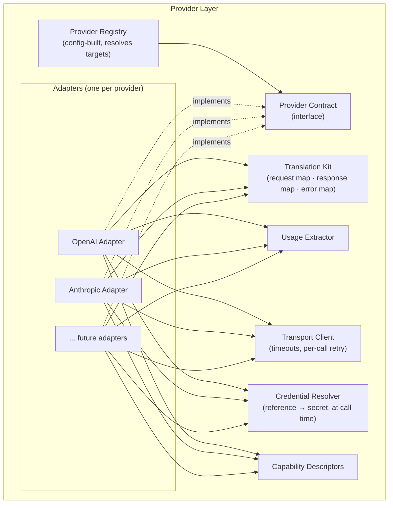
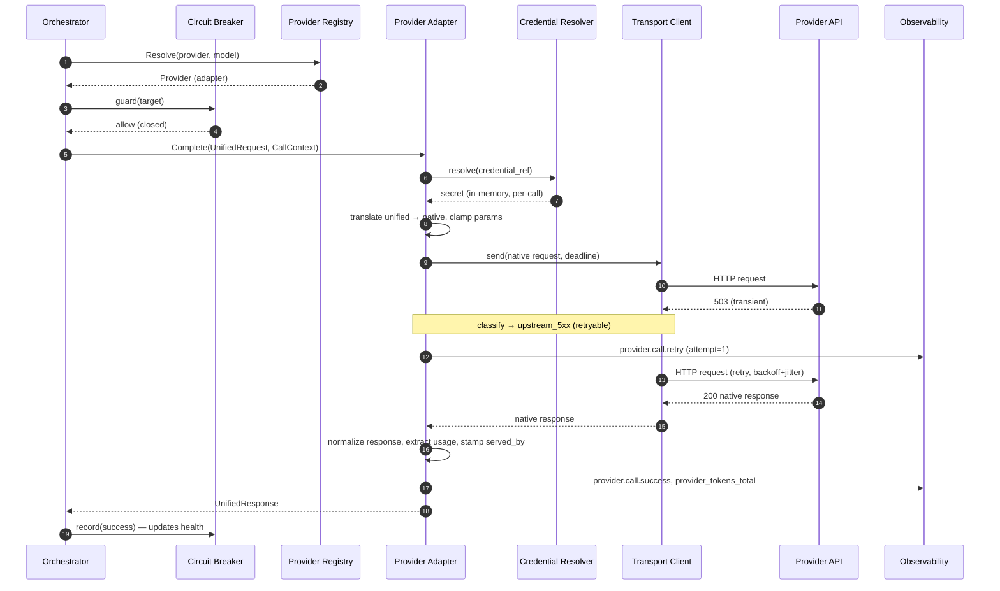
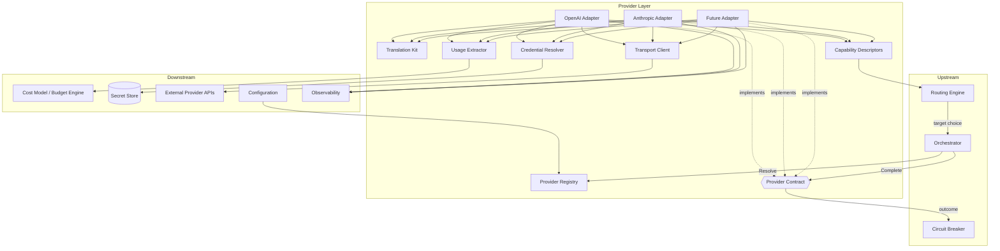

# ModelMesh — Component Design: Provider Layer

**Status:** Draft (pre-implementation)
**Document type:** Low-Level Design
**Last updated:** 2026-07-16
**Module:** 1 of 9
**Related:** [PRD](../PRD.md) · [High-Level Architecture](../02-architecture/High-Level-Architecture.md) · [Request Lifecycle](../02-architecture/Request-Lifecycle.md) · Siblings: [Routing Engine](./02-routing-engine.md) · [Circuit Breaker](./04-circuit-breaker.md) · [Budget Engine](./07-budget-engine.md) · [Observability](./05-observability.md)

---

## 1. Purpose

The Provider Layer is the abstraction that lets every application target **one unified completion API** while any number of external LLM providers (OpenAI, Anthropic, and others) sit behind a **common internal contract**. It owns the translation of a provider-neutral request into a provider-native call, the normalization of the native response back into a provider-neutral result, and the classification of every provider-specific failure into a single, stable error taxonomy.

In one sentence: **the Provider Layer is where ModelMesh stops being generic and starts talking to a specific vendor — and the only place that vendor-specific knowledge is allowed to live.**

Everything upstream (routing, caching, budgeting) operates on unified models and never imports a provider SDK, a provider model name, or a provider error shape. That containment is the entire reason this module exists.

---

## 2. Responsibilities

**In scope:**

- Define the **Provider contract** that every adapter implements.
- Implement **one adapter per provider**, translating unified ⇄ native in both directions.
- Maintain a **Provider Registry** built from configuration that resolves a `{provider, model}` target to a concrete adapter.
- Own the **Unified Request / Unified Response / Provider Error** models.
- Extract **usage / token counts** from native responses and surface them for the [Budget Engine](./07-budget-engine.md) / Cost Model.
- Publish **capability descriptors** (what each provider/model supports) so upstream components can make informed decisions.
- Enforce a **per-call timeout** and a **bounded per-provider retry** policy for transient, idempotent-safe faults.

**Explicitly out of scope (owned elsewhere):**

- **Which** provider/model to use → [Routing Engine](./02-routing-engine.md).
- **Guarding** a call / fast-failing an unhealthy provider → [Circuit Breaker](./04-circuit-breaker.md).
- **Cross-provider fallback** (trying provider B after A fails) → Orchestrator, driven by the routing candidate list.
- **Cost computation and budget enforcement** → [Budget Engine](./07-budget-engine.md); the Provider Layer only reports raw usage.
- **Caching** of responses → [Cache System](./03-cache-system.md).

> **Boundary rule:** the Provider Layer *executes and normalizes a single call to a single already-chosen target*. It does not choose, does not protect, and does not retry across providers.

---

## 3. Public Interfaces

Contracts only — no implementation.

```text
Provider (contract implemented by every adapter):
  Complete(UnifiedRequest, CallContext) -> UnifiedResponse | ProviderError
  Capabilities() -> CapabilityDescriptor

ProviderRegistry:
  Resolve(providerId, modelId) -> Provider | ResolutionError
  List() -> []ProviderDescriptor
  Describe(providerId, modelId) -> ProviderDescriptor | ResolutionError
```

| Operation | Input | Output | Semantics |
|-----------|-------|--------|-----------|
| `Provider.Complete` | `UnifiedRequest`, `CallContext` (deadline, request_id, trace span) | `UnifiedResponse` **or** `ProviderError` | Executes exactly one native call to this provider/model. Translates in, calls, translates out. Applies per-call timeout and bounded transient retry. **Never** throws provider-native errors; every failure is a normalized `ProviderError`. Idempotent from ModelMesh's view (no side effects beyond the provider call). |
| `Provider.Capabilities` | — | `CapabilityDescriptor` | Static description of what this adapter/model supports (streaming, max context, modalities). Used by routing/validation. Pure, no I/O. |
| `ProviderRegistry.Resolve` | `providerId`, `modelId` | `Provider` **or** `ResolutionError` | Returns the concrete adapter bound to that target. O(1) lookup against config-built maps. Errors if the pair is unknown/disabled. |
| `ProviderRegistry.List` | — | `[]ProviderDescriptor` | Enumerate all configured, enabled provider/model targets. Consumed by routing/health/observability at startup and on demand. |
| `ProviderRegistry.Describe` | `providerId`, `modelId` | `ProviderDescriptor` | Metadata (capabilities, pricing ref, credential ref) for one target without resolving a live adapter. |

**Contract invariants** every adapter must honor:

1. **Total error mapping** — every native outcome maps to exactly one `ProviderError.kind` or a `UnifiedResponse`.
2. **Usage fidelity** — if the provider reports token usage, it appears in `UnifiedResponse.usage`; if it does not, `usage.source = "estimated"` is set and the omission is explicit, never silently zero.
3. **Deadline honored** — the adapter never exceeds `CallContext.deadline`; on breach it returns `ProviderError{kind: timeout}`.
4. **No hidden state** — `Complete` is a pure function of `(UnifiedRequest, config, provider response)`.

---

## 4. Internal Components



| Component | Role |
|-----------|------|
| **Provider Contract** | The single interface (`Complete`, `Capabilities`) all adapters satisfy. The seam between generic and vendor-specific. |
| **Provider Adapter** | One per provider. Owns that vendor's request shape, response shape, error shape, auth style, and endpoint. |
| **Translation Kit** | Per-adapter mapping logic: unified→native request, native→unified response, native→normalized error. |
| **Usage Extractor** | Pulls token counts from the native response (or marks them estimated) and attaches them to the unified response. |
| **Capability Descriptors** | Static, per-model capability metadata surfaced to routing/validation. |
| **Transport Client** | Shared HTTP concern: applies the call deadline and bounded transient retry; provider-agnostic. |
| **Credential Resolver** | Turns a credential *reference* (from config) into an actual secret at call time. Secrets are never held in the descriptor or logged. |
| **Provider Registry** | Built once from config; maps `{provider, model}` → adapter + descriptor. |

---

## 5. Data Structures

### UnifiedRequest

| Field | Type | Description | Notes |
|-------|------|-------------|-------|
| `messages` | list<Message> | Ordered conversation turns (`role`, `content`) | Canonical input form; a bare `prompt` is normalized into a single user message upstream (Validation). |
| `params` | RequestParams | Sampling/generation params | See below. Provider-neutral names. |
| `constraints` | Constraints | Caller-imposed limits (allowed models, max cost hint) | Advisory to routing; adapters ignore routing-level constraints. |
| `metadata` | map<string,string> | Correlation tags | Non-semantic; may propagate to traces. |

**RequestParams**

| Field | Type | Description | Notes |
|-------|------|-------------|-------|
| `max_tokens` | int? | Output cap | Adapter maps to native equivalent. |
| `temperature` | float? | Sampling temperature | Clamped to provider's valid range during translation. |
| `top_p` | float? | Nucleus sampling | Optional. |
| `stop` | list<string>? | Stop sequences | Optional. |
| `stream` | bool | Streaming requested | Reserved; non-streaming in current contract (see §14). |

### UnifiedResponse

| Field | Type | Description | Notes |
|-------|------|-------------|-------|
| `content` | string | Generated completion text | Normalized from native structure. |
| `finish_reason` | enum | `stop` · `length` · `content_filter` · `other` | Mapped from native finish reasons. |
| `usage` | Usage | Token accounting | Always present; may be estimated. |
| `served_by` | ServedBy | `{provider, model}` that produced it | Set by the adapter; used by observability, never by the caller for logic. |
| `provider_raw_ref` | string? | Opaque handle/id from provider | For debugging/tracing only; not part of the caller contract. |

### Usage

| Field | Type | Description | Notes |
|-------|------|-------------|-------|
| `prompt_tokens` | int | Input tokens | From provider or estimated. |
| `completion_tokens` | int | Output tokens | From provider or estimated. |
| `total_tokens` | int | Sum | Convenience. |
| `source` | enum | `reported` · `estimated` | Drives Cost Model confidence. |

### ProviderError (normalized taxonomy)

| Field | Type | Description | Notes |
|-------|------|-------------|-------|
| `kind` | enum | `timeout` · `rate_limit` · `upstream_5xx` · `invalid_response` · `auth` · `bad_request` · `unavailable` | The stable classification the rest of the system reacts to. |
| `retryable` | bool | Whether a transient retry is sensible | Derived from `kind`. |
| `provider` | string | Which provider produced it | For metrics/logs. |
| `native_code` | string? | Original provider code/status | Diagnostic only. |
| `message` | string | Human-readable, sanitized | Never contains secrets or full prompt bodies. |

**Error classification map (native → kind):**

| Native signal | `kind` | `retryable` |
|---------------|--------|-------------|
| Connection/deadline exceeded | `timeout` | yes |
| HTTP 429 / quota | `rate_limit` | yes (bounded) |
| HTTP 500/502/503/504 | `upstream_5xx` | yes (bounded) |
| Unparseable / schema-violating body | `invalid_response` | no |
| HTTP 401/403 / bad key | `auth` | no |
| HTTP 400 / invalid params | `bad_request` | no |
| Endpoint unreachable / DNS | `unavailable` | yes |

### ProviderDescriptor

| Field | Type | Description | Notes |
|-------|------|-------------|-------|
| `provider` | string | Provider id | e.g. `openai`. |
| `models` | list<ModelDescriptor> | Enabled models under this provider | Each with capabilities + pricing ref. |
| `pricing_ref` | string | Key into pricing config | Resolved by Cost Model, not here. |
| `credential_ref` | string | Key into secret store | Resolved at call time; never the secret itself. |
| `enabled` | bool | Whether target is live | Disabled targets are excluded from `List`/`Resolve`. |

### CapabilityDescriptor / ModelDescriptor

| Field | Type | Description | Notes |
|-------|------|-------------|-------|
| `model` | string | Model id | |
| `max_context_tokens` | int | Context window | Used by validation/routing. |
| `supports_streaming` | bool | Streaming support | Future contract. |
| `modalities` | list<enum> | e.g. `text` | Text-only in current scope. |

---

## 6. Algorithms

All are per-adapter and stateless. Described as procedures, not code.

**A. Request translation (unified → native)**
1. Map `messages` to the provider's native message/prompt shape.
2. Map each `RequestParams` field to its native name; **clamp** values to the provider's documented valid range (record a `param_clamped` log if adjusted).
3. Drop params the provider doesn't support; note dropped params in the span.
4. Attach model id and resolved credentials (from Credential Resolver).

**B. Response normalization (native → unified)**
1. Extract completion text from the native structure into `content`.
2. Map native finish reason → unified `finish_reason` enum (`other` for unknowns).
3. Run the Usage Extractor (algorithm D).
4. Stamp `served_by = {provider, model}`.

**C. Error classification (native failure → ProviderError)**
1. Inspect the native outcome (transport error, HTTP status, or body).
2. Look up the classification map (§5) → `kind` and `retryable`.
3. Sanitize the message (strip secrets, truncate prompt echoes).
4. Return a `ProviderError`; **never** propagate a native exception upward.

**D. Usage / token extraction**
1. If the native response reports usage → copy through, `source = reported`.
2. Else estimate from tokenized input + output length using a provider-appropriate estimator, `source = estimated`.
3. Always populate all three token fields.

**E. Capability matching**
- Given a `{provider, model}` and a `UnifiedRequest`, confirm the request fits `max_context_tokens` and requested modalities. Used by validation/routing; the adapter also defensively rejects an over-context request as `bad_request` rather than shipping a call guaranteed to fail.

**F. Timeout + bounded transient retry**
1. Derive per-call deadline = `min(CallContext.deadline, adapter.call_timeout)`.
2. Issue the call.
3. On a `retryable` fault **and** attempts remain **and** the deadline is not exhausted → back off (jittered) and retry, up to `max_retries`.
4. On non-retryable, exhausted retries, or exhausted deadline → return the normalized error.

> **Retry boundary (design decision):** the Provider Layer retries only *transient faults on the same provider*, bounded and deadline-capped. It **never** switches providers — that is fallback, owned by the orchestrator using the routing candidate list. This keeps "try harder on the same target" separate from "try a different target."

---

## 7. State Management

- **Adapters are stateless.** Each `Complete` is a pure function of its inputs, config, and the provider's response. This is what makes the Provider Layer horizontally scalable and trivially concurrent (aligns with the stateless-hot-path principle in the [High-Level Architecture](../02-architecture/High-Level-Architecture.md)).
- **Registry is immutable after startup.** Built once from validated config; `{provider, model}` → adapter maps are read-only during request serving. A config reload rebuilds a new registry and swaps it atomically (future improvement, §14).
- **No health, no counters, no circuit state here.** Health/circuit lives in the [Circuit Breaker](./04-circuit-breaker.md); spend counters live in the [Budget Engine](./07-budget-engine.md). The Provider Layer *emits outcomes* (as return values/metrics) that those modules consume, but stores none of it.
- **Credentials are resolved per call and never retained** in adapter or descriptor state.

---

## 8. Configuration

| Key | Type | Default | Description |
|-----|------|---------|-------------|
| `providers[].id` | string | — | Provider identifier (`openai`, `anthropic`). |
| `providers[].enabled` | bool | `true` | Whether this provider participates. |
| `providers[].credential_ref` | string | — | Reference into the secret store; not the secret. |
| `providers[].base_url` | string | provider default | Endpoint override (for proxies/mocks/testing). |
| `providers[].call_timeout_ms` | int | `30000` | Per-call deadline cap for this provider. |
| `providers[].max_retries` | int | `2` | Bounded transient retries for `retryable` faults. |
| `providers[].retry_backoff_ms` | int | `200` | Base backoff; jitter applied. |
| `providers[].models[].id` | string | — | Enabled model id. |
| `providers[].models[].max_context_tokens` | int | provider spec | Capability + validation input. |
| `providers[].models[].pricing_ref` | string | — | Cost Model pricing key. |
| `providers[].models[].enabled` | bool | `true` | Per-model enablement. |

- **Validate-then-serve:** invalid provider config (unknown credential ref, missing model, bad timeout) fails at startup, never mid-request.
- **Least exposure:** the adapter receives only its own typed config slice; credentials arrive only as references.

---

## 9. Failure Handling

The Provider Layer's contract is: **surface a clean, classified result; never leak a native failure.**

| Failure | Handling | Surfaced as |
|---------|----------|-------------|
| Connection timeout / deadline breach | Stop at deadline (algorithm F) | `ProviderError{timeout, retryable}` |
| HTTP 429 / quota | Bounded retry with backoff, then stop | `ProviderError{rate_limit, retryable}` |
| HTTP 5xx | Bounded retry, then stop | `ProviderError{upstream_5xx, retryable}` |
| Unparseable/invalid body | No retry (deterministic) | `ProviderError{invalid_response}` |
| Auth failure | No retry; flagged prominently in logs | `ProviderError{auth}` |
| Over-context / invalid params | Defensive pre-check or provider 400 | `ProviderError{bad_request}` |
| Endpoint unreachable / DNS | Bounded retry, then stop | `ProviderError{unavailable, retryable}` |

**What the Provider Layer does NOT do on failure:**
- It does not fall back to another provider (orchestrator's job).
- It does not open/close circuits (it *returns the outcome*; the [Circuit Breaker](./04-circuit-breaker.md) records it).
- It does not swallow errors into empty responses — a failure is always a `ProviderError`.

This division keeps failure semantics crisp: *the adapter reports what happened; the pipeline decides what to do next.*

---

## 10. Logging

Structured events (name, level, key fields). Prompt bodies are truncated/hashed; secrets never logged.

| Event | Level | Key fields |
|-------|-------|-----------|
| `provider.call.start` | DEBUG | `request_id`, `provider`, `model`, `deadline_ms`, `attempt` |
| `provider.call.success` | INFO | `request_id`, `provider`, `model`, `latency_ms`, `prompt_tokens`, `completion_tokens`, `usage_source` |
| `provider.call.retry` | WARN | `request_id`, `provider`, `model`, `attempt`, `error_kind`, `backoff_ms` |
| `provider.call.error` | ERROR | `request_id`, `provider`, `model`, `error_kind`, `native_code`, `latency_ms` |
| `provider.param_clamped` | DEBUG | `request_id`, `provider`, `param`, `from`, `to` |
| `provider.auth_failure` | ERROR | `provider`, `credential_ref` *(ref, not secret)* |
| `registry.resolve_miss` | WARN | `provider`, `model` |

---

## 11. Metrics

Reuses the [Request Lifecycle](../02-architecture/Request-Lifecycle.md) catalog names, extended with module-local series.

| Metric | Type | Labels | Meaning |
|--------|------|--------|---------|
| `provider_requests_total` | counter | `provider`, `model`, `outcome` | Calls executed; `outcome ∈ {success, error}`. |
| `provider_latency_seconds` | histogram | `provider`, `model` | Wall-clock per native call (incl. retries). |
| `provider_tokens_total` | counter | `provider`, `model`, `type` | Tokens; `type ∈ {prompt, completion}`. |
| `provider_errors_total` | counter | `provider`, `reason` | `reason` = `ProviderError.kind`. |
| `provider_retries_total` | counter | `provider`, `reason` | Transient retries attempted. |
| `provider_usage_estimated_total` | counter | `provider`, `model` | Responses where usage was estimated, not reported. |
| `provider_param_clamped_total` | counter | `provider`, `param` | Param values adjusted to provider range. |
| `registry_resolve_errors_total` | counter | `provider`, `model` | Unknown/disabled target resolutions. |

---

## 12. Extension Points

- **Add a provider** = implement the Provider contract (a new adapter) + add a Translation Kit for its native shapes + register a `ProviderDescriptor` in config + add a `pricing_ref`. **Zero changes** to routing, caching, budget, or the API — that is the whole payoff of this module.
- **Add a model** to an existing provider = a config entry (model id, context, pricing) — no code.
- **Capability negotiation:** richer `CapabilityDescriptor` (function-calling, JSON mode, vision) lets routing/validation exploit provider-specific features behind the same contract.
- **Streaming variant:** a future `CompleteStream(UnifiedRequest) -> stream<UnifiedChunk>` contract (see §14) without disturbing the non-streaming path.
- **Alternate transport:** the Transport Client is swappable (e.g. a mock transport for tests, or a recording transport for shadow evaluation).
- **Custom usage estimators:** pluggable per-provider estimators for `source = estimated` cases.

---

## 13. Tradeoffs

| Decision | Alternative | Why chosen | Cost accepted |
|----------|-------------|------------|---------------|
| **Lowest-common-denominator unified schema** | Rich union of all provider features | Keeps upstream simple and providers truly interchangeable | Some provider-specific features are unreachable through the unified path (mitigated by capability descriptors + future extensions). |
| **Total, coarse error taxonomy (7 kinds)** | Pass-through native errors | Upstream reacts to *stable* categories, not vendor codes | Loses native nuance (kept in `native_code` for diagnostics). |
| **Retry only within a provider, bounded** | Retry + cross-provider fallback here | Clean separation: "try harder" vs "try elsewhere" | Fallback logic lives in the orchestrator, requiring the candidate list to be threaded down. |
| **Stateless adapters** | Adapters holding connection/session state | Trivial concurrency + horizontal scale | Per-call setup cost (amortized by transport-level pooling). |
| **Estimate usage when unreported** | Fail or zero the usage | Cost accounting never silently zeroes | Estimation error on some providers (flagged via `usage_source`). |
| **Credentials by reference, resolved per call** | Inline credentials in descriptor | Secrets never sit in resolvable state or logs | Slight per-call resolution overhead. |

---

## 14. Future Improvements

- **Streaming contract** (`CompleteStream`) with unified chunk model; threads through to the API as SSE.
- **Function/tool-calling** as a first-class capability with a unified tool-call schema.
- **Multimodal inputs** (image/audio) via expanded `modalities` and message content types.
- **Hot config reload** with atomic registry swap (no restart to add a provider/model).
- **Adapter-level response caching hints** (surface provider cache tokens/headers to the [Cache System](./03-cache-system.md)).
- **Adaptive timeouts** informed by observed per-provider latency percentiles.
- **Contract conformance test kit** — a shared suite every new adapter must pass to guarantee the §3 invariants.

---

## 15. Sequence Diagram

Single successful call with one transient retry, showing the boundary with sibling modules.



---

## 16. Component Diagram



---

## 17. Design Patterns Used

| Pattern | Where | Why |
|---------|-------|-----|
| **Adapter** (primary) | Each provider adapter translating unified ⇄ native | The defining pattern: makes heterogeneous vendors satisfy one contract, so they are interchangeable. |
| **Factory** | `ProviderRegistry.Resolve` constructing/returning the right adapter for `{provider, model}` | Centralizes creation and hides concrete adapter selection from callers. |
| **Facade** | Unified Request/Response/Error models over messy native shapes | Presents a single simple surface to the whole system. |
| **Strategy** (supporting) | Pluggable usage estimators and transport clients | Swap sub-behaviors (estimation, mock transport) without touching adapters. |
| **Template Method** (supporting) | Common `Complete` skeleton (translate → call → normalize → classify) with per-provider steps | Guarantees every adapter follows the same lifecycle and honors the §3 invariants. |

---

## 18. Why This Design Was Chosen

1. **Containment is the point.** LLM providers differ in request shape, response shape, error semantics, auth, and pricing. If any of that leaks upstream, every other module becomes provider-aware and the "unified gateway" promise collapses. Concentrating *all* vendor knowledge behind one contract is what lets routing, caching, and budgeting stay generic. This directly serves PRD goals G-1 (unified API) and G-2 (provider independence).

2. **The contract is small on purpose.** A narrow `Complete + Capabilities` surface with total error mapping means adding a provider is a *local* change — a new adapter and a config entry — with zero blast radius. That is the single most important property for a project whose whole thesis is "swap providers freely."

3. **Statelessness compounds.** Because adapters hold no state, the module scales horizontally for free and is trivial to test and mock, aligning with the stateless-hot-path architecture.

4. **The retry/fallback split is deliberate.** "Try the same provider harder" (bounded transient retry) is a different concern from "try a different provider" (fallback). Putting the first here and the second in the orchestrator keeps each module's failure semantics simple and testable, and prevents retry storms from hiding real provider outages from the [Circuit Breaker](./04-circuit-breaker.md).

5. **Honest usage accounting.** By always producing `usage` and marking it `reported` vs `estimated`, the Cost Model and [Budget Engine](./07-budget-engine.md) can reason about spend confidence instead of silently trusting zeros — essential for the budget-enforcement goal.

6. **Interfaces over implementations, everywhere.** The contract, the registry factory, and the swappable transport/estimators mean future work (streaming, tools, multimodal) extends the module without rewriting it — the extension points in §12 are consequences of this design, not afterthoughts.
