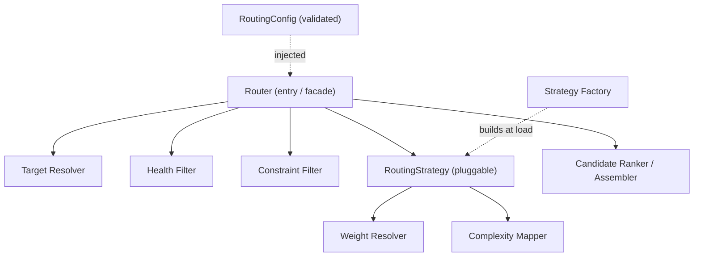

# ModelMesh — Component Design: Routing Engine

**Status:** Draft (pre-implementation)
**Document type:** Low-Level Design
**Last updated:** 2026-07-16
**Module:** 2 of 9
**Related:** [PRD](../PRD.md) · [High-Level Architecture](../02-architecture/High-Level-Architecture.md) · [Request Lifecycle](../02-architecture/Request-Lifecycle.md) · Siblings: [Provider Layer](./01-provider-layer.md) · [Cache System](./03-cache-system.md) · [Circuit Breaker](./04-circuit-breaker.md) · [Load Balancer](./06-load-balancer.md) · [Budget Engine](./07-budget-engine.md) · [Prompt Complexity Classifier](./08-prompt-complexity-classifier.md) · [Shadow Traffic](./09-shadow-traffic.md)

---

## 1. Purpose

The Routing Engine is the decision component that answers a single question for every request: **which `{provider, model}` targets should serve this request, and in what order?**

It does not perform the call, distribute load across instances, or guard for failure — it produces an **ordered candidate list**. The orchestrator walks that list top-to-bottom, and the [Circuit Breaker](./04-circuit-breaker.md) and [Load Balancer](./06-load-balancer.md) act on each candidate in turn. Emitting an *ordered list* rather than a single winner is the design's central choice: it makes orchestrator-driven fallback possible without the Routing Engine needing to know about failure at all.

Per the [Request Lifecycle](../02-architecture/Request-Lifecycle.md), routing runs **before** the cache lookup. This is deliberate: the routed model becomes part of the cache key, so exact-match caching is scoped per model. Routing is therefore on the hot path of *every* request, including cache hits, and must be cheap and allocation-light.

---

## 2. Responsibilities

**In scope:**
- Resolve the set of configured `{provider, model}` targets eligible for a request.
- Filter out targets that are unhealthy or whose circuit is open, using a read-only `HealthView`.
- Apply the active **RoutingStrategy** to rank eligible targets into an ordered candidate list.
- Incorporate an optional **ComplexitySignal** to bias model selection (simple → cheap/fast, complex → strong).
- Honor per-request routing **constraints/hints** (e.g. an allow-list of models supplied by the caller).
- Attach a machine-readable `reason` and `score` to each candidate for observability and debugging.
- Support **hot-swappable** routing configuration validated at load time.

**Explicitly out of scope (owned elsewhere):**
- Executing the provider call and translating protocols → [Provider Layer](./01-provider-layer.md).
- Distributing across instances/endpoints of a chosen target → [Load Balancer](./06-load-balancer.md).
- Failure detection, circuit state, retries → [Circuit Breaker](./04-circuit-breaker.md).
- Computing the complexity of a prompt → [Prompt Complexity Classifier](./08-prompt-complexity-classifier.md) (Routing only *consumes* the signal).
- Budget enforcement → [Budget Engine](./07-budget-engine.md) (runs after routing on the primary candidate).
- Owning or mutating provider health → the Routing Engine only **reads** a `HealthView` snapshot.

---

## 3. Public Interfaces

Contracts, not code. The engine exposes one primary operation; strategies expose one ranking operation.

| Operation | Input | Output | Semantics |
|---|---|---|---|
| `Router.SelectCandidates` | `UnifiedRequest`, `HealthView`, `ComplexitySignal?` | `[]Candidate` (ordered) | Pure decision. Returns candidates best-first. Empty list is a valid, explicit outcome (no eligible target). Never performs I/O to a provider. |
| `Router.Describe` | — | `RoutingSnapshot` | Returns the active strategy name, effective weights, and constraints for diagnostics/observability. |
| `RoutingStrategy.Rank` | `[]Target` (eligible), `RankContext` | `[]Candidate` (ordered) | Strategy-specific ordering. Deterministic for a given input unless the strategy explicitly declares itself probabilistic. |
| `StrategyFactory.Build` | `RoutingConfig` | `RoutingStrategy` | Constructs (possibly composed) strategy from validated config. Fails at load, not at request time. |

```text
Router.SelectCandidates(req: UnifiedRequest, health: HealthView, cx: ComplexitySignal?) -> []Candidate
Router.Describe() -> RoutingSnapshot
RoutingStrategy.Rank(eligible: []Target, ctx: RankContext) -> []Candidate
StrategyFactory.Build(cfg: RoutingConfig) -> RoutingStrategy
```

**Contract invariants:**
- `SelectCandidates` is **read-only and side-effect-free** except for metrics/log emission.
- The returned list contains **no** unhealthy/open-circuit targets and **no** targets violating request constraints.
- Ordering is stable and reproducible given identical `(req, health, cx, config)` for deterministic strategies; probabilistic strategies vary only in draw, never in eligibility.
- The `HealthView` is treated as an immutable snapshot for the duration of the call.

---

## 4. Internal Components



| Component | Role |
|---|---|
| **Router** | Facade and orchestration of the decision: resolve → filter → strategy rank → assemble. Holds no per-request state. |
| **Target Resolver** | Expands configured providers/models into the candidate universe of `Target`s for this request. |
| **Health Filter** | Removes targets whose provider circuit is open or health is below threshold, per the injected `HealthView`. |
| **Constraint Filter** | Applies per-request hints (allow/deny model lists, required capabilities) and global constraints. |
| **RoutingStrategy** | Pluggable ranking algorithm (weighted, complexity-aware, composite). Selected by config. |
| **Weight Resolver** | Normalizes configured weights (and any weight source) into a comparable scale for ordering. |
| **Complexity Mapper** | Maps a `ComplexitySignal` band to a preference over model tiers. |
| **Candidate Ranker / Assembler** | Produces the final ordered `[]Candidate`, attaches `score`/`reason`, applies tie-breaking and the emit cap. |
| **Strategy Factory** | Builds the (possibly composed) strategy from validated config at startup / hot reload. |

---

## 5. Data Structures

### `Target`
| Field | Type | Description | Notes |
|---|---|---|---|
| `provider` | string | Provider identifier (e.g. `openai`, `anthropic`). | Matches a registered adapter. |
| `model` | string | Model identifier within the provider. | |
| `tier` | enum | Capability/cost tier (`economy`, `standard`, `premium`). | Used by Complexity Mapper. |
| `capabilities` | set<string> | Feature flags (e.g. `vision`, `long_context`). | Used by Constraint Filter. |
| `base_weight` | float | Configured static weight. | Resolved/normalized by Weight Resolver. |

### `Candidate`
| Field | Type | Description | Notes |
|---|---|---|---|
| `provider` | string | Selected provider. | |
| `model` | string | Selected model. | |
| `score` | float | Final ranking score. | Higher = preferred; ordering key. |
| `reason` | string | Machine-readable rationale (e.g. `weighted+complexity:premium`). | For logs/traces. |
| `rank` | int | 0-based position in the ordered list. | |

### `HealthView` (read-only snapshot)
| Field | Type | Description | Notes |
|---|---|---|---|
| `states` | map<Target, HealthEntry> | Per-target health/circuit snapshot. | Owned by [Circuit Breaker](./04-circuit-breaker.md); read here. |
| `captured_at` | timestamp | Snapshot instant. | Immutable during a call. |

### `HealthEntry`
| Field | Type | Description | Notes |
|---|---|---|---|
| `circuit` | enum | `closed` / `open` / `half_open`. | `open` ⇒ excluded. |
| `health_score` | float [0..1] | Rolling health signal. | Below `min_health` ⇒ excluded; may weight ranking. |

### `ComplexitySignal` (optional)
| Field | Type | Description | Notes |
|---|---|---|---|
| `band` | enum | `simple` / `moderate` / `complex`. | Absent ⇒ default band (see Config). |
| `confidence` | float [0..1] | Classifier confidence. | Low confidence may soften the bias. |

### `RoutingConfig`
| Field | Type | Description | Notes |
|---|---|---|---|
| `strategy` | string | Active strategy name (or composite spec). | Resolved by Factory. |
| `targets` | list<Target> | Universe of provider/model targets with weights. | Validated at load. |
| `min_health` | float | Health threshold for eligibility. | |
| `max_candidates` | int | Emit cap for the candidate list. | Bounds fallback fan-out. |
| `complexity_map` | map<band, tier-preference> | Band → preferred tiers. | Drives complexity-aware routing. |
| `default_band` | enum | Fallback complexity band. | Used when classifier absent. |
| `constraints` | object | Global allow/deny and capability rules. | Merged with per-request hints. |

---

## 6. Algorithms

The decision is a short pipeline: **resolve → filter → rank → assemble**.

**6.1 Target resolution.** Expand `RoutingConfig.targets` into the candidate universe, intersected with any per-request capability requirements.

**6.2 Health filtering.** Drop every target whose `circuit == open` or whose `health_score < min_health`. If the resulting set is empty, routing terminates with an empty candidate list (see §9).

**6.3 Weighted ordering (baseline strategy).** Normalize `base_weight` across the eligible set so weights sum to 1. Two supported interpretations, selectable by config:
- **Deterministic weighted order** *(default):* sort eligible targets by descending normalized weight. Produces a stable, reproducible candidate list; weights express *preference order*, and fallback follows that order.
- **Probabilistic weighted order:** draw an order by sampling without replacement proportional to weight. Produces traffic *distribution* matching weights across many requests; each request still yields a full ordered list (the drawn sequence). Chosen when the goal is proportional spread rather than a fixed preference.

The key point: **weighting yields an order, not a single pick.** The first element is the primary; the remainder are ready-made fallbacks, so the orchestrator never re-invokes routing on failure.

**6.4 Complexity-aware biasing.** When a `ComplexitySignal` is present, the Complexity Mapper translates its `band` into a tier preference via `complexity_map` (conceptually: `simple → economy/standard`, `complex → premium`). This preference is combined with the weight score — e.g. as a multiplicative bias toward the preferred tier — so cheaper/faster models rank first for simple prompts and stronger models rank first for complex ones. Low `confidence` attenuates the bias toward the neutral weighting.

**6.5 Tie-breaking.** Ties (equal score) are broken by a stable, documented order: higher `health_score`, then lower `tier` cost, then lexicographic `provider/model`. Stability guarantees reproducible lists for deterministic strategies.

**6.6 Assembly and cap.** Attach `score`, `reason`, and `rank`; truncate to `max_candidates`. The cap bounds worst-case fallback fan-out (one bad provider cannot cause an unbounded retry walk).

**Composite strategies** are ordered compositions (Chain of Responsibility over strategies): each stage may reweight or reorder the running candidate set, enabling e.g. `weighted → complexity-aware → constraint-tiebreak` without a monolithic algorithm.

---

## 7. State Management

- **Stateless hot path.** The Router holds **no per-request durable state**. Each `SelectCandidates` call is a pure function of `(request, HealthView, ComplexitySignal, active config)`.
- **Configuration state.** `RoutingConfig` and the built strategy are loaded and validated at startup and held as an immutable, atomically-swappable reference. A hot reload builds a new strategy and swaps the pointer; in-flight requests keep using the snapshot they started with.
- **No ownership of health.** Provider health and circuit state live in shared state owned by the [Circuit Breaker](./04-circuit-breaker.md). Routing consumes a `HealthView` snapshot and never writes it — this keeps the module free of coordination logic and safe to run identically on every stateless gateway instance.
- **No feedback loop (v1).** The baseline engine does not learn from outcomes; adaptive weighting is a future extension (§14) that would introduce a bounded, shared feedback store rather than in-process mutable state.

---

## 8. Configuration

| Key | Type | Default | Description |
|---|---|---|---|
| `routing.strategy` | string | `weighted` | Active strategy: `weighted`, `complexity_aware`, or a composite spec. |
| `routing.weight_mode` | enum | `deterministic` | `deterministic` (preference order) or `probabilistic` (proportional draw). |
| `routing.targets[].provider` | string | — | Provider id for a target. |
| `routing.targets[].model` | string | — | Model id for a target. |
| `routing.targets[].weight` | float | `1.0` | Static base weight. |
| `routing.targets[].tier` | enum | `standard` | Cost/capability tier. |
| `routing.min_health` | float | `0.5` | Minimum health score to remain eligible. |
| `routing.max_candidates` | int | `3` | Cap on emitted candidates (bounds fallback). |
| `routing.default_band` | enum | `moderate` | Complexity band used when the classifier is unavailable. |
| `routing.complexity_map` | map | see §6.4 | Band → tier preference for complexity-aware routing. |
| `routing.constraints` | object | `{}` | Global allow/deny lists and required capabilities. |

Configuration is validated at load: unknown providers/models, weights ≤ 0 for all targets, an unknown strategy, or an empty target set are **load-time errors**, never request-time surprises.

---

## 9. Failure Handling

| Condition | Handling | Caller impact |
|---|---|---|
| **No eligible target** (all filtered by health/constraints) | Return empty candidate list; orchestrator maps to upstream-unavailable. Emit `routing_no_candidate_total`. | Request fails fast with a unified error — nothing to call. |
| **Classifier unavailable / times out** | Proceed with `default_band`; routing is **fail-safe** and never blocks on the classifier. Emit `classifier_latency_seconds` with a timeout marker. | None — degrades to weighted routing. |
| **Stale `HealthView`** | Use the snapshot as-is; the Circuit Breaker remains the authority at call time and will fast-fail a target that turned unhealthy. | None — breaker is the backstop. |
| **Invalid config at reload** | Reject the reload; keep the last known-good config. Emit `routing_config_reload_failures_total`. | None — old config stays active. |
| **Constraint eliminates all targets** | Same as no-eligible-target, with `reason=constraint`. | Fail fast; the request asked for something unroutable. |

Design stance: routing **never** invents a target and **never** returns an unhealthy one to "try anyway." An empty list is a first-class, observable outcome, not an exception.

---

## 10. Logging

Structured events (no message-string coupling):

| Event | Level | Key fields |
|---|---|---|
| `routing.decision` | INFO | `request_id`, `strategy`, `weight_mode`, `chosen={provider,model}`, `candidate_count`, `complexity_band`, `duration_ms` |
| `routing.candidate` | DEBUG | `request_id`, `rank`, `provider`, `model`, `score`, `reason` (one per emitted candidate) |
| `routing.no_candidate` | WARN | `request_id`, `eligible_before_filter`, `filtered_by` (`health`/`constraint`), `complexity_band` |
| `routing.classifier_fallback` | INFO | `request_id`, `default_band`, `cause` (`timeout`/`unavailable`) |
| `routing.config_reload` | INFO/ERROR | `strategy`, `target_count`, `outcome`, `error?` |

INFO covers the decision summary; DEBUG exposes per-candidate scoring for tuning; WARN flags unroutable requests worth alerting on.

---

## 11. Metrics

Reused from the Request-Lifecycle catalog:

| Metric | Type | Labels | Meaning |
|---|---|---|---|
| `routing_decisions_total` | counter | `provider`, `model`, `strategy` | Decisions by chosen primary target. |
| `routing_candidates` | histogram | `strategy` | Distribution of emitted candidate-list sizes. |
| `routing_no_candidate_total` | counter | `filtered_by` | Requests with zero eligible targets. |
| `classifier_latency_seconds` | histogram | `outcome` | Time spent obtaining the complexity signal (incl. timeout). |

Module-specific additions:

| Metric | Type | Labels | Meaning |
|---|---|---|---|
| `routing_decision_duration_seconds` | histogram | `strategy` | Pure routing compute time (hot-path budget guard). |
| `routing_filtered_targets_total` | counter | `reason` (`health`/`open_circuit`/`constraint`) | Targets removed during filtering. |
| `routing_complexity_band_total` | counter | `band`, `source` (`classifier`/`default`) | Band distribution and default-fallback rate. |
| `routing_config_reload_failures_total` | counter | — | Rejected hot reloads. |
| `routing_weight_mode` | gauge | `mode` | Active weighting mode (for dashboards). |

---

## 12. Extension Points

- **New strategies** via `StrategyFactory`: `cost_optimized` (minimize expected `$`), `latency_optimized` (prefer lowest observed p50/p95), `adaptive` (feedback-weighted — §14). Each implements `RoutingStrategy.Rank`; no Router changes required.
- **Composable strategies:** strategies chain (Chain of Responsibility), so new behavior can be layered rather than replacing the whole algorithm.
- **Pluggable weight sources:** the Weight Resolver can read weights from static config today, or from a dynamic source (health-derived, feedback-derived) behind the same interface.
- **Per-request routing hints:** callers may pass constraints/preferences (allow-list, required capabilities, tier ceiling) consumed by the Constraint Filter without engine changes.
- **Complexity map tuning:** `complexity_map` is data, not code — tier preferences can be retuned via config.

---

## 13. Tradeoffs

| Decision | Alternative | Why chosen | Cost accepted |
|---|---|---|---|
| **Emit an ordered candidate list** | Return a single winner; re-route on failure | Enables orchestrator-driven fallback with no re-entry into routing; bounded, predictable | Slightly more work per request (rank the full set) |
| **Deterministic weighting default** | Probabilistic default | Reproducible, debuggable decisions; weights read as preference | Traffic spread only approximates weights unless probabilistic mode is enabled |
| **Static configured weights** | Adaptive/health-weighted from the start | Simple, predictable, no feedback-loop instability; correct for a portfolio-scope system | Cannot auto-adapt to shifting provider performance (deferred to §14) |
| **Complexity as optional input** | Mandatory classification gate | Routing works when the classifier is down; no hard coupling | Complexity-aware benefit is lost during classifier outages |
| **Read-only `HealthView`** | Routing owns health | Keeps routing pure/stateless and identical across instances; single source of truth | Possible slight staleness — mitigated by the breaker at call time |
| **`max_candidates` cap** | Unbounded fallback list | Bounds worst-case fallback fan-out and cost | A pathological all-unhealthy scenario still fails fast (acceptable) |

---

## 14. Future Improvements

- **Adaptive / feedback-driven routing:** weight targets by recent observed latency, error rate, and cost, sourced from a bounded shared feedback store — closing the loop the v1 engine intentionally omits.
- **Cost- and latency-optimized strategies:** first-class strategies that minimize expected spend or tail latency, using the [Budget Engine](./07-budget-engine.md) cost model and observed provider latencies.
- **Sticky routing / affinity:** optional session or cache-affinity biasing to improve exact-match cache hit rates for a caller.
- **Multi-objective ranking:** combine weight, health, cost, latency, and complexity via a tunable objective function rather than layered biases.
- **Shadow-informed weighting:** feed [Shadow Traffic](./09-shadow-traffic.md) evaluation results back into weights to promote a candidate before shifting live traffic.

---

## 15. Sequence Diagram

Routing within a single request (cache-miss path shown downstream for context; routing itself ends at candidate emission).

```mermaid
sequenceDiagram
    autonumber
    participant O as Orchestrator
    participant RT as Router
    participant CX as Classifier (optional)
    participant HV as HealthView (from Circuit Breaker)
    participant ST as RoutingStrategy
    participant OB as Observability

    O->>RT: SelectCandidates(request, healthView, complexity?)
    RT->>CX: get ComplexitySignal (fail-safe)
    alt classifier ok
        CX-->>RT: {band, confidence}
    else classifier unavailable/timeout
        CX--xRT: no signal
        RT->>RT: use default_band
        RT->>OB: routing.classifier_fallback
    end
    RT->>HV: read snapshot (circuit/health per target)
    HV-->>RT: HealthEntry map
    RT->>RT: resolve targets → health filter → constraint filter
    alt eligible set empty
        RT->>OB: routing_no_candidate_total
        RT-->>O: [] (upstream-unavailable)
    else eligible set non-empty
        RT->>ST: Rank(eligible, ctx{weights, band})
        ST-->>RT: ordered candidates (score, reason)
        RT->>RT: tie-break, cap to max_candidates, assign rank
        RT->>OB: routing_decisions_total, routing_candidates
        RT-->>O: [Candidate...] (primary first)
    end
    Note over O: Orchestrator proceeds: budget check on primary,<br/>then cache lookup keyed by chosen model,<br/>then breaker-guarded call; on failure it walks to next candidate.
```

---

## 16. Component Diagram

```mermaid
graph LR
    subgraph RE["Routing Engine"]
        direction TB
        RT["Router (facade)"]
        RES["Target Resolver"]
        HF["Health Filter"]
        CF["Constraint Filter"]
        WR["Weight Resolver"]
        CM["Complexity Mapper"]
        STG["RoutingStrategy (pluggable)"]
        RK["Candidate Ranker / Assembler"]
        SF["Strategy Factory"]
    end

    CFG["RoutingConfig (validated, hot-swap)"] -.->|inject| RT
    SF -.->|build at load/reload| STG

    RT --> RES --> HF --> CF --> STG
    STG --> WR
    STG --> CM
    STG --> RK
    RK --> RT

    HVsrc["HealthView (owned by Circuit Breaker)"] -->|read-only snapshot| HF
    CXsrc["Complexity Classifier"] -->|optional signal| CM
    RT -->|ordered []Candidate| ORCH["Orchestrator"]
    ORCH --> LB["Load Balancer (distributes chosen target)"]
    ORCH --> CB["Circuit Breaker (guards call)"]
    RT -.->|metrics/logs| OBS["Observability"]
```

Boundaries visible in the diagram: Routing **reads** `HealthView` and the complexity signal, **emits** an ordered candidate list to the Orchestrator, and hands off distribution to the Load Balancer and call-guarding to the Circuit Breaker — it never crosses those lines.

---

## 17. Design Patterns Used

| Pattern | Where | Why |
|---|---|---|
| **Strategy** | `RoutingStrategy` (weighted, complexity-aware, cost/latency-optimized) | The selection algorithm is the axis of variation; swapping it must not touch the Router. |
| **Chain of Responsibility** | Composite strategies; the resolve→filter→rank pipeline | Ordered stages each transform the candidate set; new behavior inserts as a link. Mirrors the gateway pipeline. |
| **Factory** | `StrategyFactory.Build` | Construct (possibly composed) strategies from validated config at load time, isolating construction from use. |
| **Facade** | `Router` | Presents one `SelectCandidates` operation over resolver/filters/strategy/ranker. |
| **Snapshot** | `HealthView` | Immutable read-only view of externally-owned health for a consistent, race-free decision. |

---

## 18. Why This Design Was Chosen

- **Ordered candidates decouple routing from failure.** By making the output a ranked list, the Routing Engine stays a pure decision function while the orchestrator owns fallback. Routing needs no knowledge of retries, timeouts, or circuit transitions — a clean separation that keeps each module small and testable.
- **Pure and stateless fits the fleet.** Because the engine is a deterministic function of `(request, HealthView, config)`, every stateless gateway instance routes identically without coordination. Shared state (health) is *read*, never owned — no distributed consensus in the hot path.
- **Strategy + Factory match the real axis of change.** The one thing certain to evolve is *how* we choose (weighted → complexity-aware → cost/latency/adaptive). Isolating that behind an interface built by a factory lets Phases 6–8 extend routing without reworking it.
- **Config over code.** Weights, tiers, thresholds, and the complexity map are data. Operators retune routing behavior without a deploy, satisfying the project's "configuration over code" principle.
- **Fail-safe by construction.** Optional inputs (complexity) degrade gracefully; an unroutable request is an explicit, observable empty result rather than a hidden error. This keeps the hot path honest and the system debuggable.
- **Bounded and cheap.** Capping candidates and keeping the decision allocation-light respects routing's position on the hot path of *every* request — including cache hits, where its cost is pure overhead — which is why simplicity was chosen over premature adaptivity.
