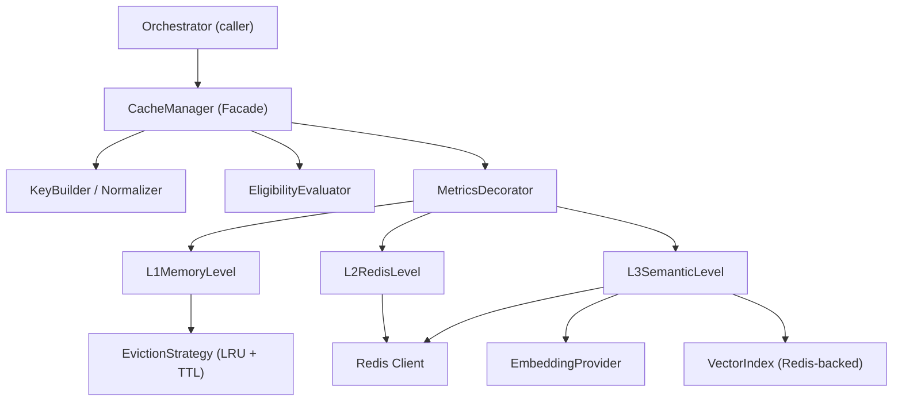
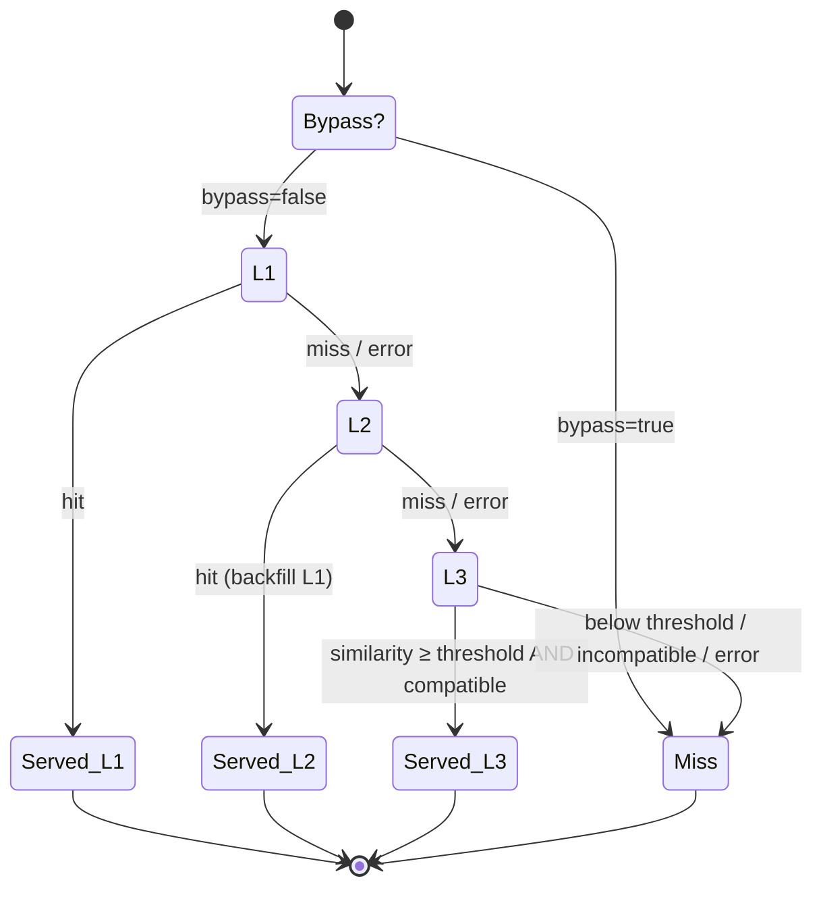
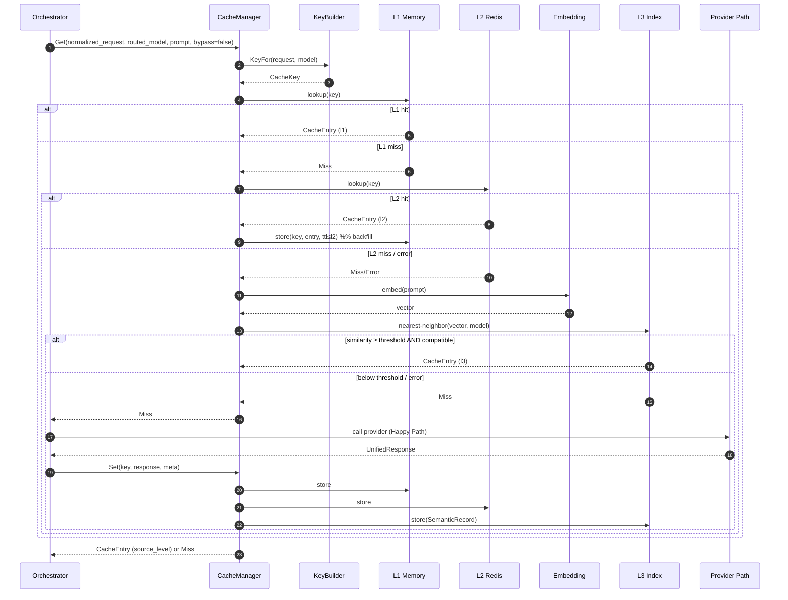
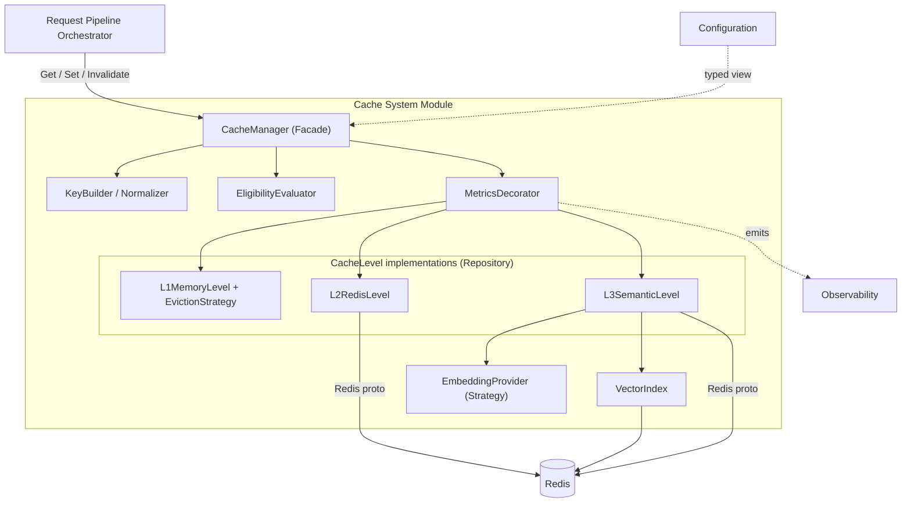

# ModelMesh — Component Design: Cache System

**Status:** Draft (pre-implementation)
**Document type:** Low-Level Design
**Last updated:** 2026-07-16
**Module:** 3 of 9
**Related:** [PRD](../PRD.md) · [High-Level Architecture](../02-architecture/High-Level-Architecture.md) · [Request Lifecycle](../02-architecture/Request-Lifecycle.md) · siblings: [Provider Layer](./01-provider-layer.md) · [Routing Engine](./02-routing-engine.md) · [Circuit Breaker](./04-circuit-breaker.md) · [Observability](./05-observability.md) · [Budget Engine](./07-budget-engine.md)

---

## 1. Purpose

The Cache System reduces end-to-end latency and provider spend by serving eligible completion responses from a layered cache instead of calling an upstream provider. It presents a **single read-through / write-through interface** (a Facade) over three progressively slower but broader levels:

- **L1** — in-process memory, per instance, exact-match, nanosecond–microsecond latency.
- **L2** — Redis, shared fleet-wide, exact-match, sub-millisecond–millisecond latency.
- **L3** — semantic cache: embedding + nearest-neighbor over a Redis-backed vector index, gated by a similarity threshold, best-effort and conservative.

Two invariants from the [Request Lifecycle](../02-architecture/Request-Lifecycle.md) shape this module:

1. **Cache runs *after* routing.** The routed `{provider, model}` is already known when the cache is consulted, so the exact-match cache key **includes the model**. A cached entry produced for model *A* is never served for a request routed to model *B*.
2. **A cache hit commits no spend.** The Budget Engine only performs a pre-authorization before the cache; committed cost is recorded solely on an actual provider call. The Cache System therefore never touches spend counters.

The caller (the Request Pipeline Orchestrator) does not know which level served a response — only that it was a hit or a miss.

---

## 2. Responsibilities

**In scope:**

- Construct a stable, collision-resistant exact-match cache key from the normalized request and routed model.
- Traverse L1 → L2 → L3 on read, short-circuiting on the first hit.
- Backfill upward on hits (L2 hit populates L1; L3 does not backfill exact levels — see §6).
- Populate all eligible levels on write-through after a provider response.
- Enforce per-level TTL and L1 size-bounded eviction.
- Compute prompt embeddings (via a pluggable embedding provider) and perform threshold-gated semantic matching for L3.
- Apply **eligibility rules** deciding what may be cached (determinism caveats around temperature/sampling).
- Degrade to a MISS on any backend error at any level, never failing the request.
- Emit per-level metrics and structured logs.

**Explicitly out of scope:**

- Routing / model selection ([Routing Engine](./02-routing-engine.md)).
- Cost computation and budget enforcement ([Budget Engine](./07-budget-engine.md)).
- Provider invocation ([Provider Layer](./01-provider-layer.md)).
- Deciding *whether to bypass cache* based on business policy beyond the eligibility rules defined here (the orchestrator passes a bypass flag; this module honors it).

---

## 3. Public Interfaces

The module exposes one Facade (`CacheManager`) to the orchestrator, and an internal `CacheLevel` contract implemented by each level. All signatures are conceptual — no bindings implied.

### 3.1 CacheManager (Facade)

| Operation | Input | Output | Semantics |
|-----------|-------|--------|-----------|
| `Get` | `LookupRequest {normalized_request, routed_model, prompt_text, bypass}` | `CacheEntry` **or** `Miss` | Read-through L1→L2→L3; first hit wins; backfills upward; never throws — errors become `Miss`. |
| `Set` | `WriteRequest {cache_key, prompt_text, response, routed_model, eligibility_meta}` | `void` (best-effort) | Write-through to all eligible levels; failures logged, not raised. |
| `Invalidate` | `cache_key` | `void` | Best-effort removal from L1 (local) and L2/L3 (shared). |
| `KeyFor` | `{normalized_request, routed_model}` | `CacheKey` | Pure function; deterministic key construction (see §6.1). Exposed for testing/diagnostics. |

```text
CacheManager.Get(LookupRequest)  -> CacheEntry | Miss
CacheManager.Set(WriteRequest)   -> void        // best-effort, non-blocking-capable
CacheManager.Invalidate(CacheKey)-> void
CacheManager.KeyFor(Request, Model) -> CacheKey
```

### 3.2 CacheLevel (internal contract, one per level)

| Operation | Input | Output | Semantics |
|-----------|-------|--------|-----------|
| `lookup` | `CacheKey` (L1/L2) or `EmbeddingQuery` (L3) | `CacheEntry` \| `Miss` \| `Error` | Level-local read; `Error` is caught by the Facade and treated as `Miss`. |
| `store` | `CacheKey`/`SemanticRecord`, `CacheEntry` | `Ok` \| `Error` | Level-local write honoring TTL/eviction. |
| `invalidate` | `CacheKey` | `Ok` \| `Error` | Level-local removal. |
| `name` | — | `"l1" \| "l2" \| "l3"` | Metric/label discriminator. |

```text
CacheLevel.lookup(Key | EmbeddingQuery) -> CacheEntry | Miss | Error
CacheLevel.store(Key | SemanticRecord, CacheEntry) -> Ok | Error
CacheLevel.invalidate(Key) -> Ok | Error
```

### 3.3 EmbeddingProvider (internal contract, L3 only)

| Operation | Input | Output | Semantics |
|-----------|-------|--------|-----------|
| `embed` | `text` | `Vector` \| `Error` | Deterministic per model version; latency-tracked; errors bubble to a MISS for L3. |
| `model_id` | — | `string` | Identifies embedding model+version; part of the semantic namespace. |

---

## 4. Internal Components



| Component | Role |
|-----------|------|
| **CacheManager** | Facade; orchestrates traversal, backfill, write-through, bypass handling. |
| **KeyBuilder / Normalizer** | Canonicalizes the request and derives the deterministic `CacheKey`. |
| **EligibilityEvaluator** | Decides whether a request/response pair may be cached (§6.5). |
| **MetricsDecorator** | Wraps each `CacheLevel` to emit lookups/hits/errors/latency without the levels knowing about telemetry. |
| **L1MemoryLevel** | Bounded in-process store with an `EvictionStrategy`. |
| **L2RedisLevel** | Exact-match store in Redis, keyed by `CacheKey`. |
| **L3SemanticLevel** | Embedding + nearest-neighbor lookup over the `VectorIndex`. |
| **EvictionStrategy** | Pluggable policy (default LRU) plus TTL expiry for L1. |
| **EmbeddingProvider** | Pluggable embedding model for L3. |
| **VectorIndex** | Redis-backed ANN/vector index storing `SemanticRecord`s per semantic namespace. |

---

## 5. Data Structures

### 5.1 CacheKey

| Field | Type | Description | Notes |
|-------|------|-------------|-------|
| `hash` | string (hex) | Digest over the canonical request payload + model | Primary key for L1/L2 |
| `namespace` | string | Logical partition, e.g. `mm:cache:v1` | Enables versioned invalidation |
| `model` | string | Routed model id | Embedded in `hash` **and** retained for diagnostics |
| `schema_version` | int | Key-construction version | Bump invalidates all old keys |

### 5.2 CacheEntry

| Field | Type | Description | Notes |
|-------|------|-------------|-------|
| `response` | UnifiedResponse | The cached completion payload | Shared shape with Provider Layer |
| `model` | string | Model that produced it | Must equal lookup model for exact levels |
| `created_at` | timestamp | Population time | Basis for TTL/age |
| `ttl` | duration | Remaining/assigned TTL | Per-level; L1 ≤ L2 (§7) |
| `source_level` | enum `l1\|l2\|l3` | Level that served this entry | Surfaced as `cache_level` to caller |
| `eligibility` | EligibilityMeta | Why it was cacheable | For audit/logging |

### 5.3 SemanticRecord (L3)

| Field | Type | Description | Notes |
|-------|------|-------------|-------|
| `embedding` | float vector | Prompt embedding | Dimensionality fixed by `embedding_model_id` |
| `embedding_model_id` | string | Embedding model+version | Part of semantic namespace; mismatches are ignored |
| `prompt_ref` | string | Canonical prompt text or its digest | For inspection/debug |
| `response_ref` | CacheKey \| inline | Pointer to (or inline copy of) the response | Reuses exact-cache entry when possible |
| `model` | string | Completion model that produced the response | Enforced in compatibility check |
| `params_fingerprint` | string | Digest of compatibility-relevant params | Temperature bucket, max_tokens, etc. |
| `created_at` | timestamp | Insert time | TTL basis |

### 5.4 EligibilityMeta

| Field | Type | Description |
|-------|------|-------------|
| `cacheable` | bool | Final decision |
| `reason` | enum | `ok`, `nondeterministic`, `bypass`, `streaming`, `too_large`, `error_response` |
| `determinism_class` | enum | `deterministic`, `low_variance`, `nondeterministic` |

---

## 6. Algorithms

### 6.1 Exact-key construction & normalization

Goal: two requests that are *semantically identical for caching purposes* produce the **same** key; any meaningful difference produces a **different** key.

Canonicalization steps (pure, deterministic):

1. **Message normalization** — trim trailing whitespace, normalize Unicode (NFC), preserve role ordering and content verbatim (content is semantically significant; do **not** lowercase or collapse internal whitespace).
2. **Parameter projection** — include only cache-affecting parameters (model, `max_tokens`, `temperature`, `top_p`, `stop`, tool/function definitions, response format). Exclude non-affecting metadata (request id, trace headers, caller tags).
3. **Stable serialization** — serialize the projected object with sorted keys and a canonical form so map ordering cannot change the digest.
4. **Model binding** — concatenate the routed `model` id into the canonical payload.
5. **Digest** — hash the canonical bytes (collision-resistant digest) → `hash`; prefix with `namespace` + `schema_version`.

Bumping `schema_version` or `namespace` performs a wholesale logical invalidation without deleting keys.

### 6.2 Read traversal (L1 → L2 → L3)



- Every downward transition fires on **miss OR backend error** — this is what makes the system fail-safe.
- First hit wins and traversal stops.
- `source_level` is stamped on the returned entry for the `cache_level` surfaced to the caller.

### 6.3 Backfill

- **L2 hit → populate L1** with a TTL no longer than the entry's remaining L2 TTL, so hot exact-matches serve locally next time.
- **L3 hit → does NOT backfill L1/L2** as an exact entry, because the incoming request's exact key differs from the stored prompt's key (that's why it missed the exact levels). Backfilling would poison the exact cache with a paraphrase. Optionally, the *incoming* prompt may be inserted as a **new SemanticRecord** pointing at the same response (config-gated; off by default to avoid unbounded index growth).

### 6.4 L1 eviction (TTL + size bound)

- Each entry carries an absolute expiry (`created_at + ttl`); expired entries are treated as absent on read (lazy expiry) and reclaimed on write pressure.
- When L1 exceeds `l1_max_entries` (or a byte budget), the **EvictionStrategy** (default **LRU**) removes least-recently-used entries until under bound.
- L1 is **per-instance and non-coherent**: an invalidation on one instance does not evict L1 on peers; short L1 TTLs bound staleness (§13).

### 6.5 Eligibility (what may be cached)

A response is eligible for write-through only if **all** hold:

| Condition | Rule |
|-----------|------|
| Not bypassed | `bypass=false` on the request |
| Successful | Response is a normal completion, not an error/partial |
| Non-streaming | Streaming responses are not cached in this design (see §14) |
| Determinism | `temperature` ≤ `determinism_temperature_max` **or** `deterministic_only=false` |
| Size bound | Serialized response ≤ `max_cacheable_bytes` |

**Determinism caveat:** with `temperature > 0` (or `top_p` sampling), the provider may return different outputs for identical inputs. Caching such a response means *pinning one sample* and serving it repeatedly. This is acceptable for cost/latency but is a **behavioral choice**, controlled by `deterministic_only` (default true → only low-temperature requests are cached). Nondeterministic requests are served but not cached when `deterministic_only=true`.

### 6.6 Semantic lookup (L3)

1. Compute `Vector = embed(prompt_text)` via `EmbeddingProvider` (latency tracked; error → MISS).
2. Query the `VectorIndex` within the semantic namespace `{embedding_model_id}` for the top-K nearest neighbors by cosine similarity.
3. For the best candidate, accept **only if all** hold:
   - `similarity ≥ similarity_threshold` (conservative default; see §13),
   - `candidate.model == routed_model` (or an explicitly configured compatible set),
   - `candidate.params_fingerprint` compatible (same temperature bucket, `max_tokens ≥ requested`, matching `response_format`/tools).
4. On accept → return the referenced response (`source_level=l3`), record `semantic_similarity`.
5. Otherwise → MISS (never return a below-threshold match; correctness over hit-rate).

### 6.7 Write-through population

On an eligible provider response, insert in parallel-capable, failure-isolated fashion:
- L1: `store(CacheKey, entry, ttl=l1_ttl)`
- L2: `store(CacheKey, entry, ttl=l2_ttl)`
- L3: `store(SemanticRecord{embedding, model, params_fingerprint, response_ref}, ttl=l3_ttl)` — embedding computed once and reused across a request where possible.

Any level's failure is logged and metered; the others proceed. Write-through may be performed off the response's critical path (the caller's response is already assembled).

---

## 7. State Management

| Level | Location | Authority | Coherence | Lifetime |
|-------|----------|-----------|-----------|----------|
| L1 | Process memory | Cache-of-cache | Non-coherent per instance | TTL + LRU eviction; lost on restart |
| L2 | Redis | Authoritative (exact) | Fleet-wide coherent | TTL; survives instance restarts |
| L3 | Redis vector index | Authoritative (semantic) | Fleet-wide coherent | TTL; survives restarts |

- **TTL ordering:** `l1_ttl ≤ l2_ttl` so a stale L1 cannot outlive the shared truth. L3 TTL is independent and typically ≥ L2 (semantic value decays slower).
- **Backfill direction is upward only** (L2 → L1).
- **Invalidation:** `Invalidate(key)` removes from L2/L3 authoritatively and from the local L1; peer L1s expire naturally via short TTL. Namespace/`schema_version` bump is the mechanism for bulk invalidation.
- No cross-instance L1 coordination is attempted — deliberately (§13).

---

## 8. Configuration

| Key | Type | Default | Description |
|-----|------|---------|-------------|
| `cache.enabled` | bool | `true` | Master switch; false makes every `Get` a MISS and `Set` a no-op. |
| `cache.namespace` | string | `mm:cache:v1` | Key namespace / logical invalidation handle. |
| `cache.schema_version` | int | `1` | Key-construction version. |
| `cache.l1.enabled` | bool | `true` | Toggle L1. |
| `cache.l1.max_entries` | int | `10000` | Size bound before eviction. |
| `cache.l1.ttl` | duration | `60s` | L1 entry TTL (must be ≤ L2 TTL). |
| `cache.l1.eviction` | enum | `lru` | Eviction strategy id. |
| `cache.l2.enabled` | bool | `true` | Toggle L2. |
| `cache.l2.ttl` | duration | `3600s` | L2 entry TTL. |
| `cache.l2.timeout` | duration | `50ms` | Redis op timeout → MISS on exceed. |
| `cache.l3.enabled` | bool | `true` | Toggle semantic cache. |
| `cache.l3.similarity_threshold` | float | `0.95` | Minimum cosine similarity to accept (conservative). |
| `cache.l3.top_k` | int | `5` | Neighbors fetched per query. |
| `cache.l3.ttl` | duration | `86400s` | Semantic record TTL. |
| `cache.l3.embedding_model` | string | *(provider default)* | Embedding model+version id. |
| `cache.l3.reinsert_paraphrase` | bool | `false` | Insert incoming prompt as new SemanticRecord on L3 hit. |
| `cache.eligibility.deterministic_only` | bool | `true` | Cache only low-temperature requests. |
| `cache.eligibility.determinism_temperature_max` | float | `0.0` | Threshold for "deterministic". |
| `cache.eligibility.max_cacheable_bytes` | int | `262144` | Max serialized response size. |

All values are validated at config load (fail-fast); e.g. `l1.ttl ≤ l2.ttl` and `0 ≤ similarity_threshold ≤ 1`.

---

## 9. Failure Handling

The governing rule: **the Cache System never fails a request.** It is an optimization layer.

| Failure | Detection | Handling |
|---------|-----------|----------|
| L1 corruption / internal error | Caught in level | Treat as MISS, continue to L2; log `warn`. |
| L2 Redis unavailable / timeout | Op timeout / connection error | Treat as MISS, continue to L3; increment `cache_backend_errors_total{level="l2"}`. |
| L3 embedding failure | EmbeddingProvider error | Skip L3 → MISS → provider path; increment errors. |
| L3 index unavailable | Query error | MISS; log `warn`. |
| L3 below threshold | Similarity check | MISS (by design; not an error). |
| Write-through failure (any level) | store error | Log + metric; other levels proceed; request already served. |
| Invalidation failure | op error | Log; rely on TTL as backstop. |
| Config invalid | Load-time validation | Fail-fast at startup (not at request time). |

No backend error is ever propagated to the orchestrator as a request failure — it degrades to MISS and the provider path proceeds.

---

## 10. Logging

Structured events (fields beyond the common `request_id`, `trace_id`):

| Event | Level | Fields |
|-------|-------|--------|
| `cache.lookup` | debug | `level`, `result` (hit/miss), `key_hash`, `latency_ms` |
| `cache.hit` | info | `level`, `key_hash`, `age_ms`, `source_level` |
| `cache.semantic_hit` | info | `similarity`, `matched_model`, `embedding_model_id` |
| `cache.semantic_reject` | debug | `best_similarity`, `threshold`, `reason` (below_threshold/incompatible) |
| `cache.backfill` | debug | `from_level`, `to_level`, `key_hash` |
| `cache.populate` | debug | `levels`, `key_hash`, `bytes` |
| `cache.backend_error` | warn | `level`, `op` (lookup/store/invalidate), `error` |
| `cache.ineligible` | debug | `reason`, `determinism_class` |

Rule: **misses are not error-logged** (they are the common case). Only backend errors escalate to `warn`.

---

## 11. Metrics

Reused from the Request-Lifecycle catalog:

| Metric | Type | Labels | Meaning |
|--------|------|--------|---------|
| `cache_lookups_total` | counter | `level` | Lookups attempted per level. |
| `cache_hits_total` | counter | `level` | Hits per level. |
| `cache_hit_ratio` | gauge | `level` | Rolling hit ratio per level. |
| `cache_backend_errors_total` | counter | `level` | Backend errors degraded to MISS. |
| `semantic_similarity` | histogram | — | Similarity of L3 best matches (accepted + rejected). |
| `embedding_latency_seconds` | histogram | `embedding_model` | Embedding computation latency. |

Module-specific additions:

| Metric | Type | Labels | Meaning |
|--------|------|--------|---------|
| `cache_l1_entries` | gauge | — | Current L1 entry count. |
| `cache_l1_evictions_total` | counter | `reason` (`lru`,`ttl`) | L1 evictions. |
| `cache_populations_total` | counter | `level` | Write-through inserts. |
| `cache_ineligible_total` | counter | `reason` | Responses skipped by eligibility. |
| `cache_lookup_latency_seconds` | histogram | `level` | Per-level lookup latency. |
| `cache_semantic_rejections_total` | counter | `reason` | L3 candidates rejected. |

Derived operational signals: overall hit rate, provider-calls-avoided, and estimated cost saved (hit rate × average request cost) — computed in dashboards, not emitted here.

---

## 12. Extension Points

| Extension | Mechanism | Notes |
|-----------|-----------|-------|
| Alternative eviction | `EvictionStrategy` (Strategy) | LRU default; LFU/ARC/segmented-LRU pluggable for L1. |
| Alternative embedding model | `EmbeddingProvider` + `embedding_model_id` | Namespaced so mixed-model records never cross-match. |
| Alternative vector backend | `VectorIndex` interface | Redis-backed default; swap for a dedicated ANN store without touching the Facade. |
| Negative caching | New eligibility reason + short-TTL entries | Cache "known-bad"/empty results to shed load (off by default). |
| Cache warming / preload | Batch `Set` path | Seed L2/L3 from a corpus before traffic. |
| Per-request bypass | `bypass` flag on `LookupRequest` | Already honored; wired to an API header by the orchestrator. |
| Additional levels | New `CacheLevel` + ordering | Facade traversal is ordered and open to a 4th level. |

---

## 13. Tradeoffs

| Decision | Alternative | Why chosen | Cost accepted |
|----------|-------------|------------|---------------|
| **Exact L1/L2 + semantic L3** | Semantic-only | Exact levels are cheap, correct, and cover true repeats; semantic adds reach for paraphrases | Two mechanisms to maintain |
| **Per-instance non-coherent L1** | Distributed/coherent L1 | Near-zero-latency local hits with no coordination overhead | Possible duplicate misses; brief cross-instance staleness (bounded by short L1 TTL) |
| **Model in the cache key** | Provider-independent key | Guarantees a request never gets another model's answer; consistent with route-before-cache | Lower hit rate than a shared key across models |
| **Conservative similarity threshold (0.95)** | Aggressive threshold | Directly mitigates PRD risk **R-2** (subtly-wrong "close" answers) | Lower L3 hit rate; some true paraphrases missed |
| **`deterministic_only=true` default** | Cache all outputs | Avoids pinning a random sample as the canonical answer | Nondeterministic (high-temp) requests aren't cached |
| **`l1_ttl ≤ l2_ttl`** | Independent TTLs | Prevents a stale local copy outliving shared truth | Slightly lower L1 residency |
| **Fail-safe (error → MISS)** | Surface cache errors | Cache is an optimization; must never break requests | Silent degradation (mitigated by error metrics) |
| **No L3→exact backfill** | Backfill paraphrase into L1/L2 | Prevents poisoning exact cache with a non-identical prompt | Repeated paraphrases re-embed unless `reinsert_paraphrase` on |

---

## 14. Future Improvements

- **Streaming response caching** — capture and replay streamed tokens; currently excluded by eligibility.
- **Adaptive similarity threshold** — tune per model/domain from observed false-hit feedback (e.g. shadow-eval signal from [Shadow Traffic](./09-shadow-traffic.md)).
- **Semantic dedup at write** — collapse near-duplicate SemanticRecords to bound index growth.
- **Tiered/segmented L1** (protected vs probationary) to resist scan-based eviction.
- **Cost-aware caching** — bias TTL/eligibility toward expensive models where a hit saves more (uses [Budget Engine](./07-budget-engine.md)/Cost Model signals).
- **Negative & partial caching** — cache validated refusals or deterministic prefixes.
- **Dedicated ANN backend** for L3 at scale, behind the existing `VectorIndex` interface.
- **Explicit invalidation API / TTL jitter** to avoid synchronized expiry stampedes.

---

## 15. Sequence Diagram

Read path with an L2 hit (backfill) and, alternately, an L3 semantic hit; plus write-through on a miss.



---

## 16. Component Diagram



---

## 17. Design Patterns Used

| Pattern | Where | Why |
|---------|-------|-----|
| **Facade** | `CacheManager` | One `Get/Set/Invalidate` surface hides three-level traversal, backfill, and eligibility from the orchestrator. |
| **Repository** | `CacheLevel` implementations | Collection-like `lookup/store/invalidate` abstraction over memory, Redis, and a vector index; callers never see the storage medium. |
| **Strategy** | `EvictionStrategy`, `EmbeddingProvider` | Swap eviction policy and embedding model without touching level logic. |
| **Decorator** | `MetricsDecorator` around each level | Adds metrics/latency/error instrumentation transparently; levels stay telemetry-agnostic. |
| **Chain (traversal)** | L1→L2→L3 ordered read | Each level either serves or delegates downward; open to inserting levels. |
| **Template method (implicit)** | Common `store` eligibility/TTL flow | Shared write-through skeleton, level-specific persistence. |

---

## 18. Why This Design Was Chosen

- **A single Facade preserves the pipeline's simplicity.** The orchestrator asks one question ("do we have this?") and populates once; all layering, backfill, and semantic logic is encapsulated. This keeps the [Request Lifecycle](../02-architecture/Request-Lifecycle.md) legible and lets the cache evolve independently.
- **Three levels match three distinct cost/latency/coverage points.** L1 wins on latency for hot repeats, L2 shares hits across the fleet without provider calls, and L3 extends coverage to paraphrases where exact matching cannot help. Each level earns its keep; none duplicates another's role.
- **Correctness is prioritized over hit rate.** Model-bound keys, a conservative similarity threshold, strict L3 compatibility checks, and `deterministic_only` defaults directly address PRD risk **R-2** (serving subtly-wrong "close" answers). We would rather miss and call the provider than serve a wrong cached answer.
- **Fail-safe by construction.** Because any backend error degrades to a MISS, a Redis outage or embedding failure costs latency and money — not availability. This aligns with the system-wide invariant that only validation, budget, or provider-exhaustion may fail a request.
- **Coherence is traded for speed deliberately.** Per-instance L1 is non-coherent on purpose; short L1 TTL bounds staleness while giving near-zero-latency local hits, and L2 remains the shared source of truth. Coordinating L1 across instances would add latency and complexity that the workload does not justify.
- **The abstractions are the ones that will actually change.** Eviction policy, embedding model, and vector backend are the components most likely to be swapped as the project scales, so each sits behind an explicit interface (Strategy/Repository) — extension without rework.

This design gives ModelMesh a cache that is safe to enable everywhere, cheap when it hits, invisible when it misses, and open to the evolutions the later phases will demand.
