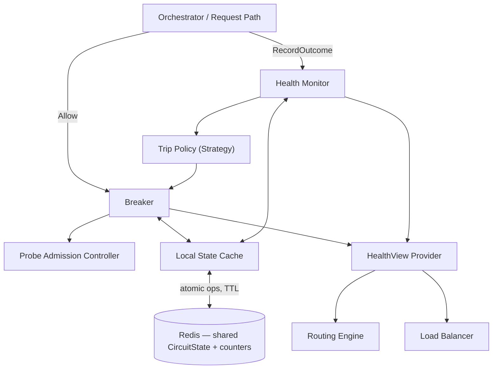
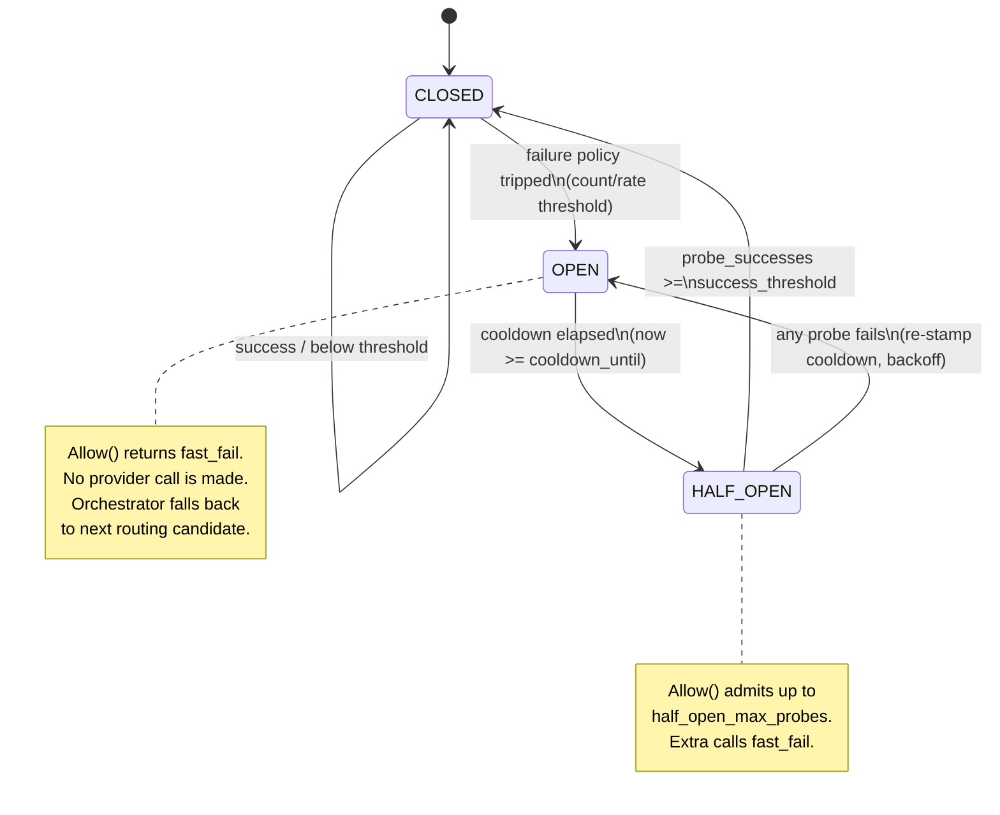
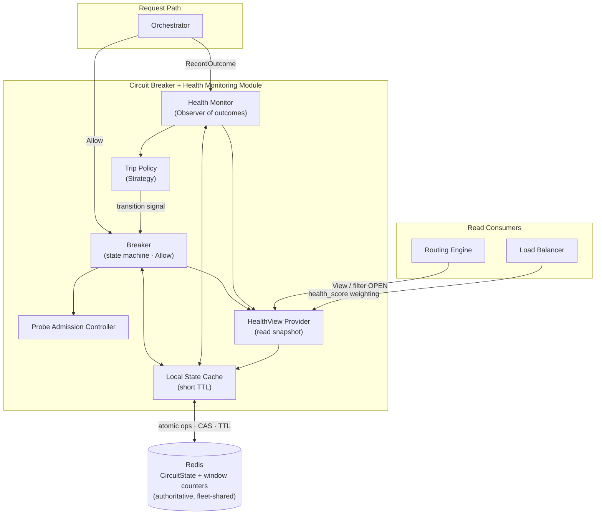

# ModelMesh — Component Design: Circuit Breaker + Health Monitoring

**Status:** Draft (pre-implementation)
**Document type:** Low-Level Design
**Last updated:** 2026-07-16
**Module:** 4 of 9
**Related:** [PRD](../PRD.md) · [High-Level Architecture](../02-architecture/High-Level-Architecture.md) · [Request Lifecycle](../02-architecture/Request-Lifecycle.md) · [Provider Layer](./01-provider-layer.md) · [Routing Engine](./02-routing-engine.md) · [Load Balancer](./06-load-balancer.md)

---

## 1. Purpose

The Circuit Breaker + Health Monitoring module exists to **contain provider failures**. A single degraded, slow, or rate-limited upstream provider must never be allowed to consume the gateway's request capacity, inflate tail latency, or cascade into a fleet-wide outage.

The module wraps every outbound provider call with a state machine that:

- **Guards** each call — deciding, before any network I/O, whether the target provider is currently trustworthy.
- **Short-circuits** (fast-fails) calls to providers that have crossed a failure threshold, so the [Routing Engine](./02-routing-engine.md) can fall back to the next candidate immediately instead of blocking on a doomed request.
- **Recovers automatically** by periodically admitting a limited number of probe requests once a cooling-off period elapses.
- **Publishes a read-only `HealthView`** consumed by the [Routing Engine](./02-routing-engine.md) and [Load Balancer](./06-load-balancer.md) so that candidate selection and weight distribution reflect live provider health.

Critically, health and circuit state are **shared across the fleet** via Redis. When one instance observes a provider failing, every instance converges on that observation, avoiding N-instance rediscovery of the same outage.

---

## 2. Responsibilities

**In scope:**

- Maintain a per-provider circuit state machine (`CLOSED`, `OPEN`, `HALF_OPEN`).
- Aggregate call outcomes (success / failure / latency) into a rolling window per provider.
- Decide admission (`allow` vs `fast_fail`) for each guarded call.
- Manage cooldown timing and half-open probe admission.
- Persist authoritative circuit and health state to the shared store (Redis) so it converges fleet-wide.
- Expose a `HealthView` snapshot for routing and load balancing.
- Emit metrics and structured logs for every state transition and admission decision.

**Explicitly out of scope:**

- Selecting *which* provider to try — that is the [Routing Engine](./02-routing-engine.md)'s job; the breaker only answers "may I use this one right now?".
- Executing the actual provider request or translating payloads — owned by the [Provider Layer](./01-provider-layer.md).
- Retries across providers / fallback orchestration — owned by the orchestrator (see [Request Lifecycle](../02-architecture/Request-Lifecycle.md)). The breaker fast-fails; the orchestrator decides what to do next.
- Cost or budget decisions — owned by the [Budget Engine](./07-budget-engine.md).

---

## 3. Public Interfaces

The module exposes two roles: a **write/guard** side (`Breaker`) used on the request path, and a **read** side (`Health`) used by routing and load balancing.

```text
Breaker.Allow(provider)                   -> Decision{allow | fast_fail, reason}
Breaker.RecordOutcome(provider, outcome)  -> void
Breaker.Execute(provider, callable)       -> Result | ShortCircuitError   (guard wrapper; optional convenience)
Health.View()                             -> HealthView
Health.ProviderState(provider)            -> CircuitSnapshot
```

| Operation | Input | Output | Semantics |
|-----------|-------|--------|-----------|
| `Allow` | `provider` id | `Decision{allow\|fast_fail, reason}` | Pure admission check. `allow` when `CLOSED`, or `HALF_OPEN` with a free probe slot. `fast_fail` when `OPEN`, or `HALF_OPEN` with no probe slot. No side effects on external systems; may lazily read shared state. |
| `RecordOutcome` | `provider`, `Outcome{result, reason, latency}` | none | Feeds the Health Monitor. Updates the rolling window and may drive a state transition (trip, close, re-open). Idempotency is per-call, not per-outcome. |
| `Execute` | `provider`, `callable` | provider result **or** `ShortCircuitError` | Convenience contract combining `Allow` → run `callable` → `RecordOutcome`. The orchestrator may instead call `Allow`/`RecordOutcome` explicitly to control fallback. **Contract only — no implementation here.** |
| `Health.View` | none | `HealthView` (all providers) | Point-in-time snapshot for the Routing Engine / Load Balancer. Read-only; never blocks on the request path. |
| `Health.ProviderState` | `provider` id | `CircuitSnapshot` | Single-provider snapshot (state, score, opened_at). |

**Contract guarantees:**

- `Allow` and `View` are **non-fatal**: they never raise to the caller. On shared-store unavailability they fall back to a documented default (§9).
- `RecordOutcome` must be called exactly once per admitted call. A `fast_fail` decision is **not** an outcome and must not be recorded as a provider failure (otherwise the breaker would starve recovery).

---

## 4. Internal Components

| Component | Role |
|-----------|------|
| **Breaker** | Per-provider state machine. Owns `Allow`, applies transitions from Health Monitor signals, enforces probe admission in `HALF_OPEN`. |
| **Health Monitor** | Observer of outcomes. Maintains the rolling window (counts / error-rate / latency) per provider and evaluates the trip policy. |
| **Trip Policy** | Strategy object deciding *when* to trip and *when* to close, given window stats. Pluggable (count-based, rate-based, latency-based). |
| **Shared State Store (Redis)** | Authoritative store for `CircuitState` and window counters. Provides atomic increments and short-TTL keys so state converges fleet-wide. |
| **Local State Cache** | Per-instance, short-TTL read cache of `CircuitState` to keep `Allow` off the Redis hot path for most calls. |
| **HealthView Provider** | Builds and serves the read-only snapshot for routing/LB, backed by the local cache with periodic refresh. |
| **Probe Admission Controller** | In `HALF_OPEN`, limits the number of concurrent/total probes admitted before a decision is reached. |



---

## 5. Data Structures

### CircuitState (per provider, authoritative in Redis)

| Field | Type | Description | Notes |
|-------|------|-------------|-------|
| `provider` | string | Provider identifier | Key of the record |
| `state` | enum | `CLOSED` \| `OPEN` \| `HALF_OPEN` | Current circuit state |
| `failure_count` | int | Failures in the current window | Reset on window roll / close |
| `success_count` | int | Successes in the current window | For rate-based policies |
| `window_started_at` | timestamp | Start of the current rolling window | Sliding or tumbling (§6) |
| `error_rate` | float | Derived failures / total in window | Cached for policy + scoring |
| `opened_at` | timestamp | When the circuit last tripped to `OPEN` | Drives cooldown expiry |
| `cooldown_until` | timestamp | Earliest time `OPEN` → `HALF_OPEN` allowed | `opened_at + cooldown` |
| `probes_in_flight` | int | Probes currently admitted in `HALF_OPEN` | Bounded by `half_open_max_probes` |
| `probe_successes` | int | Probe successes accumulated in `HALF_OPEN` | Compared to `half_open_success_threshold` |
| `generation` | int | Monotonic version for optimistic concurrency | Guards against stale writes across instances |
| `updated_at` | timestamp | Last mutation time | Observability / staleness detection |

### Outcome (input to `RecordOutcome`)

| Field | Type | Description | Notes |
|-------|------|-------------|-------|
| `result` | enum | `success` \| `failure` | Failure classification is caller-supplied |
| `reason` | enum | `ok` \| `timeout` \| `rate_limited` \| `upstream_5xx` \| `network` \| `malformed` | Not all reasons must trip (configurable) |
| `latency` | duration | Observed call latency | Feeds latency-based scoring |
| `is_probe` | bool | Whether this outcome was a `HALF_OPEN` probe | Routes transition logic |

### HealthView / CircuitSnapshot (read side)

| Field | Type | Description | Notes |
|-------|------|-------------|-------|
| `provider` | string | Provider id | — |
| `state` | enum | Circuit state | Routing excludes `OPEN` |
| `health_score` | float `[0,1]` | Composite score (success rate, latency, recency) | Used for weighting, not just filtering |
| `admits_traffic` | bool | Convenience flag (`CLOSED` or probe-available `HALF_OPEN`) | Fast filter for routing |
| `opened_at` | timestamp? | Present when not `CLOSED` | For diagnostics |
| `snapshot_at` | timestamp | When the view was built | Staleness bound (§7) |

---

## 6. Algorithms

### 6.1 Rolling-window failure accounting

Two policies are supported behind the **Trip Policy** strategy; the default is **error-rate with a minimum-volume guard**.

- **Count-based:** trip when `failure_count >= failure_threshold` within the window. Simple and predictable, but noisy at low volume and unfair at high volume (a fixed count trips faster under high traffic).
- **Rate-based (default):** trip when `error_rate >= error_rate_threshold` **and** `total >= min_requests` in the window. The `min_requests` guard prevents tripping on 1-of-1 flukes. Fairer across traffic levels.

The window is a **sliding window approximated by bucketed counters** (e.g. N sub-buckets of fixed duration), which bounds memory and Redis key count while avoiding the sharp resets of a tumbling window.

### 6.2 Trip / cooldown / recovery timing

```
CLOSED   --(policy says trip)-->        OPEN        (stamp opened_at, cooldown_until)
OPEN     --(now >= cooldown_until)-->   HALF_OPEN   (reset probes_in_flight, probe_successes)
HALF_OPEN--(probe_successes >= half_open_success_threshold)--> CLOSED  (reset window)
HALF_OPEN--(any probe fails)-->         OPEN        (re-stamp cooldown; optional backoff)
```

Cooldown may use **exponential backoff with a cap** across consecutive trips (each re-open multiplies the cooldown up to `cooldown_max`) so a persistently broken provider is probed less aggressively over time.

### 6.3 Half-open probe admission

In `HALF_OPEN`, `Allow` admits a probe only if `probes_in_flight < half_open_max_probes` (default small, e.g. 1–3). Admission **atomically increments** `probes_in_flight`; the matching `RecordOutcome` decrements it. This bounds the blast radius of a still-broken provider during recovery: at most `half_open_max_probes` real requests are exposed to a provider that may still be failing.

### 6.4 Health scoring

`health_score ∈ [0,1]` is a composite used by the [Load Balancer](./06-load-balancer.md) for *weighting* (not just the binary filter routing uses):

```
health_score = w_success * success_rate
             + w_latency  * latency_factor      (normalized against a target latency)
             + w_recency  * recency_factor       (decays while OPEN / recently reopened)
```

Weights are configurable; `OPEN` forces `admits_traffic = false` regardless of score.

### 6.5 Cross-instance consistency

Authoritative state lives in Redis. Concurrent updates from multiple instances are made safe by:

- **Atomic counters:** window increments use atomic Redis operations (increment + TTL), so no read-modify-write race on counts.
- **Optimistic transitions:** state transitions (e.g. `CLOSED → OPEN`) are guarded by the `generation` field via a compare-and-set (transactional/Lua). A losing writer re-reads and re-evaluates rather than clobbering.
- **Probe slots as an atomic gate:** `probes_in_flight` increments are atomic with a bound check, so two instances cannot both grab the last probe slot.
- **Eventual consistency of reads:** `Allow` reads the **Local State Cache** (short TTL, e.g. 250 ms–1 s) to stay off the Redis hot path. This means an instance may act on state that is up to one TTL stale — an accepted tradeoff (§13). Transitions themselves are always written through to Redis immediately.

---

## 7. State Management

- **Authoritative:** `CircuitState` per provider in Redis. This is the single source of truth that makes health converge fleet-wide.
- **Derived / cached:** each instance keeps a **short-TTL local snapshot** to serve `Allow` and `HealthView` cheaply. The TTL bounds staleness; on expiry the instance refreshes from Redis.
- **Write-through on transitions:** any state change (`trip`, `close`, `reopen`) is written to Redis immediately under optimistic concurrency; the local cache is updated on success.
- **Convergence:** because outcomes from all instances increment the *same* Redis counters, a provider degrading under fleet-wide traffic trips once, globally, rather than once per instance. Recovery probes are globally bounded by the shared `probes_in_flight`.
- **Bootstrapping:** on cold start with no Redis record, a provider defaults to `CLOSED` (assume healthy until proven otherwise).

The state machine:



---

## 8. Configuration

Loaded and validated at startup (see [High-Level Architecture](../02-architecture/High-Level-Architecture.md) — config is validated-then-served). Values may be global with per-provider overrides.

| Key | Type | Default | Description |
|-----|------|---------|-------------|
| `breaker.enabled` | bool | `true` | Master switch; when off, `Allow` always returns `allow`. |
| `breaker.trip_policy` | enum | `error_rate` | `count` \| `error_rate` \| `latency`. Selects the Trip Policy strategy. |
| `breaker.failure_threshold` | int | `5` | Failures to trip (count policy). |
| `breaker.error_rate_threshold` | float | `0.5` | Error rate to trip (rate policy). |
| `breaker.min_requests` | int | `20` | Minimum window volume before rate policy can trip. |
| `breaker.window_duration` | duration | `10s` | Rolling window length. |
| `breaker.window_buckets` | int | `10` | Sub-buckets approximating the sliding window. |
| `breaker.cooldown` | duration | `30s` | Base `OPEN` → `HALF_OPEN` cooldown. |
| `breaker.cooldown_max` | duration | `5m` | Cap for backoff on repeated trips. |
| `breaker.cooldown_backoff` | float | `2.0` | Multiplier per consecutive re-open. |
| `breaker.half_open_max_probes` | int | `2` | Concurrent probes admitted in `HALF_OPEN`. |
| `breaker.half_open_success_threshold` | int | `2` | Probe successes needed to close. |
| `breaker.trip_reasons` | list | `[timeout, upstream_5xx, network, rate_limited]` | Outcome reasons counted as failures. |
| `breaker.local_cache_ttl` | duration | `500ms` | Staleness bound for `Allow`/`HealthView`. |
| `breaker.store_unavailable_policy` | enum | `fail_open` | `fail_open` \| `local_only` \| `fail_closed` — behavior when Redis is unreachable (§9). |
| `health.score_weights` | object | `{success:0.6, latency:0.3, recency:0.1}` | Weights for `health_score`. |

---

## 9. Failure Handling

The breaker is on the critical path, so **the breaker itself must be fail-safe**. Its failure modes and dispositions:

| Failure | Disposition |
|---------|-------------|
| **Shared store (Redis) unreachable** | Governed by `store_unavailable_policy`. **Default `fail_open`**: `Allow` returns `allow` so provider calls still flow (availability over containment) — losing the breaker must not become an outage. `local_only`: fall back to a per-instance in-memory breaker (containment without convergence). `fail_closed` is available but discouraged (a Redis blip would deny all traffic). The chosen policy is logged and metered. |
| **Stale local cache** | Bounded by `local_cache_ttl`; accepted. Transitions are written through immediately, so staleness only delays reads, never loses a trip. |
| **`Allow` returns `fast_fail` (OPEN)** | Not an error — the orchestrator **falls back to the next routing candidate** (see [Request Lifecycle](../02-architecture/Request-Lifecycle.md) §8.3). |
| **All candidates OPEN / exhausted** | Orchestrator returns a unified upstream-unavailable error to the caller. The breaker's job (containment) succeeded even though the request failed. |
| **`RecordOutcome` write fails** | Best-effort; logged and metered (`breaker_store_errors_total`). A dropped outcome slightly delays a trip but does not corrupt state. |
| **Optimistic transition conflict** | Losing writer re-reads and re-evaluates; no clobber. Bounded retries, then give up (the winning transition already applied the intended effect). |

**Invariant:** a `fast_fail` decision must never be fed back as a provider `failure` outcome, or the breaker would prevent its own recovery.

---

## 10. Logging

Structured events (JSON), correlated by `request_id` where applicable. Transitions are logged at `INFO`; store problems at `WARN`/`ERROR`.

| Event | Level | Key fields |
|-------|-------|-----------|
| `breaker.transition` | INFO | `provider`, `from`, `to`, `trigger` (`threshold`\|`cooldown`\|`probe_success`\|`probe_failure`), `failure_count`, `error_rate`, `cooldown_until`, `generation` |
| `breaker.short_circuit` | DEBUG | `provider`, `request_id`, `state`, `reason` |
| `breaker.probe_admitted` | DEBUG | `provider`, `request_id`, `probes_in_flight` |
| `breaker.probe_result` | INFO | `provider`, `request_id`, `result`, `probe_successes` |
| `breaker.store_unavailable` | WARN | `applied_policy`, `error` |
| `breaker.store_error` | ERROR | `op`, `provider`, `error` |
| `breaker.conflict` | DEBUG | `provider`, `expected_generation`, `actual_generation` |

Transition logs are the primary forensic trail for post-incident review: they answer "when did provider X trip, why, and when did it recover?".

---

## 11. Metrics

Reuses the canonical names from the [Request Lifecycle](../02-architecture/Request-Lifecycle.md) metrics catalog, plus module-specific series.

| Metric | Type | Labels | Meaning |
|--------|------|--------|---------|
| `circuit_state` | gauge | `provider` | `0`=CLOSED, `1`=OPEN, `2`=HALF_OPEN (current state). |
| `circuit_transitions_total` | counter | `provider`, `to` | Count of transitions into each state. |
| `circuit_short_circuits_total` | counter | `provider` | Calls fast-failed by an OPEN (or probe-exhausted) circuit. |
| `provider_health` | gauge | `provider` | Composite `health_score ∈ [0,1]`. |
| `breaker_probes_total` | counter | `provider`, `result` | Half-open probe outcomes (`success`\|`failure`). |
| `breaker_open_duration_seconds` | histogram | `provider` | Time spent in OPEN per episode (recovery latency). |
| `breaker_window_error_rate` | gauge | `provider` | Current rolling-window error rate. |
| `breaker_store_errors_total` | counter | `op` | Shared-store operation failures. |
| `breaker_store_unavailable_total` | counter | `applied_policy` | Times the store-unavailable fallback engaged. |

These power a Grafana panel set: per-provider state timeline, trip frequency, mean time-to-recover (`breaker_open_duration_seconds`), and health-score heatmap.

---

## 12. Extension Points

- **Pluggable Trip Policy (Strategy):** add policies without touching the state machine — e.g. **latency-outlier tripping** (trip on p99 latency regression even when error rate is low), **consecutive-failure** (classic 5-in-a-row), or **composite** (rate OR latency).
- **Adaptive thresholds:** thresholds that self-tune to a provider's historical baseline instead of static config.
- **Per-model breakers:** key `CircuitState` by `{provider, model}` rather than `provider`, so one degraded model doesn't trip an otherwise healthy provider. The interface already passes `provider`; extending the key is additive.
- **Bulkheads:** cap concurrent in-flight calls per provider (isolation independent of the trip state) to bound resource consumption before the breaker even trips.
- **Outlier detection:** eject a single bad provider *instance*/endpoint (integrates with the [Load Balancer](./06-load-balancer.md)) rather than the whole provider.
- **Pluggable store backend:** the shared-state contract could target an alternative KV/consensus store without changing callers.

---

## 13. Tradeoffs

| Decision | Alternative | Why chosen | Cost accepted |
|----------|-------------|------------|---------------|
| **Rate-based tripping (with min-volume)** default | Count-based | Fair across traffic levels; avoids over/under-tripping | Slightly more state (successes + failures) and a min-volume warm-up |
| **Shared (Redis) breaker** | Local per-instance breaker | Fleet-wide convergence; one instance's discovery protects all | Redis dependency; read staleness; store-outage handling needed |
| **Short-TTL local read cache** | Read Redis on every `Allow` | Keeps the hot path fast | `Allow` may act on state up to one TTL stale |
| **`fail_open` when store down** | `fail_closed` | Losing the breaker must not cause an outage | During a Redis outage, containment is temporarily weakened |
| **Bounded half-open probes** | Full traffic on recovery | Limits blast radius while testing recovery | Slower ramp-back to full capacity |
| **Exponential cooldown backoff** | Fixed cooldown | Stops hammering a persistently broken provider | A briefly-broken provider recovers a little slower after repeated trips |
| **Per-provider granularity** (default) | Per-model | Simpler state, fewer keys | One bad model can trip a whole provider (mitigated by the per-model extension point) |

---

## 14. Future Improvements

- Per-`{provider, model}` breakers as the default once traffic justifies the extra state.
- Adaptive, baseline-relative thresholds (learned per provider/time-of-day).
- Latency-outlier and gradient tripping (detect degradation before hard failures).
- Bulkhead concurrency limits and connection-pool isolation per provider.
- Coordinated, jittered probe scheduling across the fleet to avoid synchronized probe storms.
- Health-score-driven *weighting* feedback loop with the [Load Balancer](./06-load-balancer.md) (soft shedding before hard tripping).
- Optional push-based invalidation so instances see transitions faster than the local-cache TTL.

---

## 15. Sequence Diagram

Guarded call with a trip and fleet-wide fast-fail, then a half-open recovery probe.

```mermaid
sequenceDiagram
    autonumber
    participant O as Orchestrator
    participant B as Breaker
    participant H as Health Monitor
    participant R as Redis (shared state)
    participant AD as Provider Adapter
    participant P as Provider

    Note over O,P: Normal guarded call (CLOSED)
    O->>B: Allow(providerA)
    B->>R: read/refresh CircuitState (cached, TTL)
    B-->>O: allow
    O->>AD: dispatch
    AD->>P: request
    P-->>AD: 5xx / timeout
    AD-->>O: failure(reason=upstream_5xx, latency)
    O->>H: RecordOutcome(providerA, failure)
    H->>R: atomic incr failures (window)
    H->>H: Trip Policy: error_rate >= threshold?
    H->>R: CAS CLOSED->OPEN (generation guard)
    H-->>O: (state now OPEN)

    Note over O,B: Subsequent calls fast-fail fleet-wide
    O->>B: Allow(providerA)
    B-->>O: fast_fail (OPEN)
    O->>O: fall back to next candidate (providerB)

    Note over B,P: After cooldown — half-open probe
    O->>B: Allow(providerA)
    B->>R: cooldown elapsed -> OPEN->HALF_OPEN; atomic incr probes_in_flight
    B-->>O: allow (probe)
    O->>AD: dispatch (probe)
    AD->>P: request
    P-->>AD: success
    AD-->>O: success(latency)
    O->>H: RecordOutcome(providerA, success, is_probe=true)
    H->>R: incr probe_successes; CAS HALF_OPEN->CLOSED
    H-->>O: (state now CLOSED, recovered)
```

---

## 16. Component Diagram



---

## 17. Design Patterns Used

| Pattern | Where | Why |
|---------|-------|-----|
| **Circuit Breaker** | The module itself | Core resilience pattern: guard, trip, fast-fail, auto-recover. |
| **State** | `Breaker` state machine (`CLOSED`/`OPEN`/`HALF_OPEN`) | Behavior of `Allow`/transitions depends on the current state; encapsulating each state keeps transition logic explicit and testable. |
| **Observer** | `Health Monitor` observing `RecordOutcome` events | Outcomes are published by the request path and consumed to update windows/state, decoupling call execution from health accounting. |
| **Strategy** | `Trip Policy` (count / rate / latency) | The tripping decision is swappable without changing the state machine. |
| **Facade** | `HealthView` over internal state | Presents a clean read snapshot to Routing/LB, hiding Redis, caching, and scoring. |
| **Repository** | Shared State Store abstraction over Redis | Hides whether `CircuitState` comes from local cache or Redis behind a collection-like contract. |

---

## 18. Why This Design Was Chosen

- **Containment is the primary goal, not correctness of every request.** The design optimizes for the property "one bad provider cannot take down the gateway." Fast-fail + orchestrator fallback delivers that directly, and the `fail_open`-on-store-outage default keeps the safety mechanism from itself becoming a failure source.
- **Fleet-wide convergence matters at scale.** Because ModelMesh runs as stateless horizontally-scaled instances (see [High-Level Architecture](../02-architecture/High-Level-Architecture.md)), a purely local breaker would force every instance to independently rediscover an outage, exposing N× the failing traffic. Shared Redis state trips once, globally.
- **Hot-path latency is protected.** A short-TTL local cache keeps `Allow` off Redis for the vast majority of calls; only transitions and window increments touch the store. The accepted cost — bounded read staleness — is the right trade for a decision that must be sub-millisecond.
- **Recovery is deliberately cautious.** Bounded half-open probes and backoff cooldown prevent a "recovery storm" from re-toppling a provider that has only just come back, which is a common failure mode of naive breakers.
- **The strategy seam is where evolution will happen.** Tripping policy is the part most likely to need tuning (rate vs latency vs adaptive), so it is isolated behind `Trip Policy`; per-model granularity and bulkheads are additive extension points rather than rewrites.
- **The read/write split serves the consumers cleanly.** Routing needs a binary "may I use this?" and the Load Balancer needs a graded `health_score`; exposing both through a single `HealthView` keeps those consumers decoupled from the breaker's internal mechanics.
