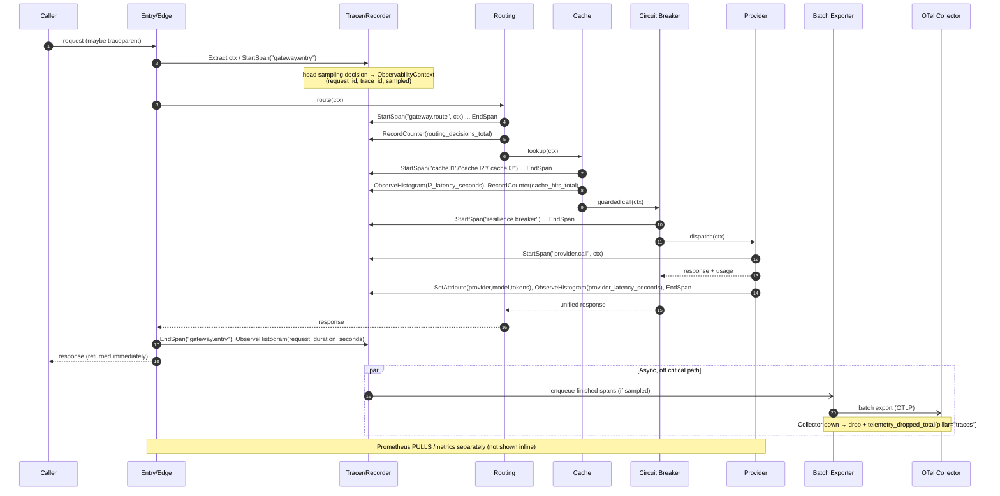
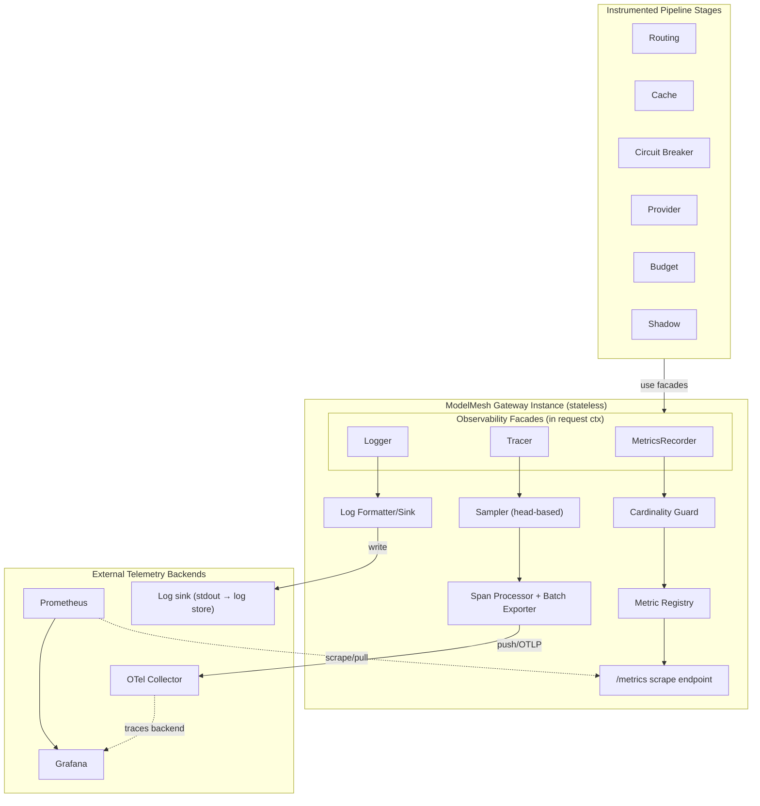

# ModelMesh — Component Design: Observability

**Status:** Draft (pre-implementation)
**Document type:** Low-Level Design
**Last updated:** 2026-07-16
**Module:** 5 of 9
**Related:**
- [Product Requirements Document](../PRD.md)
- [High-Level Architecture](../02-architecture/High-Level-Architecture.md)
- [Request Lifecycle](../02-architecture/Request-Lifecycle.md)
- Siblings: [Provider Layer](./01-provider-layer.md) · [Routing Engine](./02-routing-engine.md) · [Cache System](./03-cache-system.md) · [Circuit Breaker](./04-circuit-breaker.md) · [Load Balancer](./06-load-balancer.md) · [Budget Engine](./07-budget-engine.md) · [Prompt Complexity Classifier](./08-prompt-complexity-classifier.md) · [Shadow Traffic](./09-shadow-traffic.md)

---

## 1. Purpose

Observability makes **every request measurable and traceable across the full pipeline**. It answers three operational questions at all times: *what is the system doing right now* (metrics), *what happened to this specific request* (traces), and *why did it happen* (logs).

Unlike the other eight modules, Observability is **cross-cutting**: it does not sit in the request's *decision* path and never alters routing, caching, or provider selection. Instead it **wraps and instruments** every stage. Instrumentation is treated as part of each stage's contract — inline, not bolted on afterward. A stage that does not emit its declared metrics, span, and log is considered incomplete.

The module standardizes the **conventions** (metric names, label taxonomy, span names, log fields) that every other module must follow, so that the nine modules produce one coherent, correlatable telemetry surface rather than nine dialects.

The governing constraint: observability is **fail-safe**. A telemetry backend being slow or unavailable must never add latency to, block, or fail a user request.

---

## 2. Responsibilities

- Define and enforce the **metric naming conventions**, label taxonomy, and standard histogram buckets used by all modules.
- Provide a **`MetricsRecorder`** facade so any stage can record counters, gauges, and histograms without depending on Prometheus directly.
- Provide a **`Tracer`** facade that starts a root span at Entry and child spans per stage, propagating trace context through the request context.
- Provide a **`Logger`** facade that emits structured, trace-correlated log events.
- Expose a **Prometheus-compatible metrics endpoint** for scraping.
- **Export traces** asynchronously to an OpenTelemetry Collector.
- Own the **Grafana dashboard definitions** (as versioned config, not runtime behavior).
- Apply **trace sampling** and **label-cardinality control** to bound telemetry cost.
- Guarantee **non-blocking, fail-safe** behavior across all three pillars.

**Explicit non-responsibilities:** it does not make decisions, does not persist request state, does not implement alerting logic (only exposes the signals alerting consumes), and does not own the backends themselves (Prometheus, Grafana, OTel Collector are external infrastructure).

---

## 3. Public Interfaces

Three facades, obtained by every stage from the request context. They hide the concrete telemetry SDKs behind narrow contracts.

### 3.1 MetricsRecorder

```text
RecordCounter(name, labels, value=1)         -> void
RecordGauge(name, labels, value)             -> void
ObserveHistogram(name, labels, value)        -> void
StartTimer(name, labels)                     -> TimerHandle   // stop() observes elapsed into a histogram
```

| Operation | Input | Output | Semantics |
|---|---|---|---|
| `RecordCounter` | metric name, label set, increment | void | Monotonic increment; never blocks; drops counted locally on registry error |
| `RecordGauge` | name, labels, absolute value | void | Sets current value (e.g. `circuit_state`, `budget_remaining_usd`) |
| `ObserveHistogram` | name, labels, observation | void | Adds a sample to the named histogram's buckets |
| `StartTimer` | name, labels | `TimerHandle` | Convenience for latency; `.stop()` observes elapsed seconds |

### 3.2 Tracer

```text
StartSpan(name, ctx)                 -> (Span, ctx')      // ctx' carries the active span
SetAttribute(span, key, value)       -> void
RecordError(span, err)               -> void              // marks span status = error, attaches detail
AddEvent(span, name, attributes)     -> void
EndSpan(span)                        -> void
Inject(ctx, carrier) / Extract(carrier) -> ctx            // W3C tracecontext propagation
```

| Operation | Input | Output | Semantics |
|---|---|---|---|
| `StartSpan` | span name (e.g. `gateway.route`), parent ctx | child span + derived ctx | Child of the active span; root created at Entry |
| `SetAttribute` | span, key, scalar | void | Attaches dimension (provider, model, cache_level, decision) |
| `RecordError` | span, error | void | Sets error status; does not throw |
| `EndSpan` | span | void | Finalizes timing; buffered for async export |
| `Inject`/`Extract` | context / carrier | carrier / context | Serialize trace context (W3C `traceparent`) for propagation |

### 3.3 Logger

```text
Log(level, message, fields)          -> void
With(fields) -> Logger                                    // returns a child logger with bound fields
```

| Operation | Input | Output | Semantics |
|---|---|---|---|
| `Log` | level, message, structured fields | void | Emits one structured event; auto-injects `trace_id`/`request_id` from ctx |
| `With` | field map | bound `Logger` | Pre-binds fields (e.g. `request_id`, `provider`) for a request scope |

### 3.4 Obtaining the facades

Stages receive an **`ObservabilityContext`** threaded through the request context object established at Entry (see [Request Lifecycle §3 ①](../02-architecture/Request-Lifecycle.md)). It bundles the three facades plus the active span and `request_id`. Stages never construct recorders/tracers themselves — they read them from context. This is what guarantees correlation: the same `request_id` and `trace_id` flow to metrics exemplars, spans, and logs.

---

## 4. Internal Components

```text
observability/
  facade/            MetricsRecorder, Tracer, Logger  (public contracts)
  registry/          metric registry (holds counters/gauges/histograms + current values)
  scrape/            Prometheus scrape endpoint (/metrics handler)
  tracing/           TracerProvider, span processor, batch span exporter, sampler
  propagation/       W3C tracecontext inject/extract
  logging/           structured formatter + sink(s)
  sampling/          Sampler strategy (head-based, rate-configurable)
  cardinality/       label allow-list + value normalization guard
  dashboards/        versioned Grafana dashboard definitions (JSON, checked in)
```

| Component | Role |
|---|---|
| **Metric registry** | Single in-process registry that owns all instrument handles and current aggregated values. Deduplicates by (name, labels). |
| **Scrape endpoint** | Read-only HTTP handler that renders the registry in Prometheus exposition format. Pulled by Prometheus. |
| **TracerProvider + span processor** | Creates spans, buffers finished spans, and hands them to the batch exporter. |
| **Batch span exporter** | Async, buffered push of spans to the OTel Collector. Never on the request's critical path. |
| **Sampler** | Head-based sampling decision at root-span creation; propagated to children. |
| **Propagation** | Injects/extracts W3C `traceparent`/`tracestate` at the edge and across any async hop (e.g. shadow). |
| **Log formatter + sink** | Serializes structured events (JSON) and writes to the configured sink (stdout by default). |
| **Cardinality guard** | Enforces the label allow-list and normalizes/《buckets》 high-cardinality values before they reach the registry. |
| **Dashboards** | Grafana dashboard JSON, versioned in-repo; not runtime code. |

---

## 5. Data Structures

### 5.1 ObservabilityContext (threaded via request context)

| Field | Type | Description | Notes |
|---|---|---|---|
| `request_id` | string | Unique per request | Assigned at Entry; appears in every log/exemplar |
| `trace_id` | string | Root trace identifier | W3C format; correlates the three pillars |
| `active_span` | Span ref | Currently open span | Parent for the next `StartSpan` |
| `metrics` | MetricsRecorder | Metrics facade | Shared, stateless |
| `tracer` | Tracer | Tracing facade | Shared |
| `logger` | Logger | Request-scoped bound logger | Pre-bound with `request_id`, `trace_id` |
| `sampled` | bool | Whether this trace is sampled | Head decision; governs span export |

### 5.2 MetricDescriptor (registry entry)

| Field | Type | Description | Notes |
|---|---|---|---|
| `name` | string | Metric name | Must match naming convention (§11.1) |
| `type` | enum | counter \| gauge \| histogram | Fixed at registration |
| `labels` | []string | Allowed label keys | Enforced by cardinality guard |
| `buckets` | []float | Histogram bucket bounds | Only for histograms; standard sets in §11.4 |
| `help` | string | Description | Rendered in exposition |

### 5.3 SpanRecord (internal, pre-export)

| Field | Type | Description | Notes |
|---|---|---|---|
| `name` | string | Span name (`gateway.route`, `cache.l1`, `provider.call`, …) | From Request-Lifecycle span taxonomy |
| `trace_id` / `span_id` / `parent_id` | string | Identity + linkage | |
| `start` / `end` | timestamp | Timing | |
| `attributes` | map | Dimensions | provider, model, cache_level, decision, outcome |
| `status` | enum | ok \| error | Set via `RecordError` |
| `events` | []Event | Timed annotations | e.g. `fallback`, `circuit_open` |

### 5.4 LogEvent

| Field | Type | Description | Notes |
|---|---|---|---|
| `ts` | timestamp | Event time | |
| `level` | enum | debug\|info\|warn\|error | §10 |
| `message` | string | Human-readable | Short, stable |
| `request_id` / `trace_id` | string | Correlation | Auto-injected |
| `stage` | string | Pipeline stage | e.g. `routing`, `provider` |
| `fields` | map | Structured payload | provider, model, outcome, cache_level, cost, … |

---

## 6. Algorithms

### 6.1 Trace context propagation
1. At **Entry** the edge extracts any inbound `traceparent` (W3C). If absent, a new root trace is minted.
2. A **root span** is started and a sampling decision is made (head-based, §6.3); the decision and `trace_id`/`request_id` are written into the `ObservabilityContext`.
3. Each pipeline stage calls `StartSpan(<stage-name>, ctx)`, producing a **child** of the currently active span, then `EndSpan` on exit. Nesting mirrors the call graph.
4. For **async hops** (shadow traffic, batch export), context is **injected** into the carrier so the child work links to the originating trace rather than starting orphaned.

### 6.2 Metric aggregation
- Counters/gauges/histograms are aggregated **in-process** in the registry; Prometheus **pulls** the current snapshot on scrape. There is no per-request network write for metrics — only cheap in-memory updates on the hot path.
- Histograms accumulate into fixed buckets (§11.4); percentiles are computed **at query time** in Prometheus/Grafana (`histogram_quantile`), not in-process.

### 6.3 Sampling strategy (head-based)
- The sampling decision is made **once, at root-span creation**, and propagated to all children so a trace is wholly kept or wholly dropped (no partial traces).
- Strategy is **configurable** (`otel.sampling.ratio`), default a low ratio in high-volume settings. Two guaranteed carve-outs regardless of ratio:
  - **Always-sample on error** — any request that ends in an error outcome is force-sampled (via a tail-ish override applied at root when an error is later recorded, using a "record-and-decide" buffer for the error path only).
  - **Always-sample when inbound `traceparent` is already sampled** (respect upstream decision).
- **Metrics are never sampled** — every request updates counters/histograms. Only *traces* are sampled. This keeps aggregate signals exact while bounding trace volume.

### 6.4 Label cardinality control
- The cardinality guard enforces a **label allow-list** per metric. Unlisted labels are dropped.
- High-cardinality values (raw prompts, `request_id`, user text, exact latency) are **never** used as labels. `request_id` lives in logs/traces and, optionally, in **exemplars** — not in metric label sets.
- Provider/model/level/outcome are bounded enumerations and are safe labels. `reason` labels use a **normalized, closed vocabulary** (e.g. `timeout`, `rate_limit`, `bad_response`) rather than raw error strings.

### 6.5 Non-blocking export
- Span export is **batched and asynchronous**: finished spans go to a bounded in-memory queue drained by the batch exporter. If the queue is full or the Collector is down, spans are **dropped** and a local `telemetry_dropped_total{pillar="traces"}` counter increments. The request path is never blocked.

---

## 7. State Management

Observability is **almost entirely stateless with respect to requests** — it holds no request-durable state and nothing that must survive a restart.

- The **metric registry** holds current aggregated values in memory. On restart, counters reset to zero; Prometheus handles counter resets natively (`rate()` is reset-aware), so this is correct by construction.
- The **span export queue** is a bounded, ephemeral buffer.
- No Redis, no shared state, no coordination across instances — each gateway instance exposes its own `/metrics` and Prometheus aggregates across instances by scraping all of them. This aligns with the stateless-hot-path principle in [High-Level Architecture](../02-architecture/High-Level-Architecture.md).
- Instance identity is added as an external label by Prometheus (via scrape target), not by the application, to avoid baking instance cardinality into the app.

---

## 8. Configuration

| Key | Type | Default | Description |
|---|---|---|---|
| `metrics.enabled` | bool | `true` | Master switch for metrics collection |
| `metrics.endpoint_path` | string | `/metrics` | Prometheus scrape path |
| `metrics.default_buckets` | []float | see §11.4 | Latency histogram buckets |
| `tracing.enabled` | bool | `true` | Master switch for tracing |
| `tracing.exporter_endpoint` | string | `otel-collector:4317` | OTLP endpoint (push) |
| `tracing.sampling.ratio` | float | `0.1` | Head-based sample ratio (0.0–1.0) |
| `tracing.sampling.always_on_error` | bool | `true` | Force-sample error traces |
| `tracing.export.batch_size` | int | `512` | Spans per export batch |
| `tracing.export.queue_size` | int | `2048` | Bounded span queue; overflow → drop + count |
| `tracing.export.timeout_ms` | int | `2000` | Export timeout (async; never blocks request) |
| `logging.level` | enum | `info` | Minimum level emitted |
| `logging.format` | enum | `json` | `json` (prod) or `text` (dev) |
| `logging.sink` | string | `stdout` | Log destination |
| `cardinality.max_label_values` | int | `100` | Soft guard; excess values normalized to `other` |
| `dashboards.provisioning_dir` | string | `dashboards/` | Where Grafana loads dashboard JSON |

All keys are validated at config load (validate-then-serve). Disabling a pillar replaces its facade with a **no-op implementation** so stage code paths are unchanged.

---

## 9. Failure Handling

The single invariant: **telemetry failure never affects the request.**

| Failure | Behavior | Recovery |
|---|---|---|
| Metric registry error (e.g. bad registration) | Record dropped; `telemetry_dropped_total{pillar="metrics"}`++ | Fail-safe; request continues |
| Scrape endpoint slow/blocked | Isolated read handler; does not touch request path | Prometheus retries next scrape |
| OTel Collector unavailable | Spans buffered then **dropped** on overflow; `telemetry_dropped_total{pillar="traces"}`++ | Async retry by exporter; no request impact |
| Span queue full | Oldest/newest spans dropped per policy; counter increments | Backpressure absorbed silently |
| Log sink write failure | Event dropped; internal error counter | Never throws into caller |
| Tracing disabled/misconfigured | No-op tracer injected | Stages run unchanged |
| Cardinality blowup | Guard normalizes offending label to `other` | Protects registry memory |

There is **no fallback that adds latency** — the design chooses to *drop telemetry* rather than *slow the request*. This is the deliberate posture stated in [Request Lifecycle §9](../02-architecture/Request-Lifecycle.md): every branch emits telemetry, but telemetry itself is best-effort.

---

## 10. Logging

Observability **defines the structured logging standard** all modules follow.

**Format:** structured JSON (one object per line), correlated to traces via `trace_id`.

**Mandatory fields on every event:**

| Field | Description |
|---|---|
| `ts` | Timestamp (RFC3339, UTC) |
| `level` | `debug` \| `info` \| `warn` \| `error` |
| `message` | Short, stable, human-readable |
| `request_id` | Correlates all events for one request |
| `trace_id` | Links log ↔ trace |
| `stage` | Pipeline stage emitting the event |

**Contextual fields (added where relevant):** `provider`, `model`, `outcome`, `cache_level`, `cost`, `similarity`, `circuit_state`, `decision`, `reason`.

**Level policy:**

| Level | Use |
|---|---|
| `debug` | Verbose per-stage detail; off in production by default |
| `info` | Normal lifecycle milestones (request completed, fallback taken) |
| `warn` | Degradations that were handled (cache backend miss-as-error, classifier unavailable, telemetry drop) |
| `error` | Caller-facing failures (validation reject, budget reject, all providers exhausted) |

**Correlation guarantee:** because `request_id`/`trace_id` are injected from the `ObservabilityContext`, an operator can pivot from a Grafana metric exemplar → the trace → every log line for that request. Logs are **not sampled** (sampling applies to traces only), so error diagnosis is always complete.

---

## 11. Metrics

This module owns the metric conventions. The catalog below reuses the exact names introduced in [Request Lifecycle §4](../02-architecture/Request-Lifecycle.md), organized by subsystem.

### 11.1 Naming conventions
- Snake_case, subsystem-prefixed where useful; unit suffix required (`_seconds`, `_bytes`, `_usd`, `_total`).
- Counters end in `_total`. Gauges name a current quantity. Histograms carry a unit suffix.
- Labels are a **closed set** of bounded enumerations; no unbounded values.

### 11.2 Full catalog

| Metric | Type | Labels | Meaning |
|---|---|---|---|
| **Edge / lifecycle** | | | |
| `requests_received_total` | counter | — | Requests accepted at Entry |
| `request_bytes` | histogram | — | Inbound payload size |
| `validation_failures_total` | counter | `reason` | Schema/validation rejections |
| `requests_valid_total` | counter | — | Requests passing validation |
| `request_duration_seconds` | histogram | `outcome` | End-to-end latency |
| `requests_completed_total` | counter | `outcome`, `cache_level` | Completed requests by outcome + serving level |
| `responses_sent_total` | counter | `status` | Wire responses by status |
| `response_bytes` | histogram | — | Outbound payload size |
| **Routing** | | | |
| `routing_decisions_total` | counter | `provider`, `model` | Selected candidate per request |
| `routing_candidates` | histogram | — | Candidate-list length |
| `routing_no_candidate_total` | counter | — | No healthy candidate available |
| `classifier_latency_seconds` | histogram | — | Complexity classification latency |
| **Budget** | | | |
| `budget_checks_total` | counter | `decision` | allow \| reject \| reroute |
| `budget_rejections_total` | counter | — | Over-budget rejections |
| `estimated_cost_usd` | histogram | — | Pre-authorization estimate |
| `budget_remaining_usd` | gauge | — | Remaining budget |
| `spend_committed_usd` | counter | `provider`, `model` | Actual committed spend |
| `spend_commit_failures_total` | counter | — | Failed spend commits (reconcile later) |
| **Cache (L1/L2/L3)** | | | |
| `cache_lookups_total` | counter | `level` | Lookups per level |
| `cache_hits_total` | counter | `level` | Hits per level |
| `cache_hit_ratio` | gauge | `level` | Rolling hit ratio per level |
| `cache_backend_errors_total` | counter | `level` | Backend errors (treated as miss) |
| `cache_populations_total` | counter | `level` | Write-throughs per level |
| `l2_latency_seconds` | histogram | — | Redis L2 lookup latency |
| `semantic_similarity` | histogram | — | L3 nearest-neighbor similarity |
| `embedding_latency_seconds` | histogram | — | Embedding computation latency |
| **Circuit Breaker / health** | | | |
| `circuit_state` | gauge | `provider` | 0 closed / 1 open / 2 half-open |
| `circuit_transitions_total` | counter | `provider`, `to` | State transitions |
| `circuit_short_circuits_total` | counter | `provider` | Fast-fails on open circuit |
| `provider_health` | gauge | `provider` | Health score/state |
| **Provider** | | | |
| `provider_requests_total` | counter | `provider`, `model`, `outcome` | Provider calls by outcome |
| `provider_latency_seconds` | histogram | `provider`, `model` | Provider call latency |
| `provider_tokens_total` | counter | `provider`, `model`, `type` | Tokens (prompt/completion) |
| `provider_errors_total` | counter | `provider`, `reason` | Normalized provider errors |
| **Shadow** | | | |
| `shadow_requests_total` | counter | `provider`, `model` | Mirrored requests dispatched |
| `shadow_errors_total` | counter | `provider`, `reason` | Shadow failures (caller-invisible) |
| **Observability self-metrics** | | | |
| `telemetry_dropped_total` | counter | `pillar` | Dropped metrics/traces/logs |

### 11.3 Label cardinality guidance
- **Safe labels** (bounded): `provider`, `model`, `level`, `outcome`, `decision`, `status`, `reason` (closed vocabulary), `to` (state), `type`, `pillar`.
- **Forbidden as labels** (unbounded): `request_id`, `trace_id`, raw prompt text, user identifiers, exact latency/cost values. These belong in **logs, spans, or exemplars**.
- The cardinality guard normalizes out-of-vocabulary values to `other`.

### 11.4 Standard histogram buckets
- **Request/provider latency (`*_latency_seconds`, `request_duration_seconds`):** `[0.005, 0.01, 0.025, 0.05, 0.1, 0.25, 0.5, 1, 2.5, 5, 10]` — spans sub-10ms cache hits to multi-second provider calls.
- **Fast lookups (`l2_latency_seconds`, `embedding_latency_seconds`):** a tighter low-end set, e.g. `[0.0005, 0.001, 0.0025, 0.005, 0.01, 0.025, 0.05, 0.1, 0.25]`.
- **Cost (`estimated_cost_usd`):** exponential buckets appropriate to per-request cost scale.
- **Similarity (`semantic_similarity`):** linear buckets over `[0..1]`, e.g. steps of `0.05`, so the threshold region is well-resolved.

Percentiles (p50/p95/p99) are computed at query time via `histogram_quantile`; the app never computes them.

### 11.5 Proposed Grafana dashboards / panels
1. **Overview:** request rate (`rate(requests_received_total)`), success/error ratio, p50/p95/p99 latency (`request_duration_seconds`), completed-by-outcome.
2. **Cache:** hit ratio per level (L1/L2/L3), lookups vs hits, semantic similarity distribution, backend error rate.
3. **Providers & Resilience:** `provider_requests_total` by outcome, provider latency percentiles, `circuit_state` per provider (state timeline), transitions, short-circuit rate, `provider_health`.
4. **Cost & Budget:** `spend_committed_usd` rate, `budget_remaining_usd`, estimated vs actual cost, budget rejections.
5. **Routing:** decisions by provider/model, candidate-list length, no-candidate events, classifier latency.
6. **Shadow:** shadow request/error volume (isolated from primary success).
7. **Telemetry Health (meta):** `telemetry_dropped_total` by pillar, scrape health.

---

## 12. Extension Points

- **Additional exporters/backends:** the exporter is Strategy-based — add OTLP/HTTP, or alternate trace/metric backends without touching stage code.
- **Exemplars:** attach `trace_id` exemplars to latency histograms to jump metric → trace in Grafana (natural next step; scaffolding present via `ObservabilityContext`).
- **Pluggable log sinks:** stdout by default; sink is an interface, so a file/collector sink can be added.
- **Custom dashboards:** dashboards are versioned JSON; new dashboards are additive config.
- **SLO / alerting definitions (future):** the metric surface is designed so SLOs (availability, latency, cache-hit, budget-burn) and alert rules can be layered on externally without app changes.
- **Sampler strategies:** head-based today; the Sampler interface allows tail-based or adaptive sampling later.

---

## 13. Tradeoffs

| Decision | Alternative | Why chosen | Cost accepted |
|---|---|---|---|
| **Sample traces, never metrics** | Sample both / sample neither | Exact aggregate signals + bounded trace volume | Individual sampled-out requests have no trace (mitigated by always-on-error) |
| **Pull (Prometheus) for metrics** | Push metrics | Simpler ownership, natural per-instance aggregation, no app-side delivery guarantees | Metrics visible only at scrape granularity |
| **Push (async batch) for traces** | Pull traces | Traces are event streams; push+batch is the OTel-native model | Requires a Collector; overflow → drop |
| **Drop telemetry rather than slow requests** | Block/retry on export | Preserves the fail-safe invariant | Telemetry gaps under backend outage |
| **Closed label vocabulary** | Free-form labels | Bounds cardinality → bounds memory/cost | Some detail pushed to logs/traces instead of labels |
| **Percentiles at query time** | Pre-computed in-app | Flexible, cheap hot path, correct aggregation across instances | Depends on histogram bucket choice |
| **Instrumentation inline in each stage** | Central interceptor only | Rich, stage-accurate spans/attributes | Every module must uphold the instrumentation contract |

---

## 14. Future Improvements

- **Exemplars** wiring metrics↔traces end-to-end in Grafana.
- **Tail-based / adaptive sampling** (e.g. keep slow or anomalous traces preferentially) via the Collector.
- **SLO burn-rate alerting** and recording rules derived from the existing catalog.
- **RED/USE dashboard templating** auto-generated per provider.
- **Log-based metrics** and structured log shipping to a search backend.
- **Continuous profiling** correlation (future, out of current scope).
- **Cost attribution dashboards** joining `spend_committed_usd` with routing decisions.

(All are additive and do not change the request path — consistent with the PRD's non-goals around enterprise tooling.)

---

## 15. Sequence Diagram

Trace propagation across the pipeline — one root span at Entry, child spans per stage, async span export off the critical path.



---

## 16. Component Diagram

Exporters and facades relative to the external backends (Prometheus, Grafana, OTel Collector).



---

## 17. Design Patterns Used

| Pattern | Where | Why |
|---|---|---|
| **Facade** | `MetricsRecorder`, `Tracer`, `Logger` over Prometheus/OTel SDKs | Stages depend on narrow contracts, not vendor SDKs; backends swappable |
| **Decorator** | Instrumentation wrapping each stage (span + metrics + log around the call) | Adds telemetry without changing stage interfaces |
| **Observer** | Prometheus scraping the registry; span processor observing span completion | Decouples signal production from consumption |
| **Strategy** | Sampler (head/tail/adaptive), exporter (OTLP/other), log sink | Pluggable policies without touching call sites |
| **Null Object** | No-op recorder/tracer/logger when a pillar is disabled | Stage code paths unchanged when telemetry is off |
| **Context Object** | `ObservabilityContext` threaded through the request | Guarantees correlation across the three pillars |

---

## 18. Why This Design Was Chosen

- **Cross-cutting, not in-path.** Observability must see everything but decide nothing. Threading facades through the request context (rather than making stages call a global) keeps instrumentation inline, correlated, and testable, while ensuring it can never alter routing/caching/provider outcomes.
- **Fail-safe is non-negotiable.** The PRD and Request Lifecycle both demand that optional subsystems never fail a request. Choosing *drop-over-block* for export, async batching for traces, and pull for metrics all serve that single invariant. An observability layer that can take down the request path is worse than none.
- **Exact metrics, sampled traces.** Operators need aggregate signals (rate, error, latency, cost, cache hit) to be *exact* for capacity and SLOs, but full-fidelity traces are expensive at volume. Sampling traces (with always-on-error) while never sampling metrics gives both correctness and bounded cost.
- **One convention, nine modules.** By owning the naming/label/span/log standards centrally, the nine modules emit a single correlatable surface. The metric catalog is the exact set the Request Lifecycle already references, so the handbook is internally consistent end to end.
- **Stateless and instance-local.** Holding no request-durable state and letting Prometheus aggregate across instances matches the system's stateless-hot-path / shared-cold-state model, so observability scales the same way the gateway does.
- **Cardinality discipline up front.** Deciding the closed label vocabulary and forbidden-label list at design time prevents the most common production failure mode of metrics systems (cardinality explosion) before a line of code is written.

This design gives every future implementation phase a fixed target: each module knows exactly which spans to open, which metrics to emit, and which log fields to bind — with a hard guarantee that doing so can never harm a live request.
