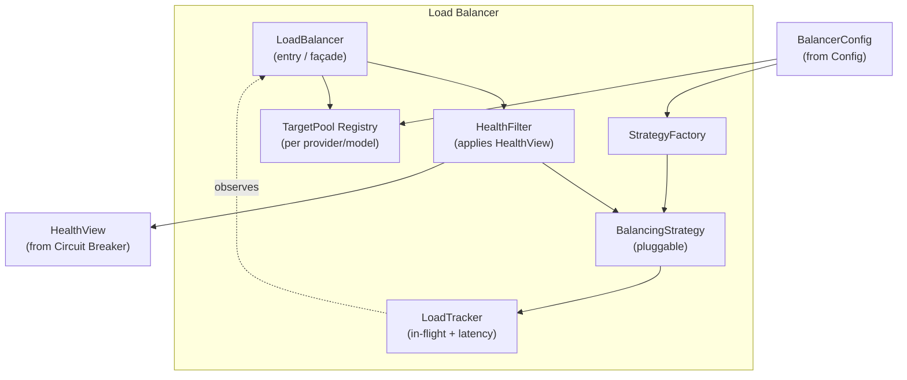
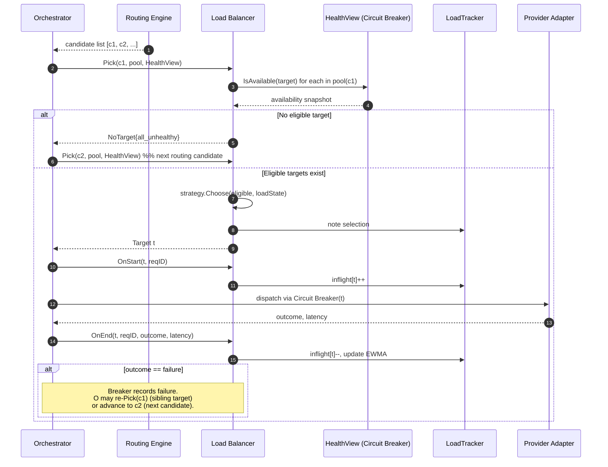
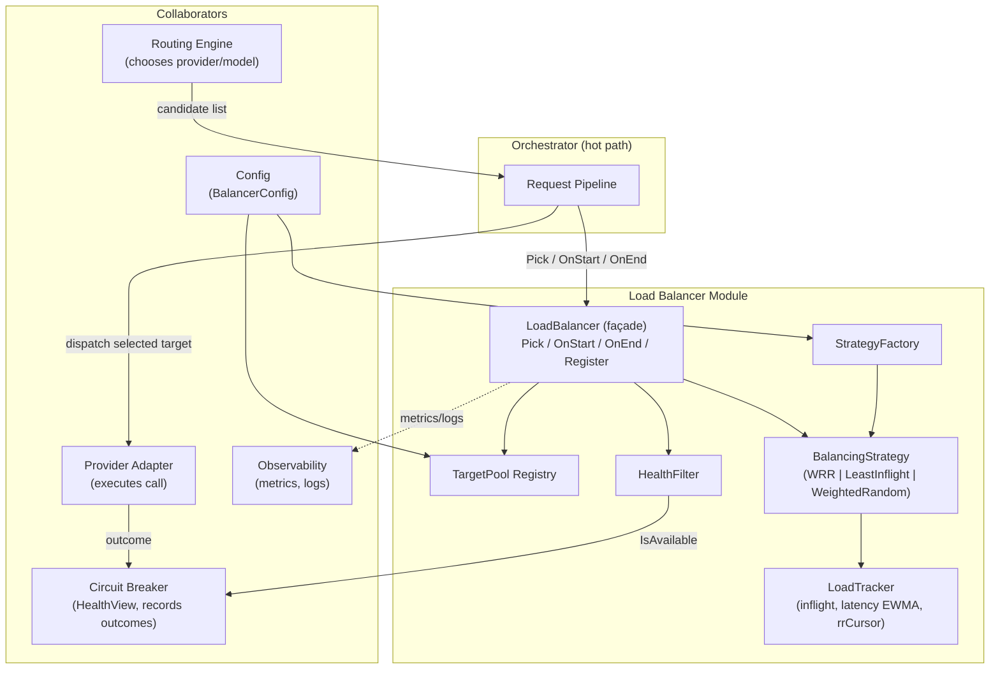

# ModelMesh — Component Design: Load Balancer

**Status:** Draft (pre-implementation)
**Document type:** Low-Level Design
**Last updated:** 2026-07-16
**Module:** 6 of 9
**Related:** [PRD](../PRD.md) · [High-Level Architecture](../02-architecture/High-Level-Architecture.md) · [Request Lifecycle](../02-architecture/Request-Lifecycle.md) · [Routing Engine](./02-routing-engine.md) · [Circuit Breaker](./04-circuit-breaker.md) · [Provider Layer](./01-provider-layer.md) · [Observability](./05-observability.md)

---

## 1. Purpose

The Load Balancer distributes requests across the **eligible concrete targets** that back a single provider/model choice made upstream by the [Routing Engine](./02-routing-engine.md). A "provider/model" is a *semantic* identity (e.g. `openai/gpt-4o`); behind it there may be multiple *physical* ways to satisfy it — several API keys or accounts, regional endpoints, or replicas with independent rate limits. The Load Balancer's job is to pick **which one** of these equivalent targets serves a given request, spreading load so that no single key/endpoint is saturated while others sit idle.

The module exists to convert a semantic routing decision into a concrete, healthy, load-aware endpoint selection — and to do so as a thin, fast, side-effect-light step on the hot path.

> **Critical boundary.** **Routing decides *which provider + model* (the semantic choice). The Load Balancer decides *which concrete target/endpoint/key* among equivalent instances of that choice (the distribution).** These are distinct layers. The Load Balancer never reconsiders provider or model, never scores providers, and never owns health — it *consumes* health via the [Circuit Breaker](./04-circuit-breaker.md)'s `HealthView`. If you find balancing logic making provider-quality or cost decisions, that logic belongs in Routing, not here.

Even when a provider/model initially has exactly **one** target, this module is still the correct seam: it gives the system a stable place to add keys, endpoints, and replicas later without touching Routing or the Orchestrator. See [§13 Tradeoffs](#13-tradeoffs) and [§14 Future Improvements](#14-future-improvements).

---

## 2. Responsibilities

**In scope:**

1. Maintain, per provider/model, a **target pool** of interchangeable endpoints/keys/replicas.
2. Filter targets by live health using the Circuit Breaker `HealthView` (skip open-circuit / unhealthy targets).
3. Apply a pluggable **balancing strategy** (weighted round-robin, least-inflight, weighted-random) to choose one eligible target.
4. Track **in-flight load** per target so load-aware strategies have live signal.
5. Return a concrete `Target`, or a clear `NoTarget` signal when nothing is eligible, so the Orchestrator can fall back to the next routing candidate.
6. Emit metrics and structured logs describing selection and skips.

**Explicitly NOT in scope (owned elsewhere):**

- Choosing provider or model → [Routing Engine](./02-routing-engine.md).
- Deciding whether a target is healthy / tripping circuits → [Circuit Breaker](./04-circuit-breaker.md).
- Executing the call or translating protocols → [Provider Layer](./01-provider-layer.md).
- Retry/fallback control flow across routing candidates → Orchestrator (see [Request Lifecycle](../02-architecture/Request-Lifecycle.md)).
- Budget/cost gating → [Budget Engine](./07-budget-engine.md).

---

## 3. Public Interfaces

The Load Balancer exposes a small, stateless-looking surface. All selection is synchronous and allocation-free on the common path.

| Operation | Input | Output | Semantics |
|---|---|---|---|
| `Pick` | `candidate` (provider/model id), `TargetPool`, `HealthView` | `Target` or `NoTarget` | Selects one eligible, healthy target per the active strategy. Pure w.r.t. providers; only mutates internal load/cursor state on selection. Never blocks; returns `NoTarget` if the pool has no eligible target. |
| `OnStart` | `Target`, `requestID` | — | Signals a request has begun on the target; increments in-flight load. Called by the Orchestrator immediately after `Pick`. |
| `OnEnd` | `Target`, `requestID`, `outcome`, `latency` | — | Signals completion; decrements in-flight load and feeds recent-latency signal. Called on success **and** failure. |
| `Register` | `candidate`, `[]Target` | — | Installs/updates the target pool for a provider/model (from config load). |

```text
LoadBalancer.Pick(candidate CandidateID, pool TargetPool, health HealthView) -> Target | NoTarget
LoadBalancer.OnStart(t Target, reqID string)
LoadBalancer.OnEnd(t Target, reqID string, outcome Outcome, latency Duration)

BalancingStrategy.Choose(eligible []Target, load LoadState) -> Target
HealthView.IsAvailable(t Target) -> bool     // provided by Circuit Breaker
```

**Contract notes:**

- `Pick` MUST be non-blocking and MUST NOT perform I/O. Health is read from an in-memory `HealthView` snapshot, not a live Redis round-trip.
- `OnStart`/`OnEnd` form a **matched pair**; the Orchestrator guarantees `OnEnd` runs for every `OnStart` (including on error, timeout, and cancellation) so in-flight counters do not leak. A missing `OnEnd` is a correctness bug that degrades load-aware strategies.
- If `candidate` has exactly one target and it is healthy, `Pick` returns it deterministically (fast path, no strategy math).

---

## 4. Internal Components



- **LoadBalancer (entry/façade):** orchestrates `Pick` — resolves the pool, applies the health filter, delegates to the strategy, records selection.
- **TargetPool Registry:** holds the set of `Target`s per provider/model, built from config. Read-mostly; updated only on config reload.
- **HealthFilter:** narrows the pool to targets reported available by the `HealthView`. Stateless.
- **BalancingStrategy:** the pluggable selection algorithm ([§6](#6-algorithms)). Constructed by the factory from config.
- **LoadTracker:** maintains per-target in-flight counts and a recent-latency signal; updated by `OnStart`/`OnEnd`. Local to the instance.
- **StrategyFactory:** constructs the configured strategy (Factory pattern), enabling swap without touching callers.

---

## 5. Data Structures

**Target** — one concrete, interchangeable way to satisfy a provider/model.

| Field | Type | Description | Notes |
|---|---|---|---|
| `id` | string | Stable unique target id | Used as metric/log label and health key |
| `provider` | string | Owning provider (e.g. `openai`) | Matches provider/model semantic identity |
| `model` | string | Model served | Same model across all targets in a pool |
| `endpointRef` | string | Reference to endpoint/base-URL config | Indirection; never a raw secret |
| `keyRef` | string | Reference to a credential (key/account) | **Reference only**; secret resolved by Provider Layer |
| `region` | string | Optional region tag | For future region-aware strategies |
| `weight` | int | Relative capacity weight (≥0) | Normalized at load; 0 = drain (never picked) |
| `enabled` | bool | Admin/config enable flag | Disabled targets are excluded pre-health |

**TargetPool** — the eligible set for one provider/model.

| Field | Type | Description | Notes |
|---|---|---|---|
| `candidate` | CandidateID | provider/model key | Pool identity |
| `targets` | []Target | Ordered target list | Order is stable for deterministic RR |
| `weightSum` | int | Cached sum of enabled weights | Recomputed on register |

**LoadState** — live, per-instance load signal used by strategies.

| Field | Type | Description | Notes |
|---|---|---|---|
| `inflight` | map[targetID]int | Current in-flight request count | Incremented/decremented by tracker |
| `recentLatency` | map[targetID]Duration | EWMA of recent latency | Fed by `OnEnd`; advisory |
| `rrCursor` | map[candidateID]int | Smooth-WRR cursor state | Per pool; per instance |

**BalancerConfig** — module configuration snapshot.

| Field | Type | Description | Notes |
|---|---|---|---|
| `strategy` | enum | `weighted_round_robin` \| `least_inflight` \| `weighted_random` | Default: `weighted_round_robin` |
| `pools` | map[candidate][]Target | Declared targets per provider/model | From provider config |
| `latencyHalfLife` | Duration | EWMA half-life for recentLatency | Only used by latency-aware strategies |

**NoTarget** — sentinel result: no eligible target exists (empty pool, all disabled, or all unhealthy). Carries a `reason` for metrics/logs (`empty_pool` \| `all_unhealthy` \| `all_disabled`).

---

## 6. Algorithms

### 6.1 Selection pipeline (`Pick`)

1. Resolve `TargetPool` for `candidate`. If absent/empty → `NoTarget{empty_pool}`.
2. Exclude `enabled == false` and `weight == 0` targets.
3. **Health filter:** keep targets where `HealthView.IsAvailable(target)` (circuit closed or half-open probe-eligible). If none remain → `NoTarget{all_unhealthy}`.
4. **Fast path:** if exactly one eligible target, return it.
5. Delegate to `BalancingStrategy.Choose(eligible, loadState)`.
6. Record selection (metric + tracker note), return `Target`.

Health filtering happens **before** strategy math so strategies never need health awareness — clean separation of concerns.

### 6.2 Smooth Weighted Round-Robin (default)

Classic *smooth weighted round-robin* (avoids the bursty "AABAB…" of naive WRR):

- Each target has static `weight`; `weightSum` = Σ weights of eligible targets.
- Maintain a per-target `currentWeight` (in `rrCursor` state).
- On each pick: for every eligible target, `currentWeight += weight`; choose the target with the greatest `currentWeight`; then `currentWeight(chosen) -= weightSum`.
- Produces a smooth, evenly interleaved distribution proportional to weights.

**Weight normalization:** weights are relative, not percentages. `weightSum` is recomputed whenever the *eligible* set changes (a target going unhealthy shifts its share proportionally to the rest — no renormalization config needed).

**Determinism & tie-breaking:** with equal weights this degrades to plain round-robin over the stable target order; ties in `currentWeight` break by lowest `target.id` for reproducibility.

### 6.3 Least-Inflight

Choose the eligible target with the smallest `inflight` count; break ties by weighted round-robin among the minima. Best when request latencies are heterogeneous, since it naturally steers away from slow/backed-up targets. Requires accurate `OnStart`/`OnEnd` pairing.

### 6.4 Weighted-Random

Pick an eligible target with probability proportional to `weight`. Stateless (no cursor), naturally spreads load across instances without shared coordination, at the cost of short-term unevenness. Randomness varies per selection; no cross-request state needed.

### 6.5 Interaction with fallback

The Load Balancer selects **one** target and returns. If the call to that target fails, the [Circuit Breaker](./04-circuit-breaker.md) records the failure (possibly tripping that target's circuit) and the **Orchestrator** decides what happens next:

- Re-invoke `Pick` for the *same* candidate → the now-unhealthy target is health-filtered out, so a *sibling* target is selected (intra-candidate retry).
- Or advance to the *next routing candidate* (different provider/model) per Routing's ordered list (inter-candidate fallback).

The Load Balancer itself performs **no retry loop** — it stays a single-selection function. This keeps retry/fallback policy in one place (the Orchestrator) rather than smeared across layers.

---

## 7. State Management

| State | Scope | Rationale |
|---|---|---|
| In-flight counts (`inflight`) | **Local** to instance | Cheap, accurate for *this* instance's own load; the only load this instance can act on precisely. |
| RR cursor (`rrCursor`) | **Local** to instance | Per-instance smoothing; global RR coordination is unnecessary and costly. |
| Recent latency EWMA | **Local** to instance | Advisory signal; local view is sufficient. |
| Target health | **Shared** (via Circuit Breaker → Redis-backed) | Health must converge fleet-wide; owned by Circuit Breaker, consumed here as a snapshot. |
| Target pool / weights | **Config** (read-mostly) | Reloaded on config change; not runtime-mutated. |

**Design stance: local load + shared health.** In-flight/latency counters are kept **local**; provider/target **health** is the only cross-instance state, and it is owned by the Circuit Breaker (not duplicated here). Rationale in [§13](#13-tradeoffs): sharing per-target in-flight counts through Redis on every `Pick`/`OnStart`/`OnEnd` would put a synchronous coordination hop on the hot path for marginal accuracy gain. With N stateless instances each balancing locally over the same weights, aggregate distribution still tracks weights well; instances are symmetric.

---

## 8. Configuration

| Key | Type | Default | Description |
|---|---|---|---|
| `loadbalancer.strategy` | enum | `weighted_round_robin` | Active balancing strategy. |
| `loadbalancer.pools.<provider>/<model>` | list<Target> | derived | Target list per provider/model (endpoints/keys/regions/weights). |
| `loadbalancer.target.weight` | int | `1` | Per-target relative weight; `0` drains the target. |
| `loadbalancer.target.enabled` | bool | `true` | Enable/disable a target without removing config. |
| `loadbalancer.latencyHalfLife` | duration | `30s` | EWMA half-life for latency-aware strategies. |
| `loadbalancer.singleTargetFastPath` | bool | `true` | Skip strategy math when a pool has one eligible target. |

Config is loaded and validated at startup and on reload (see [Configuration flow](../02-architecture/High-Level-Architecture.md)); invalid weights (negative) or unknown strategies fail validation, not requests. Target credentials are **references** resolved by the Provider Layer; the Load Balancer never holds secrets.

---

## 9. Failure Handling

| Situation | Behavior | Caller impact |
|---|---|---|
| Pool empty / unregistered | Return `NoTarget{empty_pool}` | Orchestrator falls back to next routing candidate |
| All targets disabled | `NoTarget{all_disabled}` | Fallback |
| All targets unhealthy (circuits open) | `NoTarget{all_unhealthy}` | Fallback |
| Selected target subsequently fails | Not handled here; Circuit Breaker records, Orchestrator re-picks/falls back | Transparent to caller if a sibling/candidate succeeds |
| `HealthView` unavailable/stale | Treat all targets as available (fail-open) and log | Availability preserved; Circuit Breaker still guards the actual call |
| Missing `OnEnd` (leaked in-flight) | Counter drifts high; self-heals on restart; guarded by optional TTL sweep | Degrades load-aware accuracy only; never fails a request |

**Core principle:** the Load Balancer **never blocks and never fails a request by itself.** Its only failure signal is `NoTarget`, which is an ordinary control-flow output the Orchestrator expects. Health-view staleness is handled fail-open because the Circuit Breaker remains the authoritative guard at call time — a stale "healthy" read at most costs one guarded attempt.

---

## 10. Logging

Structured events (levels: DEBUG for per-pick on hot path, INFO for state changes, WARN for degradation):

| Event | Level | Fields |
|---|---|---|
| `lb.pick` | DEBUG | `request_id`, `candidate`, `target_id`, `strategy`, `eligible_count`, `inflight` |
| `lb.no_target` | WARN | `request_id`, `candidate`, `reason`, `pool_size` |
| `lb.target_skipped` | DEBUG | `request_id`, `candidate`, `target_id`, `reason` (`unhealthy`\|`disabled`\|`drained`) |
| `lb.pool_registered` | INFO | `candidate`, `target_count`, `weight_sum`, `strategy` |
| `lb.health_view_stale` | WARN | `candidate`, `age_ms` |
| `lb.inflight_leak_swept` | WARN | `target_id`, `swept_count` |

Per-pick `lb.pick` is DEBUG to avoid hot-path log volume in production; it is invaluable at debug level when diagnosing skew. All events carry `request_id` for trace correlation with [Observability](./05-observability.md).

---

## 11. Metrics

Prometheus-style. Reuses shared conventions; module prefix `lb_`.

| Metric | Type | Labels | Meaning |
|---|---|---|---|
| `lb_selections_total` | counter | `candidate`, `target`, `strategy` | Selections per target. Skew/fairness signal. |
| `lb_target_inflight` | gauge | `candidate`, `target` | Current in-flight requests per target (this instance). |
| `lb_target_skipped_total` | counter | `candidate`, `target`, `reason` | Targets skipped during selection. |
| `lb_no_target_total` | counter | `candidate`, `reason` | `Pick` returned `NoTarget`; drives fallback. |
| `lb_eligible_targets` | histogram | `candidate` | Distribution of eligible-set size at pick time. |
| `lb_target_latency_seconds` | histogram | `candidate`, `target` | Observed per-target latency (from `OnEnd`). |
| `lb_pick_duration_seconds` | histogram | `strategy` | Selection compute time (should be sub-microsecond-ish). |

Key operational signals: rising `lb_no_target_total` indicates health starvation upstream; skew in `lb_selections_total` vs configured weights indicates misconfiguration or health-induced rebalancing; `lb_target_inflight` imbalance validates least-inflight behavior.

---

## 12. Extension Points

- **New BalancingStrategy** (primary seam): implement `BalancingStrategy.Choose` and register with the `StrategyFactory`. No caller changes.
- **Latency/adaptive strategies:** consume `recentLatency` EWMA to bias away from slow targets (e.g. latency-weighted least-inflight).
- **Power-of-two-choices:** sample two eligible targets, pick the less loaded — near-optimal spread with O(1) cost and minimal state; a natural drop-in strategy.
- **Weighted-by-capacity:** derive weights from measured throughput/rate-limit headroom rather than static config.
- **Region/affinity awareness:** use `Target.region` for locality-preferring selection.
- **Sticky routing hints:** honor an optional caller/session key to prefer a stable target (e.g. for provider-side prompt caching), while preserving health filtering.
- **Shared load coordination (opt-in):** a strategy variant that reads aggregate in-flight from Redis for cross-instance accuracy (see tradeoff below).

---

## 13. Tradeoffs

- **Local vs shared load state.** *Chosen: local in-flight + shared health.* Local counters keep `Pick` I/O-free and fast; the cost is that each instance only sees its own load. Sharing in-flight via Redis would improve global least-inflight accuracy but adds a synchronous coordination hop per request — unjustified for a portfolio-scale gateway and a hot-path latency regression. Health *is* shared because it must converge fleet-wide and is already owned by the Circuit Breaker.
- **Round-robin vs least-inflight.** WRR is stateless-ish, predictable, and great when latencies are homogeneous. Least-inflight adapts to heterogeneous latency but depends on flawless `OnStart`/`OnEnd` pairing and reflects only local load. Default is WRR for predictability; least-inflight is a config switch.
- **Static vs adaptive weights.** Static weights are transparent and debuggable; adaptive (capacity/latency-derived) weights react to reality but add feedback-loop complexity and can oscillate. Start static; adaptive is a future strategy, not a default.
- **Where balancing ends and routing begins.** Deliberately narrow: the Load Balancer never reasons about provider quality, cost, or model — only distribution among equivalent targets. This avoids two layers making overlapping decisions. The cost is an extra hop for the common single-target case, accepted for the clean seam it provides.
- **Single-target reality vs the abstraction.** Early on, most pools have one target, so `Pick` is nearly a no-op. We keep the module anyway: it is the designated place to grow to multiple keys/endpoints/replicas without disturbing Routing or the Orchestrator.

---

## 14. Future Improvements

- Power-of-two-choices strategy as the new default once multi-target pools are common.
- Latency-aware and capacity-aware adaptive weighting driven by `recentLatency` and rate-limit headroom.
- Optional Redis-backed shared in-flight for globally-accurate least-inflight (behind a flag; off by default).
- Region/zone affinity and sticky-target hints for provider-side cache locality.
- Automatic weight suggestion from observed throughput (report-only advisory first).
- Concurrency-limit enforcement per target (shed/queue when a target's in-flight exceeds a cap) — coordinated with Budget/Circuit Breaker.

---

## 15. Sequence Diagram

Selection on the hot path, including health filtering, load tracking, and the fallback interaction with the Orchestrator.



---

## 16. Component Diagram



---

## 17. Design Patterns Used

| Pattern | Where | Why |
|---|---|---|
| **Strategy** | `BalancingStrategy` (WRR / least-inflight / weighted-random) | Selection algorithm is swappable via config without touching callers; new strategies are additive. |
| **Factory** | `StrategyFactory` | Constructs the configured strategy from `BalancerConfig`, decoupling wiring from selection logic. |
| **Observer** | `LoadTracker` via `OnStart`/`OnEnd` | The Orchestrator notifies the tracker of lifecycle events; load-aware strategies observe the resulting `LoadState`. |
| **Façade** | `LoadBalancer` entry | Presents one small surface (`Pick`/`OnStart`/`OnEnd`) over pool, filter, strategy, and tracker. |
| **Null Object** | `NoTarget` sentinel | Represents "no eligible target" as a first-class, non-exceptional result driving Orchestrator fallback. |

---

## 18. Why This Design Was Chosen

1. **Sharp separation from Routing.** By constraining the module to *distribution among equivalent targets* and forbidding provider/model reasoning, we avoid two layers making overlapping decisions — the single most common source of confusion in gateway designs. Routing answers "what," the Load Balancer answers "which one."
2. **Health without ownership.** Reading a `HealthView` snapshot from the Circuit Breaker keeps health authoritative in one place and lets the Load Balancer stay a fast, pure-ish selector. Fail-open on stale health is safe because the Circuit Breaker still guards the actual call.
3. **Local state on the hot path.** Keeping in-flight/cursor state local removes Redis coordination from `Pick`, honoring the system-wide "stateless hot path, shared cold state" principle while still tracking weights well across symmetric instances.
4. **Pluggable by construction.** Strategy + Factory make the balancing policy a config decision, so the project can start with predictable WRR and grow into power-of-two-choices or adaptive weighting without refactoring callers.
5. **A seam that pays off later.** Even with one target per model today, the module is the designated growth point for multiple keys, regional endpoints, and replicas — added later with zero changes to Routing or the Orchestrator.
6. **Never the reason a request fails.** Its only negative output is `NoTarget`, an expected control-flow signal, keeping failure semantics simple and fallback logic centralized in the Orchestrator.

This makes the Load Balancer a small, predictable, well-bounded layer — exactly what a hot-path distribution component should be, and a clean foundation for the scale-oriented strategies in [§14](#14-future-improvements).
