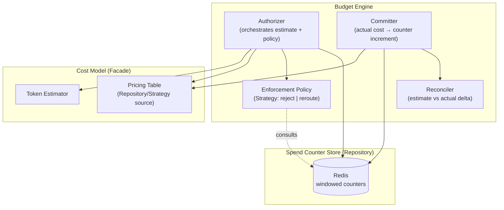
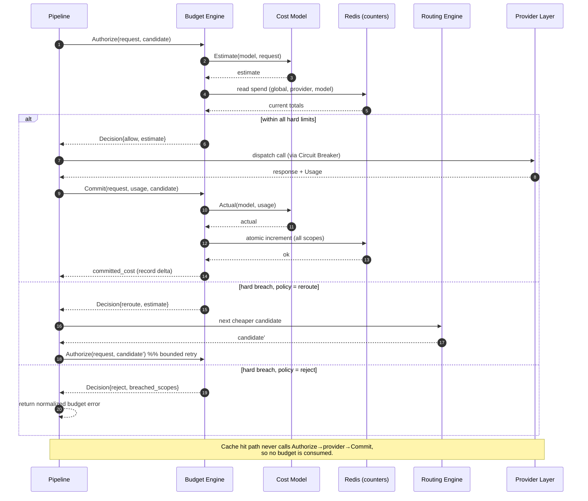
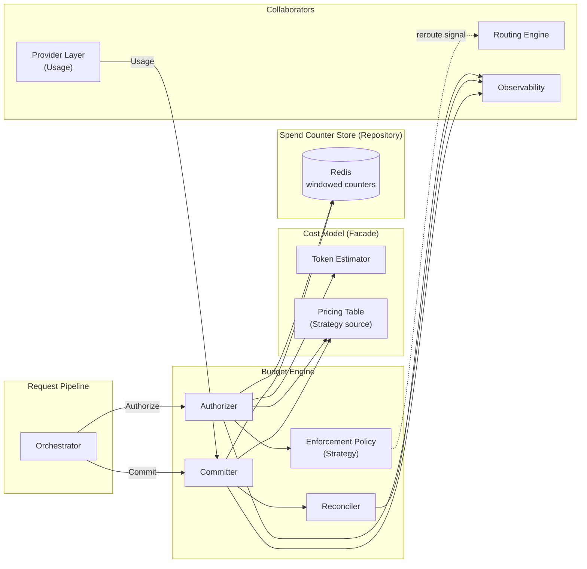

# ModelMesh — Component Design: Budget Engine

**Status:** Draft (pre-implementation)
**Document type:** Low-Level Design
**Last updated:** 2026-07-16
**Module:** 7 of 9
**Related:**
- [PRD](../PRD.md)
- [High-Level Architecture](../02-architecture/High-Level-Architecture.md)
- [Request Lifecycle](../02-architecture/Request-Lifecycle.md)
- Siblings: [Provider Layer](./01-provider-layer.md) · [Routing Engine](./02-routing-engine.md) · [Circuit Breaker](./04-circuit-breaker.md) · [Observability](./05-observability.md)

---

## 1. Purpose

The Budget Engine is the financial control plane of ModelMesh. It answers two questions for every request that reaches a provider:

1. **Before the call:** *"Can we afford this request under the configured limits?"* — a **pre-authorization** based on an estimated cost.
2. **After the call:** *"What did this request actually cost, and record it against the running total."* — a **commit** of the actual cost derived from the provider's reported token usage.

This split is deliberate and consistent with the [Request Lifecycle](../02-architecture/Request-Lifecycle.md): estimation gates the request cheaply and quickly; commitment happens only after a *successful, billable* provider call. A request served from any cache layer (L1/L2/L3) never reaches a provider, therefore **incurs no commit and consumes no budget**. The Budget Engine is the guardrail that prevents ModelMesh from silently overspending against upstream providers while keeping the hot path fast.

The engine owns cost computation (via the **Cost Model**), budget bookkeeping (via **spend counters** in Redis), and the **enforcement policy** (reject vs. reroute) applied when a limit would be breached.

---

## 2. Responsibilities

**In scope:**

- Estimate the cost of a request *before* dispatch, from the target model's pricing and an approximate token count.
- Enforce configurable budget limits across one or more **scopes** (global, per-provider, per-model, per-window).
- Return an authorization **Decision**: `allow`, `reject`, or `reroute` (to a cheaper candidate).
- Compute the **actual** cost of a completed request from provider-reported token usage.
- Atomically commit actual spend to the authoritative counters in Redis so enforcement is consistent across the fleet.
- Reconcile estimate vs. actual, exposing the delta for observability and future tuning.
- Emit metrics, structured logs, and remaining-budget gauges.

**Explicitly out of scope:**

- Deciding *which* provider/model to call — that is the [Routing Engine](./02-routing-engine.md). The Budget Engine only signals `reroute`; Routing selects the next candidate.
- Extracting token usage from provider responses — that is the [Provider Layer](./01-provider-layer.md)'s normalized `Usage`. The Budget Engine consumes it.
- Long-term persistence, invoicing, or chargeback (explicit non-goals in the [PRD](../PRD.md)). Counters are windowed and operational, not an accounting ledger.

---

## 3. Public Interfaces

The engine exposes a narrow surface to the request pipeline. The Cost Model is a collaborator surface used internally and by Observability for reporting.

| Operation | Input | Output | Semantics |
|-----------|-------|--------|-----------|
| `Authorize` | `request`, `candidate {provider, model}` | `Decision {verdict, estimate, scope_hits}` | Pure read + estimate. Reads current spend for all scopes touching the candidate, estimates cost, applies policy. **No mutation.** Idempotent. |
| `Commit` | `request`, `actualUsage`, `candidate` | `committed_cost`, `CostRecord` | Called only after a successful provider call. Computes actual cost, atomically increments every relevant scope counter. **Mutates state.** Must be safe under concurrency. |
| `Remaining` | `scope` | `amount`, `window_reset_at` | Read-only introspection for gauges/alerts. |
| `RegisterPricing` | `PricingTable` | `ok / validation errors` | Loads or hot-swaps pricing (see §12). Validated before activation. |

Cost Model (Facade over pricing):

```text
CostModel.Estimate(model, request)   -> Cost        # approximate, pre-call
CostModel.Actual(model, usage)       -> Cost        # exact, from reported tokens
CostModel.Price(model)               -> PricingEntry # raw lookup
```

Budget Engine (façade over Cost Model + counters + policy):

```text
Budget.Authorize(request, candidate) -> Decision{ allow | reject | reroute, estimate }
Budget.Commit(request, actualUsage, candidate) -> committed_cost
Budget.Remaining(scope) -> { amount, window_reset_at }
```

**Contract notes:**

- `Authorize` and `Commit` are **decoupled**: authorization does not reserve funds (no hold/escrow). This keeps the hot path a single read and accepts a small, bounded overshoot window (see §6, §13).
- `Commit` is **best-effort with respect to the response**: a commit failure never fails a request whose response has already been produced (see §9).
- All operations are **stateless in the engine**; the only state lives in Redis (§7).

---

## 4. Internal Components



| Component | Role |
|-----------|------|
| **Authorizer** | Entry point for `Authorize`. Reads relevant scope counters, calls the Cost Model for an estimate, delegates the verdict to the Enforcement Policy. |
| **Committer** | Entry point for `Commit`. Computes actual cost, performs the atomic increment across scopes, hands the estimate/actual pair to the Reconciler. |
| **Enforcement Policy** | Strategy object deciding `allow`/`reject`/`reroute` given `(estimate, remaining, config)`. Swappable without touching the Authorizer. |
| **Reconciler** | Records estimate-vs-actual delta for metrics; may feed future estimator tuning (§14). Stateless, observability-only. |
| **Cost Model (Facade)** | Single entry for cost computation. Hides the estimator and pricing source from callers; also used by Observability for cost dashboards. |
| **Token Estimator** | Produces an approximate token count for a request pre-call (prompt tokens + a max/expected output allowance). |
| **Pricing Table** | Repository of `PricingEntry` keyed by `(provider, model)`; the pricing *source* is a Strategy (static config now; dynamic later — §12). |
| **Spend Counter Store** | Repository abstraction over Redis providing atomic increment and windowed reads. The only stateful dependency. |

---

## 5. Data Structures

**PricingEntry** — one row of the pricing table.

| Field | Type | Description | Notes |
|-------|------|-------------|-------|
| `provider` | string | Provider id (e.g. `openai`) | Part of key |
| `model` | string | Model id | Part of key |
| `input_price` | decimal | Price per `unit` input tokens | Currency in `currency` |
| `output_price` | decimal | Price per `unit` output tokens | Often ≠ input price |
| `unit` | int | Token unit for pricing (e.g. 1000 or 1_000_000) | Avoids float drift |
| `currency` | string | ISO currency (e.g. `USD`) | Single currency per deployment assumed |
| `version` | string | Pricing revision tag | For audit / hot-swap |

**BudgetLimit** — a configured ceiling for a scope.

| Field | Type | Description | Notes |
|-------|------|-------------|-------|
| `scope` | ScopeKey | What the limit applies to | See ScopeKey below |
| `amount` | decimal | Ceiling in `currency` | Hard limit unless `soft=true` |
| `window` | duration | Reset window (e.g. `24h`, `1h`) | `none` = cumulative/no reset |
| `soft` | bool | Soft (alert only) vs hard (enforce) | Enables warn-without-block (§12) |
| `on_breach` | enum | `reject` \| `reroute` | Policy hint; global default in config |

**ScopeKey** — identifies a budget dimension.

| Field | Type | Description | Notes |
|-------|------|-------------|-------|
| `dimension` | enum | `global` \| `provider` \| `model` | Extensible (§12) |
| `value` | string | e.g. provider id or model id | Empty for `global` |

**SpendCounter** — authoritative running total (in Redis).

| Field | Type | Description | Notes |
|-------|------|-------------|-------|
| `scope` | ScopeKey | Counter identity | Encoded in Redis key |
| `current` | decimal | Spend so far in window | Atomically incremented |
| `window_start` | timestamp | Start of current window | Drives reset |
| `window_reset_at` | timestamp | When counter resets | Derived from `window` |

**Decision** — result of `Authorize`.

| Field | Type | Description | Notes |
|-------|------|-------------|-------|
| `verdict` | enum | `allow` \| `reject` \| `reroute` | Consumed by pipeline |
| `estimate` | Cost | Estimated cost of the request | For logging/metrics |
| `breached_scopes` | []ScopeKey | Scopes that would exceed | Empty on `allow` |
| `reason` | string | Human-readable cause | For logs / caller error |

**Cost** — a computed monetary amount.

| Field | Type | Description | Notes |
|-------|------|-------------|-------|
| `amount` | decimal | Money | Fixed-precision decimal, never float |
| `currency` | string | Currency | Matches pricing |
| `basis` | enum | `estimate` \| `actual` | Provenance |

**CostRecord** — reconciliation artifact from `Commit`.

| Field | Type | Description | Notes |
|-------|------|-------------|-------|
| `estimate` | Cost | Pre-call estimate | |
| `actual` | Cost | Post-call actual | From `Usage` |
| `delta` | decimal | `actual − estimate` | Signed; feeds accuracy metric |
| `model` | string | Model used | |

---

## 6. Algorithms

**6.1 Pre-call token estimation.** The estimator computes `input_tokens` from the request payload (prompt/messages) using a tokenizer or a calibrated heuristic, and adds an **output allowance** — the request's `max_tokens` if provided, otherwise a configured `default_output_estimate`. This is intentionally approximate; the goal is a *safe-enough* pre-authorization, not exactness. The estimator errs slightly high on output to bias toward not overspending.

```text
est_input  = tokenize(request.prompt)              # or heuristic char/word ratio
est_output = request.max_tokens ?? default_output_estimate
estimate   = CostModel.Estimate(model, {est_input, est_output})
```

**6.2 Cost formula.** For both estimate and actual, cost is linear in tokens against the `PricingEntry`:

```text
cost = (input_tokens  / unit) * input_price
     + (output_tokens / unit) * output_price
```

Actual cost uses the provider-reported `Usage` (input/output tokens) from the [Provider Layer](./01-provider-layer.md); estimate uses §6.1 figures.

**6.3 Authorization check.** For each scope touched by the candidate (`global`, its `provider`, its `model`):

```text
for scope in scopes(candidate):
    limit  = limits[scope]                 # skip if none configured
    spent  = store.read(scope)             # windowed current
    if spent + estimate > limit.amount and limit is hard:
        breached += scope
verdict = policy.decide(estimate, breached, config)
```

**6.4 Enforcement policy (Strategy).**
- **reject** policy: any hard breach ⇒ `reject` with `breached_scopes`.
- **reroute** policy: any hard breach ⇒ `reroute`; the pipeline asks [Routing Engine](./02-routing-engine.md) for the next-cheaper candidate, and `Authorize` is re-run for it. A bounded number of reroute attempts prevents loops; on exhaustion the policy falls back to `reject`.
- Soft limits never block; they only emit a warn log + threshold metric.

**6.5 Atomic commit.** After a successful provider call, actual cost is added to every relevant scope counter using a **server-side atomic increment** (single round-trip per counter, or one grouped atomic script). This avoids the read-modify-write race that would let concurrent commits lose updates:

```text
actual = CostModel.Actual(model, usage)
for scope in scopes(candidate):
    store.increment_atomic(scope, actual.amount)   # INCRBYFLOAT-style, atomic
reconciler.record(CostRecord{estimate, actual})
```

**6.6 Windowed budgets (fixed window).** Each counter carries a `window_start`. On read/increment, if `now >= window_reset_at`, the counter is reset to zero and the window advanced. Reset is performed atomically (e.g. via an atomic script or a keyed TTL that expires the counter) so a window rollover cannot double-count. `window = none` means a cumulative counter with no reset.

**6.7 Reconciliation.** The Reconciler computes `delta = actual − estimate` and emits it (§11). Persistent bias (estimates consistently low/high) is a signal to recalibrate the estimator or `default_output_estimate` — a feedback loop deferred to §14.

**Overshoot bound.** Because `Authorize` does not reserve funds, N concurrent requests can each pass authorization against the same `remaining` before any commits land. The worst-case overshoot per scope is bounded by `(in-flight concurrency) × (max single-request cost)`. For a portfolio-scale gateway this is acceptable; a reservation/escrow scheme (§14) would tighten it at the cost of hot-path complexity.

---

## 7. State Management

- **Authoritative state lives in Redis**, never in the engine process. This makes every gateway instance enforce against the *same* running totals — essential because the fleet is horizontally scaled ([High-Level Architecture](../02-architecture/High-Level-Architecture.md)).
- **Counters are the only durable state.** Estimates are transient: they exist only for the lifetime of a single `Authorize`/pipeline pass and are **never persisted**. Only **actuals** mutate counters, and only via `Commit`.
- **Atomicity.** Increments use Redis atomic primitives (atomic float increment / single Lua script for grouped multi-scope updates + window check). The engine never does a client-side `read → add → write` for commits; that pattern is explicitly rejected as racy under fleet concurrency.
- **Window reset** is handled atomically at access time (§6.6). Two strategies are supported by config: (a) key TTL that lets the counter expire and be recreated at zero, or (b) explicit `window_start` comparison in an atomic script. TTL is simpler; the script variant gives exact reset boundaries.
- **Read consistency.** `Authorize` reads are point-in-time and may be slightly stale relative to in-flight commits — this is the accepted overshoot window (§6). Enforcement correctness over the window is eventually consistent, not linearizable, by design.

---

## 8. Configuration

| Key | Type | Default | Description |
|-----|------|---------|-------------|
| `budget.enabled` | bool | `true` | Master switch. If false, `Authorize` always `allow`, `Commit` still records cost for metrics. |
| `budget.default_policy` | enum | `reject` | Global enforcement policy when a limit lacks `on_breach`. `reject` \| `reroute`. |
| `budget.max_reroute_attempts` | int | `2` | Bound on reroute loops before falling back to `reject`. |
| `budget.store_failure_mode` | enum | `fail_closed` | Behavior when Redis is unreachable. `fail_closed` (reject) \| `fail_open` (allow). See §9. |
| `budget.default_output_estimate` | int | `512` | Output-token allowance when `max_tokens` absent. |
| `budget.currency` | string | `USD` | Deployment currency; must match pricing. |
| `budget.limits[]` | list<BudgetLimit> | `[]` | Configured ceilings by scope/window. Empty ⇒ no enforcement, cost still tracked. |
| `budget.pricing_source` | enum | `static` | Pricing Strategy: `static` (config file) \| `dynamic` (future, §12). |
| `budget.pricing[]` | list<PricingEntry> | required if static | Pricing table. Validated on load. |
| `budget.soft_alert_ratio` | float | `0.8` | Emit warn/alert metric when `spent/limit ≥ ratio`. |

Configuration is validated at load ([High-Level Architecture](../02-architecture/High-Level-Architecture.md) config flow): every priced model referenced by routing must have a `PricingEntry`, currencies must match, and windows/amounts must be positive. Invalid pricing fails startup rather than silently mispricing.

---

## 9. Failure Handling

| Failure | Detection | Behavior |
|---------|-----------|----------|
| **Over hard budget** | `Authorize` check | Return `reject` (or `reroute` per policy). Caller receives a normalized budget error (a defined, expected outcome — not a `5xx`). |
| **Redis unreachable on `Authorize`** | store read error | Governed by `budget.store_failure_mode`. **Default `fail_closed`** ⇒ `reject`, protecting spend at the cost of availability. `fail_open` ⇒ `allow`, prioritizing availability and accepting unbounded spend risk. Either way, `budget_store_errors_total` is incremented and a warn log emitted. |
| **Redis unreachable / error on `Commit`** | store increment error | The provider response has **already been returned to the caller** (commit is post-response). **Never fail the request.** The uncommitted cost is logged and flagged for reconciliation; `spend_commit_failures_total` increments. Optionally buffered for retry (§14). |
| **Missing pricing for model** | Cost Model lookup miss | Startup validation should prevent this. At runtime, treat as `store_failure_mode` for `Authorize` (fail-closed default) and, for `Commit`, record a zero/unknown-cost `CostRecord` with an error metric rather than crashing. |
| **Estimator failure** | estimator error | Fall back to a conservative high default estimate so authorization stays safe; log warn. |
| **Reroute exhaustion** | policy loop bound reached | Fall back to `reject` after `max_reroute_attempts`. |

**Guiding principle:** the Budget Engine may *deny* a request (that is its job), but it must never *crash* a request whose response already exists. Pre-call it can be strict; post-call it is strictly best-effort.

---

## 10. Logging

Structured events (`event`, `level`, fields). Costs are logged as decimal amounts with currency; no prompt content is logged.

| event | level | fields |
|-------|-------|--------|
| `budget.authorize` | debug | `request_id`, `provider`, `model`, `estimate`, `verdict`, `breached_scopes` |
| `budget.reject` | info | `request_id`, `scope`, `estimate`, `remaining`, `reason` |
| `budget.reroute` | info | `request_id`, `from_model`, `estimate`, `attempt` |
| `budget.commit` | debug | `request_id`, `model`, `actual`, `delta`, `scopes` |
| `budget.soft_threshold` | warn | `scope`, `spent`, `limit`, `ratio` |
| `budget.store_error` | warn | `op` (`read`/`increment`), `scope`, `failure_mode`, `error` |
| `budget.commit_failed` | error | `request_id`, `model`, `actual`, `scope`, `error` (flags reconciliation) |
| `budget.pricing_missing` | error | `provider`, `model` |

---

## 11. Metrics

Reusing the [Request Lifecycle](../02-architecture/Request-Lifecycle.md) catalog plus module-specific additions.

| Metric | Type | Labels | Meaning |
|--------|------|--------|---------|
| `budget_checks_total` | counter | `decision` (`allow`/`reject`/`reroute`) | Every `Authorize` outcome. |
| `budget_rejections_total` | counter | `scope`, `dimension` | Hard-limit rejections. |
| `estimated_cost_usd` | histogram | `provider`, `model` | Distribution of pre-call estimates. |
| `budget_remaining_usd` | gauge | `scope`, `dimension` | Remaining headroom per scope. |
| `spend_committed_usd` | counter | `provider`, `model`, `scope` | Actual committed spend. |
| `spend_commit_failures_total` | counter | `scope` | Commits that failed post-response (reconciliation backlog). |
| `budget_estimate_delta_usd` | histogram | `provider`, `model` | `actual − estimate`; estimator accuracy signal. |
| `budget_store_errors_total` | counter | `op`, `failure_mode` | Redis read/increment failures. |
| `budget_reroute_attempts` | histogram | — | Reroute attempts before resolution. |
| `budget_soft_threshold_total` | counter | `scope` | Soft-limit threshold crossings. |
| `budget_window_reset_total` | counter | `scope` | Window rollovers. |

---

## 12. Extension Points

- **Additional scopes.** `ScopeKey.dimension` is an enum designed to grow (e.g. `region`, `route-class`, `time-of-day`). Adding a dimension requires a counter-key convention and a limit config; the Authorizer iterates scopes generically.
- **Enforcement policies (Strategy).** New `on_breach` behaviors (e.g. `degrade-to-smaller-model`, `queue-and-retry`) plug in as policy strategies without touching estimation or counters.
- **Pricing source (Strategy).** `pricing_source: dynamic` allows a live pricing feed (provider price API, control-plane push) behind the same `CostModel.Price` façade. Hot-swap via `RegisterPricing` with validation.
- **Soft vs hard limits + alerting.** `soft` limits and `soft_alert_ratio` already model warn-without-block; a future alert sink (webhook/notification) can subscribe to `budget_soft_threshold_total`.
- **Cost-optimized routing feedback.** The Reconciler's delta stream and `Remaining` can feed the [Routing Engine](./02-routing-engine.md) as a cost signal, biasing routing toward cheaper models as budget depletes.
- **Reservation/escrow.** An optional hold-on-authorize + settle-on-commit mode (§14) can be added behind the same interface to tighten the overshoot bound.

---

## 13. Tradeoffs

| Decision | Chosen | Alternative | Why |
|----------|--------|-------------|-----|
| Authorize semantics | **Estimate-only, no reservation** | Reserve/escrow funds on authorize | Single hot-path read; simpler; bounded, acceptable overshoot for portfolio scale. |
| Store failure default | **fail-closed** | fail-open | Protecting against runaway spend is the engine's reason to exist; availability is recovered by fixing Redis, not by overspending. Configurable for those who prefer availability. |
| Commit vs response | **Commit is post-response, best-effort** | Commit before responding | Never make a caller pay (in latency/failure) for bookkeeping; correctness of totals is eventually consistent. |
| Estimate accuracy | **Approximate, biased high** | Exact pre-call tokenization always | Exactness pre-call is impossible for output tokens; a safe over-estimate is cheaper and sufficient. Delta metric keeps it honest. |
| Consistency model | **Atomic increments, eventually-consistent reads** | Linearizable check-and-reserve (locks/transactions) | Atomic increments give correct *totals* without hot-path locking; strict linearizability would throttle throughput for marginal benefit. |
| Budget granularity | **Windowed + cumulative, multi-scope** | Per-request cap only | Real budgets are time-boxed and layered (global + provider + model); per-request caps alone can't express "$X per day." |

---

## 14. Future Improvements

- **Reservation/escrow mode** to tighten the concurrency overshoot bound where strict caps matter.
- **Commit retry buffer**: durably queue failed commits and replay them, eliminating reconciliation drift after Redis blips.
- **Estimator auto-calibration** driven by the `budget_estimate_delta_usd` feedback loop (per-model correction factors).
- **Sliding-window / token-bucket budgets** in addition to fixed windows, for smoother rate-shaped spend.
- **Multi-currency** pricing with a conversion layer (currently single-currency per deployment).
- **Dynamic pricing feed** from provider price APIs behind the existing Strategy seam.
- **Alert sink integration** for soft-threshold and near-exhaustion events.

These are explicitly deferred; the [PRD](../PRD.md) scopes billing/invoicing out entirely, so the engine stays operational, not financial.

---

## 15. Sequence Diagram

Pre-authorize → provider call → commit, including the cache-hit short-circuit and the reroute branch.



---

## 16. Component Diagram



---

## 17. Design Patterns Used

| Pattern | Where | Why |
|---------|-------|-----|
| **Facade** | Cost Model wraps estimator + pricing table | Callers (Budget Engine, Observability) get one cost surface; internals can change freely. |
| **Strategy** | Enforcement Policy (`reject`/`reroute`/future); Pricing source (`static`/`dynamic`) | Swap enforcement or pricing behavior via config without touching orchestration logic. |
| **Repository** | Spend Counter Store over Redis | Abstracts atomic-increment/windowed-read storage; enables an alternate backend or a test double. |
| **Command (implicit)** | `Authorize`/`Commit` as discrete operations over shared state | Clean pre/post split mirroring the request lifecycle; each is independently testable and observable. |

---

## 18. Why This Design Was Chosen

The design optimizes for three properties, in order: **safety of spend**, **speed of the hot path**, and **fleet-wide consistency**.

- **Safety first.** Cost control is the module's entire purpose, so ambiguous cases default to *not overspending*: fail-closed on store errors, high-biased estimates, hard limits that reject. A portfolio gateway that quietly burns provider credits would be a worse failure than one that occasionally rejects.
- **Speed via decoupled authorize/commit.** Reserving funds or taking locks on the hot path would add latency and contention to *every* request. Instead, `Authorize` is a single read + arithmetic, and the only mutation (`Commit`) happens after the response is already on its way back — off the caller's critical path. The price is a small, bounded, well-understood overshoot, which we measure rather than pretend away.
- **Consistency via Redis + atomic increments.** Because ModelMesh runs many stateless instances, budgets can only be enforced correctly if every instance reads and writes the *same* counters. Redis with server-side atomic increments gives correct totals without distributed locks, matching the system-wide "stateless compute, shared state in Redis" principle from the [High-Level Architecture](../02-architecture/High-Level-Architecture.md).

The Facade/Strategy/Repository seams keep the two genuinely volatile concerns — **pricing** and **enforcement policy** — swappable, so the engine can grow from static config toward dynamic pricing and cost-aware routing without a rewrite. Everything the [PRD](../PRD.md) excludes (invoicing, chargeback, multi-tenant billing) is intentionally absent: this is an operational guardrail, not an accounting system.
