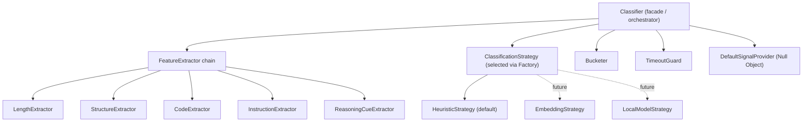
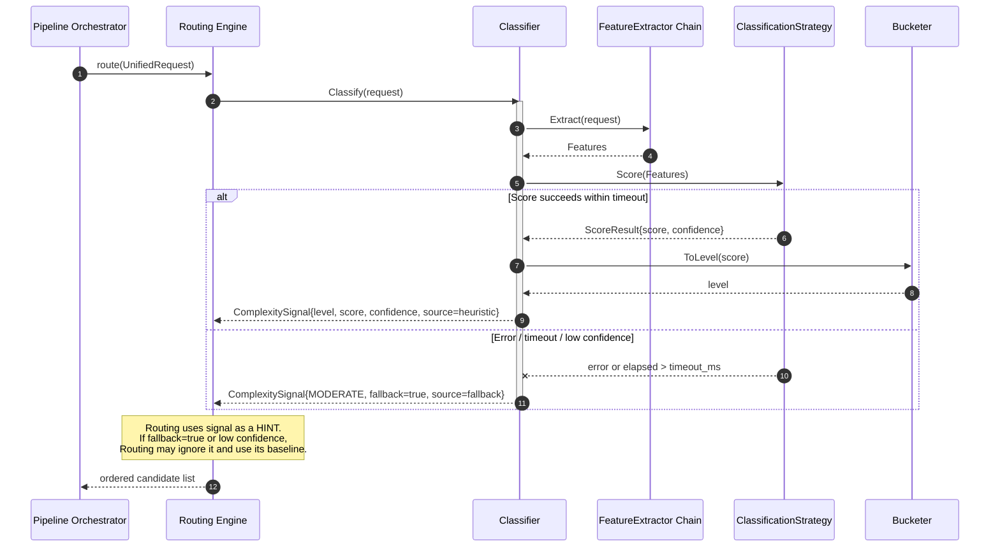
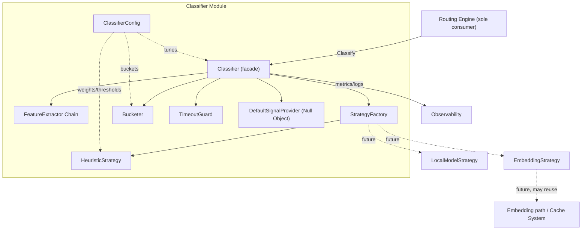

# ModelMesh — Component Design: Prompt Complexity Classifier

**Status:** Draft (pre-implementation)
**Document type:** Low-Level Design
**Last updated:** 2026-07-16
**Module:** 8 of 9
**Related:**
- [Product Requirements Document](../PRD.md)
- [High-Level Architecture](../02-architecture/High-Level-Architecture.md)
- [Request Lifecycle](../02-architecture/Request-Lifecycle.md)
- Consumer: [Routing Engine](./02-routing-engine.md)
- Siblings: [Provider Layer](./01-provider-layer.md) · [Cache System](./03-cache-system.md) · [Circuit Breaker](./04-circuit-breaker.md) · [Observability](./05-observability.md) · [Load Balancer](./06-load-balancer.md) · [Budget Engine](./07-budget-engine.md) · [Shadow Traffic](./09-shadow-traffic.md)

---

## 1. Purpose

The Prompt Complexity Classifier assigns each incoming request a **complexity signal** — a discrete level (`SIMPLE` / `MODERATE` / `COMPLEX`) plus a numeric score and confidence — that the [Routing Engine](./02-routing-engine.md) may use as **one optional input** when selecting a provider/model.

The intent is economic and latency-driven: trivial prompts ("summarize this sentence") should not be routed to the most expensive frontier model, while genuinely hard prompts (multi-step reasoning, long code generation) should be. The classifier makes that distinction cheaply, *before* routing, without ever contacting a provider.

Two constraints define the entire design:

1. **It sits on the hot path**, immediately before routing on every non-cached request (see [Request Lifecycle §3, Stage ③](../02-architecture/Request-Lifecycle.md)). It must therefore be *cheap* — single-digit-millisecond budget — or it is not worth having.
2. **It is strictly advisory and fail-safe.** The classifier is an optimization, not a gate. If it errors, times out, or is disabled, routing proceeds with a documented **default (`MODERATE`) signal**. A misclassification degrades cost-efficiency, never correctness — the routed model still answers the prompt.

## 2. Responsibilities

**In scope:**
- Extract cheap, deterministic features from a `UnifiedRequest`.
- Produce a normalized complexity **score** and map it to a discrete **level** via configured thresholds.
- Attach a **confidence** and a **source** tag (which strategy produced the signal, or `fallback`).
- Enforce a hard latency budget and return the fail-safe default on timeout/error/low-confidence.
- Emit metrics and structured logs for every classification.

**Explicitly NOT responsible for:**
- Choosing a provider or model — that is the [Routing Engine](./02-routing-engine.md)'s job; the classifier only supplies a hint.
- Rejecting, rewriting, or moderating prompts.
- Any network or provider call. (A future embedding strategy MAY call an embedding service — see §12/§14 — but the default heuristic strategy is purely local.)
- Persisting state or learning online.

## 3. Public Interfaces

The module exposes a single narrow entry point to the pipeline; the rest are internal seams behind interfaces.

| Operation | Input | Output | Semantics |
|---|---|---|---|
| `Classify` | `UnifiedRequest` | `ComplexitySignal` | Total function. **Never throws.** Returns a valid signal under all conditions; returns the fail-safe default (`level=MODERATE`, `fallback=true`) on any internal error or timeout. Bounded by `timeout_ms`. |
| `ClassificationStrategy.Score` | `Features` | `ScoreResult{score, confidence}` | Pure, deterministic for the default heuristic. May be non-deterministic/remote for future strategies. Allowed to fail; failure is caught by `Classify`. |
| `FeatureExtractor.Extract` | `UnifiedRequest` | `Features` | Pure and cheap. Must not allocate unboundedly on large prompts (operates on bounded prefixes — see §6). |
| `Bucketer.ToLevel` | `score`, `Buckets` | `ComplexityLevel` | Pure mapping from a normalized score to a discrete level. |

Pseudo-signatures (contracts only, no bodies):

```text
Classifier.Classify(UnifiedRequest) -> ComplexitySignal
ClassificationStrategy.Score(Features) -> ScoreResult
FeatureExtractor.Extract(UnifiedRequest) -> Features
Bucketer.ToLevel(score: float, Buckets) -> ComplexityLevel
```

**Consumer contract with Routing.** The Routing Engine calls `Classify` and treats the result as a hint. It MUST behave correctly when `signal.fallback == true` or when the classifier is disabled entirely (signal absent) — see [Routing Engine](./02-routing-engine.md). The classifier guarantees it will *always* hand back a well-formed `ComplexitySignal`; Routing decides how much weight to give it (including ignoring low-confidence or fallback signals).

## 4. Internal Components



- **Classifier** — thin facade the pipeline calls. Owns the flow: extract → score → bucket → assemble signal, wrapped by the timeout guard and fail-safe.
- **FeatureExtractor chain** — an ordered set of small, independent extractors (Chain pattern) each contributing to a shared `Features` record. Adding a feature = adding an extractor, no change to callers.
- **ClassificationStrategy** — pluggable scoring method chosen by config via a Factory. `HeuristicStrategy` ships first; `EmbeddingStrategy`/`LocalModelStrategy` are future implementations of the same interface.
- **Bucketer** — maps normalized score → level using configured thresholds.
- **TimeoutGuard** — enforces the latency budget; on breach it abandons the in-flight work and yields the default.
- **DefaultSignalProvider** — Null Object producing the canonical fail-safe signal, so every failure path returns the *same* well-formed object.

## 5. Data Structures

### `Features`
| Field | Type | Description | Notes |
|---|---|---|---|
| `char_length` | int | Character count of the effective prompt | Computed over a bounded prefix (`max_scan_chars`) |
| `token_estimate` | int | Cheap token approximation | Heuristic (e.g. chars/4); NOT a real tokenizer call |
| `message_count` | int | Number of messages/turns in the request | From `UnifiedRequest` |
| `has_code` | bool | Code fences / code-like structure detected | Fenced blocks, common code punctuation density |
| `structural_markers` | int | Count of lists, numbered steps, headings, tables | Signals structured multi-part asks |
| `instruction_count` | int | Approximate number of distinct instructions/asks | Imperatives, "and then", enumerations |
| `reasoning_cues` | int | Count of reasoning/analysis keywords | e.g. "explain why", "prove", "step by step", "compare", "derive" |
| `question_count` | int | Number of question marks / interrogatives | Cheap proxy for multi-question prompts |
| `max_word_length` | int | Longest token length (proxy for technical/dense text) | Optional weak signal |

### `ComplexitySignal`
| Field | Type | Description | Notes |
|---|---|---|---|
| `level` | enum `{SIMPLE, MODERATE, COMPLEX}` | Discrete complexity bucket | The primary output Routing reads |
| `score` | float `[0.0, 1.0]` | Normalized continuous complexity | Enables future finer-grained routing |
| `confidence` | float `[0.0, 1.0]` | How trustworthy the signal is | Low confidence ⇒ Routing may ignore it |
| `source` | enum `{heuristic, embedding, local_model, fallback}` | Strategy that produced it | `fallback` ⇒ default was used |
| `fallback` | bool | True if the fail-safe default was returned | Routing MUST tolerate this |
| `computed_in_ms` | float | Wall time spent classifying | For metrics/telemetry only |

### `ScoreResult`
| Field | Type | Description | Notes |
|---|---|---|---|
| `score` | float `[0.0, 1.0]` | Raw normalized score from the strategy | Pre-bucketing |
| `confidence` | float `[0.0, 1.0]` | Strategy-reported confidence | Heuristic derives this from feature agreement (§6) |

### `ClassifierConfig` (see §8)
| Field | Type | Description | Notes |
|---|---|---|---|
| `enabled` | bool | Master switch | Disabled ⇒ Routing gets no signal / default |
| `strategy` | enum | Active strategy | `heuristic` initially |
| `buckets` | `Buckets` | Thresholds for score→level | Two cut points |
| `weights` | map<feature, float> | Heuristic feature weights | Tunable without redeploy |
| `timeout_ms` | int | Hard latency budget | Breach ⇒ fallback |
| `default_level` | enum | Fail-safe level | `MODERATE` |
| `min_confidence` | float | Below this ⇒ treated as fallback | Routing may also apply its own threshold |

## 6. Algorithms

**A. Feature extraction (bounded).** Each extractor in the chain scans at most `max_scan_chars` of the prompt (a configured prefix) so cost is O(bounded), independent of a pathologically large prompt. Extractors are independent and side-effect-free; they populate a shared `Features` record. Token estimate is a division-based approximation — deliberately *not* a real tokenizer, which would be too costly here (the [Provider Layer](./01-provider-layer.md) owns exact token accounting).

**B. Heuristic scoring.** The default strategy computes a weighted, normalized combination:

```text
raw   = Σ  w_f · normalize_f(feature_f)      for f in features
score = clamp(raw, 0.0, 1.0)
```

Each feature is individually normalized to `[0,1]` (e.g. length saturates via a soft cap so a 50k-char prompt doesn't dominate). Weights come from config, so tuning requires no code change. The combination is intentionally **linear and transparent** — every routing decision it influences can be explained by inspecting feature contributions.

**C. Confidence estimation.** Confidence reflects *feature agreement*, not model probability: when features point consistently in one direction (all high, or all low) confidence is high; when signals conflict (short prompt but heavy reasoning cues and code) confidence is lower. Concretely, confidence falls as the score sits near a bucket boundary and as feature variance rises. Signals with `confidence < min_confidence` are surfaced as low-confidence so Routing can discount them.

**D. Bucketing.** Two configured cut points map score → level:

```text
score <  t_low            -> SIMPLE
t_low <= score < t_high   -> MODERATE
score >= t_high           -> COMPLEX
```

**E. Latency budget & timeout.** The whole pipeline runs under `timeout_ms`. If extraction+scoring exceeds it (only realistically possible for future remote strategies), the TimeoutGuard abandons and returns the default. For the local heuristic the budget is effectively never hit; the guard exists so the *interface contract* holds uniformly across future strategies.

**F. Fail-safe resolution.** Any exception, timeout, or `confidence < min_confidence` collapses to `DefaultSignalProvider` → `{level: default_level, score: 0.5, confidence: 0.0, source: fallback, fallback: true}`.

## 7. State Management

The classifier is **stateless per request** and holds **no durable state**. All tunables live in `ClassifierConfig`, loaded once and hot-reloadable (see §8). There is no learning, no counters, no cross-request memory in the default design.

**Optional memoization (off by default):** because classification is a pure function of the prompt for the heuristic strategy, results MAY be memoized keyed by the same exact-match key the [Cache System](./03-cache-system.md) computes. This is a micro-optimization only — given the sub-millisecond heuristic cost it is rarely worthwhile, and it is explicitly *not* required. Any future embedding strategy would benefit more and could reuse the L2/L3 infrastructure. Memoization, if enabled, is best-effort and never a correctness dependency.

## 8. Configuration

| Key | Type | Default | Description |
|---|---|---|---|
| `classifier.enabled` | bool | `true` | Master switch; `false` ⇒ Routing receives no signal and uses its own default |
| `classifier.strategy` | enum(`heuristic`,`embedding`,`local_model`) | `heuristic` | Active scoring strategy (Factory selects the impl) |
| `classifier.timeout_ms` | int | `5` | Hard latency budget before fail-safe |
| `classifier.default_level` | enum | `MODERATE` | Level returned on any fallback |
| `classifier.min_confidence` | float | `0.35` | Below ⇒ signal marked fallback/low-confidence |
| `classifier.buckets.t_low` | float | `0.33` | SIMPLE/MODERATE cut point |
| `classifier.buckets.t_high` | float | `0.66` | MODERATE/COMPLEX cut point |
| `classifier.max_scan_chars` | int | `8000` | Prefix length each extractor scans |
| `classifier.weights.*` | float | per-feature | Heuristic feature weights, tunable live |
| `classifier.memoize` | bool | `false` | Enable optional exact-key memoization |

All keys are hot-reloadable; a bad config (e.g. `t_low > t_high`) fails validation at load and the module falls back to built-in safe defaults rather than starting mis-tuned.

## 9. Failure Handling

The controlling principle: **the classifier can degrade its own quality but can never degrade the request.**

| Failure | Behavior |
|---|---|
| Extractor throws | Caught; that feature defaulted; classification continues |
| Strategy throws | Caught → `DefaultSignalProvider` (fallback signal) |
| Timeout (`timeout_ms`) | Abandon → fallback signal |
| Low confidence (`< min_confidence`) | Return signal with `fallback=true`, low confidence; Routing discounts it |
| Module disabled | No call, or immediate default; Routing uses its own baseline |
| Invalid config | Rejected at load; safe built-in defaults used |
| Downstream (Routing) ignores signal | Acceptable by contract — signal is always advisory |

`Classify` is a **total function**: there is no input or internal state for which it fails to return a well-formed `ComplexitySignal`. This is the single most important property of the module and is enforced by wrapping the entire body in the fail-safe and returning the Null Object default on every error edge.

## 10. Logging

Structured events (fields flattened into the log record; correlated by `request_id` from the pipeline):

| Event | Level | Fields |
|---|---|---|
| `classifier.classified` | DEBUG | `request_id`, `level`, `score`, `confidence`, `source`, `computed_in_ms` |
| `classifier.fallback` | WARN | `request_id`, `reason` (`timeout`\|`error`\|`low_confidence`\|`disabled`), `computed_in_ms` |
| `classifier.timeout` | WARN | `request_id`, `timeout_ms`, `elapsed_ms`, `strategy` |
| `classifier.config_reloaded` | INFO | `strategy`, `t_low`, `t_high`, `enabled` |
| `classifier.config_rejected` | ERROR | `reason`, `offending_key` |

Normal classifications log at DEBUG to avoid hot-path log volume; only anomalies (fallbacks, timeouts) escalate to WARN so they are visible without sampling.

## 11. Metrics

Reuses `classifier_latency_seconds` from the [Request Lifecycle metrics catalog](../02-architecture/Request-Lifecycle.md); adds:

| Metric | Type | Labels | Description |
|---|---|---|---|
| `classifier_latency_seconds` | histogram | `strategy` | Time to produce a signal (hot-path budget tracking) |
| `classifier_classifications_total` | counter | `bucket`, `source` | Count of signals by level and producing strategy |
| `classifier_fallback_total` | counter | `reason` | Fallback occurrences by cause (`timeout`/`error`/`low_confidence`/`disabled`) |
| `classifier_confidence` | histogram | `bucket` | Distribution of confidence, per level |
| `classifier_score` | histogram | — | Distribution of normalized scores (detects drift / bad thresholds) |
| `classifier_timeouts_total` | counter | `strategy` | Timeout budget breaches |

Operationally, a rising `classifier_fallback_total{reason="timeout"}` or a bimodal `classifier_score` clustered on a bucket boundary are the signals that thresholds/weights or the strategy need tuning.

## 12. Extension Points

- **Pluggable strategies** — `ClassificationStrategy` behind a Factory. `EmbeddingStrategy` (cosine distance to labeled centroids, possibly reusing the [Cache System](./03-cache-system.md)'s embedding path) and `LocalModelStrategy` (a small local classifier) slot in without touching the Classifier facade or Routing.
- **Additional feature extractors** — append to the Chain; new features flow into scoring via config weights.
- **Learned / calibrated thresholds** — `buckets` and `weights` can be fitted offline from labeled data and shipped as config; the module stays code-stable.
- **Feedback loop** — outcomes from [Shadow Traffic](./09-shadow-traffic.md) and served-request evaluation can score classification quality (did COMPLEX prompts actually need the strong model?) and drive recalibration.
- **Per-route / per-tenant tuning** — future: scoped config overrides (out of current single-tenant scope per [PRD](../PRD.md) non-goals).
- **Confidence calibration** — replace the heuristic agreement measure with a calibrated probability once labeled data exists.

## 13. Tradeoffs

- **Heuristic first vs. model/embedding first.** The default is a transparent linear heuristic. It is fast (sub-ms, hot-path-safe), cheap (no network, no tokens), deterministic, and *explainable* — every routing hint can be traced to feature contributions. A model/embedding classifier would be more accurate on ambiguous prompts but adds latency, cost, and a network failure mode on the critical path — a poor trade for a signal that is only advisory. We start heuristic and keep the seam open (§12).
- **Number of buckets.** Three (`SIMPLE/MODERATE/COMPLEX`) balances routing usefulness against tuning burden and misclassification blast radius. More buckets = finer routing but more boundary noise and harder threshold tuning. The continuous `score` is retained so finer routing is possible later without an interface change.
- **Latency budget vs accuracy.** A tight `timeout_ms` guarantees the classifier never becomes a bottleneck, at the cost of foreclosing expensive strategies unless they fit the budget — an intentional constraint, not an oversight.
- **Misclassification impact is bounded.** Because Routing uses the signal only as a hint (and can discount low-confidence/fallback signals), a wrong level costs efficiency (wrong-tier model) but never correctness — the prompt is still answered. This is what licenses the aggressive fail-safe posture.
- **Bounded scanning vs completeness.** Scanning only a prefix (`max_scan_chars`) caps cost but can under-read very long prompts; length itself already pushes such prompts toward higher complexity, so the practical error is small and conservative (tends toward COMPLEX, the safe direction).

## 14. Future Improvements

- Ship an `EmbeddingStrategy` that reuses ModelMesh's embedding path and classifies via distance to labeled complexity centroids.
- Offline-fit weights/thresholds from labeled traffic; add automated calibration.
- Close the feedback loop with [Shadow Traffic](./09-shadow-traffic.md): compare routed-model necessity against classified level and auto-suggest threshold adjustments.
- Add a small, quantized local model strategy for higher accuracy while staying off the network.
- Emit per-feature contribution breakdowns in traces for explainability dashboards.
- Confidence recalibration to a true probability once labeled ground truth exists.

## 15. Sequence Diagram

Interaction with the Routing Engine on the hot path (non-cached request). The classifier always returns; Routing decides how to use the signal.



## 16. Component Diagram



## 17. Design Patterns Used

| Pattern | Where | Why |
|---|---|---|
| **Strategy** | `ClassificationStrategy` (heuristic / embedding / local model) | Swap the scoring method without touching the facade or the consumer contract |
| **Factory** | `StrategyFactory` selects the strategy from config | Construction decoupled from use; config-driven selection |
| **Chain of Responsibility** | `FeatureExtractor` chain | Independent, composable extractors; add features without changing callers |
| **Null Object** | `DefaultSignalProvider` | Every failure path returns the *same* valid default signal, keeping `Classify` total |
| **Facade** | `Classifier` | Presents one `Classify` operation over extract→score→bucket→guard internals |

## 18. Why This Design Was Chosen

The classifier is an **optimization on a critical path**, and that framing drives every decision:

1. **Total, fail-safe function.** Because it is advisory, the correct failure mode is to degrade *itself*, never the request. Modeling `Classify` as a total function with a Null Object default means Routing never needs defensive branching beyond "is this a fallback signal?" — the contract is trivially safe.
2. **Cheap and transparent before clever.** Starting with a linear heuristic buys hot-path safety, zero cost, determinism, and explainability. Since the signal is only a hint, the accuracy ceiling of a heuristic is acceptable, and we avoid putting a network dependency in front of routing. The Strategy seam ensures we can upgrade accuracy later without re-architecting.
3. **Config over code.** Weights, thresholds, and the active strategy are all configuration. Tuning the system's cost/latency behavior — the whole point of the module — must not require a deploy.
4. **Bounded, predictable cost.** Prefix-bounded extraction and a hard timeout guarantee the module's cost is independent of adversarial input, which is essential for something that runs on every non-cached request.
5. **Clean single-consumer coupling.** The module has exactly one consumer (Routing) and a one-way, advisory relationship with it. Keeping that boundary narrow (`Classify -> ComplexitySignal`) makes the module independently testable and independently replaceable, consistent with the handbook's module-independence goal.

This yields a component that meaningfully improves cost/latency routing when it works, costs almost nothing, and is provably incapable of harming request success when it doesn't.
