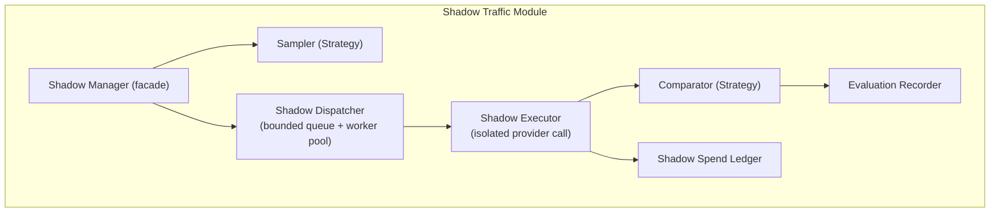
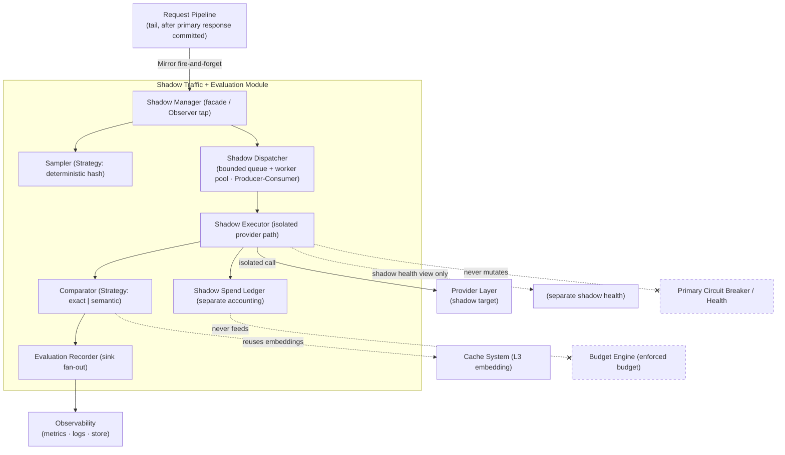

# ModelMesh — Component Design: Shadow Traffic + Evaluation

**Status:** Draft (pre-implementation)
**Document type:** Low-Level Design
**Last updated:** 2026-07-16
**Module:** 9 of 9
**Related:**
- [Product Requirements Document](../PRD.md)
- [High-Level Architecture](../02-architecture/High-Level-Architecture.md)
- [Request Lifecycle](../02-architecture/Request-Lifecycle.md)
- Siblings: [Provider Layer](./01-provider-layer.md) · [Routing Engine](./02-routing-engine.md) · [Cache System](./03-cache-system.md) · [Circuit Breaker](./04-circuit-breaker.md) · [Observability](./05-observability.md) · [Load Balancer](./06-load-balancer.md) · [Budget Engine](./07-budget-engine.md) · [Prompt Complexity Classifier](./08-complexity-classifier.md)

---

## 1. Purpose

The Shadow Traffic + Evaluation module mirrors a configurable fraction of live production requests to an **alternative** provider/model (the *shadow target*) **out of band**, so ModelMesh can measure how a candidate routing decision would have performed against real traffic **without changing the response the caller receives**.

This is the safest mechanism in the system for validating a change before it becomes a live routing decision. When an operator is considering "should we route complexity-tier-2 prompts to Provider B instead of Provider A?", the module answers it with evidence drawn from actual requests — latency, cost, and response divergence — while the caller continues to be served exclusively by the primary path.

The module is governed by two non-negotiable invariants:

1. **Zero caller impact.** The primary response is fully determined and returned *before* the shadow path is even invoked. Nothing the shadow path does — success, failure, timeout, or saturation — can alter, delay, or fail the caller's response.
2. **Zero enforced-budget impact.** Shadow calls cost real money, but that spend is accounted **separately** and never decrements the enforced budget that gates live traffic (see [Budget Engine](./07-budget-engine.md)).

Everything else in this design is downstream of those two invariants.

---

## 2. Responsibilities

**In scope:**

- Decide, per request, whether it should be shadowed (sampling).
- Snapshot the minimum request state required to replay the call against the shadow target.
- Execute the shadow call asynchronously, isolated from the primary request path, under bounded concurrency and its own timeout.
- Compare the shadow outcome against the primary outcome (latency, cost, response divergence).
- Record evaluation results to metrics, logs, and an optional evaluation sink for offline analysis.
- Shed load by dropping shadow work — never queuing unboundedly, never blocking — when saturated.

**Explicitly out of scope:**

- Serving or influencing the caller's response (that is the [Request Lifecycle](../02-architecture/Request-Lifecycle.md) primary path).
- Automatic promotion of a shadow route to primary (see [§14 Future Improvements](#14-future-improvements)).
- Enforcing budget (owned by [Budget Engine](./07-budget-engine.md)); this module only *records* shadow spend.
- Mutating primary provider health or circuit state (owned by [Circuit Breaker](./04-circuit-breaker.md)).

---

## 3. Public Interfaces

The module presents a single narrow entry point to the pipeline (`ShadowManager.Mirror`) plus internal strategy contracts that make the sampler and comparator swappable.

| Operation | Input | Output | Semantics |
|---|---|---|---|
| `ShadowManager.Mirror` | `request` (unified request), `primaryResult` (unified response + metadata), `primaryChoice` (provider/model that served the caller) | `void` — **returns immediately** | Non-blocking. Applies sampling; if selected, enqueues a `ShadowJob`. Never throws into the caller; all errors are contained. If disabled, sampling is negative, or the queue is full, it returns silently after recording the appropriate metric. |
| `Sampler.ShouldSample` | `request`, `primaryChoice` | `bool` | Pure, deterministic decision (see [§6](#6-algorithms)). No side effects except a sampling metric. |
| `ShadowDispatcher.Submit` | `ShadowJob` | `bool` (accepted / dropped) | Attempts to hand the job to the worker pool. Returns `false` immediately if the bounded queue is full (drop policy). Never blocks the caller. |
| `Comparator.Compare` | `primaryOutcome`, `shadowOutcome` | `ComparisonRecord` | Computes divergence/cost/latency deltas. Strategy-selected (exact vs semantic). |
| `Evaluator.Record` | `primary`, `shadow`, `comparison` | `void` | Persists the evaluation to the configured sink(s): metrics always, structured log optionally, evaluation store optionally. Best-effort. |

Pseudo-signatures (contracts, not code):

```text
ShadowManager.Mirror(request, primaryResult, primaryChoice) -> void   (async, fire-and-forget)
Sampler.ShouldSample(request, primaryChoice)               -> bool    (deterministic, pure)
ShadowDispatcher.Submit(job)                               -> bool    (non-blocking; false = dropped)
Comparator.Compare(primaryOutcome, shadowOutcome)          -> ComparisonRecord
Evaluator.Record(primaryOutcome, shadowOutcome, comparison)-> void    (best-effort)
```

**Contract note:** `Mirror` is the *only* surface the request pipeline touches, and it is invoked from the pipeline tail **after** the caller's response has been committed. The pipeline treats it as a fire-and-forget observer tap — it does not await it, inspect its result, or handle exceptions from it.

---

## 4. Internal Components

| Component | Role |
|---|---|
| **Shadow Manager** | Facade and entry point. Reads config, invokes the Sampler, builds a `ShadowJob` snapshot, and hands it to the Dispatcher. Owns the "return immediately" guarantee. |
| **Sampler** (Strategy) | Decides whether a given request is shadowed. Default is a deterministic percentage sampler; pluggable (see [§12](#12-extension-points)). |
| **Shadow Dispatcher** | Bounded worker pool + bounded queue (producer/consumer). Executes shadow calls off the hot path, applies the shadow timeout, enforces `max_concurrency`, and drops on saturation. |
| **Shadow Executor** | Per-job unit that invokes the [Provider Layer](./01-provider-layer.md) against the shadow target. Uses an **isolated** provider-call path so it cannot touch primary circuit/health state. |
| **Comparator** (Strategy) | Computes the `ComparisonRecord`. `exact` (hash/string equality) or `semantic` (embedding similarity, reusing the [Cache System](./03-cache-system.md) embedding capability). |
| **Evaluation Recorder** | Fan-out sink writer: emits metrics, optional structured logs, and optional durable evaluation records. |
| **Shadow Spend Ledger** | Accumulates shadow cost **separately** from the enforced budget; exposes it only as observability. |



---

## 5. Data Structures

### `ShadowConfig`

| Field | Type | Description | Notes |
|---|---|---|---|
| `enabled` | bool | Master switch | If false, `Mirror` is a no-op after one cheap metric increment |
| `sample_rate` | float (0.0–1.0) | Fraction of eligible requests to shadow | 0.05 = 5% |
| `shadow_target` | `{provider, model}` | Alternative route being evaluated | Must be a registered provider/model |
| `max_concurrency` | int | Max in-flight shadow calls | Backpressure bound |
| `queue_capacity` | int | Max buffered `ShadowJob`s | Overflow → drop |
| `timeout` | duration | Per-shadow-call deadline | Independent of primary timeout |
| `comparator` | enum(`exact`,`semantic`) | Comparison strategy | Default `semantic` |
| `divergence_threshold` | float | Similarity below which a divergence is flagged | Semantic only |
| `record_sink` | enum(`metrics`,`log`,`store`) set | Where evaluation records go | Metrics always on |
| `snapshot_payload` | enum(`full`,`hashed`,`none`) | How much request/response body to retain | Memory vs fidelity tradeoff |

### `ShadowJob` (transient)

| Field | Type | Description | Notes |
|---|---|---|---|
| `request_id` | string | Correlates to the primary request | For log/trace joining |
| `request_snapshot` | RequestSnapshot | Minimal request state to replay | Size governed by `snapshot_payload` |
| `primary_ref` | PrimaryOutcome | Primary result reference for comparison | May be hashed, not full text |
| `shadow_target` | `{provider, model}` | Where to send the shadow call | Copied from config at enqueue time |
| `enqueued_at` | timestamp | For queue-wait and staleness measurement | |

### `ShadowOutcome`

| Field | Type | Description | Notes |
|---|---|---|---|
| `response` | UnifiedResponse? | Shadow response, if any | Absent on error/timeout |
| `latency` | duration | Shadow call wall time | |
| `cost` | money | Computed shadow cost | Goes to Shadow Spend Ledger only |
| `error` | ErrorInfo? | Failure detail | Contained; never propagated |
| `dropped` | bool | Job shed before execution | Mutually exclusive with response |

### `ComparisonRecord`

| Field | Type | Description | Notes |
|---|---|---|---|
| `similarity` | float (0–1) | Response similarity | 1.0 = identical (exact); embedding cosine (semantic) |
| `diverged` | bool | `similarity < divergence_threshold` | |
| `cost_delta` | money | shadow_cost − primary_cost | Signed |
| `latency_delta` | duration | shadow_latency − primary_latency | Signed |
| `outcome_class` | enum | `match` / `divergent` / `shadow_error` / `dropped` | Drives metrics labels |

---

## 6. Algorithms

### 6.1 Sampling decision (deterministic by default)

Randomness on the hot path is avoided; the default sampler is **deterministic** so that sampling is reproducible, evenly distributed, and free of any per-call RNG dependency:

```text
h = stable_hash(request_id)          # uniform 64-bit
threshold = floor(sample_rate * H_MAX)
ShouldSample = (h mod H_MAX) < threshold
```

Properties:
- **Deterministic:** the same `request_id` always yields the same decision — reproducible for debugging and safe to recompute across instances.
- **Uniform:** a good hash gives an even ~`sample_rate` selection without a global counter or shared state.
- **Stateless:** no coordination between gateway instances; each decides independently but consistently.

An optional **counter-based** sampler (every Nth request per instance) is available for exact-rate needs in low-volume tests; it carries local state and is documented as a secondary strategy.

### 6.2 Async dispatch with bounded concurrency and drop policy

```text
on Mirror(request, primaryResult, primaryChoice):
    if not enabled: metric(shadow_skipped, reason=disabled); return
    if not Sampler.ShouldSample(...): metric(shadow_sampled=false); return
    job = build_snapshot(request, primaryResult, primaryChoice)   # bounded by snapshot_payload
    accepted = ShadowDispatcher.Submit(job)                        # non-blocking
    if not accepted: metric(shadow_dropped, reason=queue_full); return
    # returns to caller immediately here

worker loop (x max_concurrency):
    job = queue.take()
    outcome = execute_with_timeout(job, timeout)   # isolated provider path
    ledger.add(outcome.cost)                        # separate accounting
    cmp = Comparator.Compare(job.primary_ref, outcome)
    Evaluator.Record(job.primary_ref, outcome, cmp)
```

**Backpressure = drop, never block.** The queue is bounded (`queue_capacity`); `Submit` returns `false` immediately when full. Dropping is the correct load-shedding behavior: shadow data is statistical, so losing a fraction under load costs nothing, while blocking would violate the zero-caller-impact invariant (even though `Mirror` is off the caller's response path, unbounded queue growth would threaten process memory).

### 6.3 Response comparison

- **Exact:** normalize (whitespace/casing) then hash-compare; `similarity ∈ {0,1}`. Cheap, brittle to benign wording differences.
- **Semantic:** embed both responses (reusing the L3 embedding capability from the [Cache System](./03-cache-system.md)) and compute cosine similarity; `diverged = similarity < divergence_threshold`. More expensive, tolerant of paraphrase — the default because LLM outputs are rarely byte-identical.

Comparison runs **only inside the worker**, never inline on the primary path.

### 6.4 Path isolation

Shadow execution uses a dedicated provider-call path with its **own** client pool and timeout budget so shadow load cannot exhaust resources reserved for primary traffic, and so shadow outcomes are routed to a **separate** health view rather than the primary [Circuit Breaker](./04-circuit-breaker.md).

---

## 7. State Management

- **Hot path:** stateless. `Mirror` computes a decision and either enqueues or returns; it holds no durable per-request state.
- **Shadow jobs:** transient — they live only in the bounded in-memory queue and the worker that processes them. A job that is never processed (dropped, or lost on process shutdown) is acceptable; shadow data is best-effort by design.
- **Evaluation records:** the only potentially durable state. Written to the configured sinks (metrics always; optional log; optional evaluation store) for later analysis. Loss of a record degrades statistical confidence but nothing else.
- **Shadow spend:** accumulated in the **Shadow Spend Ledger**, which is **strictly separate** from the enforced budget counters in the [Budget Engine](./07-budget-engine.md). Shadow spend is observability, not an enforcement input. This is a hard boundary: no code path lets shadow cost decrement live budget.
- **Health isolation:** shadow provider outcomes feed a *separate shadow health view* (or are simply recorded), and must never mutate primary provider health or circuit state. This prevents a flaky shadow target from ever throttling live traffic.

---

## 8. Configuration

| Key | Type | Default | Description |
|---|---|---|---|
| `shadow.enabled` | bool | `false` | Master on/off. Off by default — shadowing is opt-in because it spends money. |
| `shadow.sample_rate` | float | `0.05` | Fraction (0–1) of eligible requests mirrored. |
| `shadow.target.provider` | string | — | Provider being evaluated. Required when enabled. |
| `shadow.target.model` | string | — | Model being evaluated. Required when enabled. |
| `shadow.max_concurrency` | int | `8` | Max simultaneous shadow calls. |
| `shadow.queue_capacity` | int | `256` | Bounded queue depth; overflow drops. |
| `shadow.timeout` | duration | `10s` | Per-shadow-call deadline. |
| `shadow.comparator` | enum | `semantic` | `exact` or `semantic`. |
| `shadow.divergence_threshold` | float | `0.85` | Similarity floor for `diverged`. |
| `shadow.record_sink` | list | `[metrics]` | Any of `metrics`, `log`, `store`. |
| `shadow.snapshot_payload` | enum | `hashed` | `full` (store bodies), `hashed` (store digests), `none` (deltas only). |

Configuration is validated at load (per [High-Level Architecture](../02-architecture/High-Level-Architecture.md) config flow): if `shadow.enabled` is true, a valid registered `shadow.target` is mandatory, and `sample_rate ∈ [0,1]`. Invalid config fails fast at startup, not mid-request.

---

## 9. Failure Handling

The module is designed for **total failure isolation**. Every failure mode resolves to "the caller is unaffected; record a metric."

| Failure | Behavior | Caller impact |
|---|---|---|
| Shadow disabled / not sampled | `Mirror` returns after a metric increment | None |
| Queue full (overload) | `Submit` returns false → **drop** job, count `shadow_dropped_total{reason="queue_full"}` | None |
| Shadow call error / 5xx / rate-limit | Contained in worker; recorded as `outcome_class=shadow_error` | None |
| Shadow call timeout | Worker abandons at `timeout`; recorded as error | None |
| Comparator failure (e.g. embedding unavailable) | Skip comparison; record raw outcome with `outcome_class=shadow_error` | None |
| Evaluation sink write failure | Log-and-continue; metrics are best-effort | None |
| Process shutdown with jobs in queue | Jobs dropped; no attempt to drain synchronously | None |
| Shadow provider persistently unhealthy | Feeds *shadow* health view only; **never** primary circuit state | None |

Two rules make this robust:
1. **`Mirror` cannot throw into the pipeline.** It is invoked fire-and-forget; any exception is caught at the module boundary.
2. **Bounded everything.** Bounded queue, bounded concurrency, bounded timeout, bounded snapshot size — no shadow resource is unbounded, so shadow work cannot starve the primary path or the process.

---

## 10. Logging

Structured events (fields beyond the standard `request_id`, `timestamp`, `instance_id`):

| Event | Level | Fields |
|---|---|---|
| `shadow.sampled` | debug | `sampled` (bool), `sample_rate`, `shadow_target` |
| `shadow.dropped` | warn | `reason` (`queue_full`/`disabled_target`), `queue_depth` |
| `shadow.dispatched` | debug | `shadow_target`, `queue_wait_ms` |
| `shadow.completed` | info | `latency_ms`, `cost`, `outcome_class` |
| `shadow.error` | warn | `error_kind`, `shadow_target`, `latency_ms` |
| `shadow.divergence` | info | `similarity`, `cost_delta`, `latency_delta`, `diverged` (bool) |

Log volume is governed by `record_sink` and level. Divergences are the operationally interesting signal and are logged at `info` even when the raw completion is at `debug`. No response bodies are logged unless `snapshot_payload=full` *and* the log sink is explicitly enabled, to avoid leaking prompt/response content into logs by default.

---

## 11. Metrics

Prometheus-style. Labels kept low-cardinality (`shadow_target` is a bounded set of configured evaluation routes).

| Metric | Type | Labels | Meaning |
|---|---|---|---|
| `shadow_sampled_total` | counter | `sampled` (`true`/`false`) | Sampling decisions made |
| `shadow_requests_total` | counter | `outcome` (`match`/`divergent`/`shadow_error`/`dropped`), `shadow_target` | Shadow attempts by result class |
| `shadow_dropped_total` | counter | `reason` | Jobs shed (queue full, disabled target) |
| `shadow_latency_seconds` | histogram | `shadow_target` | Shadow call latency distribution |
| `shadow_queue_depth` | gauge | — | Current bounded-queue occupancy |
| `shadow_inflight` | gauge | — | In-flight shadow calls (≤ `max_concurrency`) |
| `shadow_divergence` | histogram | `shadow_target` | Distribution of `1 − similarity` |
| `shadow_cost_delta_usd` | histogram | `shadow_target` | shadow_cost − primary_cost |
| `shadow_latency_delta_seconds` | histogram | `shadow_target` | shadow_latency − primary_latency |
| `shadow_spend_usd_total` | counter | `shadow_target` | **Separate** shadow spend ledger (never budget) |
| `shadow_errors_total` | counter | `error_kind`, `shadow_target` | Shadow call failures |

These feed the [Observability](./05-observability.md) stack and Grafana. The headline evaluation dashboard is `shadow_divergence`, `shadow_cost_delta_usd`, and `shadow_latency_delta_seconds` per `shadow_target` — the three signals an operator needs to judge whether the shadow route is better, cheaper, or faster.

---

## 12. Extension Points

- **Sampler strategy:** swap deterministic-hash for counter-based, attribute-based (e.g. only shadow complexity-tier-N prompts, joining the [Complexity Classifier](./08-complexity-classifier.md)), or cohort-based sampling.
- **Comparator strategy:** add domain-specific scorers (JSON-structural diff, task-specific rubric, LLM-as-judge scorer) alongside `exact`/`semantic`.
- **Multi-arm shadowing:** generalize `shadow_target` to a list, mirroring one request to several candidates for tournament-style evaluation.
- **Record sink:** pluggable evaluation stores (time-series, warehouse table) behind the `Evaluator.Record` contract.
- **Feedback loop:** expose aggregated evaluation results to the [Routing Engine](./02-routing-engine.md) as an input signal (kept read-only in this phase; see below).

---

## 13. Tradeoffs

| Decision | Alternative | Why chosen | Cost accepted |
|---|---|---|---|
| **Fire-and-forget async** | Inline/synchronous shadowing | Guarantees zero caller latency/impact | Some shadow jobs are dropped under load; evaluation is statistical, not complete |
| **Drop on saturation** | Unbounded queue / block | Protects process memory and the primary path | Lost samples during spikes — acceptable for statistical evaluation |
| **Deterministic sampler** | Random sampling | Reproducible, stateless, no RNG dependency | Selection is pseudo-random per `request_id`, not cryptographically unpredictable (irrelevant here) |
| **Semantic comparison default** | Exact-match | LLM outputs are rarely byte-identical; semantic captures real divergence | Embedding cost + dependency on the embedding capability |
| **Separate shadow budget ledger** | Count against enforced budget | Shadow must never throttle or block live traffic | Operators must watch a second cost line for shadow spend |
| **Isolated shadow health view** | Feed primary circuit state | A flaky evaluation target must not throttle production | Shadow gets no automatic circuit protection on the primary path |
| **`hashed` snapshot default** | Store full bodies | Bounds memory, avoids logging sensitive content | Lower comparison fidelity than `full` |
| **Opt-in (`enabled=false` default)** | On by default | Shadowing spends real money; must be a deliberate choice | No evaluation until explicitly turned on |

**The dominant tradeoff is sample rate vs cost.** Every shadowed request is a *real, billed* provider call that produces a response the caller never sees. A 100% sample rate doubles provider spend. `sample_rate` is therefore the primary cost lever, defaulted low (5%) and always paired with the separate `shadow_spend_usd_total` meter so the cost of evaluation is never hidden.

---

## 14. Future Improvements

- **A/B and canary evaluation:** promote shadowing into a controlled experiment framework with cohorts and statistical significance testing.
- **Automatic route promotion:** close the loop so a shadow target that wins consistently (better divergence-adjusted cost/latency) is *proposed* — and eventually auto-promoted — to primary routing, gated by guardrails. Deliberately deferred; auto-promotion changes live behavior and needs safety rails.
- **Multi-arm / tournament shadowing:** evaluate several candidates per request simultaneously.
- **Offline replay harness:** persist request snapshots and replay historical traffic against a new candidate without touching live traffic at all.
- **Scored evaluation harness:** integrate task-specific quality scoring (LLM-as-judge, rubric scoring) beyond similarity.
- **Classifier/routing feedback loop:** feed per-complexity-tier shadow results back to the [Routing Engine](./02-routing-engine.md) and [Complexity Classifier](./08-complexity-classifier.md) as routing hints.

---

## 15. Sequence Diagram

The `par` block is the heart of this design: the shadow branch runs **out of band** and the caller's response has already returned before it does anything meaningful.

```mermaid
sequenceDiagram
    autonumber
    participant C as Caller
    participant PIPE as Request Pipeline
    participant P1 as Primary Provider
    participant SM as Shadow Manager
    participant SMP as Sampler
    participant DSP as Dispatcher (pool)
    participant P2 as Shadow Provider
    participant EV as Evaluator/Recorder

    C->>PIPE: request
    PIPE->>P1: primary call (guarded, budgeted)
    P1-->>PIPE: primary response
    PIPE->>SM: Mirror(request, primaryResult, primaryChoice)
    SM->>SMP: ShouldSample(request)
    SMP-->>SM: true
    SM->>DSP: Submit(ShadowJob)  [non-blocking]
    SM-->>PIPE: return immediately (void)
    PIPE-->>C: primary response ✅ (caller done)

    par Out of band — no effect on caller
        DSP->>P2: shadow call (isolated path, own timeout)
        P2-->>DSP: shadow outcome (or error/timeout)
        DSP->>EV: Compare + Record (divergence, cost Δ, latency Δ)
        EV->>EV: emit metrics / log / store; add to shadow ledger
    end

    Note over SM,DSP: If not sampled OR queue full →<br/>Mirror returns after a metric, no shadow call
    Note over P2,EV: Shadow error, timeout, or drop is invisible to the caller<br/>and never touches primary budget or health.
```

---

## 16. Component Diagram



The two dashed "never" edges are load-bearing architectural constraints, not decoration: shadow spend never reaches the enforced budget, and shadow execution never mutates primary circuit/health state.

---

## 17. Design Patterns Used

| Pattern | Where | Why |
|---|---|---|
| **Observer** | `ShadowManager.Mirror` taps the primary result at the pipeline tail | The pipeline emits the primary outcome; the shadow module observes it without the pipeline depending on or awaiting the module |
| **Producer–Consumer** | Dispatcher's bounded queue + worker pool | Decouples the (fast) enqueue on the hot path from the (slow) shadow provider calls, with backpressure via drop |
| **Strategy** | `Sampler` and `Comparator` | Sampling policy and divergence scoring are swappable without touching the manager or dispatcher |
| **Decorator** | The module wraps the pipeline *tail* — augmenting behavior (evaluation) without altering the primary response | Adds evaluation capability transparently around the completed request |
| **Facade** | `Shadow Manager` presents one `Mirror` operation over sampler/dispatcher/executor/recorder | The pipeline needs exactly one, un-scary entry point |
| **Bulkhead** (isolation) | Separate client pool, queue, concurrency limit, and health view for shadow work | Contains shadow faults so they cannot spill into the primary path |

---

## 18. Why This Design Was Chosen

**The problem is asymmetric, so the design is asymmetric.** Evaluating a routing change against production traffic is enormously valuable, but the downside of getting it wrong — degrading or delaying live responses — is unacceptable. The entire design therefore optimizes for *containment* over *completeness*: it is acceptable to lose shadow data, but never acceptable to touch the caller.

Concretely:

- **Fire-and-forget after the primary response** is the only way to guarantee zero caller latency and zero caller-visible failure. Any synchronous or awaited coupling would put shadow faults on the critical path, so it is prohibited by construction (the pipeline never awaits `Mirror`).
- **Bounded, drop-on-overload dispatch** is chosen because shadow evaluation is *statistical*. Losing a fraction of samples during a spike costs a little confidence; blocking or growing memory unboundedly costs reliability. For statistical data, shedding is strictly the right call.
- **Deterministic sampling** gives reproducible, coordination-free selection across a horizontally scaled fleet — important because ModelMesh instances are stateless and must each decide consistently without shared RNG or counters.
- **Separate budget and health accounting** are hard boundaries, not conveniences: they are what let an operator point shadow traffic at a brand-new, possibly-flaky, possibly-expensive provider with confidence that doing so cannot throttle production or blow the enforced budget.
- **Semantic comparison by default** matches the reality that LLM outputs vary in wording; exact comparison would report noise as divergence.

The result is a module that an operator can enable in production to answer "would this route be better?" with real evidence, while knowing — structurally, not just by convention — that turning it on can do no harm to the traffic it is measuring. That safety-by-construction is exactly what makes shadow traffic the preferred evaluation mechanism over live experiments in the [Request Lifecycle](../02-architecture/Request-Lifecycle.md).
