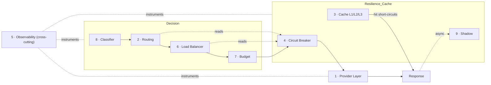

# ModelMesh — Architecture Handbook (Component Designs)

**Status:** Draft (pre-implementation)
**Document type:** Low-Level Design — Index
**Last updated:** 2026-07-16
**Related:** [PRD](../PRD.md) · [High-Level Architecture](../02-architecture/High-Level-Architecture.md) · [Request Lifecycle](../02-architecture/Request-Lifecycle.md)

---

## 0. What This Is

This directory is the **architecture handbook** for ModelMesh: one independent low-level design (LLD) per major module. Each document is written **before implementation** and is meant to guide the corresponding build phase. Together they form the authoritative reference for how every module is structured, what contracts it exposes, and why it was designed the way it is.

Read the [PRD](../PRD.md), [High-Level Architecture](../02-architecture/High-Level-Architecture.md), and [Request Lifecycle](../02-architecture/Request-Lifecycle.md) first — they establish scope, layering, and the end-to-end request path that these modules plug into.

---

## 1. Module Index

| # | Module | Phase | Design Doc | Core pattern(s) |
|---|--------|-------|-----------|-----------------|
| 1 | Provider Layer | 1 | [01-provider-layer.md](./01-provider-layer.md) | Adapter, Factory, Facade |
| 2 | Routing Engine | 2 | [02-routing-engine.md](./02-routing-engine.md) | Strategy, Chain of Responsibility, Factory |
| 3 | Cache System (L1/L2/L3) | 3 | [03-cache-system.md](./03-cache-system.md) | Facade, Repository, Strategy, Decorator |
| 4 | Circuit Breaker + Health | 4 | [04-circuit-breaker.md](./04-circuit-breaker.md) | Circuit Breaker, State, Observer, Strategy |
| 5 | Observability | 5 | [05-observability.md](./05-observability.md) | Decorator, Facade, Observer, Strategy |
| 6 | Load Balancer | 6 | [06-load-balancer.md](./06-load-balancer.md) | Strategy, Factory, Observer |
| 7 | Budget Engine | 7 | [07-budget-engine.md](./07-budget-engine.md) | Strategy, Repository, Facade |
| 8 | Prompt Complexity Classifier | 8 | [08-prompt-complexity-classifier.md](./08-prompt-complexity-classifier.md) | Strategy, Factory, Null Object |
| 9 | Shadow Traffic + Evaluation | 9 | [09-shadow-traffic.md](./09-shadow-traffic.md) | Observer, Producer-Consumer, Strategy |

Every document follows the same 18-section structure: Purpose · Responsibilities · Public Interfaces · Internal Components · Data Structures · Algorithms · State Management · Configuration · Failure Handling · Logging · Metrics · Extension Points · Tradeoffs · Future Improvements · Sequence Diagram · Component Diagram · Design Patterns Used · Why This Design Was Chosen.

---

## 2. How the Modules Fit the Request Path

The modules are ordered stages in the pipeline described in [Request Lifecycle](../02-architecture/Request-Lifecycle.md). Observability cross-cuts all of them.

---

## 3. Shared Contracts Between Modules

These are the seams where modules meet. They are defined in one owning module and consumed read-only by others — keep them stable, and change them deliberately across the docs that reference them.

| Contract | Owned by | Consumed by | Meaning |
|----------|----------|-------------|---------|
| **UnifiedRequest / UnifiedResponse / Usage / ProviderError** | Provider Layer (`provider/contract`) | Everyone | The single normalized request/response/error/usage model. The caller never sees provider-native shapes. |
| **HealthView** | Circuit Breaker | Routing Engine, Load Balancer | Read-only snapshot of per-provider circuit/health state. Drives candidate filtering and target skipping. |
| **ComplexitySignal** | Classifier | Routing Engine | Optional complexity hint (level/score/confidence). Fail-safe: routing tolerates its absence. |
| **Cost estimate / actual (Cost Model)** | Budget Engine | Budget pre-authorize & commit; Observability (cost metrics) | Token-usage → cost, using the configured pricing table. |
| **Candidate list** | Routing Engine | Orchestrator, Load Balancer | Ordered `[{provider, model}]`; enables orchestrator-driven fallback and per-candidate target selection. |
| **CacheKey (includes routed model)** | Cache System | — | Exact-match key over normalized messages/params **plus the routed model** (routing runs before cache). |

Boundary reminders that appear across several docs:
- **Routing vs Load Balancer:** Routing chooses *which provider+model* (semantic). Load Balancer chooses *which concrete target/endpoint/key* among equivalents (distribution). See [02](./02-routing-engine.md) and [06](./06-load-balancer.md).
- **Provider Layer vs Circuit Breaker:** the Provider Layer *executes and normalizes* a call; it does not decide the provider (Routing) and does not guard the call (Circuit Breaker).
- **Budget pre-authorize vs commit:** budget authorizes with an *estimate* before dispatch and *commits actual spend only after a successful provider call* — a cache hit commits nothing. See [07](./07-budget-engine.md).

---

## 4. Consistent System-Wide Rules

Applied identically across all nine modules (see [Request Lifecycle §9](../02-architecture/Request-Lifecycle.md)):

1. **Fail-safe optional stages.** Classifier, L3 semantic cache, Shadow, and telemetry errors degrade to "skip / miss / drop" — never a request failure.
2. **Only three caller-facing failures:** validation error, budget rejection, or all provider candidates exhausted.
3. **Stateless hot path, shared cold state in Redis:** L2/L3 cache, health/circuit state, and budget counters are authoritative in Redis; L1 and per-instance load counters are local.
4. **Instrumentation is inline,** part of each stage's contract — every branch emits telemetry.
5. **Config over code:** weights, thresholds, TTLs, budgets, sampling, and pricing are configuration.

### One intentional divergence — store-outage defaults

When their shared Redis state is unavailable, two modules deliberately default in **opposite** directions, and this is by design, not an inconsistency:

| Module | Default on store outage | Rationale |
|--------|------------------------|-----------|
| **Circuit Breaker** | **fail-open** (allow calls) | The breaker is a *protection* layer. Losing visibility into health should not itself block all traffic; degrade to "let calls through and observe them locally." |
| **Budget Engine** | **fail-closed** (reject) | The budget engine is a *spend guard*. Losing the counter must not permit unbounded overspend; protecting credits is its entire purpose. |

Both defaults are configurable; the defaults encode each module's reason for existing.

---

## 5. Traceability

Each module maps 1:1 to a build phase (PRD §Implementation Phases, Architecture §17). Implementing a phase means implementing the module whose LLD is linked above; the LLD's Public Interfaces, Data Structures, and Configuration sections are the contract that phase must satisfy, and its Metrics section defines what the phase must expose to Observability.

## 6. Change Discipline

- A change to a **shared contract** (§3) must be reflected in the owning doc *and* every consuming doc in the same change.
- New behavior belongs in a module's **Extension Points**, not as a new module — the nine modules are the whole system by scope ([PRD Non-Goals](../PRD.md)).
- Keep metric names aligned with the [Observability catalog](./05-observability.md) and [Request Lifecycle catalog](../02-architecture/Request-Lifecycle.md); they are a shared namespace.
