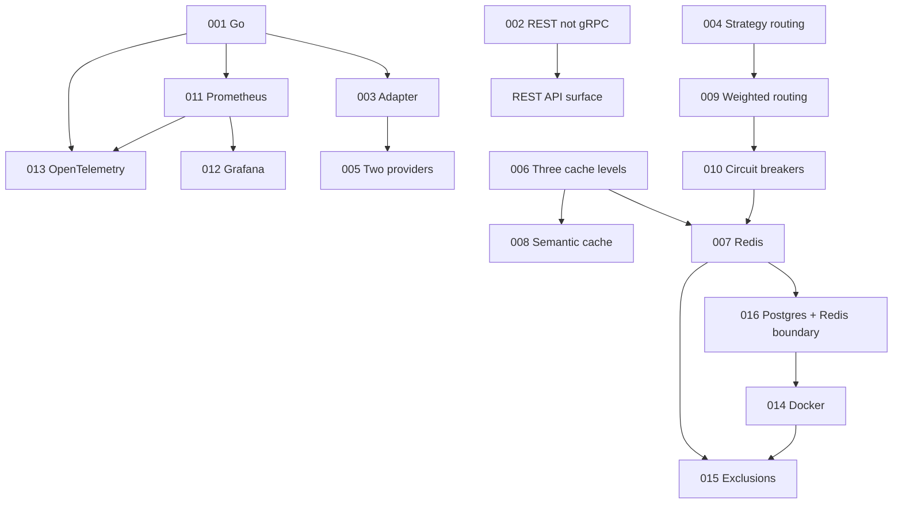

# ModelMesh — Architecture Decision Records

**Status:** Accepted (pre-implementation baseline)
**Document type:** Architecture Decision Records (ADRs)
**Last updated:** 2026-07-16
**Owner:** Engineering
**Related:** [PRD](../PRD.md) · [High-Level Architecture](../02-architecture/High-Level-Architecture.md) · [Request Lifecycle](../02-architecture/Request-Lifecycle.md) · [Component Handbook](../03-components/README.md) · [REST API](../04-api/REST-API.md)

---

## 0. About This Document

This document records **why** each load-bearing technical decision for ModelMesh was made. An ADR captures a decision at a point in time: the forces that shaped it, the options weighed, and the consequences accepted. ADRs are **immutable once accepted** — a later reversal is a *new* ADR that supersedes an old one, not an edit. This keeps the reasoning history honest.

Each ADR follows a fixed structure: **Context · Problem · Alternatives Considered · Pros · Cons · Final Decision · Consequences.** No implementation detail appears here — these are decisions, not designs.

### Status lifecycle
`Proposed → Accepted → (Superseded | Deprecated)`. All ADRs below are **Accepted** as the pre-implementation baseline.

### Index

| ADR | Title | Status |
|-----|-------|--------|
| [001](#adr-001--why-go) | Why Go | Accepted |
| [002](#adr-002--why-rest-instead-of-grpc) | Why REST instead of gRPC | Accepted |
| [003](#adr-003--why-the-adapter-pattern-for-providers) | Why the Adapter pattern for providers | Accepted |
| [004](#adr-004--why-the-strategy-pattern-for-routing) | Why the Strategy pattern for routing | Accepted |
| [005](#adr-005--why-only-two-providers) | Why only two providers | Accepted |
| [006](#adr-006--why-three-cache-levels) | Why three cache levels | Accepted |
| [007](#adr-007--why-redis) | Why Redis | Accepted |
| [008](#adr-008--why-semantic-caching) | Why semantic caching | Accepted |
| [009](#adr-009--why-weighted-routing) | Why weighted routing | Accepted |
| [010](#adr-010--why-circuit-breakers) | Why circuit breakers | Accepted |
| [011](#adr-011--why-prometheus) | Why Prometheus | Accepted |
| [012](#adr-012--why-grafana) | Why Grafana | Accepted |
| [013](#adr-013--why-opentelemetry) | Why OpenTelemetry | Accepted |
| [014](#adr-014--why-docker) | Why Docker | Accepted |
| [015](#adr-015--why-we-intentionally-exclude-kubernetes-oauth-rbac-multi-tenancy-sdk-generation-and-an-admin-panel) | Why we intentionally exclude enterprise modules | Accepted |
| [016](#adr-016--why-postgresql-alongside-redis-and-the-state-boundary) | Why PostgreSQL alongside Redis (state boundary) | Accepted |

---

## ADR-001 — Why Go

**Context.** ModelMesh is a network-bound gateway that fans out to external LLM providers, holds many concurrent in-flight requests, and must keep per-request overhead low relative to provider latency. It must expose Prometheus metrics and OpenTelemetry traces and ship as a small container.

**Problem.** Which implementation language best fits a high-concurrency, I/O-bound infrastructure service that also needs to *read* as an infrastructure team's internal tool?

**Alternatives Considered.**
- **Python** — richest LLM/ML ecosystem; but the GIL and higher per-request overhead make high-concurrency gateways awkward, and it reads less like systems infrastructure.
- **Rust** — best raw performance and safety; but slower to build in and heavier cognitive load for a portfolio scoped to architecture, not micro-optimization.
- **Node/TypeScript** — strong async I/O; but weaker fit for CPU-adjacent work and less idiomatic in the cloud-infra space this project imitates.
- **Java/Kotlin** — mature and concurrent; but heavier runtime/footprint and more ceremony than the project warrants.

**Pros (Go).**
- Goroutines + channels model per-request concurrency and fan-out naturally, which is the core shape of this gateway.
- Small, fast, statically-linked binaries → tiny Docker images and trivial deployment.
- First-class, mature Prometheus and OpenTelemetry libraries.
- The lingua franca of cloud infrastructure (Kubernetes, Docker, Envoy, Prometheus) — reinforces the "internal infra tool" framing.
- Simple, readable, low-magic code that reviewers can follow quickly.

**Cons.**
- Thinner LLM/embedding ecosystem than Python (mitigated: providers are HTTP APIs; embeddings can be called out to).
- More verbose error handling and generics ergonomics than some alternatives.

**Final Decision.** Implement ModelMesh in **Go**.

**Consequences.** Concurrency primitives shape the orchestrator and provider fan-out design. Provider adapters wrap HTTP clients. The build produces a single static binary per the [deployment architecture](../02-architecture/High-Level-Architecture.md). Any embedding computation for [semantic cache](#adr-008--why-semantic-caching) is an external call rather than in-process ML.

---

## ADR-002 — Why REST instead of gRPC

**Context.** Applications must talk to ModelMesh over a stable, unified API ([REST API spec](../04-api/REST-API.md)). Internally, the pipeline runs in-process and synchronously ([architecture](../02-architecture/High-Level-Architecture.md)).

**Problem.** What transport should the *public* API use, given callers are ordinary application services expecting to swap a provider SDK for ModelMesh with minimal friction?

**Alternatives Considered.**
- **gRPC** — efficient binary transport, streaming, codegen clients; but requires proto tooling on every client, is awkward from browsers/curl, and gRPC is explicitly a [PRD non-goal](../PRD.md).
- **GraphQL** — flexible querying; but wrong shape for an action-oriented completion API and adds a schema/runtime layer with no payoff here.
- **REST/JSON over HTTP** — ubiquitous, inspectable, zero client tooling, mirrors the provider APIs it replaces.

**Pros (REST/JSON).**
- Drop-in familiarity — migrating from an OpenAI/Anthropic SDK to ModelMesh is a base-URL and schema change, not a tooling change.
- Trivially testable with curl/Postman; demo-friendly for a portfolio.
- Naturally cacheable and observable at the HTTP layer; SSE covers streaming without gRPC.

**Cons.**
- Larger wire payloads than protobuf and no built-in contract enforcement (mitigated by the [OpenAPI spec](../04-api/REST-API.md#11-openapi-skeleton-excerpt)).
- Bidirectional streaming is clunkier than gRPC (acceptable — only server-push streaming is needed, handled via SSE).

**Final Decision.** Expose a **REST/JSON API over HTTP**, with SSE for streaming. gRPC stays out of scope.

**Consequences.** The API contract is the OpenAPI-described REST surface. No proto toolchain enters the build. Internal calls remain in-process function calls (not RPC), keeping latency low; if the system were ever split into services, that would be a new ADR.

---

## ADR-003 — Why the Adapter pattern for providers

**Context.** ModelMesh must present one unified request/response model while calling providers (OpenAI, Anthropic) that differ in schemas, error semantics, and pricing ([Provider Layer](../03-components/01-provider-layer.md)).

**Problem.** How do we isolate provider-specific differences so the rest of the system — routing, cache, budget, breaker — never depends on any provider's shape?

**Alternatives Considered.**
- **Direct per-provider branching** in call sites — `if provider == openai …`. Spreads provider knowledge everywhere; adding a provider touches many files.
- **A shared "fat" client** trying to be all providers — becomes a tangle of conditionals and lowest-common-denominator leakage.
- **Adapter per provider** behind one contract — each adapter translates unified ⇄ native and normalizes errors/usage.

**Pros (Adapter).**
- Provider knowledge is confined to one adapter; the rest of the system sees only the unified model.
- Adding a provider = add an adapter + registry/config entry, nothing else ([extension point](../03-components/01-provider-layer.md)).
- Enables clean testing with mock adapters (essential given provider cost limits).

**Cons.**
- Some feature loss at the unified boundary (provider-specific extras must be normalized or dropped).
- Ongoing maintenance as provider APIs drift.

**Final Decision.** Use the **Adapter pattern**: a common `Provider` contract with one adapter per provider, resolved by a registry ([Factory](../03-components/01-provider-layer.md)).

**Consequences.** The unified request/response/error model becomes the system's backbone; all other modules depend on it, not on providers. Provider count becomes a configuration/scope decision (see [ADR-005](#adr-005--why-only-two-providers)) rather than an architectural one.

---

## ADR-004 — Why the Strategy pattern for routing

**Context.** The [Routing Engine](../03-components/02-routing-engine.md) must select provider/model per request, and the *selection algorithm* itself is expected to evolve (weighted → complexity-aware → cost/latency-optimized).

**Problem.** How do we make the routing algorithm swappable and testable without rewriting the engine each time the policy changes?

**Alternatives Considered.**
- **Hardcoded routing logic** — simplest now, but every policy change edits core code and risks regressions.
- **Rules engine / DSL** — very flexible; but heavyweight and over-engineered for the scope.
- **Strategy pattern** — the engine holds a pluggable `RoutingStrategy`; algorithms are interchangeable implementations selected by config.

**Pros (Strategy).**
- New strategies (cost-optimized, adaptive) drop in without touching the engine.
- Each strategy is unit-testable in isolation.
- Config selects the active strategy — a [config-over-code](../02-architecture/High-Level-Architecture.md) win.

**Cons.**
- Slight indirection/abstraction overhead.
- Risk of premature abstraction if only one strategy ever exists (mitigated: the phased roadmap explicitly adds complexity-aware routing).

**Final Decision.** Implement routing as a **Strategy**: pluggable ranking algorithms behind the `Router`, starting with weighted selection.

**Consequences.** The classifier's [ComplexitySignal](../03-components/08-prompt-complexity-classifier.md) plugs in as an input to a strategy rather than a rewrite. The [load balancer](../03-components/06-load-balancer.md) uses the same pattern for target distribution, keeping the codebase consistent.

---

## ADR-005 — Why only two providers

**Context.** ModelMesh is an architecture-first **portfolio** project ([PRD](../PRD.md)) valuing depth over breadth. Real provider calls cost money and consume quota.

**Problem.** How many providers should be integrated to demonstrate the gateway's value without turning the project into an adapter-maintenance treadmill?

**Alternatives Considered.**
- **One provider** — insufficient: routing, failover, and health comparison are meaningless without at least two.
- **Many providers (5+)** — impressive breadth, but adapter upkeep dominates effort and adds no new *architectural* insight; cost/quota multiply.
- **Exactly two (OpenAI + Anthropic)** — the minimum that makes routing, fallback, weighting, and per-provider health genuinely demonstrable.

**Pros (two).**
- Enough to exercise every cross-provider behavior: weighted routing, circuit-breaker fallback, per-provider health, cost comparison.
- Keeps focus and cost bounded; more effort goes into the infrastructure primitives that are the point.
- The [Adapter pattern](#adr-003--why-the-adapter-pattern-for-providers) already proves N-provider extensibility with N=2.

**Cons.**
- Doesn't showcase large-scale provider sprawl (acceptable — that's a maintenance story, not an architecture story).

**Final Decision.** Integrate exactly **two providers, OpenAI and Anthropic**, with the adapter seam making more additive.

**Consequences.** Two is sufficient to validate routing/resilience/cost logic end to end. Adding providers later is a documented [extension point](../03-components/01-provider-layer.md), not a redesign. Test suites lean on mock adapters to avoid real spend.

---

## ADR-006 — Why three cache levels

**Context.** A gateway can avoid substantial provider latency and cost by not recomputing answers it already has. Requests range from exact repeats to semantic paraphrases; instances scale horizontally ([Cache System](../03-components/03-cache-system.md)).

**Problem.** What caching design maximizes hit rate and cost savings while respecting latency, cross-instance sharing, and correctness?

**Alternatives Considered.**
- **Single in-memory cache** — fastest, but per-instance only (no fleet sharing) and exact-match only.
- **Single Redis cache** — fleet-shared, but adds a network hop on every hit and still exact-match only.
- **Exact-only (memory + Redis), no semantic** — misses the large class of near-duplicate prompts.
- **Three tiers (L1 memory, L2 Redis, L3 semantic)** — each covers a distinct win: local speed, fleet sharing, near-duplicate collapse.

**Pros (three levels).**
- L1 serves hot repeats at near-zero latency; L2 shares hits across the fleet; L3 collapses paraphrases that exact caches miss.
- Read-through with upward backfill gives a natural latency/coverage gradient.
- Each level fails safe to a miss, so the stack degrades gracefully.

**Cons.**
- More moving parts and cache-coherence nuance (L1 is deliberately non-coherent).
- L3 introduces a correctness risk (serving a "close" answer) — see [ADR-008](#adr-008--why-semantic-caching).

**Final Decision.** Adopt a **three-level cache: L1 in-memory, L2 Redis, L3 semantic**, presented behind one read-through interface.

**Consequences.** The [cache key includes the routed model](../02-architecture/Request-Lifecycle.md); a cache hit commits no spend. Cache effectiveness becomes a first-class success metric surfaced via [`/v1/cache/stats`](../04-api/REST-API.md#109-get-v1cachestats). Redis becomes load-bearing (see [ADR-007](#adr-007--why-redis)).

---

## ADR-007 — Why Redis

**Context.** Stateless gateway instances must share hot state — L2/L3 cache, provider health/circuit state, and budget counters — so the fleet behaves consistently ([architecture](../02-architecture/High-Level-Architecture.md)).

**Problem.** What backing store provides low-latency, shared, atomically-updatable state for the hot path across instances?

**Alternatives Considered.**
- **In-process only** — no coordination cost, but each instance re-learns health, re-caches, and drifts on budget; fails the consistency requirement.
- **PostgreSQL for hot state** — durable and transactional, but higher latency and write contention make it wrong for per-request cache/counter traffic (Postgres has a role — see [ADR-016](#adr-016--why-postgresql-alongside-redis-and-the-state-boundary)).
- **Dedicated systems per concern** (vector DB + KV + counter service) — better specialized, but multiplies operational surface for a portfolio project.
- **Redis** — fast in-memory store with atomic ops, TTLs, and vector-search capability covering all four hot-state needs.

**Pros (Redis).**
- Sub-millisecond shared reads/writes suitable for the hot path.
- Atomic increments make [budget counters](../03-components/07-budget-engine.md) correct across instances.
- TTL/eviction fit cache semantics; vector search supports the [semantic cache](#adr-008--why-semantic-caching).
- One well-understood dependency covers L2, L3, health, and budget.

**Cons.**
- A shared bottleneck and single point of failure (mitigated at deploy time via replication/clustering — a deployment, not architecture, concern).
- In-memory durability limits (acceptable: hot state is reconstructable; durable records live in Postgres).

**Final Decision.** Use **Redis** as the single shared hot-state store for L2/L3 cache, health/circuit state, and budget counters.

**Consequences.** Redis availability becomes a scaling dependency; every module that touches shared state defines a **fail-safe behavior when Redis is down** (cache → miss, breaker → fail-open, budget → fail-closed). This divergence is deliberate and documented in the [handbook index](../03-components/README.md).

---

## ADR-008 — Why semantic caching

**Context.** Many prompts are not byte-identical repeats but semantic paraphrases of prior prompts. Exact caches (L1/L2) miss all of these, leaving latency and cost on the table ([Cache System](../03-components/03-cache-system.md)).

**Problem.** Can we serve near-duplicate prompts from cache without returning subtly wrong answers?

**Alternatives Considered.**
- **No semantic cache** — safest correctness, but forfeits a large hit-rate opportunity.
- **Aggressive semantic cache as authoritative** — high hit rate, but risks returning a "close enough" answer that is actually wrong (the [PRD's risk R-2](../PRD.md)).
- **Conservative, best-effort semantic cache (L3)** — embedding nearest-neighbor gated by a high similarity threshold, always fail-safe to a miss.

**Pros (conservative L3).**
- Captures paraphrase hits that exact caches cannot.
- Threshold + model/param compatibility check bound the correctness risk.
- Fail-safe: below threshold or on any error, it's a miss — never a wrong-but-confident answer.

**Cons.**
- Embedding computation adds latency and (if externally computed) cost on misses.
- Threshold tuning is a genuine correctness/coverage tradeoff.
- Nondeterministic-output prompts are poor cache candidates.

**Final Decision.** Include a **semantic cache as a best-effort L3**, conservative by default, behind the same read-through interface.

**Consequences.** L3 depends on an embedding mechanism and Redis vector search. Similarity is reported in observability (`semantic_similarity`) and via [`/v1/cache/stats`](../04-api/REST-API.md#109-get-v1cachestats). Callers may disable semantic matching per request (`cache.semantic: false`).

---

## ADR-009 — Why weighted routing

**Context.** With two+ providers/models, ModelMesh must choose which serves each request and in what fallback order ([Routing Engine](../03-components/02-routing-engine.md)).

**Problem.** What routing policy is simple to reason about, demonstrably correct, and extensible toward smarter strategies?

**Alternatives Considered.**
- **Static single primary + failover** — trivial, but wastes the multi-provider setup and can't express distribution.
- **Pure round-robin** — even distribution, but ignores that providers/models differ in cost, quality, and health.
- **ML/bandit-optimized routing** — powerful, but over-engineered for the scope and hard to explain in a portfolio.
- **Configurable weighted selection** — assign weights per provider/model; derive an ordered candidate list; filter by health.

**Pros (weighted).**
- Simple, transparent, and explainable (surfaced via [`/v1/debug/route`](../04-api/REST-API.md#108-post-v1debugroute-router-explanation-debug)).
- Weights are config → behavior changes without redeploys.
- Produces an *ordered* candidate list, which directly enables breaker-driven fallback.
- A clean base that the [Strategy pattern](#adr-004--why-the-strategy-pattern-for-routing) can extend (complexity/cost-aware).

**Cons.**
- Static weights don't self-adapt to real-time performance (a documented future improvement).
- Requires sensible weight configuration to behave well.

**Final Decision.** Start with **configurable weighted routing** producing an ordered, health-filtered candidate list.

**Consequences.** Weighting integrates the [classifier's complexity signal](../03-components/08-prompt-complexity-classifier.md) as an additional input and the [breaker's HealthView](../03-components/04-circuit-breaker.md) as a filter. Adaptive/cost-optimized strategies are additive, not rewrites.

---

## ADR-010 — Why circuit breakers

**Context.** External providers fail, rate-limit, and slow down. Without protection, a degraded provider can exhaust resources in the gateway and cascade into an outage ([reliability goal G-4](../02-architecture/High-Level-Architecture.md)).

**Problem.** How do we contain a failing provider so one provider's incident does not become a gateway-wide failure?

**Alternatives Considered.**
- **Naive retries** — often *worsen* an incident by amplifying load on a struggling provider.
- **Static timeouts only** — bound individual calls but keep hammering a dead provider.
- **Manual disable** — reliable but slow and operator-dependent.
- **Circuit breaker per provider** — automatically stop calling a failing provider (open), probe for recovery (half-open), and restore (closed).

**Pros (circuit breaker).**
- Fast-fails calls to known-bad providers, freeing resources and enabling immediate [fallback](#adr-009--why-weighted-routing).
- Automatic recovery via half-open probing — no operator intervention.
- Health/circuit state shared in Redis converges the whole fleet on the same view.

**Cons.**
- Tuning (thresholds, cooldown, probe concurrency) is non-trivial.
- Shared-state consistency adds complexity; a store outage forces a documented default (**fail-open**, so losing the protector never blocks all traffic).

**Final Decision.** Implement a **per-provider circuit breaker with health monitoring** (closed/open/half-open) backed by shared state.

**Consequences.** Routing and load balancing consume the breaker's [HealthView](../03-components/04-circuit-breaker.md); the pipeline falls back across candidates on open circuits; state is observable via [`/v1/circuit-breakers`](../04-api/REST-API.md#1010-get-v1circuit-breakers). This is the module that makes "only candidate-exhaustion is a caller-facing failure" true.

---

## ADR-011 — Why Prometheus

**Context.** Every request must be measurable — latency, error rate, cache hit ratios, provider health, cost ([Observability](../03-components/05-observability.md)).

**Problem.** What metrics system fits a Go infrastructure service and integrates with the surrounding cloud-native tooling?

**Alternatives Considered.**
- **StatsD/Graphite** — workable, but push-based and less expressive query model.
- **Hosted APM (Datadog, etc.)** — powerful, but proprietary, costly, and overkill for a self-hosted portfolio.
- **Custom logging + ad-hoc aggregation** — no standard query/alerting; reinvents the wheel.
- **Prometheus** — the de-facto cloud-native metrics standard: pull-based scraping, dimensional labels, PromQL.

**Pros (Prometheus).**
- First-class Go client; trivial `/metrics` exposition ([spec](../04-api/REST-API.md#106-get-metrics)).
- Dimensional labels + PromQL express exactly the questions this system asks (per-provider, per-cache-level).
- Pull model suits stateless, horizontally-scaled instances.
- Pairs natively with [Grafana](#adr-012--why-grafana).

**Cons.**
- Not built for high-cardinality labels (mitigated by cardinality discipline in the observability design).
- Long-term storage/HA needs extra components (out of scope here).

**Final Decision.** Use **Prometheus** for metrics via a scraped `/metrics` endpoint.

**Consequences.** A shared metric namespace/catalog is defined once ([Observability](../03-components/05-observability.md)) and reused across modules and the API doc. Label cardinality becomes a design constraint.

---

## ADR-012 — Why Grafana

**Context.** Prometheus stores metrics but does not visualize them; operators and reviewers need dashboards to see system behavior, including under fault injection.

**Problem.** How do we turn metrics into legible, shareable dashboards without building a UI?

**Alternatives Considered.**
- **Build a custom dashboard UI** — full control, but real effort for zero architectural payoff and contradicts the [no-admin-panel non-goal](#adr-015--why-we-intentionally-exclude-kubernetes-oauth-rbac-multi-tenancy-sdk-generation-and-an-admin-panel).
- **Prometheus's built-in expression browser** — fine for ad-hoc queries, poor for curated dashboards.
- **Grafana** — the standard visualization layer for Prometheus, dashboards-as-code.

**Pros (Grafana).**
- Native Prometheus datasource; rich panels for latency percentiles, hit ratios, health, cost.
- Dashboards can be version-controlled and shipped with the repo.
- Instantly recognizable to the infra audience; strong demo value.

**Cons.**
- Another container to run (acceptable via [Docker Compose](#adr-014--why-docker)).
- Dashboard upkeep as metrics evolve.

**Final Decision.** Use **Grafana** for dashboards over the Prometheus datasource.

**Consequences.** The [Observability module](../03-components/05-observability.md) enumerates the intended panels. Grafana is part of the local compose stack, not the gateway binary. It reads metrics only; it is not an admin/control surface.

---

## ADR-013 — Why OpenTelemetry

**Context.** Metrics tell you *what* is happening in aggregate; diagnosing a specific slow or failed request needs a **trace** across pipeline stages (route → cache → breaker → provider) ([Request Lifecycle](../02-architecture/Request-Lifecycle.md)).

**Problem.** How do we get vendor-neutral, end-to-end distributed tracing across the request path?

**Alternatives Considered.**
- **No tracing** — metrics + logs only; hard to reconstruct a single request's journey.
- **Vendor-specific tracing SDK** — locks the project to one backend.
- **OpenTelemetry** — the vendor-neutral standard for traces (and metrics/logs), with a Go SDK and pluggable exporters.

**Pros (OpenTelemetry).**
- Backend-agnostic — export to any OTel-compatible collector/backend.
- Consistent span model across all stages; span names already defined in the lifecycle doc.
- Context propagation ties logs and metrics to `request_id`/`trace_id`.

**Cons.**
- Instrumentation and sampling add some overhead (mitigated by head-based sampling and fail-safe, async export).
- Additional collector component to run.

**Final Decision.** Use **OpenTelemetry** for distributed tracing, exported to a collector.

**Consequences.** Tracing is inline in each stage's contract but fail-safe — telemetry failure never fails a request. Sampling rate is configurable. Traces, metrics, and logs correlate through a shared request id.

---

## ADR-014 — Why Docker

**Context.** ModelMesh comprises a Go service plus Redis, PostgreSQL, Prometheus, Grafana, and an OTel collector. It must be reproducibly runnable locally for development and demos, and it is explicitly **not** targeting Kubernetes ([non-goals](#adr-015--why-we-intentionally-exclude-kubernetes-oauth-rbac-multi-tenancy-sdk-generation-and-an-admin-panel)).

**Problem.** How do we package and run the gateway and its dependencies consistently across machines without heavyweight orchestration?

**Alternatives Considered.**
- **Native/manual setup** — install each dependency by hand; brittle and non-reproducible.
- **Kubernetes/Helm** — production-grade orchestration, but explicitly out of scope and far too heavy for a portfolio's local story.
- **Docker + Docker Compose** — reproducible images and a one-command local stack.

**Pros (Docker).**
- Go's static binary yields a tiny image; the whole stack starts with one Compose command.
- Reproducible, environment-independent runs for reviewers.
- Standard, expected packaging for an infra project.

**Cons.**
- Compose is single-host and not a production orchestrator (accepted — matches scope).
- Image/build hygiene is an ongoing concern.

**Final Decision.** Package the gateway as a **Docker image** and provide a **Docker Compose** stack for the full local environment.

**Consequences.** The [deployment architecture](../02-architecture/High-Level-Architecture.md) targets self-hosted containers. Kubernetes/Helm are named as [future scope](../PRD.md). "Runs with one command" becomes part of the portfolio's success criteria.

---

## ADR-015 — Why we intentionally exclude Kubernetes, OAuth, RBAC, multi-tenancy, SDK generation, and an admin panel

**Context.** The problem space invites endless enterprise features. ModelMesh is a focused, architecture-first portfolio project ([PRD Non-Goals](../PRD.md)) valuing depth in infrastructure primitives over product breadth.

**Problem.** Which capabilities do we deliberately *not* build, and why is exclusion the right engineering choice rather than an omission?

**Alternatives Considered.**
- **Build a broad enterprise feature set** — impressive surface area, but each feature dilutes focus, multiplies scope, and adds little *architectural* signal.
- **Build a thin subset of each** — half-features that demonstrate neither depth nor completeness.
- **Explicitly exclude them, with rationale, and record them as future scope** — keeps the project deep and coherent.

**Pros (deliberate exclusion).**
- Effort concentrates on the primitives that are the point: routing, caching, resilience, observability, cost.
- The system stays legible and defensible in a technical review.
- Each exclusion is a *scoping* decision (recorded here), not a gap.

**Cons.**
- The project doesn't showcase enterprise concerns like tenancy or authz (accepted — these are product/ops stories, and are listed as [future scope](../PRD.md)).

**Final Decision — and the reason for each exclusion:**

| Excluded | Why excluded |
|----------|--------------|
| **Kubernetes/Helm** | Orchestration is a deployment concern; [Docker Compose](#adr-014--why-docker) fully covers the local story. Adds ops complexity, no architectural insight. |
| **OAuth / authentication** | Single-tenant, self-hosted, trusted-network scope; auth would add surface without exercising the gateway's core value ([API is unauthenticated by design](../04-api/REST-API.md)). |
| **RBAC** | No multi-user/role model exists to protect; authorization presupposes tenancy/identity that are out of scope. |
| **Multi-tenancy** | Tenancy isolation is a large product concern orthogonal to the infrastructure primitives being demonstrated; single-tenant keeps state and routing simple. |
| **SDK generation** | The [REST/OpenAPI surface](#adr-002--why-rest-instead-of-grpc) is directly consumable; generated SDKs are packaging, not architecture. |
| **Admin panel** | [Grafana](#adr-012--why-grafana) plus read-only operational endpoints cover visibility; a control UI implies mutation/authz that are out of scope. |

**Consequences.** These boundaries are firm for this project and are treated as new-behavior *extension points*, not silent gaps. Any of them returning would be a **new ADR** superseding this exclusion, with the corresponding scope and dependencies (identity, tenancy, orchestration) made explicit.

---

## ADR-016 — Why PostgreSQL alongside Redis (and the state boundary)

**Context.** The project technology set includes **both Redis and PostgreSQL**. The earlier [architecture](../02-architecture/High-Level-Architecture.md) centralized *hot shared state* in Redis and did not yet name a durable store. Some data — [shadow-traffic evaluation](../03-components/09-shadow-traffic.md) results, a cost/spend ledger for analysis, and request/decision history — is **durable and analytical**, not hot-path state, and outlives any cache TTL.

**Problem.** Where should durable, queryable, historical data live, and how do we avoid overloading Redis (a cache/coordination store) with responsibilities it is wrong for?

**Alternatives Considered.**
- **Redis for everything** — one dependency, but Redis is in-memory and not built for durable, richly-queryable historical records; using it for analytics risks memory pressure and data loss.
- **Postgres for everything (including hot state)** — durable and transactional, but per-request cache/counter traffic would suffer Postgres latency and write contention ([rejected in ADR-007](#adr-007--why-redis)).
- **A split by data temperature** — Redis for hot ephemeral shared state; PostgreSQL for durable analytical records.

**Pros (Redis + Postgres split).**
- Each store does what it is good at: Redis = fast, atomic, TTL'd coordination; Postgres = durable, relational, queryable history.
- Losing Redis degrades gracefully (fail-safe rules); durable records in Postgres are unaffected.
- Enables meaningful offline analysis of shadow evaluations and cost trends without touching the hot path.

**Cons.**
- Two data stores to run and reason about (acceptable; both are in the standard toolkit and the [Compose stack](#adr-014--why-docker)).
- A clear ownership boundary must be maintained to prevent responsibility creep.

**Final Decision.** Use **Redis for hot ephemeral shared state and PostgreSQL for durable analytical records**, with this boundary:

| Data | Store | Rationale |
|------|-------|-----------|
| L2 exact cache, L3 semantic index/vectors | **Redis** | Hot, TTL'd, latency-critical. |
| Provider health / circuit state | **Redis** | Read on every routing decision; must be fast and atomic. |
| Budget spend counters (enforcement) | **Redis** | Atomic increments on the hot path. |
| Shadow-traffic evaluation records | **PostgreSQL** | Durable, queryable, analyzed offline; must survive restarts. |
| Cost/spend ledger (historical analysis) | **PostgreSQL** | Durable audit trail; distinct from the hot enforcement counter in Redis. |
| Request/decision history (optional) | **PostgreSQL** | Durable analytics; never read on the hot path. |

**Consequences.** The hot request path never blocks on Postgres — writes to it (e.g. shadow evaluations, ledger entries) happen **out of band**, consistent with the [stateless-hot-path principle](../02-architecture/High-Level-Architecture.md) and shadow's [fire-and-forget](../03-components/09-shadow-traffic.md) design. This ADR **refines** the earlier "Redis for all shared state" statement: Redis remains the store for *hot shared state specifically*; durable records were always going to need a relational home, and this records that choice explicitly. A future schema/data-model document will define the Postgres tables.

---

## Appendix — Decision Dependency Map

