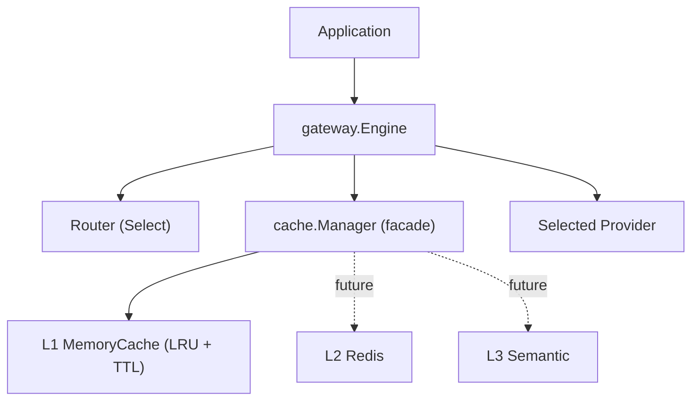

# ModelMesh — Cache Layer (Implementation Guide)

**Status:** Implemented & finalized (Phase 3 complete — L1 memory + L2 Redis + L3 semantic)
**Document type:** Implementation Guide
**Last updated:** 2026-07-16
**Related:** [Cache System LLD](../03-components/03-cache-system.md) · [ADR-006](./Architecture-Decisions.md#adr-006--why-three-cache-levels) · [ADR-007](./Architecture-Decisions.md#adr-007--why-redis)

---

## 1. Cache Architecture

The cache is a composable, multi-level read-through/write-through structure. Part 1
ships the framework and the L1 (in-memory) level; L2 (Redis) and L3 (semantic)
plug into the same `Cache` interface later.

- **`Cache` interface** — `Name/Get/Set/Delete/Exists/Clear`, uniform across levels; values are `[]byte` so every level stores an identical representation.
- **`Manager`** — facade over ordered levels: read-through (first hit wins, backfill faster levels with remaining TTL) + write-through; a level error is logged and treated as a miss (fail-safe). It satisfies `Cache` itself.
- **`MemoryCache` (L1)** — thread-safe bounded LRU with TTL (map + `container/list`).
- **`KeyGenerator`** — SHA-256 over canonical JSON of the semantically-relevant request fields **including the routed model** (routing runs before the cache); non-semantic metadata is excluded so equivalent requests share a key.
- **`gateway.Engine`** — the integration middleware: route → cache lookup → (miss) dispatch + populate. Keeps `cache` and `routing` decoupled.

## 2. Request Flow (gateway)

`Chat(ctx, req)`: **route** (so the key includes the routed model) → build key → **cache Get** → hit? decode and return (`Cached=true`, `CacheLevel`) : **dispatch** to the selected provider → **populate** (best-effort JSON marshal + Set) → return (`Cached=false`). Provider dispatch is the only network work; cache population never fails a served response, and a corrupt cached value degrades to a miss.

## 3. TTL Strategy

- **Per-entry absolute expiry.** `Set(ttl)` computes `ExpiresAt = now + ttl`. A non-positive `ttl` inherits the level's `DefaultTTL`; if that is also zero, the entry never expires.
- **Two-way expiration:** **lazy** (an expired entry found on `Get`/`Exists` is removed and counted as a miss/eviction) + **proactive** (an optional background janitor sweeps on `CleanupInterval`; `Cleanup` is also callable manually). `Close` stops the janitor.
- **TTL preserved on backfill** — when a hit at a slower level backfills faster levels, the entry's *remaining* TTL is used, so faster copies expire together with the source.

## 4. Thread-Safety Strategy

`MemoryCache` uses a **single mutex** guarding the map + LRU list. A `Get` updates
recency (moves the entry to the front) and therefore mutates shared state, so
read/write locks would be unsafe; one mutex keeps it simple and correct. `Stats`
uses atomics (lock-free counters). The janitor is a single goroutine stopped
deterministically by `Close` (via a stop channel + done channel). All exported
operations are safe for concurrent use and verified under `go test -race`.
Per-shard mutexes to reduce contention are a documented future optimization.

## 5. L2 Redis (exact, fleet-shared)

`RedisCache` implements the same `Cache` interface over `go-redis`, storing a JSON
envelope (value + timestamps) with Redis-native `EX` expiry. Namespaced by a key
prefix, so `Clear` scans and deletes only its own keys (never `FLUSHDB`). It
depends on a narrow `RedisClient` interface (client/cluster/fake injectable) and
is unit-tested against **miniredis** (in-process Redis) — no live server. A Redis
error is treated as a miss by the Manager (fail-safe); a corrupt value self-heals.

## 6. L3 Semantic Cache

Pipeline **text → embedding → vector search → similarity → threshold → hit**,
behind a distinct `SemanticCache` interface (`Lookup(text, model)` / `Store`),
since matching is by similarity, not exact key.

- **Embedding abstraction** (`Embedder`): text → vector. Ships a deterministic `HashingEmbedder` for local/tests; a real provider-backed embedder implements the same interface — **not coupled to one model**.
- **Vector store abstraction** (`VectorStore`): `Add/Search/Delete/Clear`. Ships a thread-safe brute-force `MemoryVectorStore` (cosine); an ANN/Redis-vector backend implements the same interface.
- **Similarity + safety:** a match qualifies only if `cosine ≥ threshold` (default 0.92) **and** the stored model matches **and** it is unexpired — a below-threshold/mismatched result is a miss, never a wrong answer.

## 7. Cache Promotion Strategy

Hits promote upward so repeats hit the fastest level: **L2 hit** → backfill L1;
**L3 semantic hit** → promote into all exact levels (L1, L2) under the exact key,
so the next identical request is an exact L1 hit. Promotion is best-effort and
preserves remaining TTL.

## 8. Write Policy

`Store` honors a configurable `WritePolicy` (via `WithWritePolicy`): `DisabledLevels`
skips named levels (e.g. write-around L3) and `Async` populates the cache in the
background (detached context) so the request path is never blocked by cache
writes; in-flight async writes are drained on `Close`. The zero value is
synchronous write-through to every level.

## 9. Analytics

`Manager.Stats()` (`ManagerStats`) reports **hit ratio**, **average lookup time**,
per-source **memory/redis/semantic hit counts and rates**, and **average
similarity** (from L3). **Tokens Saved** and **Estimated Cost Saved** are tracked
at the **gateway** (which decodes cached responses to read `Usage` and applies an
injected `CostEstimator`), since levels store opaque `[]byte`.

## 10. Diagnostics

Pure renderers make cache behavior inspectable: `ExplainHit(entry, found)` names
the layer and, for L3, the similarity that cleared the threshold; `InspectEntry`
shows layer, size, age, TTL, and similarity; `LayerUsed` gives a friendly layer
name. The gateway's `ChatResult` carries `CacheLevel` and `Similarity`.
The `cmd/cachedemo` command demonstrates the full pipeline offline.

## 11. Exported Types Reference

| Symbol | Role |
|--------|------|
| `Cache`, `StatsReporter` | Level contract + optional stats |
| `Manager`, `ManagerStats` | Read-through/write-through facade |
| `MemoryCache` | L1 in-memory LRU+TTL level |
| `Entry` | Cached item (value + TTL metadata) |
| `KeyGenerator`, `SHA256KeyGenerator` | Deterministic keying |
| `Stats`, `StatsSnapshot` | Counters + hit ratio |
| `Config`, `MemoryConfig` | Configuration + validation |
| `gateway.Engine`, `ChatResult` | Router↔cache integration |

Full API docs live in the GoDoc comments on each exported symbol.
