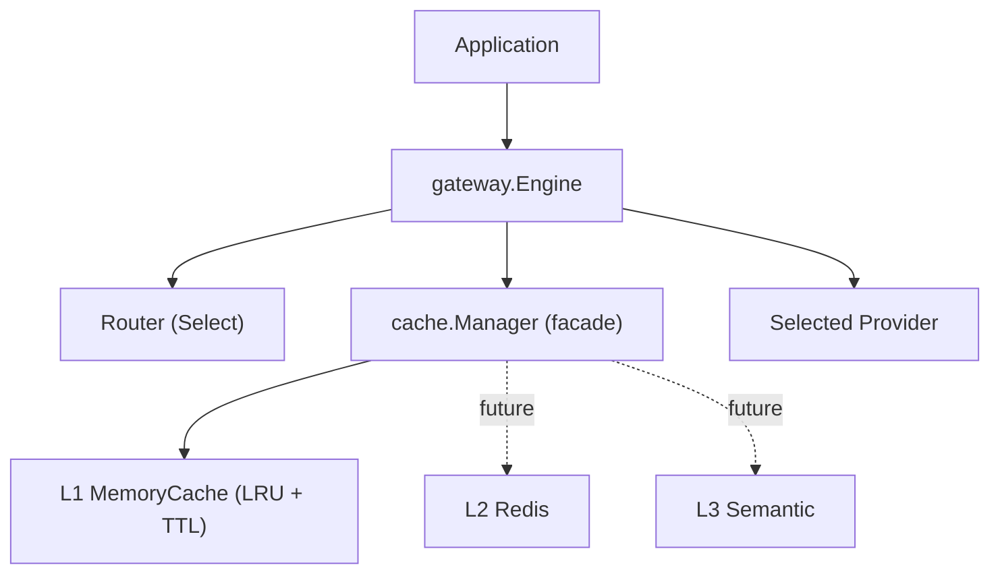

# ModelMesh — Cache Layer (Implementation Guide)

**Status:** Implemented (Phase 3 Part 1 — framework + L1)
**Document type:** Implementation Guide
**Last updated:** 2026-07-16
**Related:** [Cache System LLD](../03-components/03-cache-system.md) · [ADR-006](./Architecture-Decisions.md#adr-006--why-three-cache-levels) · [ADR-007](./Architecture-Decisions.md#adr-007--why-redis)

---

## 1. Cache Architecture

The cache is a composable, multi-level read-through/write-through structure. Part 1
ships the framework and the L1 (in-memory) level; L2 (Redis) and L3 (semantic)
plug into the same `Cache` interface later.

- **`Cache` interface** — `Name/Get/Set/Delete/Exists/Clear`, uniform across levels; values are `[]byte` so every level stores an identical representation.
- **`Manager`** — facade over ordered levels: read-through (first hit wins, backfill faster levels with remaining TTL) + write-through; a level error is logged and treated as a miss (fail-safe). It satisfies `Cache` itself.
- **`MemoryCache` (L1)** — thread-safe bounded LRU with TTL (map + `container/list`).
- **`KeyGenerator`** — SHA-256 over canonical JSON of the semantically-relevant request fields **including the routed model** (routing runs before the cache); non-semantic metadata is excluded so equivalent requests share a key.
- **`gateway.Engine`** — the integration middleware: route → cache lookup → (miss) dispatch + populate. Keeps `cache` and `routing` decoupled.

## 2. Request Flow (gateway)

`Chat(ctx, req)`: **route** (so the key includes the routed model) → build key → **cache Get** → hit? decode and return (`Cached=true`, `CacheLevel`) : **dispatch** to the selected provider → **populate** (best-effort JSON marshal + Set) → return (`Cached=false`). Provider dispatch is the only network work; cache population never fails a served response, and a corrupt cached value degrades to a miss.

## 3. TTL Strategy

- **Per-entry absolute expiry.** `Set(ttl)` computes `ExpiresAt = now + ttl`. A non-positive `ttl` inherits the level's `DefaultTTL`; if that is also zero, the entry never expires.
- **Two-way expiration:** **lazy** (an expired entry found on `Get`/`Exists` is removed and counted as a miss/eviction) + **proactive** (an optional background janitor sweeps on `CleanupInterval`; `Cleanup` is also callable manually). `Close` stops the janitor.
- **TTL preserved on backfill** — when a hit at a slower level backfills faster levels, the entry's *remaining* TTL is used, so faster copies expire together with the source.

## 4. Thread-Safety Strategy

`MemoryCache` uses a **single mutex** guarding the map + LRU list. A `Get` updates
recency (moves the entry to the front) and therefore mutates shared state, so
read/write locks would be unsafe; one mutex keeps it simple and correct. `Stats`
uses atomics (lock-free counters). The janitor is a single goroutine stopped
deterministically by `Close` (via a stop channel + done channel). All exported
operations are safe for concurrent use and verified under `go test -race`.
Per-shard mutexes to reduce contention are a documented future optimization.

## 5. Extension Points (Part 2 and beyond)

- **Add L2 (Redis):** implement `Cache` (Get/Set/Delete/Exists/Clear over Redis, `[]byte` values), add it to the Manager's level list after L1. Read-through, backfill, write-through, and stats work unchanged. Optionally implement `io.Closer` (connection cleanup) and `StatsReporter`.
- **Add L3 (semantic):** implement `Cache` with an embedding-based `Get`; provide a semantic `KeyGenerator` variant or a similarity lookup behind the same interface.
- **Alternative eviction / sharding:** swap the L1 internals behind the `Cache` interface without touching the Manager or gateway.
- **Config:** `cache.Config` grows additively (e.g. a future `Redis` sub-config); `Validate` fails fast.

## 6. Exported Types Reference

| Symbol | Role |
|--------|------|
| `Cache`, `StatsReporter` | Level contract + optional stats |
| `Manager`, `ManagerStats` | Read-through/write-through facade |
| `MemoryCache` | L1 in-memory LRU+TTL level |
| `Entry` | Cached item (value + TTL metadata) |
| `KeyGenerator`, `SHA256KeyGenerator` | Deterministic keying |
| `Stats`, `StatsSnapshot` | Counters + hit ratio |
| `Config`, `MemoryConfig` | Configuration + validation |
| `gateway.Engine`, `ChatResult` | Router↔cache integration |

Full API docs live in the GoDoc comments on each exported symbol.
