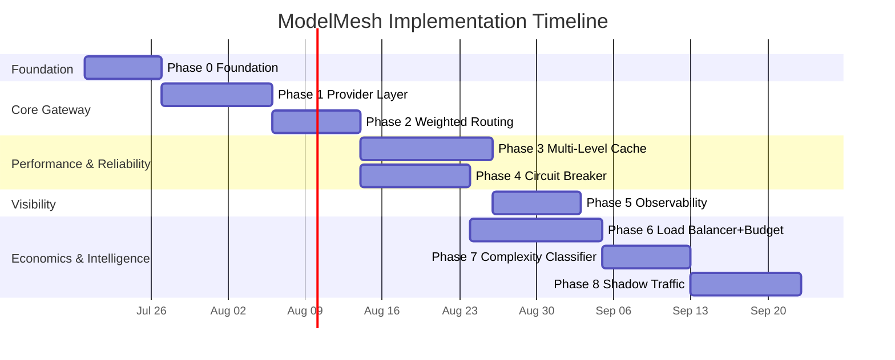
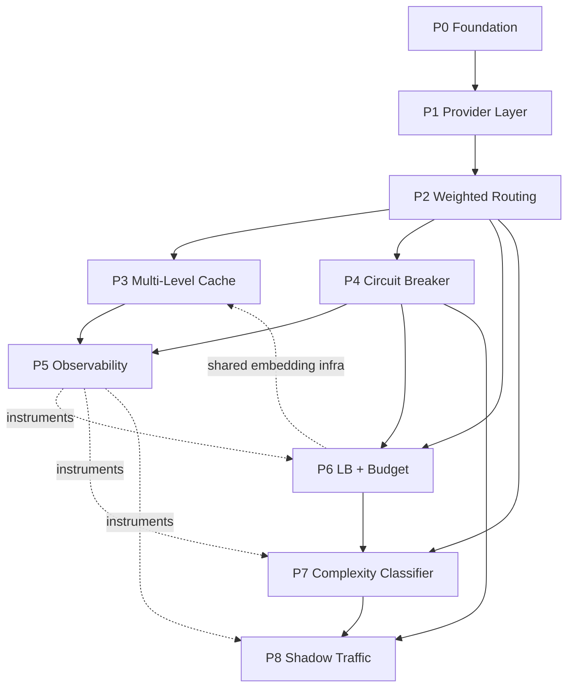

# ModelMesh — Development Roadmap

**Status:** Draft (pre-implementation)
**Document type:** Project Execution Blueprint
**Last updated:** 2026-07-16
**Owner:** Engineering
**Related:** [PRD](../PRD.md) · [High-Level Architecture](../02-architecture/High-Level-Architecture.md) · [Request Lifecycle](../02-architecture/Request-Lifecycle.md) · [Component Handbook](../03-components/README.md) · [REST API](../04-api/REST-API.md) · [ADRs](./Architecture-Decisions.md)

---

## 0. How to Use This Document

This roadmap takes ModelMesh from an **empty repository** to the **completed portfolio project**, one demonstrable phase at a time. It is the authoritative implementation guide: each phase builds a **vertical slice** that runs, is instrumented, and can be demoed before the next phase begins.

Guiding rules for the whole build:

- **Every phase ends in a live demo.** If it can't be shown running, it isn't done.
- **Mock-first.** Provider calls are exercised against mock adapters by default; real OpenAI/Anthropic calls are reserved for targeted verification (cost/quota discipline, per [PRD R-6](../PRD.md)).
- **Instrument as you go.** Observability hooks are added *with* each module, not bolted on in Phase 5 — Phase 5 formalizes dashboards over metrics that already exist.
- **Config over code.** New behavior arrives behind configuration and interfaces defined in the [handbook](../03-components/README.md).
- **The nine modules are the whole system.** No module outside the [handbook](../03-components/README.md) is introduced.

A **Phase 0 (Foundation)** precedes the eight feature phases: the Provider Layer cannot exist without an HTTP surface, the unified request/response contract, configuration, and the container stack. Phases 1–8 then map 1:1 to the project's implementation phases and their headline deliverables.

---

## Phase 0 — Foundation

**Goal.** Stand up an empty-repo-to-running skeleton: an HTTP service that boots, loads config, answers health/metrics, and defines the unified request/response contract — with the full local stack running under Docker Compose.

**Why this phase exists.** Every later phase plugs into a request pipeline, a config system, a telemetry surface, and the unified data model. Building those once, first, prevents rework and gives every subsequent phase a demoable host.

**Architecture changes.** Establishes the [layered skeleton](../02-architecture/High-Level-Architecture.md): Edge (API + middleware), Orchestration (a pass-through pipeline), and Cross-Cutting (config, observability stubs). No decision/provider logic yet.

**New modules introduced.** `api` + `middleware`, `orchestrator` (skeleton), `config`, `observability` (stub: request-id, `/metrics`, `/healthz`, `/readyz`), `provider/contract` (unified models only).

**Folder structure changes** (from [architecture §12](../02-architecture/High-Level-Architecture.md)):
```
modelmesh/
├── cmd/gateway/                 # entrypoint, wiring
├── internal/
│   ├── api/ + api/middleware/    # NEW
│   ├── orchestrator/             # NEW (pass-through)
│   ├── provider/contract/        # NEW (UnifiedRequest/Response/Error/Usage)
│   ├── observability/            # NEW (stub)
│   └── config/                   # NEW (loader + typed views)
├── config/                       # example config + schema
├── deploy/docker-compose.yml     # NEW (gateway only for now)
└── Dockerfile                    # NEW
```

**Implementation milestones.**
1. Repo bootstrap, module layout, lint/CI, Makefile/task runner.
2. Config loader with validation and typed views.
3. HTTP server + middleware (validation shell, request-id, trace context stub).
4. Unified request/response/error/usage models in `provider/contract`.
5. `/healthz`, `/readyz`, `/metrics` (empty registry), `/v1/chat/completions` returning a stub.
6. Dockerfile + Compose; one-command boot.

**Deliverables.** A running container that boots, validates config, and answers health/metrics; the unified contract exists; `POST /v1/chat/completions` returns a stubbed unified response.

**Demo scenario.** `docker compose up` → `curl /healthz` returns ok → `curl /v1/chat/completions` returns a valid (stub) unified response with an `X-ModelMesh-Request-Id` header → `/metrics` scrapes clean.

**Validation checklist.**
- [ ] `docker compose up` starts the gateway with one command.
- [ ] Invalid config fails fast at startup with a clear message.
- [ ] `/healthz` 200, `/readyz` reflects readiness, `/metrics` scrapes.
- [ ] Malformed request → standard `400` [error envelope](../04-api/REST-API.md#5-error-response-format).
- [ ] Every response carries `X-ModelMesh-Request-Id`.

**Exit criteria.** Skeleton service is reproducibly runnable, contract and error/response formats are frozen, telemetry surface exists (even if near-empty).

**Future integration.** Every later phase adds a stage to the orchestrator, a package under `internal/`, config keys, and metrics — all against this foundation.

---

## Phase 1 — Provider Layer

**Goal.** Execute real completions/embeddings through a common provider contract with adapters for OpenAI and Anthropic, selectable by configuration.

**Why this phase exists.** It delivers the project's founding premise: *applications never call a provider directly*. It proves provider independence — the seam every other module relies on.

**Architecture changes.** Adds the Provider Layer (registry + adapters) and wires the orchestrator to dispatch a real call and normalize the result. ([ADR-003](./Architecture-Decisions.md#adr-003--why-the-adapter-pattern-for-providers))

**New modules introduced.** `provider/registry`, `provider/adapters/openai`, `provider/adapters/anthropic`, plus a `mock` adapter for testing.

**Folder structure changes.**
```
internal/provider/
├── contract/            # (from Phase 0)
├── registry/            # NEW
└── adapters/
    ├── openai/          # NEW
    ├── anthropic/       # NEW
    └── mock/            # NEW
```

**Implementation milestones.**
1. Provider contract finalized (`Complete`, capability descriptors, `Resolve`).
2. Registry builds from config; resolves `{provider, model}` → adapter.
3. OpenAI adapter: translate unified ⇄ native, extract usage, normalize errors.
4. Anthropic adapter: same contract.
5. Mock adapter (scriptable latency/errors) for tests and demos.
6. `/v1/chat/completions` and `/v1/embeddings` served end to end; `X-ModelMesh-Provider/Model` headers.

**Deliverables.** **Switch providers without changing application code** — the same request served by OpenAI or Anthropic purely via config.

**Demo scenario.** Send an identical `curl /v1/chat/completions` twice; between runs flip the configured provider. The response body is unified and unchanged in shape; only `X-ModelMesh-Provider` differs. Repeat for `/v1/embeddings`.

**Validation checklist.**
- [ ] Same request, two providers, identical response *shape*; header reveals which served it.
- [ ] Provider-native errors surface as the normalized [error taxonomy](../04-api/REST-API.md#51-error-type-taxonomy--http-status).
- [ ] Token usage extracted for both providers.
- [ ] Adding a (mock) provider requires only an adapter + config entry.
- [ ] All tests pass against mock adapters with zero real spend.

**Exit criteria.** Two real providers work behind one contract; the unified model fully hides provider differences; mocks enable provider-free testing.

**Future integration.** Routing (P2) selects among these; the breaker (P4) guards their calls; budget (P6) prices their usage; shadow (P8) mirrors to an alternate one.

---

## Phase 2 — Weighted Routing Engine

**Goal.** Choose `{provider, model}` per request via configurable weighted selection, producing an ordered, health-aware candidate list, and expose the reasoning.

**Why this phase exists.** With two providers live, the gateway must *decide* between them — the first piece of intelligence, and the precondition for fallback (P4) and cost/complexity routing (P6–P7). ([ADR-004](./Architecture-Decisions.md#adr-004--why-the-strategy-pattern-for-routing), [ADR-009](./Architecture-Decisions.md#adr-009--why-weighted-routing))

**Architecture changes.** Inserts the Routing stage before provider dispatch; `model: "auto"` now resolves through the router; adds the debug/explain surface.

**New modules introduced.** `routing` (Router + weighted `RoutingStrategy`), with a `HealthView` stub (all-healthy until P4).

**Folder structure changes.** `internal/routing/` (+ `strategies/`).

**Implementation milestones.**
1. Candidate/Target/Score data model; `SelectCandidates` contract.
2. Weighted strategy → normalized weights → ordered candidate list.
3. Health-filter hook (stubbed healthy now; real in P4).
4. `routing` hints/constraints honored from the request (`routing.providers/models/strategy`).
5. `POST /v1/debug/route` returns the decision without dispatch; `explain: true` attaches the `modelmesh.routing` block.

**Deliverables.** **Show the routing score breakdown for every request** — candidates, weights, scores, and selection reason.

**Demo scenario.** `POST /v1/debug/route` with a prompt returns the ordered candidate list with per-candidate scores and reasons. Then a real `chat/completions` with `explain: true` shows the same selection was applied; adjust weights in config and observe the ordering change.

**Validation checklist.**
- [ ] Selection distribution matches configured weights over many requests.
- [ ] Candidate list is ordered and health-filtered (trivially, pre-P4).
- [ ] `routing` constraints correctly restrict candidates.
- [ ] `/v1/debug/route` performs **no** provider call and commits nothing.
- [ ] `routing_decisions_total`, `routing_candidates` metrics emitted.

**Exit criteria.** Every request has an explainable routing decision; weights are config-driven; the explain/debug surfaces are truthful mirrors of live logic.

**Future integration.** P4 replaces the stub HealthView with real state; P6 adds a target-distribution layer and budget reroute; P7 feeds the complexity signal into the strategy.

---

## Phase 3 — Multi-Level Cache

**Goal.** Serve eligible requests from L1 (memory), L2 (Redis), and L3 (semantic) caches behind one read-through interface, and report effectiveness.

**Why this phase exists.** Caching is the gateway's biggest latency/cost lever and a headline portfolio result. It also introduces Redis, the shared-state backbone. ([ADR-006](./Architecture-Decisions.md#adr-006--why-three-cache-levels), [ADR-007](./Architecture-Decisions.md#adr-007--why-redis), [ADR-008](./Architecture-Decisions.md#adr-008--why-semantic-caching))

**Architecture changes.** Inserts the cache lookup after routing (so the [key includes the routed model](../02-architecture/Request-Lifecycle.md)); a cache hit short-circuits before dispatch and commits no spend. Redis joins the stack.

**New modules introduced.** `cache` (Manager/Facade), `cache/l1memory`, `cache/l2redis`, `cache/l3semantic` (+ embedding client).

**Folder structure changes.**
```
internal/cache/
├── l1memory/   # NEW
├── l2redis/    # NEW
└── l3semantic/ # NEW
deploy/docker-compose.yml   # + redis
```

**Implementation milestones.**
1. Cache key construction/normalization (incl. routed model); `CacheManager` facade.
2. L1: bounded LRU + TTL, per-instance.
3. L2: Redis exact-match; hit backfills L1; fail-safe to miss on Redis error.
4. L3: embedding + Redis vector search, threshold-gated, best-effort.
5. Write-through population + eligibility rules; per-request `cache` controls.
6. `GET /v1/cache/stats`; hit/miss and savings metrics.

**Deliverables.** **Cache hit ratio and estimated cost savings** exposed and observable.

**Demo scenario.** Send a prompt (miss, `X-ModelMesh-Cache: none`); resend identical (`l1`/`l2`, cost `0`); send a paraphrase (`l3` with similarity). Then `GET /v1/cache/stats` shows per-level hit ratios, provider calls avoided, and estimated cost saved.

**Validation checklist.**
- [ ] Exact repeat → L1/L2 hit, no provider call, `X-ModelMesh-Cost-Usd: 0`.
- [ ] Paraphrase within threshold → L3 hit; below threshold → miss (no wrong-but-confident answer).
- [ ] Redis down → all levels degrade to miss; requests still succeed.
- [ ] `cache.bypass`/`cache.enabled`/`cache.semantic` honored.
- [ ] `/v1/cache/stats` numbers reconcile with `cache_hits_total`.

**Exit criteria.** Three levels work with correct short-circuit and fail-safe behavior; effectiveness is measurable; correctness risk R-2 is bounded by a conservative threshold.

**Future integration.** P5 dashboards the hit ratios; P6 counts avoided spend against budget; P7 embeddings infra is shared with the classifier.

---

## Phase 4 — Circuit Breaker

**Goal.** Guard each provider call with a per-provider circuit breaker + health monitor, and fall back across candidates automatically, with fleet-wide state in Redis.

**Why this phase exists.** It makes the system *reliable*: one degraded provider must not fail the gateway. It turns P2's candidate list into real failover. ([ADR-010](./Architecture-Decisions.md#adr-010--why-circuit-breakers))

**Architecture changes.** Wraps dispatch with the breaker; replaces P2's stub HealthView with real shared state; the orchestrator advances candidates on fast-fail/failure.

**New modules introduced.** `resilience` (Breaker + Health Monitor + shared state, HealthView provider).

**Folder structure changes.** `internal/resilience/`.

**Implementation milestones.**
1. Circuit state machine (closed/open/half-open) + rolling-window health.
2. Redis-backed shared state with atomic updates; instance-local read cache.
3. `Allow`/`RecordOutcome` wired around dispatch; store-outage default = **fail-open**.
4. Half-open probe admission + automatic recovery.
5. Orchestrator fallback across the candidate list; exhaustion → `503`/`502`/`504`.
6. `GET /v1/circuit-breakers`; circuit/health metrics.

**Deliverables.** **Automatic provider failover demonstration.**

**Demo scenario.** Using the mock adapter, inject failures into the primary provider. Watch: failures accumulate → circuit opens (`/v1/circuit-breakers` shows `open`) → live traffic transparently served by the fallback (`X-ModelMesh-Fallback: true`) → after cooldown, half-open probe → recovery to `closed`. Caller sees uninterrupted success.

**Validation checklist.**
- [ ] Repeated primary failures open the circuit within the configured threshold.
- [ ] Open circuit → fast-fail → fallback candidate serves the request.
- [ ] Half-open probe restores a recovered provider automatically.
- [ ] All candidates exhausted → correct upstream error (`502/503/504`), not a hang.
- [ ] Circuit state converges across two running instances via Redis.

**Exit criteria.** Failover is automatic and observable; recovery needs no operator; "only candidate-exhaustion is caller-facing" holds under fault injection.

**Future integration.** Routing/LB consume the real HealthView; P5 dashboards circuit state; P8 keeps shadow provider health isolated from this.

---

## Phase 5 — Observability

**Goal.** Formalize the three telemetry pillars — Prometheus metrics, OpenTelemetry traces, structured logs — and ship Grafana dashboards over the metrics accumulated in P0–P4.

**Why this phase exists.** The system is only credible if its behavior is *visible*. This phase turns scattered instrumentation into an operator-grade view. ([ADR-011](./Architecture-Decisions.md#adr-011--why-prometheus), [ADR-012](./Architecture-Decisions.md#adr-012--why-grafana), [ADR-013](./Architecture-Decisions.md#adr-013--why-opentelemetry))

**Architecture changes.** Replaces observability stubs with full metric registry, tracer/exporter, and log correlation; adds Grafana + OTel collector to the stack. Cross-cutting — instruments existing stages, changes none of their logic.

**New modules introduced.** `observability` (full: MetricsRecorder, Tracer, Logger facades); no new pipeline stage.

**Folder structure changes.**
```
internal/observability/   # expanded
deploy/
├── docker-compose.yml     # + prometheus, grafana, otel-collector
├── prometheus/            # scrape config
└── grafana/dashboards/    # dashboards-as-code
```

**Implementation milestones.**
1. Consolidate the metric catalog; enforce label-cardinality discipline.
2. End-to-end spans across stages (`gateway.route`, `cache.l1`, `provider.call`, …) with head-based sampling.
3. Structured logs correlated by `request_id`/`trace_id`.
4. Prometheus scrape + OTel collector wired in Compose.
5. Grafana dashboards: request rate, latency percentiles, error rate, per-level cache hit ratio, provider health/circuit state, cost/budget.

**Deliverables.** **A Grafana dashboard showing latency, cache hit rate, provider health, and cost metrics.**

**Demo scenario.** Drive mixed traffic (hits, misses, a fault-injected provider). Open Grafana: latency percentiles, cache hit ratios per level, provider health flipping as the circuit opens/closes, and cost accumulating — all live. Open a trace for one slow request and walk its spans.

**Validation checklist.**
- [ ] Every request appears in metrics with an `outcome`, including fail-safe skips.
- [ ] A single request's trace spans the full pipeline and correlates to its logs.
- [ ] Dashboards render all four headline signal groups.
- [ ] Telemetry backend down → requests unaffected (fail-safe export).
- [ ] Label cardinality stays bounded under load.

**Exit criteria.** The system is fully observable; dashboards are shipped as code; tracing/metrics/logs correlate.

**Future integration.** P6–P8 add budget, classifier-accuracy, and shadow-divergence panels to the same stack.

---

## Phase 6 — Load Balancer + Budget Engine

**Goal.** Distribute across equivalent targets of a chosen provider/model, and enforce cost budgets — pre-authorizing before dispatch and committing actual spend after, with a durable cost ledger.

**Why this phase exists.** It adds *cost control* (the gateway's economic value) and the distribution seam for multiple keys/endpoints. Budget reroute closes the loop with routing. ([ADR-016](./Architecture-Decisions.md#adr-016--why-postgresql-alongside-redis-and-the-state-boundary))

**Architecture changes.** Inserts the Load Balancer after routing and the Budget pre-authorization before dispatch + commit after; adds the Cost Model and Redis spend counters (enforcement) plus a PostgreSQL cost ledger (history). Postgres joins the stack.

**New modules introduced.** `loadbalancer` (+ strategies), `budget` (Engine + policy), `cost` (Cost Model + pricing).

**Folder structure changes.**
```
internal/
├── loadbalancer/   # NEW
├── budget/         # NEW
└── cost/           # NEW
deploy/docker-compose.yml   # + postgres
```

**Implementation milestones.**
1. Cost Model: pricing table → estimate/actual from token usage.
2. Budget pre-authorize (estimate vs remaining) with Redis atomic counters; commit actuals post-call; cache hits commit nothing.
3. Enforcement policy: **reject (`402`)** or **reroute-to-cheaper** candidate (ties into routing).
4. Cost ledger persisted to Postgres (out of band, off hot path).
5. Load Balancer: health-aware target selection (weighted RR / least-inflight); `NoTarget` → fallback.
6. `GET /v1/budget`; budget/cost/LB metrics.

**Deliverables.** **Automatic downgrade after budget exhaustion** — once the budget is exhausted, requests are rerouted to a cheaper model (or rejected per policy).

**Demo scenario.** Set a low daily budget. Drive traffic while watching `/v1/budget` climb. As it nears the limit, requests **downgrade** to the cheaper configured model (visible via `X-ModelMesh-Model` and `/v1/debug/route`); once hard-exhausted, further billable requests return `402 budget_exceeded`. The Postgres ledger records each committed cost.

**Validation checklist.**
- [ ] Estimate precedes dispatch; actual is committed only on provider success.
- [ ] Cache hits commit zero spend.
- [ ] Budget exhaustion triggers reroute-to-cheaper, then `402` when hard.
- [ ] Spend counters correct across two instances (atomic).
- [ ] Redis counter down → fail-closed default (configurable); ledger writes never block the response.

**Exit criteria.** Cost is computed per request, enforced consistently across the fleet, and both enforced (Redis) and recorded (Postgres) per the [state boundary](./Architecture-Decisions.md#adr-016--why-postgresql-alongside-redis-and-the-state-boundary).

**Future integration.** P7 complexity can bias routing toward cost; P8 shadow spend is recorded separately and must **not** hit these budgets.

---

## Phase 7 — Prompt Complexity Classifier

**Goal.** Classify prompt complexity cheaply on the hot path and feed it into routing, then measure routing accuracy on a labeled dataset.

**Why this phase exists.** It makes routing *smart*: send simple prompts to cheap/fast models and complex prompts to strong ones — measurable, cost-relevant intelligence. ([ADR-004](./Architecture-Decisions.md#adr-004--why-the-strategy-pattern-for-routing))

**Architecture changes.** Adds the Classifier before routing as an **optional, fail-safe** input; the weighted strategy gains a complexity-aware variant.

**New modules introduced.** `classifier` (Classifier + heuristic `ClassificationStrategy` + feature extractor), plus an offline **evaluation harness**.

**Folder structure changes.**
```
internal/classifier/    # NEW
eval/complexity/        # NEW (labeled dataset + harness, offline)
```

**Implementation milestones.**
1. Feature extractor (length/tokens, code presence, structure, instruction count).
2. Heuristic scoring → buckets (simple/moderate/complex) with a strict latency budget + timeout → fail-safe default.
3. Complexity-aware routing strategy consumes `ComplexitySignal`.
4. Labeled dataset assembled; offline harness computes accuracy/confusion.
5. `explain`/`debug/route` surface the complexity; classifier metrics.

**Deliverables.** **Routing accuracy measured on a labeled dataset** (classifier accuracy and its effect on model selection).

**Demo scenario.** Run the eval harness over the labeled set → report classification accuracy + confusion matrix. Then show two live requests — a trivial one routed to the cheaper model, a hard reasoning one routed to the stronger model — via `explain`. Disable the classifier and show routing still works on a neutral default (fail-safe).

**Validation checklist.**
- [ ] Classifier stays within its hot-path latency budget; timeout → default.
- [ ] Classifier unavailable → routing proceeds unaffected.
- [ ] Complexity-aware routing measurably shifts model selection.
- [ ] Eval harness reports accuracy against the labeled dataset.
- [ ] `classifier_classifications_total`/`classifier_fallback_total` emitted.

**Exit criteria.** Complexity classification is fast, fail-safe, integrated into routing, and its accuracy is quantified.

**Future integration.** P8 shadow can evaluate alternative routing driven by complexity; a feedback loop from shadow/outcomes is a documented future improvement.

---

## Phase 8 — Shadow Traffic

**Goal.** Mirror a sampled fraction of live traffic to a shadow model out of band, record outcomes to Postgres, and produce a primary-vs-shadow comparison report — with zero caller impact.

**Why this phase exists.** It is the safe way to evaluate a routing/provider/model change against real traffic before adopting it — the capstone that ties routing, cost, and observability into a decision tool. ([ADR-016](./Architecture-Decisions.md#adr-016--why-postgresql-alongside-redis-and-the-state-boundary))

**Architecture changes.** Adds the Shadow Manager as an out-of-band tap after the primary response is determined; fire-and-forget dispatch; evaluation records to Postgres. Shadow spend and health are **isolated** from primary budget/circuit state.

**New modules introduced.** `shadow` (Manager + Sampler + Dispatcher + Evaluation Recorder + Comparator), plus an offline **comparison report** generator.

**Folder structure changes.**
```
internal/shadow/     # NEW
eval/shadow/         # NEW (comparison report generator, offline)
```

**Implementation milestones.**
1. Deterministic sampler (hash/counter based) with configurable rate.
2. Bounded-concurrency dispatcher with drop-on-overload (never blocks primary).
3. Shadow call to alternate target; outcome + cost captured **separately**.
4. Comparator: divergence (exact/semantic), cost delta, latency delta.
5. Evaluation records persisted to Postgres; comparison report generator.
6. Shadow metrics; confirm hard budget/health isolation.

**Deliverables.** **A comparison report between primary and shadow model outputs** (divergence, cost delta, latency delta).

**Demo scenario.** Enable shadowing at a sample rate to an alternate model. Drive traffic — callers see only primary responses, returned immediately. After a run, generate the comparison report from Postgres: per-request divergence, aggregate agreement rate, cost and latency deltas. Kill the shadow provider mid-run to show the caller is entirely unaffected and shadow jobs simply drop.

**Validation checklist.**
- [ ] Caller latency/reliability unchanged whether shadowing is on or off.
- [ ] Shadow failures/overload are invisible to callers; drops are counted.
- [ ] Shadow spend does **not** affect the enforced budget; recorded separately.
- [ ] Shadow provider health does not pollute primary circuit state.
- [ ] Comparison report generated from persisted evaluation records.

**Exit criteria.** Shadowing runs with provably zero caller impact, isolated cost/health, and produces an actionable comparison report — completing all nine modules.

**Future integration (beyond scope).** A/B/canary evaluation, automatic promotion of a better route, and a routing feedback loop — recorded as [future scope](../PRD.md), each a new ADR.

---

## 1. Complete Project Timeline

Indicative solo-developer schedule (~13 weeks). Durations are estimates; phases are sized by risk, not just size.



| Phase | Est. duration | Headline deliverable |
|-------|--------------|----------------------|
| 0 Foundation | ~1 wk | Running skeleton, unified contract, one-command stack |
| 1 Provider Layer | ~1.5 wk | Switch providers with no app change |
| 2 Weighted Routing | ~1 wk | Routing score breakdown per request |
| 3 Multi-Level Cache | ~2 wk | Hit ratio + estimated cost savings |
| 4 Circuit Breaker | ~1.5 wk | Automatic failover demo |
| 5 Observability | ~1 wk | Grafana dashboard (latency/cache/health/cost) |
| 6 LB + Budget | ~2 wk | Auto downgrade after budget exhaustion |
| 7 Classifier | ~1 wk | Routing accuracy on labeled dataset |
| 8 Shadow Traffic | ~1.5 wk | Primary-vs-shadow comparison report |

Note: P3 (cache) and P4 (breaker) both depend only on P1–P2 and can overlap; P5 is scheduled after P3 so the dashboard has cache metrics to show.

---

## 2. Phase Dependency Graph



Hard dependencies: P1←P0; P2←P1; P3,P4←P2; P6←{P2,P4}; P7←{P2,P6}; P8←{P7,P4}. P5 is cross-cutting (instrumentation exists from P0; the *dashboard* lands after P3/P4). Redis enters at P3; Postgres at P6.

---

## 3. Risk Analysis

| Risk | Likelihood | Impact | Mitigation |
|------|-----------|--------|-----------|
| **Scope creep** (enterprise features leak in) | Med | High | [ADR-015](./Architecture-Decisions.md#adr-015--why-we-intentionally-exclude-kubernetes-oauth-rbac-multi-tenancy-sdk-generation-and-an-admin-panel) exclusions are firm; anything new is an extension point, not a module. |
| **Provider cost/quota during dev** | High | Med | Mock-first; real calls only for targeted verification ([PRD R-6](../PRD.md)). |
| **Semantic cache false hits** (R-2) | Med | High | Conservative threshold + model/param compatibility + fail-safe miss; report `semantic_similarity`. |
| **Redis as bottleneck/SPOF** | Med | Med | Fail-safe degradation per module; replication is a deploy concern, not a redesign. |
| **Distributed state races** (health, budget) | Med | Med | Atomic Redis ops; documented fail-open (breaker) / fail-closed (budget) defaults. |
| **Classifier latency on hot path** | Med | Med | Strict latency budget + timeout → default; heuristic (cheap) before any model-based approach. |
| **Shadow traffic leaking cost/impact** | Low | High | Fire-and-forget, bounded concurrency, drop-on-overload, separate spend/health accounting. |
| **Observability overhead** | Low | Med | Head-based sampling; async, fail-safe export; cardinality discipline. |
| **Cross-phase contract drift** | Med | Med | Shared contracts owned by one module ([handbook §3](../03-components/README.md)); change them everywhere in one change. |

---

## 4. Development Strategy

- **Vertical slices per phase.** Each phase produces a running, instrumented, demoable increment — never a horizontal layer that can't be shown.
- **Mock-first, real-on-demand.** The mock adapter is the default test/demo provider; real providers are opt-in for verification. Fault injection lives in the mock (essential for P4/P8 demos).
- **Interfaces before implementations.** Build to the [handbook](../03-components/README.md) contracts (Provider, RoutingStrategy, CacheLevel, Breaker, BalancingStrategy, Classifier). Concrete types stay swappable.
- **Config-driven behavior.** Weights, thresholds, TTLs, budgets, sampling, pricing are config; changing behavior should not require a redeploy of logic.
- **Instrument continuously.** Metrics/spans/logs ship with each module; Phase 5 curates, it doesn't retrofit.
- **Trunk-based, phase-gated.** Small changes on short-lived branches; a phase merges only when its **exit criteria** and **validation checklist** pass.
- **Docs are living.** A contract change updates the owning handbook doc and every consumer; a reversed decision is a new ADR, not an edit.

---

## 5. Testing Strategy

| Test type | What it covers | Primary phases |
|-----------|----------------|----------------|
| **Unit** | Pure logic: weight math, key construction, cost estimation, state transitions, feature extraction | All |
| **Contract/adapter** | Each provider adapter maps unified ⇄ native and normalizes errors/usage identically | P1 |
| **Integration** | Real Redis/Postgres via Compose/testcontainers: cache levels, counters, ledger, shared state | P3, P4, P6, P8 |
| **Fault-injection** | Mock adapter forces latency/errors: breaker open/half-open/recovery, fallback, exhaustion | P4, P8 |
| **Fail-safe/chaos** | Kill Redis/Postgres/telemetry backend mid-traffic → requests still served; documented defaults hold | P3–P8 |
| **Concurrency/consistency** | Two instances converge on health, budget counters, circuit state | P4, P6 |
| **Load** | Cache hit-rate and LB distribution under sustained traffic; gateway overhead measured | P3, P5, P6 |
| **Evaluation harness** | Classifier accuracy vs labeled dataset; primary-vs-shadow comparison report | P7, P8 |
| **End-to-end demo scripts** | Each phase's demo scenario runs as a repeatable script | All |

**Cross-cutting testing rules.**
- Every phase's **validation checklist** is encoded as automated checks where feasible; the **demo scenario** is a runnable script (doubles as living documentation).
- Fail-safe behavior is tested by *actually* killing dependencies, not mocking their absence.
- Real-provider tests are quarantined behind a flag to protect cost/quota; CI runs against mocks.

---

## 6. Definition of Done (whole project)

ModelMesh is complete when all nine modules are implemented behind their [handbook](../03-components/README.md) contracts, every phase's exit criteria are met, the full stack runs with one command, all headline deliverables are demonstrable live, and the system's behavior — routing, caching, failover, cost, and shadow evaluation — is visible in Grafana and reproducible from the demo scripts. At that point the [PRD success metrics](../PRD.md) are satisfied and the project stands as the intended architecture-first portfolio artifact.
