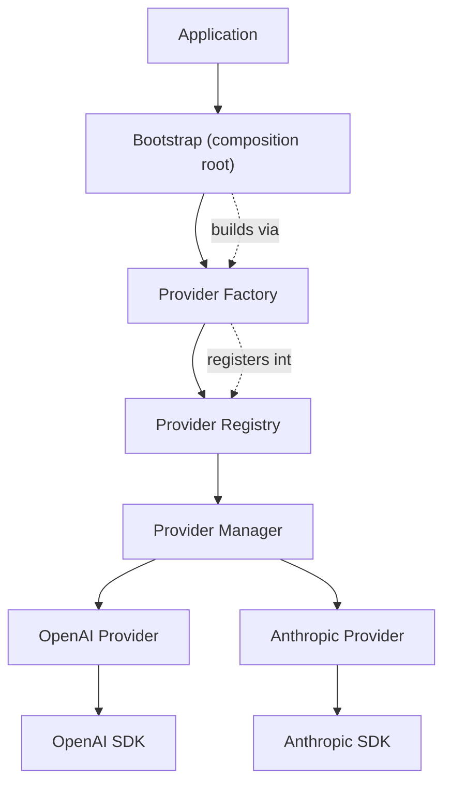
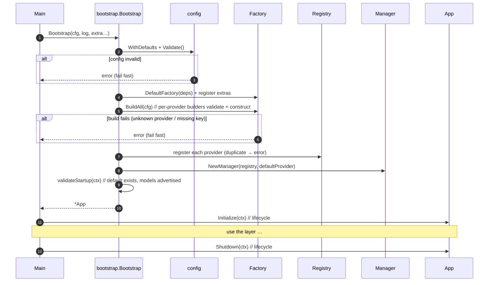

# ModelMesh — Provider Layer (Implementation Guide)

**Status:** Implemented (Phase 1 complete)
**Document type:** Implementation & Extension Guide
**Last updated:** 2026-07-16
**Related:** [Provider Layer LLD](../03-components/01-provider-layer.md) · [ADR-003 Adapter](./Architecture-Decisions.md#adr-003--why-the-adapter-pattern-for-providers) · [Development Roadmap](./Development-Roadmap.md)

---

## 1. Overview

The Provider Layer is the foundation of ModelMesh: it abstracts every LLM provider behind a single unified interface so the rest of the system — and every future phase — depends only on ModelMesh's own types, never on a provider SDK.



**Package map** (all under `internal/`):

| Package | Responsibility |
|---------|----------------|
| `provider` | Unified DTOs, `LLMProvider` and `Lifecycle` interfaces, `Registry`, `Manager`, error model |
| `provider/factory` | Builds providers from configuration via registered builders |
| `provider/adapters/openai`, `.../anthropic` | Concrete adapters over the official SDKs |
| `provider/adapters/adaptererr` | Shared upstream-error → sentinel translation |
| `provider/mock` | Deterministic, no-I/O provider for tests and demos |
| `config` | Configuration structures + centralized validation |
| `logger` | Structured logging abstraction |
| `retry` | Bounded retry with exponential backoff |
| `bootstrap` | Composition root: startup flow, default factory, App lifecycle |

---

## 2. Initialization Flow

`bootstrap.Bootstrap` is the complete, fail-fast startup flow. It never returns a partially initialized system.



Startup validation performed (fail fast, meaningful errors):

- **Configuration structure** — timeouts positive, retry non-negative, no duplicate names, base URLs are valid http(s), default provider is among configured providers (`config.Validate`).
- **Provider-specific config** — e.g. OpenAI/Anthropic require an API key (enforced in their factory builders).
- **Default provider is registered** (`bootstrap.New` + `validateStartup`).
- **Every provider advertises at least one model** (`validateStartup`).

---

## 3. Provider Registration (the Factory)

Providers are built by **builders** registered with the factory, keyed by name. The default factory ([`bootstrap.DefaultFactory`](../../internal/bootstrap/providers.go)) pre-registers OpenAI and Anthropic.

```
factory.BuilderFunc = func(config.ProviderConfig, factory.Deps) (provider.LLMProvider, error)
```

- **Builders own provider-specific validation** (API key required, etc.).
- **The factory owns generic concerns** (unknown provider, nil result, duplicate registration).
- **`config` owns structural validation** (URL format, timeouts, duplicates).

This three-way split is why adding a provider touches no existing business logic — see the [Extension Guide](#7-extension-guide-adding-a-new-provider).

---

## 4. Configuration

`config.Config` and `config.ProviderConfig` are plain, validated data structures — no parsing logic (that belongs to the composition root / a future config loader). Credentials are injected (`APIKey`), never hardcoded; the entrypoint sources them from the environment.

| `ProviderConfig` field | Meaning |
|------------------------|---------|
| `Name` | Provider id, matches `LLMProvider.Name()` and a factory builder |
| `Enabled` | Turn a provider on/off without removing it |
| `APIKey` | Credential (env-sourced) |
| `BaseURL` | Override endpoint (proxy, Azure, test server); validated as http(s) |
| `Timeout` | Per-provider timeout override |
| `Models` | Optional override of the built-in model catalog |

Validation is centralized: `Config.Validate()` delegates to `ProviderConfig.Validate()` and adds cross-entry checks (duplicates, default-in-list). All failures wrap `config.ErrInvalidConfig`.

---

## 5. Provider Lifecycle

`provider.Lifecycle` is an **optional** interface (`Initialize`/`Shutdown`) detected by type assertion. Providers with no resources need not implement it; the OpenAI, Anthropic, and mock providers do.

- `App.Initialize(ctx)` — runs `Initialize` on each lifecycle-aware provider; **fails fast** on the first error.
- `App.Shutdown(ctx)` — runs `Shutdown` on each (releasing idle HTTP connections in the adapters); aggregates errors so one failure doesn't skip the rest.
- `App.HealthCheckAll(ctx)` — on-demand health of every provider (a diagnostic helper, **not** a background monitor — that is Phase 4).

---

## 6. Discovery API

The Manager exposes the surface later phases use to enumerate and inspect providers:

| Method | Purpose |
|--------|---------|
| `ListProviders() []string` | Names of all registered providers (sorted) |
| `GetProvider(name)` | Resolve one provider (alias of `Provider`) |
| `DefaultProvider()` | Resolve the configured default (alias of `Default`) |
| `ListModels(ctx, name)` | A provider's model catalog |
| `ProviderCapabilities(ctx, name)` | A provider's coarse capabilities |
| `Describe(ctx, name)` | Full `ProviderInfo` (name + capabilities + models) |

---

## 7. Extension Guide: Adding a New Provider

Adding a provider (e.g. **Gemini**, **Ollama**, **Groq**, **Azure OpenAI**, **Bedrock**) requires **no change to any existing business logic** — only a new adapter and one builder registration.

**Step 1 — Implement the interface.** Create `internal/provider/adapters/gemini/` with a `Provider` type implementing `provider.LLMProvider` (and optionally `provider.Lifecycle`). Keep the three-file shape:
- `gemini.go` — orchestration (validate → map → retry → map → translate errors)
- `mapping.go` — **pure** DTO ⇄ SDK translation functions
- `models.go` — the static model catalog + `ModelsFromIDs`

Reuse `adaptererr` for error translation and `retry` for retries. Add a compile-time assertion:
```
var _ provider.LLMProvider = (*Provider)(nil)
```

**Step 2 — Register a builder** in the composition root (`internal/bootstrap/providers.go`):
```
mustRegister(f, gemini.ProviderName, geminiBuilder)
```
where `geminiBuilder` validates provider-specific config (e.g. API key) and calls `gemini.New(...)`.

**Step 3 — Configure it.** Add a `ProviderConfig{Name: "gemini", Enabled: true, APIKey: …}` (env-sourced). Done.

That is the entire change set. The registry, manager, discovery API, lifecycle, and every consumer work unchanged — the open/closed principle in practice. For an OpenAI-compatible endpoint (Azure OpenAI, Groq, Ollama), you may not even need a new adapter: construct the OpenAI adapter with a different `Name` and `BaseURL`.

---

## 8. Exported Types Reference (quick index)

| Type / func | Package | Role |
|-------------|---------|------|
| `LLMProvider` | `provider` | The contract every provider implements |
| `Lifecycle` | `provider` | Optional resource lifecycle |
| `ChatRequest/Response`, `EmbeddingRequest/Response`, `Usage`, `ModelInfo`, `ProviderInfo`, `HealthStatus` | `provider` | Unified DTOs |
| `Registry`, `Manager` | `provider` | Storage and access |
| `ProviderError` + sentinels (`ErrProviderNotFound`, `ErrRateLimited`, …) | `provider` | Error model |
| `Factory`, `BuilderFunc`, `Deps` | `provider/factory` | Construction from config |
| `Config`, `ProviderConfig` | `config` | Configuration + validation |
| `App`, `Bootstrap`, `New`, `DefaultFactory`, `NamedBuilder` | `bootstrap` | Composition root |
| `Policy`, `Do` | `retry` | Retry helper |

Full API documentation lives in the GoDoc comments on each exported symbol.
