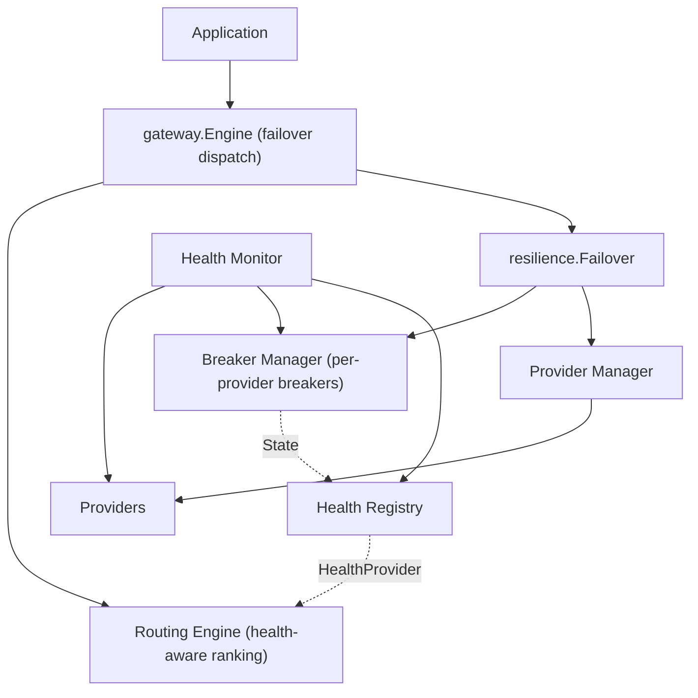

# ModelMesh — Resilience Layer (Implementation Guide)

**Status:** Implemented & finalized (Phase 4 complete — breaker + health + failover)
**Document type:** Implementation & Extension Guide
**Last updated:** 2026-07-16
**Related:** [Circuit Breaker LLD](../03-components/04-circuit-breaker.md) · [ADR-010](./Architecture-Decisions.md#adr-010--why-circuit-breakers) · [Routing Engine](./Routing-Engine.md)

---

## 1. Architecture

The resilience layer keeps a failing provider from degrading the gateway. It
composes four pieces around the per-provider **circuit breaker**:

- **Circuit Breaker** (Part 1) — three-state machine (Closed/Open/Half-Open), per provider.
- **Health Monitor** (Part 2) — background service probing each provider through its breaker.
- **Health Registry** (Part 2) — live health per provider; **structurally satisfies routing's `HealthProvider`**, so routing scores are health-aware with no coupling.
- **Failover** (Part 3) — tries ranked candidates, skipping open circuits, retrying transient blips, until one succeeds.

## 2. Resilience Pipeline

`gateway.Chat` (failover mode): **route** (ordered candidates; unhealthy providers already down-ranked by the availability scorer reading the Health Registry) → **cache lookup** → on miss **failover dispatch**:

For each candidate in rank order: if the breaker is **Open**, skip (record "circuit open"); else run the provider call inside `breaker.Execute` wrapped by `retry.Do`; on success return; on failure fail over to the next candidate. All-exhausted → `ErrAllProvidersFailed`. The response is cached under the intended (top-ranked) key regardless of which provider served it.

## 3. Failover Strategy

- **Ranked candidates** come from routing (already health- and score-aware).
- **Hard skip** of providers whose breaker is Open (no call made) — verified: a tripped provider is never contacted.
- **Fail over** on error to the next candidate; a `Failoverable` predicate lets caller-fault errors (e.g. validation) return immediately instead of fanning out.
- **Bounded**: walks the candidate list once (no infinite retry); each candidate may retry internally.
- **Diagnostics**: `FailoverOutcome` records every attempt (skipped/failed/served) — `ExplainFailover` renders it.

## 4. Retry Strategy

Retry is composed **inside** the breaker: `breaker.Execute(func { retry.Do(providerCall) })`.

- The breaker is **outermost**, so an admitted call's whole retry sequence is **one** breaker outcome — retries never amplify the failure count.
- Retry respects **context cancellation**, a **retry limit**, and **exponential backoff** (the Phase 1 `retry` helper).
- Cooperation: if the breaker is Open, no retry happens (fast-fail → failover); a `retryable` predicate limits retries to transient provider errors.

## 5. Recovery Strategy

Recovery is **driven by the monitor's probes, gated by the breaker**:
1. Failing probes/requests trip the breaker **Closed→Open** (`ProviderDown` event); traffic fails over.
2. While cooling, probes are **gated** (provider not contacted).
3. After `OpenTimeout`, the next probe triggers **Open→Half-Open** and is admitted (≤ `HalfOpenMaxRequests`).
4. `SuccessThreshold` successful probes **close** the breaker (`ProviderRecovered`); the Health Registry marks it healthy → routing resumes ranking it first → **traffic returns automatically**.

## 6. Configuration

| Breaker (`resilience.Config`) | Default | | Monitor (`MonitorConfig`) | Default |
|---|---|---|---|---|
| `FailureThreshold` | 5 | | `Interval` | 15s |
| `SuccessThreshold` | 2 | | `Timeout` | 5s |
| `OpenTimeout` | 30s | | | |
| `HalfOpenMaxRequests` | 1 | | **Failover** | |
| `IsFailure(err)` | any error | | `WithRetryPolicy` / `WithRetryable` / `WithFailoverable` | none / none / any |

`DefaultConfig()`/`WithDefaults()` + `Validate()` (fails fast). Inject `IsFailure`/`Failoverable` (e.g. reuse `adaptererr.Retryable`) so caller-fault errors neither trip breakers nor fan out.

## 7. Extension Guide

- **New failure classifier:** inject `Config.IsFailure` (breaker) and `WithFailoverable` (failover) to control what trips/fails-over.
- **Custom probe cadence:** `MonitorConfig.Interval/Timeout`; the monitor probes any `ProviderSource`.
- **Event consumers:** `Monitor.AddListener` — receive `ProviderDown`/`ProviderRecovered`/`StateChanged` (Phase 5 exports these to metrics).
- **Fleet-wide state:** the breaker is per-instance today; a Redis-backed breaker (ADR-016) implements the same state machine behind `CircuitBreaker`.
- **Wiring:** one shared `Breaker Manager` feeds both the Monitor and `Failover`; the Registry injects into routing via `WithHealthProvider`.

## 8. Exported Types Reference

| Symbol | Role |
|--------|------|
| `CircuitBreaker`, `Breaker`, `State` | Breaker contract + state machine |
| `Manager` | Per-provider breakers (`States`, `Reset`, `ExplainStates`) |
| `Monitor`, `MonitorConfig` | Background health probing |
| `Registry`, `HealthRecord` | Live health; `Health()` = routing seam |
| `Event`, `Listener` | Health events |
| `Failover`, `Target`, `FailoverOutcome` | Automatic failover |
| `ExplainFailover`, `ExplainAttempt` | Diagnostics |

Full API docs live in the GoDoc comments on each exported symbol.
