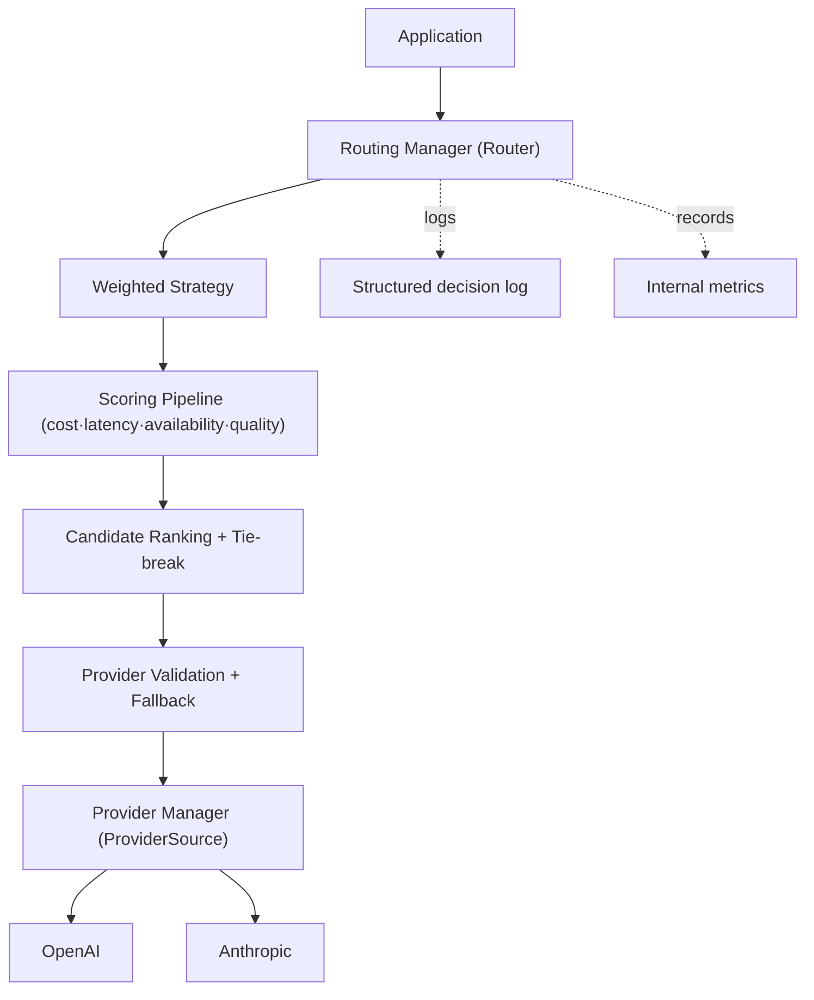

# ModelMesh — Routing Engine (Implementation Guide)

**Status:** Implemented (Phase 2 complete)
**Document type:** Implementation & Extension Guide
**Last updated:** 2026-07-16
**Related:** [Routing Engine LLD](../03-components/02-routing-engine.md) · [Weighted Scoring](./Routing-Scoring.md) · [ADR-004](./Architecture-Decisions.md#adr-004--why-the-strategy-pattern-for-routing) · [ADR-009](./Architecture-Decisions.md#adr-009--why-weighted-routing)

---

## 1. Routing Architecture

The Routing Engine selects the best `{provider, model}` for a request and explains
why. It sits above the Provider Layer and depends on it only through the narrow
`ProviderSource` interface (satisfied by `*provider.Manager`).

**Package map** (`internal/routing`):

| Concern | Files |
|---------|-------|
| Contracts & DTOs | `router.go` (Router, ProviderSource, Manager, Selection), `types.go`, `strategy.go`, `errors.go` |
| Strategy registry | `registry.go` |
| Scoring | `scoring.go`, `scorer_cost.go`, `scorer_latency.go`, `scorer_availability.go`, `scorer_quality.go`, `weighted.go` |
| Config | `config.go` |
| Observability-lite | `metrics.go` (internal), `diagnostics.go` |

## 2. Routing Pipeline (end-to-end)

`Manager.Select(ctx, rc)` runs the full workflow:

1. **Enumerate** — discover providers from the `ProviderSource`, list their models, filter by requested capability and caller constraints → candidate `{provider, model}` pairs.
2. **Score** — each scorer returns normalized `[0,1]` values; the aggregator combines them with normalized factor weights into a final score (see [Weighted Scoring](./Routing-Scoring.md)).
3. **Rank** — sort by final score descending, with deterministic tie-breaking.
4. **Validate + fallback** — walk the ranked list; the first candidate that passes provider validation is selected. If the top fails, fall back to the next.
5. **Log + measure** — emit a structured decision log and record metrics.
6. **Return** `*Selection` — the resolved provider (ready to dispatch), the chosen candidate, the full decision (ranking + explanation), and fallback bookkeeping.

`Route(ctx, rc)` exposes steps 1–3 alone (scoring decision without validation/dispatch) for dry-run/explain use.

## 3. Provider Validation

Before a candidate is selected it is validated against the Provider Layer:

- **Registered / available** — `ProviderSource.GetProvider` must resolve it. Because only *enabled*, *startup-validated* providers are in the registry, resolvability implies enabled + validated.
- **Supports the requested model + capability** — re-checked via `provider.ModelSupported` (defensive; enumeration already filtered on it).

Validation failures produce meaningful errors (`provider.ErrProviderNotFound`, `provider.ErrUnsupportedModel`) and trigger fallback.

## 4. Fallback Strategy (intentionally limited until Phase 4)

Fallback here is **validation-fallback only**: on a validation failure for the
top-ranked candidate, the router advances to the next-ranked *valid* candidate,
records `FallbackUsed=true`, and returns it. If every candidate fails validation,
it returns `ErrNoValidProvider`.

It is **not** a circuit breaker and performs **no retries against a provider that
errors at dispatch time**. Runtime failure handling, health-based exclusion, and
open/half-open circuits are Phase 4 — deliberately kept out here so the routing
subsystem stays a pure *decision* engine. The ordered candidate list Select
produces is exactly what Phase 4 will consume for resilient dispatch.

## 5. Configuration

All routing behavior is configuration (`routing.Config`), modifiable without
recompiling. Factor weights, per-model pricing, expected latencies, quality
scores, availability mappings, and tie-break inputs are covered with a full
example in [Weighted Scoring §5](./Routing-Scoring.md#5-configuration-guide).
`routing.Build(source, cfg, opts...)` validates and fails fast; options inject a
logger (`WithLogger`), metrics sink (`WithMetrics`), and clock (`WithClock`).

## 6. Diagnostics Guide

`diagnostics.go` provides pure renderers for debugging (no I/O):

| Function | Shows |
|----------|-------|
| `Explain(decision)` | Full decision: strategy, weights, ranked candidates with factor breakdowns, winner, reason |
| `ScoreBreakdown(decision)` | Per-candidate factor table (selected marked `*`) |
| `Rankings(decision)` | The ranked `[]CandidateExplanation` |
| `InspectSelection(sel)` | Selection outcome: provider, model, score, fallback, attempts, duration |

The **structured decision log** (emitted by `Select`) carries: `request_id`,
`prompt_summary`, `strategy`, `available_providers`, `candidate_scores`,
`selected_provider`, `selected_model`, `selected_score`, `routing_duration`,
`reason`, `fallback_used`. The **internal metrics** (`MetricsCollector.Snapshot`)
expose total decisions, selections per provider, average decision time, average
score, fallback count, and failed attempts — read by the Observability phase and
exported then (no Prometheus dependency here).

## 7. Extension Guide

**Add a new routing strategy** (e.g. round-robin):
1. Implement `Strategy` (`Name`, `Rank`); optionally `Explainer`.
2. Register a `Builder` — either extend `DefaultRegistry` or register on a custom `Registry`. The reserved names (`round_robin`, `random`, `cost_first`, `latency_first`) are already recognized and currently return `ErrStrategyNotImplemented`.
No change to the Manager, ranking, validation, or logging.

**Add a new scoring factor** (e.g. `region`):
1. Implement `Scorer` (`Name`, batch `Scores` returning `[0,1]`).
2. Inject it: `routing.NewWeighted(cfg.Weighted, routing.WithScorer(regionScorer, weight))`.
The aggregator, ranking, and explanation pick it up automatically — no existing
scoring logic changes.

**Add new provider metadata** for scoring:
1. Add fields to the relevant scorer config (e.g. a `Region` map) or read from `RoutingContext.Attributes` (open `map[string]any`, forward-compatible).
2. Consume it in the scorer. `ModelInfo` (from the Provider Layer) is the source of per-model metadata already used by capability and quality scoring.

## 8. Exported Types Reference

| Symbol | Role |
|--------|------|
| `Router`, `Manager` | Routing abstraction + concrete manager |
| `Route`, `Select`, `Selection` | Scoring decision / validated selection with fallback |
| `ProviderSource` | Seam onto the Provider Layer |
| `Strategy`, `Explainer`, `Registry`, `Build` | Strategy contract + registration |
| `Scorer`, `Cost/Latency/Availability/QualityScorer`, `WithScorer` | Scoring pipeline |
| `HealthProvider`, `NoHealth`, `WithHealthProvider` | Availability health seam (Phase 4) |
| `Config`, `WeightedConfig`, `FactorWeights`, `ModelPricing`, ... | Configuration |
| `Metrics`, `MetricsCollector`, `MetricsSnapshot`, `DecisionRecord` | Internal metrics |
| `Explain`, `ScoreBreakdown`, `Rankings`, `InspectSelection` | Diagnostics |

Full API docs live in the GoDoc comments on each exported symbol.
