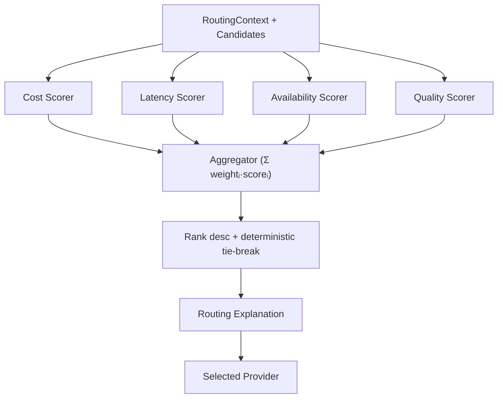

# ModelMesh — Weighted Scoring Engine (Implementation Guide)

**Status:** Implemented (Phase 2 Part 2)
**Document type:** Implementation Guide
**Last updated:** 2026-07-16
**Related:** [Routing Engine LLD](../03-components/02-routing-engine.md) · [ADR-009 Weighted Routing](./Architecture-Decisions.md#adr-009--why-weighted-routing)

---

## 1. Scoring Architecture

The weighted strategy is a modular scoring pipeline. Each scorer has one
responsibility and returns normalized `[0,1]` scores; an aggregator combines them
with normalized factor weights; candidates are ranked and tie-broken
deterministically; an explanation is emitted.



- **Scorer interface** (`Scores(ctx, rc, candidates) []float64`) scores the whole
  set at once, so relative scorers (cost, latency) can normalize across the set
  while absolute scorers (availability, quality) stay trivial.
- **Adding a factor** is implementing `Scorer` and injecting it with a weight via
  `WithScorer` — the aggregator, ranking, and explanation never change.
- **`final = Σ (normWeightᵢ × scoreᵢ)`**, weights sourced entirely from config.

## 2. Score Normalization Strategy

Every scorer returns `[0,1]` where **1.0 = best**:

| Factor | Normalization |
|--------|---------------|
| **Cost** | Min-max, inverted, across candidates: cheapest → 1.0, dearest → 0.0. Parameter-free (no magic reference constant). |
| **Latency** | Same min-max inversion on expected latency: fastest → 1.0. |
| **Availability** | Absolute: health state → configured score (`healthy`/`degraded`/`unhealthy`/`unknown`). |
| **Quality** | Absolute: configured model quality, already in `[0,1]`. |

Degenerate cases (one candidate, or all-equal values) yield `1.0` for every
candidate — there is no basis to differentiate. Factor **weights** are normalized
to sum to 1, so the final score is a weighted average in `[0,1]`.

## 3. Explainability Strategy

Every decision produces a `RoutingExplanation` that is both **machine-readable**
(normalized `Weights`; per-candidate `Factors`, `Score`, `Rank`, `Selected`) and
**human-readable** (`Reason`). The winner's reason is derived deterministically:
the factor with the largest positive weighted contribution vs. the runner-up is
named as the deciding factor, and any factor where the winner was weaker is noted
(e.g. *"won: final 0.85 vs 0.84; strongest on latency (0.84 vs 0.76), despite
weaker cost (0.72 vs 0.81)"*). Factor iteration is over sorted names, so the same
inputs always produce the same explanation.

## 4. Tie-Breaking (deterministic, never random)

When final scores are equal (within epsilon), order is decided by, in priority:

1. **Explicit `TieBreak`** provider order (earlier = higher priority);
2. **Per-provider `Weights`** (higher = higher priority);
3. **Provider name** ascending, then **model name** ascending.

Randomness is never used.

## 5. Configuration Guide

All scoring inputs are configuration (no recompile). Example (`routing.Config`):

```go
cfg := routing.Config{
    Strategy: "weighted",
    Weighted: routing.WeightedConfig{
        // Factor weights (normalized at runtime; relative magnitudes matter).
        Factors: routing.FactorWeights{Cost: 0.3, Latency: 0.2, Availability: 0.2, Quality: 0.3},

        // Per-model pricing → cost estimation.
        Cost: routing.CostConfig{
            Pricing: map[string]routing.ModelPricing{
                "gpt-4o":          {InputPer1K: 0.0025, OutputPer1K: 0.01, Currency: "USD"},
                "claude-sonnet-5": {InputPer1K: 0.003,  OutputPer1K: 0.015},
            },
            EstimatedInputTokens: 1000, EstimatedOutputTokens: 300,
        },

        // Configured expected latencies (live metrics arrive in Observability).
        Latency: routing.LatencyConfig{
            Providers: map[string]time.Duration{"openai": 700 * time.Millisecond, "anthropic": 900 * time.Millisecond},
            Default:   800 * time.Millisecond,
        },

        // Configured quality scores (not hardcoded in logic).
        Quality: routing.QualityConfig{
            Models:  map[string]float64{"gpt-4.1": 0.98, "gpt-4o": 0.95, "claude-sonnet-5": 0.94, "claude-haiku-4-5": 0.80},
            Default: 0.7,
        },

        // Health-state → availability score mapping (+ optional static overrides).
        Availability: routing.AvailabilityConfig{Healthy: 1.0, Degraded: 0.5, Unhealthy: 0.0, Unknown: 0.8},

        // Deterministic tie-break inputs.
        TieBreak: []string{"openai", "anthropic"},
        Weights:  map[string]float64{"openai": 2, "anthropic": 1},
    },
}
router, _ := routing.Build(providerManager, cfg)
```

Live health is injected (Phase 4) via `routing.NewManager(src, routing.NewWeighted(cfg.Weighted, routing.WithHealthProvider(hp)), cfg)`; until then availability uses the configured `unknown` score.
